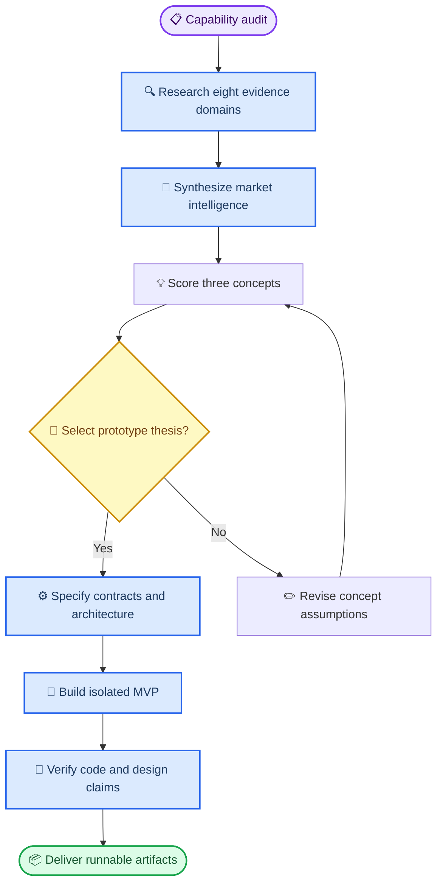

# Solana ecosystem project capability audit

_Current-session inventory and execution plan — 2026-10-01_

---

## 📋 Observed execution environment

The active execution environment is one online **Manus Sandbox** (`sandbox:root:eAevfpaxD0XXei262BkC5v`). No Cloud Computer or user Desktop is presently authorized in this session. The sandbox supplies a shell, persistent task filesystem, GitHub CLI authentication, Node.js `v22.13.0`, npm `10.9.2`, pnpm `11.25.0`, TypeScript, and the existing `asentxia-command` TypeScript/Three.js repository.

`rustc`, `cargo`, Solana CLI, Anchor, AVM, and Go are **not installed**. Therefore this session can author and validate TypeScript code immediately, but cannot truthfully claim compilation, local-validator tests, or deployment of an Anchor program until a pinned Solana/Anchor/Rust toolchain is installed. This is an environment fact, not a product limitation.

The checked-out repository is a static TypeScript/Three.js site using esbuild. It is not a Next.js, Anchor, or Webdev Game project. The prototype will be isolated from the existing site unless the chosen design explicitly requires integration.

## 🔧 Relevant capabilities

| Need | Available capability | Current limitation / use decision |
| --- | --- | --- |
| Live research | Built-in web search/fetch, Firecrawl MCP, stateful Sandbox browser | Firecrawl is enabled; no Solana-specific market-data connector is enabled |
| Code and checks | Shell, GitHub CLI, Node/npm/pnpm, TypeScript `tsc`, esbuild | Rust, Go, Anchor and Solana CLI need explicit installation before on-chain compilation |
| Game/web delivery | Existing Three.js dependency; Webdev MCP can initialize a Three.js Game Dev or Godot project | No Webdev project is bound; Game Dev setup should follow selected concept and any Blueprint gate |
| Visual/audio assets | Manus media generation plus Webdev game-asset catalog | Not needed for the architecture-first MVP unless selected design needs bespoke art |
| Persistent runtime | Webdev supports reserved single-process hosting for WebSockets; Cloud Computer is not attached | Do not provision a VM merely for prototype work; decide from measured memory/CPU/socket needs |
| Monitoring/automation | Triggers MCP, Make MCP, Firecrawl monitors | No live social or on-chain monitor is configured; monitoring architecture can be specified but should not be activated without named data sources and ownership scope |
| Deployment/infrastructure | Cloudflare, Cloudflare Worker Bindings, Vercel, GitHub connectors | These are available integrations, not a deployment authorization or production configuration |

> **Decision:** Use the Sandbox and the existing repository for research, architecture, an interactive web MVP, Action-compatible endpoints, and generated Anchor scaffolding. Defer real-value wagering, launch liquidity, persistent multiplayer hosting, and mainnet deployment until legal, custody, abuse, and measured-runtime gates are satisfied.

## 🌐 Relevant MCP modules

The current session exposes `firecrawl`, `manus-tools` browser/media, `webdev-mcp`, `triggers`, `make`, `cloudflare`, `cloudflare-worker-bindings`, `vercel`, `github` CLI access, `workflow`, and `manus-device`. The enabled connector inventory confirms Firecrawl, GitHub, Make, Cloudflare, Cloudflare Worker Bindings, and Vercel. No enabled Helius, QuickNode, Birdeye, Jupiter, Telegram, X, Discord, Twitch, Kick, or wallet provider connector was observed.

This means protocol and market research can begin now. Production-grade on-chain indexing should later select a named RPC/indexer using explicit quality requirements—commitment level, websocket semantics, historical coverage, rate limits, regional latency, and price—not an assumed connector.

## 🔄 Orchestration plan

## 🎯 Agent allocation and gates

1. **Market-evidence map:** eight independent agents research bonding curves, chat-native mini-apps, Actions/Blinks, move-to-earn, SocialFi, prediction/PvP, Solana primitives, and launch-risk controls. A reducer creates a cited intelligence report. This work is in progress.
2. **Concept selection:** the primary agent scores the three requested concepts with an explicit scoring rubric. Scores are hypotheses, not forecasts; the report names their falsifiers and the nearest credible alternatives.
3. **Architecture:** the primary agent writes a system design and a narrow implementation plan. It specifies authority at each effect boundary, state ownership, settlement semantics, idempotency, deterministic game-replay requirements, and economic safety limits.
4. **Prototype:** implementation targets an isolated browser-first game loop and mock-only settlement adapter. Anchor code is scaffolded as source with pinned toolchain instructions, not represented as compiled until the toolchain exists.
5. **Validation:** TypeScript build/type checks run locally. One independent read-only reviewer traces requirements to source and tests. Any real-money, mainnet, liquidity, or release operation remains out of scope unless separately authorized.

## ⚠️ Non-negotiable product boundaries

- Do not describe a virality score, financial return, “massive market share,” or token appreciation as a fact. Treat them as experiments with measurable success criteria.
- Do not ship or recommend real-money wagering without jurisdiction-specific counsel, age/geofence controls where required, custody/AML analysis, and an authoritative random-outcome or oracle model.
- Do not use transfer fees, permanent delegates, or referral payouts as hidden value extraction. Their authorization, rate caps, immutable fields, and migration/revocation story must be user-visible and contract-tested.
- Use the existing website only after preserving its build and semantics. The game MVP must be independently runnable and removable.
