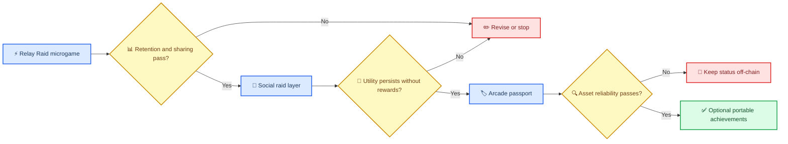

# Relay Raid concept selection

_Evidence-led concept decision for the Solana ecosystem project — 2026-10-01_

---

## 🎯 Decision

**Select Concept A, narrowed to a wallet-optional competitive microgame:** **Relay Raid** is a 60–90 second cooperative score-attack that is shareable as a normal URL or Telegram deep link. A compatible Solana Action is an optional portable-receipt surface, not the first-session gate. The MVP has **no real-money wager, transferable token, bonding curve, swap, pool, buy-in, or cash-redeemable reward**.

This is an experiment selection, not a prediction that the product will become globally viral. The near-term claim is narrower and falsifiable: a chat-native challenge can earn fraud-adjusted replay and sharing without financial incentives. The cited [market-intelligence report](../research/solana-viral-intelligence.md) is the evidence base for this decision.

## 📊 Evaluation matrix

Scores are directional product judgments on a `0–10` scale, not measured forecasts. The weighting deliberately favors a fast, falsifiable experiment over speculative economic upside.

| Criterion | Weight | Concept A: Blink microgame | Concept B: SocialFi prediction/raids | Concept C: Persistent WebGL arcade |
| --- | ---: | ---: | ---: | ---: |
| **Virality coefficient potential** | 30% | 8.0 | 7.0 | 5.0 |
| **Replayability** | 25% | 7.0 | 7.0 | 8.5 |
| **Economic longevity** | 20% | 7.0 | 5.0 | 7.0 |
| **Solana differentiation** | 15% | 7.0 | 7.0 | 8.0 |
| **Speed to prototype** | 10% | 9.0 | 6.0 | 3.0 |
| **Weighted total** | **100%** | **7.55** | **6.50** | **6.30** |

**Calculation:** `weighted total = Σ(score × weight)`. The selected concept wins because it tests distribution and core play before committing to a high-cost persistent world or a compliance-heavy value-settlement model.

## 💡 The three concepts, treated rigorously

### Concept A — Relay Raid: chat-native competitive arcade

A squad sends a Relay link into a chat. Each player has 90 seconds to route pulses through a grid, collect stable signals, and avoid overloads. Individual performance contributes to a squad meter; a completed run produces a shareable receipt and an optional on-chain achievement claim.

- **Novel primitive:** a portable, server-attested `raid receipt` whose in-game use precedes any on-chain representation.
- **Closest prior art:** shareable Action/Blink flows, Telegram HTML5 games, high-score loops, and quest-based reward systems.
- **Benefit hypothesis:** the challenge link is the social object; no wallet, token purchase, or app install is required to understand or play.
- **Economic model:** initially sponsor/creator-funded utility rewards and non-transferable status only.
- **Falsifier:** after bot filtering, D7 retention, completed raids per acquired player, and unprompted share rate fail to beat a plain web control; or the game is no longer played when rewards pause.

### Concept B — social raids and prediction

A squad coordinates around raids, creator challenges, and game-event calls. The viable version is **cooperative contribution**, not real-value prediction or pooled wagering.

- **Novel primitive:** contribution records for squad progress, campaign attribution, and utility unlocks.
- **Closest prior art:** SocialFi points, daily quests, creator campaigns, and prediction-market settlement.
- **Benefit hypothesis:** co-op goals and status can retain players without liquid emissions.
- **Economic model:** capped non-transferable points; future campaign settlement only after controls are proven.
- **Falsifier:** squad behavior resolves into referral/Sybil clusters, utility unlocks do not change behavior, or rewards are the only reason for sessions.

### Concept C — persistent arcade passport

A multi-game WebGL universe maintains status, seasonal achievements, creator access, and squad history. It is the strategic destination, not the first product.

- **Novel primitive:** a versioned cross-game status interface whose portable assets are receipts, not mutable runtime state.
- **Closest prior art:** live-service battle passes, cNFT campaign receipts, and game identity systems.
- **Benefit hypothesis:** status created in one game increases re-entry and utility in another.
- **Economic model:** non-transferable access/status, then carefully measured optional assets.
- **Falsifier:** passport ownership does not increase cross-game re-entry or utility use; cNFT/RPC/wallet support cannot meet reliability targets.

## 🔄 Product sequencing

## ⚠️ Explicit non-decisions

The following requests are **not accepted as initial design commitments** because the research does not establish their player value or operational safety:

| Proposed mechanic | Decision | Reason |
| --- | --- | --- |
| Real-money PvP wagering | Deferred | Requires separately scoped legal, age, geography, custody, abuse, and responsible-play review |
| Pump.fun-like bonding curve | Deferred | Trading/migration is not a gameplay loop and adds fairness, authority, and market-abuse risks |
| Player-owned liquidity pools | Deferred | Adds financial-product and liquidity-risk exposure without validating game demand |
| Automatic buyback and burn | Rejected for MVP | No transferable launch asset or fee base exists; it would create artificial token-finance scope |
| Real-time SOL referral payout | Rejected for MVP | Requires KYC/tax/abuse/policy design and would incentivize Sybil acquisition over retained play |
| Transfer hook or permanent delegate | Not selected | These immutable Token-2022 choices add user-trust and compatibility cost; no current use case justifies them |

## 📈 Success criteria

The prototype may advance to a limited external playtest only if it can measure the following. Targets are deliberately not set until a baseline cohort exists.

1. **Core loop:** completion rate, median and p95 round duration, repeat rounds/session, and rage-quit point.
2. **Distribution:** deep-link launch completion, unprompted share rate, referred-player completion, and D1/D7 retention.
3. **Social quality:** squad contribution concentration, quest diversity, and referred-player D30 retention.
4. **Trust:** bot/farm flags, false-positive appeal rate, client failure rate, and receipt idempotency/replay attempts.
5. **Optional ownership:** wallet connect/sign/return/cancel funnel, Action fallback rate, simulation/finality failures, and utility use after claim.

> **Exit criterion:** If non-incentivized play and utility use do not remain after a reward pause, do not add a tradable asset to rescue retention. Improve the game or stop the experiment.
