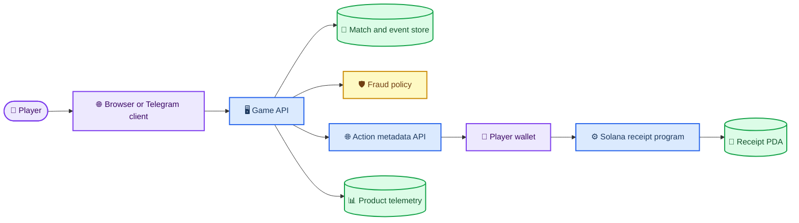
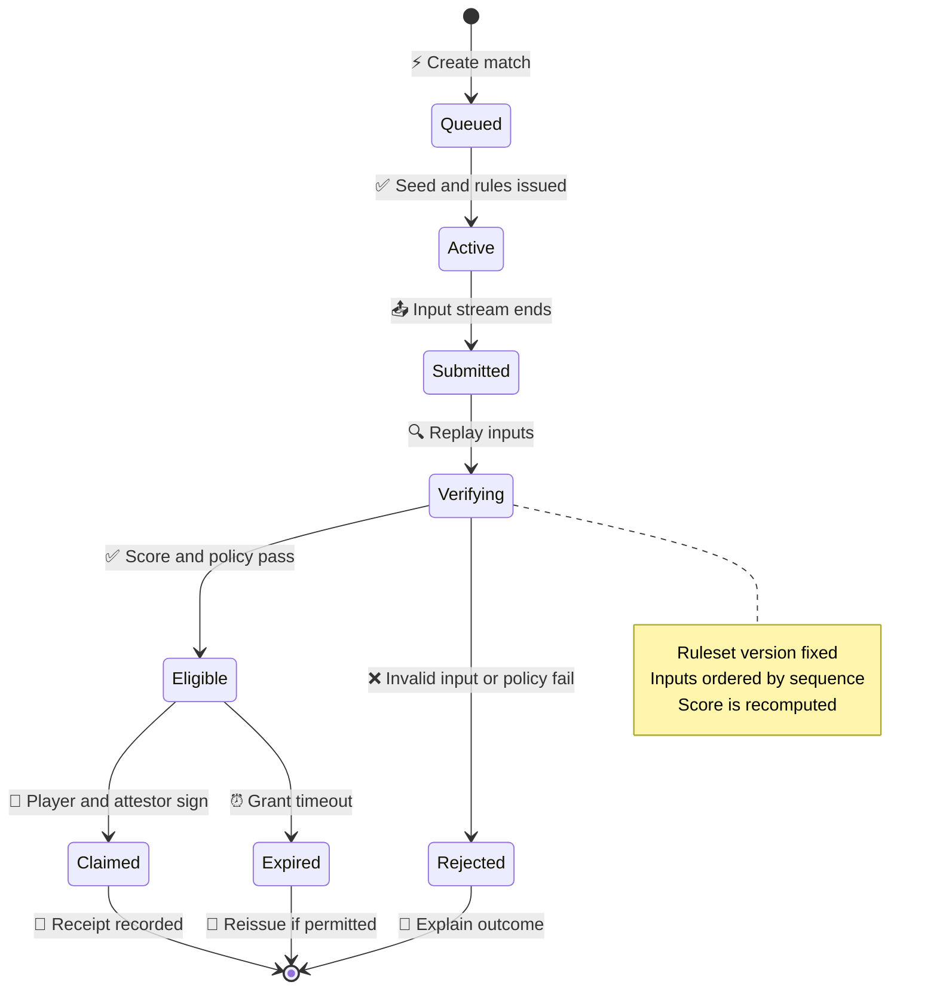
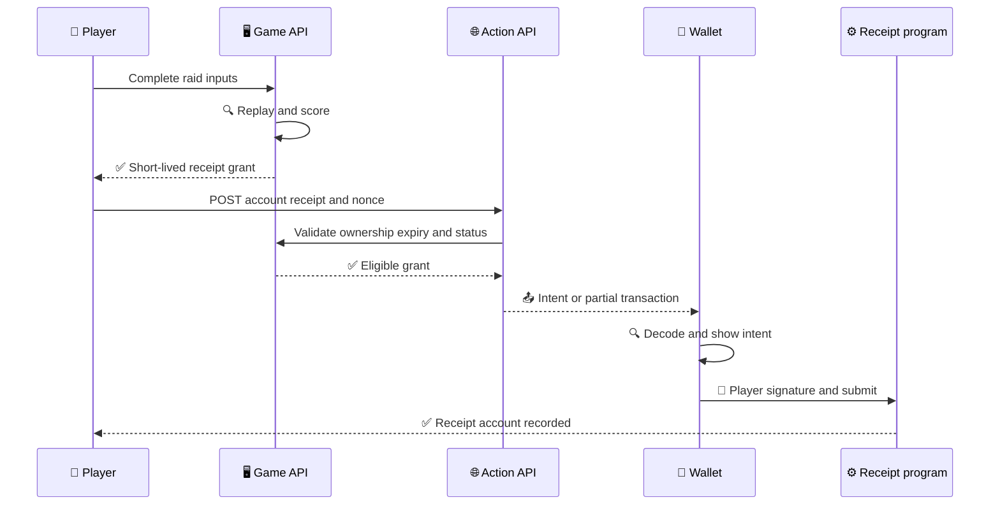

# Relay Raid system design

_A buildable architecture for a wallet-optional Solana-native arcade experiment — 2026-10-01_

---

## 🎯 Product and safety boundary

**Relay Raid** is a 60–90 second cooperative score-attack. Players route pulses through a canvas grid, bank stable signals, and avoid overloads. A player can enter through a normal web URL, a Telegram Mini App/deep link, or a compatible Action surface. The core game is playable without a wallet.

The system is intentionally **not a wagering product**. It has no player stake, no chance-based cash redemption, no exchange or swap, no transferability, and no promise of financial return. The source research explains why this narrow scope is a product and safety advantage rather than a missing feature.[^1]

> **Authority boundary:** The client may propose input. Only the authoritative game service may certify a completed raid. Only a wallet may sign its own transaction. The on-chain program records a receipt only when the player and the configured attestor have both authorized it.

## 🧭 Scope and assumptions

| Label | Statement |
| --- | --- |
| **Fact** | Telegram supports HTML5 game/Mini App launch paths and requires server-side validation of init data; Actions are HTTPS GET/POST interfaces that return wallet-inspected intent.[^2] [^3] |
| **Assumption** | Initial public play is a browser/Telegram playtest with normal URL fallback; no persistent multiplayer room is required for MVP |
| **Hypothesis** | Squad progress plus useful status can improve replay and sharing without liquid incentives |
| **MVP target** | Local interactive game, deterministic engine, Action manifest/metadata endpoints, and an Anchor receipt-program scaffold |
| **Non-goal** | Mainnet deployment, asset sale, Telegram checkout, wallet-required onboarding, transfers, payouts, live oracle settlement, or a liquidity pool |

## 🏗️ System boundary map



### Component ownership

| Component | Owns | Must not own |
| --- | --- | --- |
| **Client** | Rendering, input capture, accessibility, local replay preview, wallet UX | Score truth, eligibility, nonce issuance, reward value, private keys |
| **Game API** | Match assignment, deterministic input ordering, score computation, receipt issuance | Wallet private keys, player custody, unbounded game economy |
| **Risk service** | Rate limits, velocity and graph signals, quarantine decisions, appeal evidence | Irreversible automatic punishment without review pathway |
| **Action API** | GET/POST metadata, nonce/receipt validation, transaction construction after future setup | Transaction-signing on behalf of player, trusting client score, unbounded CORS/origin assumptions |
| **Solana receipt program** | One-time receipt recording under PDA constraints | Game simulation, token price, escrow, discretionary payouts |
| **Telemetry** | Immutable/append-only operational events with retention policy | Player secrets, full wallet signatures beyond necessary audit references |

## 🎮 Gameplay contract

### Primary loop

1. A player opens `/arcade/` from a browser or chat link.
2. The browser begins a fixed-seed 90-second local demo raid; the production service instead issues `match_id`, `seed`, and `ruleset_version`.
3. Player input rotates/moves the relay and routes pulses to stable nodes. Each accepted event emits deterministic score deltas.
4. A completed round yields a local receipt preview. In production the Game API recomputes the outcome from ordered inputs and issues a short-lived `ReceiptGrant`.
5. Squad progress, daily energy, quests, and social sharing create re-entry. A claim is available only if a receipt has explicit utility.
6. A compatible Action/wallet can display claim intent. It must never be required to play.

### Meta progression

- **Level:** experience is an off-chain, non-transferable progress counter.
- **Prestige:** a season-scoped cosmetic/status tier earned by verified contribution.
- **Squad:** up to 12 players with a rolling, capped weekly collective goal; score caps prevent one account from dominating.
- **Leaderboard:** fraud-adjusted and provisional until score verification; a leaderboard is never an entitlement ledger.
- **Season passport:** later, optional cNFT or non-transferable Token-2022 representation of selected immutable milestones—not mutable match state.

### Deterministic rules

```text
score = 10 × stable_routes + 3 × pulse_chain_length − 7 × overloads
round_score = max(0, score)
```

All scoring uses integers. A ruleset version is stored with every match and receipt. Server simulation consumes ordered `InputFrame` records, not a client-supplied final score.

## 🔄 Authoritative round lifecycle



### Typed interfaces

```ts
export type InputFrame = {
  matchId: string;
  sequence: number;
  serverTickHint: number;
  action: 'rotate_left' | 'rotate_right' | 'boost';
  receivedAtMs: number;
};

export type ReceiptGrant = {
  receiptId: string;
  seasonId: number;
  playerId: string;
  playerWallet?: string;
  score: number;
  rulesetVersion: string;
  inputDigestHex: string;
  expiresAtMs: number;
  status: 'eligible';
};

export type ActionClaimRequest = {
  account: string;
  receiptId: string;
  nonce: string;
};
```

**Ordering:** the server accepts strictly increasing `sequence` within one `match_id`. Duplicates return the previously recorded effect; gaps produce a recoverable resync response. The server assigns durable tick/order—client timestamps are diagnostic only.

**Cancellation and deadlines:** `ReceiptGrant.expiresAtMs` is a hard claim deadline. An expired claim is never silently renewed; a new grant requires the game API to verify the receipt remains unclaimed and policy-valid.

**Backpressure:** input queue cap is `64` frames/player. Overflow applies `slow_down` then drops newest unaccepted frames with a visible resync event; it must not grow without bound.

## 🌐 Realtime and persistence architecture

The MVP remains local and single-player. Production needs a small, authoritative service, preferably Go for the hot path and a separate TypeScript edge/API layer only where it accelerates Action/Telegram integration.

| Layer | Proposed implementation | State ownership | Scale boundary |
| --- | --- | --- | --- |
| Edge/API | TypeScript HTTP service | Tokens, routes, Action metadata, Telegram validation | Stateless; horizontally scalable |
| Match authority | Go, one goroutine/actor per match | Fixed-tick simulation and ordered inputs | Shard by `match_id`; no cross-match lock |
| Durable record | Postgres append-only `match_events` plus snapshots | Results, receipt eligibility, audit history | Partition by season/day |
| Cache/presence | Redis with TTL only | Match routing, reconnect cursor | Never source of receipt truth |
| Analytics | Batched event store/object storage | Product funnel and fraud features | Asynchronous; shed analytics before game control |
| Solana adapter | Replaceable RPC/indexer interface | Submission/finality/reconciliation | At least two providers before portable assets |

### Resource model

The following is an **estimate**, not a benchmark. Assumptions are 20 input frames/s at 96 B each/player, 20 snapshots/s at 320 B each/player, 15% framing overhead, and continuously active CCU for 24 hours.

| Continuous CCU | Ingress | Egress | Interpretation |
| ---: | ---: | ---: | --- |
| 100 | 18,193 MiB/day | 60,645 MiB/day | ~17.8 GiB in / 59.2 GiB out |
| 1,000 | 181,934 MiB/day | 606,445 MiB/day | ~177.7 GiB in / 592.2 GiB out |
| 10,000 | 1,819,336 MiB/day | 6,064,453 MiB/day | ~1.73 TiB in / 5.79 TiB out |

At 60 FPS, the browser has a **16.67 ms frame budget**. A 90-second server round at 20 Hz has `1,800` ticks. With 25,000 DAU completing six rounds each, 150,000 round records/day at 1 KiB/event are about 146.5 MiB/day before indexes, replicas, retries, and analytics copies.

> **Decision:** Start with 10 Hz snapshots and client interpolation unless measured play quality requires 20 Hz. Never use on-chain transactions for per-tick state. A WebDev reserved process is a potential later deployment only if a measured implementation fits its documented 1 vCPU / 512 MB ceiling; otherwise assess a persistent VM from actual CPU, resident memory, socket count, and egress measurements.[^4]

## 🔐 Optional Solana receipt layer

### Anchor program scope

The program stores a one-time, server-attested receipt. It holds **no player funds** and provides no exchange, burn, transfer fee, or liquidity function.

| Account | PDA seeds | Owner / signer relationship | Essential fields |
| --- | --- | --- | --- |
| `Season` | `['season', season_id_le]` | authority creates; `attestor` is configured | version, start/end timestamp, authority, attestor, active |
| `PlayerProfile` | `['player', season, player]` | player creates/updates own profile | player, season, created_at, revoked |
| `RoundReceipt` | `['receipt', season, player, nonce]` | player + attestor sign claim | digest, score, issued_at, claim version |

### Program instructions

| Instruction | Required signer(s) | Preconditions | Postconditions |
| --- | --- | --- | --- |
| `initialize_season` | authority | unique season PDA; nonzero duration | active season with fixed attestor and version |
| `create_profile` | player | active season; one profile PDA | player profile exists |
| `claim_receipt` | player, attestor | active season; unrevoked profile; bounded score; unexpired signed grant; unique nonce | one immutable receipt PDA exists |
| `set_profile_revoked` | authority | matching `Season.authority` | profile claim eligibility changes; prior receipt remains auditable |
| `close_season` | authority | now ≥ season end | new claims blocked; existing receipts remain readable |

### Contract invariants

1. A `RoundReceipt` exists at most once for `(season, player, nonce)` because `init` at the PDA fails on duplicate initialization.
2. `claim_receipt` requires both `player` and `Season.attestor` signatures. The attestor is an explicit authority, not an implicit client claim.
3. `RoundReceipt.score <= MAX_SCORE` and `now <= expires_at`; expiry prevents replay of stale grants.
4. Only the `Season.authority` may revoke a profile or close a season. This is recorded, not hidden.
5. No instruction transfers SOL or tokens. A receipt is not an entitlement to value.
6. The PDA seeds and account constraints are checked in Anchor; CPI allowlists and program IDs must be fixed before any future token/cNFT integration.

### Asset policy

| Phase | Representation | Why | Explicit constraint |
| --- | --- | --- | --- |
| MVP | Off-chain receipt plus on-chain receipt PDA scaffold | Fastest falsifiable path; no wallet requirement | No transferable asset |
| Measured pilot | Non-transferable Token-2022 achievement with `decimals = 0` **or** cNFT season badge | Test portable utility | Decide extensions only after wallet/RPC compatibility matrix |
| Later | cNFT for high-cardinality immutable campaign receipts | Low-cost durable presence | No high-frequency mutable game state in cNFTs |

Token-2022 extensions are often fixed at initialization and can be incompatible; transfer hooks add CPI. The design therefore does **not** select permanent delegate, transfer fees, or transfer hooks without a concrete, tested requirement.[^5]

## 🔗 Action and Blink-compatible interface

| Route | Method | Result | Safety rule |
| --- | --- | --- | --- |
| `/actions.json` | `GET` | Root rule mapping `/arcade/*` to the Action API | Normal page remains canonical fallback |
| `/api/actions/relay-raid` | `OPTIONS` | CORS preflight | Explicit allowed methods/headers |
| `/api/actions/relay-raid` | `GET` | Title, icon, description, `Open game` link | No financial language or transaction requirement |
| `/api/actions/relay-raid` | `POST` | MVP `message` response for validated action intent | Validate `account`, nonce, receipt ownership, expiry, and idempotency |
| Future `/api/actions/claim` | `POST` | Partially attestor-signed serialized transaction | Allowlist program/PDAs; decode/simulate; player wallet signs last |



Actions return transaction bytes that a wallet/client must treat as untrusted and inspect. Action compatibility is not universal; CORS, client trust/registration, wallet behavior, and normal web fallback must be instrumented.[^3]

## 🛡️ Security and abuse controls

| Threat | Control | Test / evidence |
| --- | --- | --- |
| Client score forgery | Server replay and input digest; never claim from client final score | Mutate/reorder/replay input fixture tests |
| Duplicate claim | Receipt PDA + unique nonce + idempotency key | Concurrent duplicate claim test |
| Attestor compromise | Hot-key isolation, rotation plan, low-value cap, campaign pause switch, audit log | Key rotation/tabletop recovery before pilot |
| Wallet farm | Low-value open play; delayed utility; rate/velocity/graph signals; appeal path | Synthetic farm cohort and false-positive review |
| Transaction substitution | Program/PDA/account/amount allowlist; client decode/simulate; expiration | Snapshot test serialized instruction policy |
| RPC divergence | Finalized commitment reconciliation across two providers before assets | Cross-provider compare test |
| Abuse of share links | Signed, bounded `match_id`/campaign parameters; no secrets in URLs | Invalid/expired/tampered link test |

**Cryptographic domains:** game replay digest is `SHA-256("relay-raid/v1/input" || ruleset_version || match_id || canonical_input_bytes)`. Receipt grants are domain-separated and expire. Wallet authentication nonces use a separate `"relay-raid/v1/auth"` domain, one-time persistence, and account binding. Never reuse a game digest as a wallet-auth nonce.

## 📈 Growth and launch architecture

### Distribution

- Canonical HTTPS URL with ordinary browser fallback.
- Telegram `startapp` and inline challenge links after server validation of `initData`.[^2]
- Action/Blink-compatible optional receipt surface with client-specific fallback metrics.[^3]
- Later streamer overlay: a read-only signed event feed that displays team progress; no audience betting and no stream-controlled reward adjudication.

### Ethical launch plan

| Phase | Activity | Gate |
| --- | --- | --- |
| Closed technical alpha | Transparent test invite, no token, no promise of reward | Stability, accessibility, anti-bot telemetry work |
| Creator challenge | Creator-branded squad raid with fixed utility and published cap | Verified game completion and no referral-only concentration |
| Open playtest | Share links, public ruleset, public status page | Fraud-adjusted D7 and player support evidence |
| Portable receipt pilot | Optional receipt/cNFT test on devnet | Wallet/Action funnel and recovery targets pass |
| Any value settlement | Separate product/counsel/compliance review | No launch by default |

No stealth token narrative, fake scarcity, automatic buyback, hidden delegate, or volume-based KOL payment is part of this design. Creators are paid for disclosed content and evaluated by retained, fraud-adjusted cohorts rather than raw clicks.

## 🧪 Acceptance evidence

The MVP is complete only when:

1. The TypeScript build and static route run locally.
2. The fixed-seed game produces identical score/event output across two simulations.
3. The Action manifest and `GET`/`OPTIONS`/`POST` routes return valid JSON and CORS headers.
4. The on-chain program source exposes the stated accounts, instructions, and invariants, while documentation clearly labels it uncompiled until the Rust/Solana/Anchor toolchain is installed.
5. The browser UI labels its local result as a demo and does not imply custody, earnings, deployed contracts, or real prizes.

## 🔗 References

[^1]: [Solana gaming market intelligence](../research/solana-viral-intelligence.md) — cited research synthesis and design constraints.
[^2]: Telegram. “Web Apps.” _Telegram Bot API Documentation_. https://core.telegram.org/bots/webapps
[^3]: Solana. “Actions.” _Solana Documentation_. https://solana.com/docs/tools/actions
[^4]: Manus. “Persistent Computing.” _Session Skill Guidance_. https://help.manus.im
[^5]: Solana. “Token Extensions.” _Solana Documentation_. https://solana.com/docs/tokens/extensions
