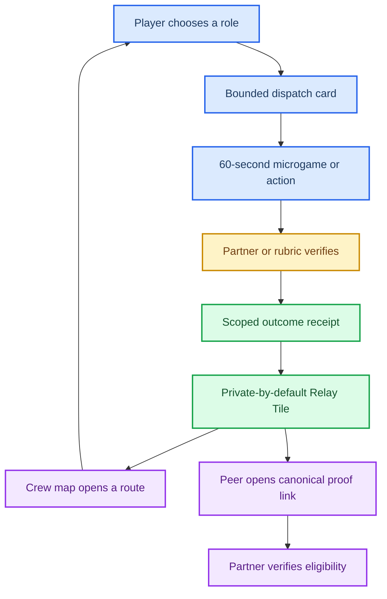

# Outcome Network Game Strategy — Rail and Product Decision

*Decision memo for a game-first consumer prototype in Manus Studio — 2 October 2026. Scores and forecasts in this memo are **design judgments**, not market data.*

---

**Recommendation: build _Proof Relay_ on Solana.** Proof Relay is a cooperative “dispatch” game in which a player completes one tiny, partner-verifiable real-world contribution, earns a privacy-controlled **Relay Tile** as proof of follow-through, and helps a crew complete a shared map. The initial player is a regular in a creator, campus, or Discord community who already helps occasionally but receives no durable, portable credit for it. Its one-sentence promise is: **“Do one useful 60-second dispatch, earn proof that you showed up, and let that proof open the next room.”**

**No system can reliably promise highly profitable autonomous moves.** Markets, execution, fees, taxes, and product failures are uncertain; regulators explicitly identify guaranteed or low-effort profit claims as scam signals.[^1] A responsible first product must **not** claim autonomous profitability, superior trading, passive income, or guaranteed economic gain. Proof Relay instead makes a bounded, already-understood real action legible and useful. Its economic value is partner-paid access, credits, or reduced friction **only when a partner can verify a qualified completion**—not a speculative token, a return forecast, or a balance leaderboard.

Choose **Solana**, but use it selectively: keep play, private evidence, moderation, and real-time state offchain; anchor only final, compact outcome attestations and optional claims. Solana’s Actions can expose human-readable action metadata and return a transaction or message for wallet signing; they do not remove the need for a supported client and an explicit signature.[^2] This is a factual capability. The design hypothesis is that an optional, public-by-choice Relay Tile will make a completed contribution more shareable and more useful to a partner than a conventional signed server receipt. That hypothesis has to win an A/B test.

Robinhood Chain loses **today**, not because its technology is incapable, but because its documented center of gravity is EVM financial/RWA infrastructure, not consumer games or a proven partner distribution surface. It has EVM compatibility, ERC-4337/account-abstraction primitives, sponsored-gas tooling, and sub-second soft confirmations—useful building blocks, not consumer-game demand.[^3] Its stock-token context adds jurisdictional and consumer-protection complexity, and a third-party product cannot assume it may use Robinhood account APIs or act for users without Robinhood’s express written consent.[^4] Solana has the better near-term game/tooling and URL-native outcome-prototype fit; Robinhood Chain should be a **future partner/settlement experiment**, not the launch rail.

## 🎯 1. Direct decision

| Decision item | Decision | What is factual vs. what is a design judgment |
|---|---|---|
| **Recommended product** | **Proof Relay** — a cooperative dispatch game that turns small, verified contributions into a collectible, partner-readable reliability artifact. | Product choice is a design judgment. The artifact is not a claim of financial competence or profit. |
| **First user** | A socially active community regular (creator Discord, campus club, hobby guild) who wants to be recognized as dependable without broadcasting wealth, follower count, or portfolio. | Persona is a hypothesis to test in the 48-hour study. |
| **One-sentence promise** | “Do one useful 60-second dispatch, earn proof that you showed up, and let that proof open the next room.” | Promise is intentionally about completion and access, not outcome returns. |
| **Chosen rail** | **Solana**, hybrid/offchain-first; use devnet for early anchoring and an ordinary HTTPS verification page for every artifact. | Solana supports Actions, wallets, token/collectible primitives, and game-development routes.[^2][^5] Whether these improve conversion is unproven. |
| **Why Solana wins now** | Better immediate fit for a Web/Three.js game that needs low-value, shareable attestations and optional claim links; a broad official guide enumerates JavaScript/Canvas, Phaser, Unity, Unreal, Godot, and other game routes, although the SDK catalog is community-built rather than a first-party SLA-backed game platform.[^5] | Capability is factual; “better fit” is a judgment that will be invalidated if partner integration or completion is worse than a signed server receipt. |
| **Why Robinhood Chain loses today** | More finance/RWA-adjacent, no documented mature third-party consumer-games/quest ecosystem in the supplied evidence, and an account/API relationship that requires commercial and authority validation. | The documented platform facts are cited.[^3][^4] The strategic loss is a sequencing judgment—not a claim that Robinhood Chain cannot win later. |

### Decision guardrails

1. **No live trading, portfolio linking, deposits, custody, or autonomous execution in v0.** A user can play, earn status, and help a team without a wallet.
2. **No speculative game token.** If a benefit later has value, it is sponsor-funded, disclosed, capped, partner-redeemable, and subject to legal review—not emissions-funded.
3. **No reliance on Blink unfurls.** Solana’s own documentation requires client support; Phantom has discontinued Blink support, so direct wallet integration plus a normal web page is mandatory.[^2][^6]
4. **Proof is scoped.** A Relay Tile proves only that a named verifier accepted a defined mission under a versioned rule. It never proves that someone is wealthy, trustworthy in every context, or likely to profit.
5. **“Composability” is earned.** An onchain receipt is only valuable if a partner can consume it with less friction and lower fraud/support cost than the alternative.

## 🧪 2. Hard thesis test

The five drivers are a product thesis, not five tricks to optimize. Proof Relay passes only if users experience voluntary value with incentives hidden or absent. **Manufactured anxiety, profit promises, paid streak protection, variable-reward gambling mechanics, and deceptive gamification are rejected.** The GameFi precedent is a warning: Axie’s own materials describe inflation and new-entrant dependence as unsustainable, while later changes cut rewards after issuance outpaced burns.[^7] The relevant question is not “can we make people click?” but “would a player return if the reward had zero resale value?”

| Founder driver | Proof Relay mechanism | Why it may work | Boundary / falsifier |
|---|---|---|---|
| **1. Status / identity** | A player’s Relay Atlas shows verified roles—Scout, Finisher, Host, Tester—not money, ROI, or follower count. A Tile contains a rule, verifier, date, and opt-in audience. | It turns a self-assertion (“I help”) into evidence-linked identity, closer to a contribution record than a vanity badge. GitHub’s profile is a precedent for legible, visibility-controlled contribution history, not a forecast for this product.[^8] | Reject if players confuse a Tile with financial credibility, feel pressured to expose private behavior, or share only when a cash-like reward is present. Default audience is private. |
| **2. Actual economic value** | A partner can attach a clear benefit—access, a fee waiver, a credit, early entry, or a qualified offer—to a verified completion. The user can receive value without taking market exposure. | The partner pays for a completed, fraud-controlled job: qualified testing, attendance, onboarding, fulfillment, or community contribution. | Reject if “value” is merely points, token liquidity, or a discount that induces unnecessary spending. A benefit must be deliverable, disclosed, and not require recruiting. |
| **3. Cognitive relief** | One visible dispatch, one bounded action, one next step. The player need not choose among an infinite feed, study a market, or configure an agent. | It converts “what useful thing should I do?” into a low-stakes, comprehensible action. | Reject if the game creates notification dependence, fear of breaking a streak, decision fatigue, or ambiguous mission requirements. Include pause and recovery with no penalty. |
| **4. Asymmetric effort-to-reward** | A 30–90 second action creates a durable, reusable proof object and advances a team map; the reward is leverage and recognition, not a lottery. | A small contribution can have durable value if a partner or peer can verify and reuse it. | Reject if economic upside is only promised future appreciation or if the work resembles underpaid micro-labor. Time cost, beneficiary, and benefit must be explicit. |
| **5. Legitimate network pressure** | Crews need complementary roles to open a shared district, but no user must invite, spend, or post publicly. A teammate’s Tile shows what was completed, not what they earned. | Adoption can arise because a peer wants the same credible role or wants to help complete a shared map—not because they are shamed or paid to recruit. | Reject if invites, scarcity, loss framing, or social comparison are the primary activation engine. No referral bounty in v0. |
| **6. B2B permissionless composability** | Partner receives a narrow Verify API, signed receipt, and embeddable Tile—not wallet access, raw evidence, or a user’s full history. | A partner can check eligibility or attribute a completed action with minimal data. Share cards use a canonical URL and Open Graph metadata even where wallet clients do not render an action.[^9] | Reject if every partner needs bespoke manual operations, cannot explain its job-to-be-done, or gets no measurable lift versus a server-signed receipt. “Permissionless” means technically open verification, not that every commercial partner is automatically entitled to user data. |

**Thesis conclusion:** The status + actual-value combination is viable only if **status follows a genuinely useful action**, not the other way around. Economic value should be an occasional consequence of partner demand; the first retained loop must be the satisfaction of finishing a dispatch, displaying a credible role, and helping a crew progress with rewards disabled.

## ⚖️ 3. Rail decision matrix — Solana vs. Robinhood Chain

**Scoring convention:** 1 = poor for the first product, 3 = usable with material work, 5 = strong fit. These are **design judgments**, not measured benchmarks or claims about total ecosystem value. The factual anchors appear in the last column.

| Criterion | Solana | Robinhood Chain | Decision judgment | Factual anchor / uncertainty |
|---|---:|---:|---|---|
| **User reach** | 3 | 2 | Neither has proven mainstream reach for this exact game. Solana has broader gaming adjacency; Robinhood has finance adjacency, neither is an acquisition channel. | Solana Mobile adds Android/web-app distribution but does not prove broad reach.[^10] Robinhood Chain’s public materials focus on RWA/financial services, not games.[^3] |
| **Integration maturity** | 4 | 3 | Solana has mature web primitives and a broad game route catalog; Robinhood Chain has conventional EVM tools and new-chain operational dependencies. | Solana catalog is community-built.[^5] Robinhood documents EVM, RPC, explorer, and common tooling.[^3] |
| **Transaction / signing friction** | 3 | 4 | Robinhood’s smart-account/paymaster pattern may ultimately be smoother; Solana needs direct wallet UX and an explicit signature. For v0, avoid chain signing in the first minute on both. | Actions return signable payloads and require supported clients.[^2] ERC-4337 supports bundlers/paymasters; it is infrastructure, not proof of UX success.[^11] |
| **Game tooling** | 4 | 2 | Solana is more prototype-friendly for a game-first team today. | Official Solana documentation lists multiple game routes, but community maintenance is a material caveat.[^5] No comparable official Robinhood game SDK/quest ecosystem was found in supplied research. |
| **Data / asset composability** | 4 | 4 | Both can carry compact public outcomes. Solana’s credential/collectible patterns are closer to the first artifact; Robinhood’s standard EVM is strong for generic contracts. | Solana supports programmable token/account state with compatibility constraints.[^12] Robinhood is EVM-compatible.[^3] |
| **Payment / commerce primitives** | 4 | 3 | Solana gives low-value transfer and fee-abstraction options; Robinhood offers sponsorship but ETH/L1 data fees and bridge/recovery mechanics add operational complexity. Neither is needed in v0. | Solana’s official payment docs describe sponsored-fee options and low transfer costs but note account-creation cost.[^13] Robinhood uses ETH gas with L2 plus L1 data fees.[^14] |
| **B2B embed surfaces** | 4 | 3 | Solana’s URL/action plus normal-web fallback makes a good proof-distribution experiment; EVM smart accounts are promising when a financial partner explicitly wants them. | Actions/Blinks are web/QR/button-capable but client-dependent.[^2][^6] Robinhood AA is a capability, not a distribution guarantee.[^3] |
| **Regulatory / custody burden** | 4 | 2 | Both require review for valued rewards. Robinhood’s finance/RWA and account-authority context puts it closer to high-consequence financial UX; Solana v0 can remain non-custodial/nonfinancial. | Robinhood Stock Tokens are jurisdictionally restricted and represent economic exposure rather than underlying ownership.[^15] API use requires explicit permission.[^4] |
| **Time to Manus Studio prototype** | 5 | 3 | A Three.js local-first game with offchain receipts can be prototyped fastest; add Solana devnet anchoring later. Robinhood needs more wallet/account/provider/commercial assumptions to test its distinctive value. | Judgment based on the documented stacks and product scope; no public source proves time-to-prototype. |
| **Weighted first-product fit** | **3.85 / 5** | **2.90 / 5** | **Choose Solana now; retain Robinhood Chain as a later finance-partner test.** | Not a market-size forecast. |

### What would reverse the rail decision?

Move Robinhood Chain ahead only if all three conditions hold: (1) an approved Robinhood or finance-adjacent partner supplies a concrete embedded distribution surface; (2) an AA/sponsored-gas path demonstrably beats Solana/web fallback on informed completion and support burden; and (3) the product’s useful artifact genuinely requires a regulated, jurisdiction-gated financial entitlement rather than a general outcome receipt. No current supplied evidence establishes those conditions.

## 🃏 4. Ten original game-first concept cards

All ten concepts are designed so the core loop works **without live financial-market execution**. Concepts 3, 8, and 10 are money-adjacent but start with simulation, verified savings, or bounded commerce—not trading. Each card is a design hypothesis and deliberately separates its real-value claim from speculative value.

### 1. Proof Relay — recommended

- **One-line aha:** A tiny real contribution becomes a tile in a cooperative map that says, credibly and privately by default, “this person follows through.”
- **Core loop:** Draw one dispatch → perform a 30–90 second partner/community action → receive verifier result → place a Relay Tile → unlock a complementary crew route → choose tomorrow’s role.
- **Real user value source:** Reliable recognition, a lighter decision about what to do today, and occasionally a sponsor/partner access benefit tied to a completed action.
- **Status / share artifact:** Versioned Relay Tile and a personal Relay Atlas with role streaks, verifier, date, audience, and limited claim—not a balance, rank by spend, or PnL.
- **B2B embed hook:** A host embeds a “Verify Relay” widget to validate completed onboarding, attendance, test feedback, or fulfillment and issue access/benefit eligibility.
- **Why a chain is essential:** It is **not essential to game feel**. A public, portable attestation is useful only once a partner needs independent verification across properties; otherwise a signed server receipt wins.
- **Minimal first action:** Pick a private callsign and answer one 20-second partner test/crew dispatch.
- **Closest alternatives:** GitHub contributions, Discord badges, Strava activity objects, and quest platforms; none combine a bounded partner attestation, cooperative map, and privacy-first portable outcome in this form.
- **Major risk:** It becomes disguised survey labor or a generic loyalty app.
- **Strongest falsifier:** With rewards hidden, fewer than 25% of verified completers return voluntarily within seven days or partners prefer a simple form/receipt at equal or lower cost.
- **No-money Manus Studio prototype:** Local Three.js map, scripted dispatch deck, simulated signed verifier, share-card preview, crew progress, and one “partner” dashboard; no wallet, token, payment, or chain write.

### 2. Skill-Swap Draft

- **One-line aha:** Draft a role your crew needs, complete a tiny real help task, and build a visible “I am useful at this” roster instead of a social feed.
- **Core loop:** Team sees unmet skill slots → player drafts one → completes a peer-confirmed assist → role card levels → team unlocks a joint challenge.
- **Real user value source:** Faster mutual aid, a credible capability signal, and introductions to teams needing that skill.
- **Status / share artifact:** Peer-attested Role Card showing task class, quality threshold, and recency.
- **B2B embed hook:** Communities, co-working spaces, or creator teams embed role verification to find contributors without exposing a full résumé.
- **Why a chain is essential:** Portable, tamper-evident credentials matter when roles cross communities; ordinary signed credentials are sufficient until that happens.
- **Minimal first action:** Choose one role card and accept a 10-minute asynchronous request; in demo, complete a simulated task.
- **Closest alternatives:** Volunteer matching, Discord roles, LinkedIn endorsements.
- **Major risk:** Favor trading becomes coercive or exposes minors/vulnerable users.
- **Strongest falsifier:** Requests are not completed at a materially better rate than direct community posts, or users do not value the credential after help is delivered.
- **No-money Manus Studio prototype:** Draft board, mock peer confirmation, role-card renderer, contribution graph, and safety/report action.

### 3. Subscription Siege

- **One-line aha:** Turn the boring act of stopping unwanted recurring spend into a cooperative “escape room” whose trophy is a private, verifiable savings-action receipt—not an investment claim.
- **Core loop:** Choose a simulated subscription trap → identify cancellation/renewal lever → complete guided offchain task → capture proof → rescue a district from recurring-cost monsters.
- **Real user value source:** Actual avoided future expense, better renewal awareness, and a receipt of the action taken.
- **Status / share artifact:** “Renewal Defender” Tile revealing only a category and completion date, never merchant name or dollar amount by default.
- **B2B embed hook:** Budgeting, employee-benefit, or subscription-management partners can issue/verify a cancellation or review-completion receipt.
- **Why a chain is essential:** A portable, user-controlled proof can power benefits across partners; the cancellation itself should remain offchain and user-controlled.
- **Minimal first action:** Select a mock subscription and correctly choose the renewal deadline from a card.
- **Closest alternatives:** Subscription managers, personal-finance apps, habit trackers.
- **Major risk:** The product overstates savings or encourages cancellation of useful services.
- **Strongest falsifier:** Users complete the game but do not complete real cancellation/review actions, or report regret/confusion at a nontrivial rate.
- **No-money Manus Studio prototype:** Fictional subscription deck, calendar puzzle, opt-in “completed” receipt, private Tile view, and no account/email connection.

### 4. Signal School

- **One-line aha:** Make high-quality user testing a team sport: a player spots a real product ambiguity, explains it in one sentence, and earns a “clarity scout” proof only if the partner accepts it.
- **Core loop:** Inspect a partner mock → choose the most confusing moment → submit a structured explanation → partner or rubric accepts/rejects → place a clarity beacon on team map.
- **Real user value source:** Players improve products they use; accepted insights can unlock access, credits, or beta participation.
- **Status / share artifact:** Accepted Clarity Beacon with task class, rubric version, and partner attestation.
- **B2B embed hook:** Research/QA teams embed a micro-test in their launch flow and receive structured, attributable, deduplicated feedback.
- **Why a chain is essential:** Independent provenance is useful if accepted contributions must travel between an agency, creator, and customer; it is unnecessary for an internal test.
- **Minimal first action:** Tap the confusing element in a three-screen prototype and select one reason.
- **Closest alternatives:** User-testing panels, bug bounties, feedback widgets.
- **Major risk:** Low-quality crowdsourced feedback overwhelms the partner.
- **Strongest falsifier:** Accepted feedback does not beat a conventional panel on usefulness per review minute.
- **No-money Manus Studio prototype:** Three clickable mock screens, rubric scorer, mock acceptance event, beacon inventory, and partner review queue.

### 5. Access Key Forge

- **One-line aha:** Instead of grinding content, demonstrate one practical safety or community skill in a 60-second challenge and carry a verifiable access key to partner spaces.
- **Core loop:** Choose a scenario → make a bounded judgment → explain one reason → pass rubric → forge a key → unlock a cooperative room or host perk.
- **Real user value source:** Faster, more credible onboarding and access to communities/events with shared norms.
- **Status / share artifact:** Non-transferable Access Key with scope, expiry, issuer, and revocation status.
- **B2B embed hook:** Event hosts, clubs, or moderated communities use a key to verify completed orientation without exposing quiz answers.
- **Why a chain is essential:** Portable revocable credential is helpful across hosts; a signed web credential is the v0 control.
- **Minimal first action:** Solve one fictional moderation/safety scenario.
- **Closest alternatives:** Compliance training, Discord verification, event onboarding.
- **Major risk:** It substitutes a game quiz for real competence or becomes exclusionary.
- **Strongest falsifier:** Hosts do not see lower onboarding/support burden or users cannot accurately apply the skill later.
- **No-money Manus Studio prototype:** Scenario deck, explain-your-choice interaction, local credential wallet, expiry/revocation simulator, host verify page.

### 6. Commons Courier

- **One-line aha:** A crew routes small verified acts of local/community maintenance like parcels through a playful city, with the reward being a public-good footprint rather than loot.
- **Core loop:** See a blocked city route → select a mission (report issue, verify accessibility info, welcome newcomer, attend cleanup) → host confirms → route opens for the crew.
- **Real user value source:** More legible and coordinated community contributions; partners receive verified completion rather than vague volunteer intent.
- **Status / share artifact:** Route Stamp indicating contribution type and host verification; user can hide location/category.
- **B2B embed hook:** Nonprofits, campus organizations, and local venues embed a mission/verify widget and issue access or recognition.
- **Why a chain is essential:** Cross-organization contribution history is the only chain justification; exact location and evidence must not go onchain.
- **Minimal first action:** Choose one fictional route blockage and complete a 30-second triage.
- **Closest alternatives:** Volunteer platforms, civic-report apps, geocaching.
- **Major risk:** Safety, fraud, and unequal ability to perform real-world tasks.
- **Strongest falsifier:** Host verification is too manual or users feel status pressure rather than genuine agency.
- **No-money Manus Studio prototype:** City map, fictional mission state machine, host confirmation simulator, redaction controls, and crew route progression.

### 7. Proof-of-Practice Arcade

- **One-line aha:** Convert tiny practice repetitions into a social arcade cabinet where the only currency is demonstrable improvement, not time spent.
- **Core loop:** Play a short skill microgame → upload/record a bounded result → automated/peer verifier checks threshold → mastery streak updates → remix challenge for peers.
- **Real user value source:** Structured practice, portfolio evidence, and access to harder/hosted challenges.
- **Status / share artifact:** Practice Patch showing rule, score band, verifier type, and date—not raw high-score pressure.
- **B2B embed hook:** Learning, creator-tool, and community platforms use patches for progressive access or challenge placement.
- **Why a chain is essential:** A portable patch can matter across learning providers; it is not required to make the game fun.
- **Minimal first action:** Complete one 20-second pattern/typing/visual task.
- **Closest alternatives:** Duolingo streaks, coding challenge sites, achievement systems.
- **Major risk:** It rewards easy repeatable activity rather than skill or becomes a leaderboard arms race.
- **Strongest falsifier:** Improvements do not transfer to the real skill or players only engage while scores are public.
- **No-money Manus Studio prototype:** Three microgames, local verifier thresholds, patch gallery, audience toggle, and share-card preview.

### 8. Bounded Bot Arena

- **One-line aha:** Compete to write the clearest limits for a simulated consumer agent; win by preventing bad outcomes, not predicting profitable trades.
- **Core loop:** Receive a fictional consumer request → configure merchant, budget, expiry, and exception policy → run simulation → inspect failures → earn a Safety Tactician badge for robust constraints.
- **Real user value source:** People learn how to set scopes, caps, and revocation on future automation; partners learn where consent UI fails.
- **Status / share artifact:** Policy Card with allowed scope, expiry, scenario result, and no connection to live account authority.
- **B2B embed hook:** Wallets, payment providers, and agent products use the arena to educate users and test policy templates.
- **Why a chain is essential:** It is optional; signed policy/revocation receipts become useful only when a real authorized payment endpoint exists.
- **Minimal first action:** Drag one maximum-spend chip and one expiry chip onto a fictional agent card.
- **Closest alternatives:** Security training, fintech onboarding, budgeting simulators.
- **Major risk:** Simulation appears to endorse autonomous finance or creates false confidence.
- **Strongest falsifier:** Players cannot explain the difference between simulation and authorization, or a partner sees no policy-comprehension lift.
- **No-money Manus Studio prototype:** Local rule engine, fictional merchants, attack/failure cards, policy-receipt viewer, and revoke button.

### 9. Receipt Raiders

- **One-line aha:** A co-op puzzle where each verified order fulfillment, pickup, or return resolves a shared supply-chain mystery—without showing spending amounts.
- **Core loop:** Choose a fictional logistics clue → take a partner-defined fulfillment action → merchant webhook confirms → evidence card resolves → crew collection advances.
- **Real user value source:** Clearer fulfillment/return status, reduced support friction, and optional merchant recognition or access.
- **Status / share artifact:** Fulfillment Proof Card showing event state and verifier, with item/amount redacted by default.
- **B2B embed hook:** Merchants embed status proof in post-purchase flows to reduce “where is my order?” contacts and reward reliable pickup/return completion.
- **Why a chain is essential:** A reusable receipt is valuable across marketplace, delivery, and loyalty surfaces; the order record itself must remain private/offchain.
- **Minimal first action:** Solve a simulated order-status sequence.
- **Closest alternatives:** Order trackers, loyalty programs, package-tracking apps.
- **Major risk:** It gamifies consumption or leaks commerce data.
- **Strongest falsifier:** Partner support cost does not decrease or users perceive the game as pressure to purchase.
- **No-money Manus Studio prototype:** Simulated order webhooks, redacted receipt renderer, puzzle map, partner status panel, no checkout.

### 10. Futures Without Funds

- **One-line aha:** Players build a “weather report” for a chosen public goal—event turnout, inventory demand, community need—not an asset price; accuracy creates a calibrated judgment reputation.
- **Core loop:** Make a bounded forecast with confidence → explain one signal → outcome resolves from a public or partner feed → calibration badge adjusts → crew compares assumptions.
- **Real user value source:** Better planning judgment, useful partner demand/attendance signals, and a record of calibrated—not merely lucky—calls.
- **Status / share artifact:** Calibration Stamp with question, horizon, confidence band, resolution source, and Brier-style score band; no cash prize.
- **B2B embed hook:** Event, creator, and merchant partners embed forecasts to plan capacity or inventory and publish resolved results.
- **Why a chain is essential:** Tamper-evident timestamping can prevent post-resolution edits; a signed server timestamp is the v0 comparator.
- **Minimal first action:** Choose “higher/lower/about the same” for a fictional event turnout and set confidence.
- **Closest alternatives:** Prediction games, polling, fantasy markets.
- **Major risk:** It drifts into gambling or is mistaken for investment advice.
- **Strongest falsifier:** Participants treat probability as a trading recommendation or partner forecasts do not improve a real planning decision.
- **No-money Manus Studio prototype:** Fictional forecast deck, locked timestamp, delayed reveal, calibration chart, no stakes, no token, no market price.

## 📊 5. Transparent ranked scorecard

**Method:** The table is a transparent **design-judgment scorecard**, not evidence. Each criterion is scored 1–5; weighted points equal `score ÷ 5 × weight`. Weights deliberately favor useful, safe, prototypeable loops over chain novelty. Total is out of 100.

| Rank | Concept | Instant comprehension 15% | Real utility 20% | Status / share 15% | Repeat loop 10% | Partner integration 15% | Studio buildability 10% | Trust / safety 10% | Rail fit 5% | **Total / 100** |
|---:|---|---:|---:|---:|---:|---:|---:|---:|---:|---:|
| 1 | **Proof Relay** | 5 | 4 | 5 | 4 | 5 | 5 | 4 | 5 | **92** |
| 2 | Signal School | 4 | 4 | 4 | 5 | 4 | 5 | 3 | 4 | **82** |
| 3 | Skill-Swap Draft | 4 | 4 | 5 | 4 | 4 | 4 | 3 | 3 | **80** |
| 4 | Commons Courier | 3 | 5 | 4 | 4 | 5 | 3 | 3 | 4 | **80** |
| 5 | Subscription Siege | 5 | 5 | 3 | 3 | 4 | 4 | 3 | 3 | **79** |
| 6 | Proof-of-Practice Arcade | 5 | 3 | 4 | 5 | 3 | 5 | 4 | 3 | **79** |
| 7 | Access Key Forge | 4 | 4 | 3 | 3 | 5 | 4 | 4 | 4 | **78** |
| 8 | Receipt Raiders | 4 | 4 | 4 | 3 | 5 | 3 | 3 | 4 | **77** |
| 9 | Bounded Bot Arena | 3 | 4 | 4 | 4 | 4 | 4 | 3 | 3 | **74** |
| 10 | Futures Without Funds | 3 | 3 | 4 | 4 | 3 | 5 | 2 | 3 | **67** |

### Arithmetic check for the winner

| Criterion | Weight | Proof Relay score | Calculation | Weighted points |
|---|---:|---:|---|---:|
| Instant comprehension | 15 | 5 | 5 ÷ 5 × 15 | 15 |
| Real utility | 20 | 4 | 4 ÷ 5 × 20 | 16 |
| Status / share value | 15 | 5 | 5 ÷ 5 × 15 | 15 |
| Repeat loop | 10 | 4 | 4 ÷ 5 × 10 | 8 |
| Partner integration value | 15 | 5 | 5 ÷ 5 × 15 | 15 |
| Buildability in Studio | 10 | 5 | 5 ÷ 5 × 10 | 10 |
| Trust / safety tractability | 10 | 4 | 4 ÷ 5 × 10 | 8 |
| Rail fit | 5 | 5 | 5 ÷ 5 × 5 | 5 |
| **Total** | **100** |  | 15 + 16 + 15 + 8 + 15 + 10 + 8 + 5 | **92** |

**Why the winner is not simply a rewards app:** the first scarce object is an outcome with a named scope and verifier. Reward value is downstream of a partner’s demonstrated utility. If a partner cannot articulate the verified action it values, no mission ships.

## 🕹️ 6. Detailed product design — Proof Relay

### Product thesis and first screen

**The game:** Proof Relay is an asynchronous cooperative city-map game. A crew can open one district only by completing complementary dispatch types—e.g., a Scout finds a confusion, a Finisher confirms a task, a Host welcomes a new member. A player chooses a role, completes a bounded mission, and places one visual Tile. The game is satisfying because the map visibly changes, roles complement rather than compete, and a player’s Atlas tells a coherent story of how they contribute.

**First screen copy:**

> **Your crew needs one move.**  
> Choose a 60-second dispatch. Complete it. Keep the proof private or let it open the next room.

The screen contains exactly three dispatch cards, one-line purpose labels, “What gets verified?” disclosure, expected time, audience selector defaulting to **Only me**, and a **Try a demo dispatch** button. It contains **no wallet request, money amount, leaderboard, referral prompt, token, or market chart**.

### 60-second first journey

| Time | Player action | System response | Trust boundary |
|---:|---|---|---|
| 0–5 sec | Selects a callsign and private/public preference. | Creates local profile; no email or wallet. | Callsign is a local pseudonym. |
| 5–12 sec | Sees three roles; taps **Scout**. | Shows a dispatch: “Find the most confusing step in this partner’s three-card mock.” | Copy says the partner will receive only the selected confusion tag and explanation. |
| 12–30 sec | Plays a 20-second observation microgame. | Highlights selected friction point; asks one structured reason. | The game does not infer personal financial behavior. |
| 30–42 sec | Submits one sentence or selects “skip.” | Mock verifier returns accepted/review-needed and tells the player precisely what that means. | A failed/uncertain result is never presented as a verified outcome. |
| 42–52 sec | Picks Tile visibility: private, crew, or link-only. | Places a private Relay Tile on Atlas and advances crew demo map. | Privacy can be changed/revoked; share defaults off. |
| 52–60 sec | Taps **See what this opened**. | Shows a new complementary crew route and optional ordinary web share card. | No social contact harvesting, follow prompt, or payment action. |

### Core game loop

1. **Dispatch:** One useful, clearly scoped task appears; its beneficiary, time cost, verifier, and optional benefit are legible.
2. **Play:** The task is framed as a compact microgame/puzzle, not a survey quota. A player makes one meaningful choice or contribution.
3. **Verify:** A partner webhook, trusted rubric, peer double-confirmation, or moderator validates the specific defined outcome.
4. **Place:** The app creates a Relay Tile; the player controls audience and can view the rule/version.
5. **Cooperate:** Complementary Tiles open map routes, cosmetic regions, and more interesting dispatch types; they do not make a player financially superior.
6. **Reuse:** A partner or peer can verify the Tile through a constrained public link/API. A useful open can unlock a next mission or access condition.
7. **Return:** The player sees a new dispatch only when there is a credible job, never because an artificial streak will expire.

### User-generated artifact schema

A Tile is an **outcome claim**, not a social post and not evidence of wealth. Store raw evidence and identity offchain; commit a compact hash only after a partner needs portable verification.

```json
{
  "artifact_version": "1.0",
  "artifact_id": "relay_01J...",
  "game_id": "proof_relay",
  "ruleset_version": "dispatch_v1.2",
  "mission": {
    "type": "clarity_scout",
    "scope": "partner_mock_2026q4",
    "beneficiary_label": "Partner-defined product test"
  },
  "participant": {
    "pseudonym": "northstar_fox",
    "credential_commitment": "optional-hash-not-identity"
  },
  "outcome": {
    "status": "verified",
    "completed_at": "2026-10-02T20:15:00Z",
    "verifier_type": "partner_webhook",
    "verifier_id": "partner_opaque_id",
    "evidence_hash": "sha256:..."
  },
  "visibility": "link_only",
  "benefit": {
    "kind": "access",
    "terms_url": "https://partner.example/terms",
    "value_amount": null
  },
  "revocation": {
    "status": "active",
    "revocation_url": "https://relay.example/revoke/..."
  },
  "proof": {
    "server_signature": "ed25519:...",
    "solana_anchor": null
  }
}
```

**Schema rules:** do not include raw evidence, government identity, exact location, financial account, merchant amount, wallet history, health information, private social graph, or inferred “trust score.” A partner verifies the narrow claim: *this credential is active; a defined ruleset was satisfied by a pseudonymous participant at this time.*

### Partner embed contract

**Partner job-to-be-done:** “I need a trustworthy, low-data way to know a user completed this particular action, and I need that action to improve activation, support cost, retention, or eligibility enough to justify integration.” Not “I want a viral token campaign.”

| Contract surface | Partner supplies | Relay supplies | Prohibited / required control |
|---|---|---|---|
| **Mission manifest** | Mission ID, purpose, estimated time, eligibility, verifier type, benefit terms, expiry, disclosure text. | Schema validation and user-facing receipt copy. | No hidden paid promotion, no cash-like claim without review. |
| **Embedded widget** | Host origin, theme tokens, context ID. | Sandboxed Tile/mission renderer, consent screen, ordinary web fallback. | No third-party cookies by default; partner cannot read Atlas history. |
| **Verification webhook** | Signed `mission.completed` / `mission.rejected` event with nonce, reason code, event ID. | Idempotency, event log, status transition, Tile issuance/revocation. | HMAC/signature required; replay and duplicate events rejected. |
| **Verify API** | Artifact ID or signed presentation request. | `active/revoked/pending`, ruleset version, scope, issuer, timestamp, opaque subject. | Read-only, minimal fields, rate-limited; no raw evidence or identity. |
| **Attribution report** | Campaign ID and agreed success event. | Aggregated open → consent → verified-completion → repeat funnel. | No raw wallet/account data; partner cannot retarget based on a private Tile. |

### Authority and data boundaries

- **Player authority:** Controls mission acceptance, visibility, sharing, revocation request, and all later wallet signing. A player never pre-authorizes money movement through the game.
- **Relay authority:** May render a mission, store private gameplay/evidence, issue/revoke a scoped Tile, and anchor a hash only on the user/partner-approved policy. It cannot execute a trade, transfer, purchase, or bind a user to external terms.
- **Partner authority:** Can attest its own event and check a narrow claim; it cannot access player credentials, financial accounts, unredacted history, share settings, or create a verified Tile unilaterally without its signed event.
- **Chain authority:** Solana holds only a compact final-state commitment or non-transferable credential when needed. Chain state does **not** adjudicate the truth of offchain behavior; the verifier and dispute policy do.
- **Moderator authority:** Can pause a mission, mark a Tile under review, reverse a fraudulent result, and publish a reason. Moderators cannot convert a Tile into money or expose raw evidence.

### Anti-abuse model

| Threat | First control | Escalation / recovery |
|---|---|---|
| Sybil farming | Per-mission eligibility, device/session velocity limits, no cash-per-completion payout, limited daily Tile issuance. | Risk review, human challenge, partner-specific cooldown, reputation reset without public shaming. |
| Replay / forged partner event | Nonce, expiry, signed webhook, idempotency key, event hash. | Quarantine artifact; partner and player see transparent `under_review` state. |
| Collusive peer confirmation | Two-party confirmation only for low-value/status actions; random audit and role diversity. | Remove affected Tiles and pause mission type; no collective punishment. |
| Screenshot / share deception | Canonical artifact URL has live status and revocation state; rendered card says exactly what was verified. | Link-only verification overrides stale image; takedown/report route. |
| Privacy leak | Private default, coarse labels, separate evidence vault, redaction preview. | Immediate audience change, unlink/revoke, evidence-deletion workflow subject to legal retention. |
| Partner reward failure | Benefit terms, availability, and fulfillment SLA stored in mission manifest; support case ID. | Pause partner, make-good only after review, public partner reliability record. The FTC’s reward enforcement is a useful warning that promised third-party rewards require clear terms, complaint handling, monitoring, and partner discipline.[^16] |
| Harmful status pressure | No spend/return leaderboards, no paid streak protection, no referral bounty, no loss-framed push notification. | Well-being complaint review and experiment stop if pressure/compulsion signals appear. |

### Non-goals

- Not a trader terminal, signal service, copy-trading product, or portfolio tracker.
- Not a play-to-earn economy, liquidity/reward-emission scheme, lottery, or paid-entry contest.
- Not a general social feed, gig-work marketplace, or influencer affiliate layer.
- Not a permanent universal reputation score or behavioral surveillance system.
- Not proof that a person is safe, solvent, skilled in all contexts, or entitled to a benefit outside its defined scope.

### Money and account policy

**Prototype and first pilot:** no deposits, transfers, token rewards, stock tokens, wallets, Robinhood accounts, bank connections, or live financial-market execution. Benefits may be non-cash access or a partner-provided perk only after a written fulfillment policy and jurisdiction review. Do not make a player pay to protect progress or participate.

**If a later commerce action is considered:** treat it as user-approved execution of a known objective, never autonomous investment selection. Apply exact merchant/asset allowlist, budget and velocity cap, expiry, clear preview of fees/downside, transaction-level status, one-tap revoke, and step-up confirmation for exceptions. Industry payment patterns demonstrate the relevant boundary: a seller-scoped, amount-limited, time-limited authorization is materially safer than a long-lived unrestricted credential.[^17]

### Event metrics

| Event / metric | Definition | Why it matters | Not a success metric |
|---|---|---|---|
| `value_explained_correctly` | User correctly states task, verifier, privacy choice, and that no profit is promised after 30 seconds. | Informed use, not accidental completion. | Raw clicks. |
| `dispatch_started` → `dispatch_completed` | Start-to-submission and verified completion rates by mission type. | Tests clarity and actual usefulness. | Total mission volume. |
| `tile_visibility_selected` | Private / crew / link-only / public choice; later changes/revocations. | Tests voluntary social value and privacy comfort. | Public-share count alone. |
| `qualified_open` | Recipient opens canonical Tile, sees verification status, and completes a useful partner/crew next step. | Measures credible share/open behavior. | Impressions/follower count. |
| `repeat_without_incentive` | Verified completer returns and accepts another dispatch after benefits are removed. | Tests intrinsic game/identity loop. | Token price, wallet count, trading volume. |
| `partner_verified_value` | Partner-confirmed action, integration time, support tickets avoided, and fraud/dispute rate relative to control. | Tests B2B value. | Partnership announcement. |
| `permission_or_privacy_regret` | Visibility changes, deletion requests, complaints, comprehension failures. | Safety leading indicator. | Time-in-app. |
| `abuse_rate` | Quarantined, replayed, Sybil-suspected, or overturned Tiles per 1,000 attempts. | Protects artifact credibility. | Number of credentials minted. |

### Kill criteria

Kill, redesign, or demote Proof Relay before adding money/chain complexity if any of these occur:

1. Fewer than **70%** of comprehension-test participants correctly explain that the game verifies a narrow action—not profit, investment advice, or a universal trust score.
2. Fewer than **50%** of eligible first-session users complete the chosen micro-dispatch after informed consent, or median completion exceeds **90 seconds** for a claimed 60-second task.
3. Fewer than **25%** of verified completers return within seven days **with no reward/benefit visible**, or return collapses by more than **30 percentage points** when incentives turn off.
4. Fewer than **15%** of deliberately offered share cards are opened by a peer, or fewer than **25%** of openers can correctly say what is verified.
5. No pilot partner can demonstrate an attributable benefit (activation, verified completion, support reduction, eligibility accuracy) worth more than integration/support cost within a 30-day pilot.
6. Privacy regret, deceptive-outcome complaints, or credible abuse exceeds **2% of verified attempts**, or any incident shows the artifact is interpreted as a financial-performance claim.

## 🔁 7. Winning product loop



## 🛠️ 8. Manus Studio build plan — do not initialize yet

### Technology decision

Use **Three.js** with a minimal React/Vite-style web starter, not 2D Godot. The value proposition is a tactile, spatial “crew map / Tile placement” experience that benefits from lightweight 3D depth, transitions, and share-card composition in a browser. There is no physics-heavy 2D simulation, mobile-native input requirement, or high-frame-rate arcade mechanic that would justify Godot for the first validation. This is a **planning recommendation only**; do not initialize, scaffold, or build a Studio project before founder decisions and the first comprehension test.

### Online capabilities

| Capability | v0 local-first | Pilot | Explicitly not needed yet |
|---|---|---|---|
| Local callsign, crew state, dispatch completion | `localStorage` seeded data | Account-lite pseudonymous session | Email/password, social login, wallet onboarding |
| Game rendering | Three.js scene + DOM overlays | Same | Multiplayer real-time sync |
| Verification | Deterministic local mock verifier | Signed backend webhook / admin queue | Onchain program / live wallet signing |
| Artifact | Local JSON + share-card preview | Canonical HTTPS receipt + Open Graph image | Transferable NFT, token account, public wallet graph |
| Partner embed | Static mock host page | Sandboxed iframe/widget + Verify API | Full partner marketplace / revenue settlement |
| Moderation / abuse | Hard-coded rules, report button, event log | Rate limits, review queue, mission pause | Automated financial risk engine |
| Chain | None; UI includes an “anchored later” state | Solana devnet compact outcome hash after A/B | Mainnet settlement, rewards, payments |

### Local-first prototype scope

Build only one **Signal School / Clarity Scout** dispatch as the Proof Relay vertical: three fictional product cards, one player choice, one short explanation, mock verification, one Tile, crew route update, and a share/verify preview. It should run entirely in the browser with fixture data. The proof question is whether a player understands and wants the Tile—not whether a blockchain transaction succeeds.

### Code and module boundaries

| Boundary | Responsibility | Must not do |
|---|---|---|
| `src/game/scene/` | Three.js camera, district map, Tile placement, transitions. | Know partner credentials or verify outcomes. |
| `src/game/dispatch/` | Dispatch state machine, timer, microgame interactions, accessibility-friendly DOM controls. | Render chain/wallet UX. |
| `src/domain/outcome/` | Typed mission, verification, Tile, visibility, revocation models; deterministic reducers. | Call vendor APIs directly. |
| `src/services/verifier/` | `MockVerifier` now; later `SignedWebhookVerifier` behind same interface. | Store raw evidence in public artifact. |
| `src/services/artifacts/` | Artifact serializer, share-card data, canonical status resolver. | Decide gameplay progression. |
| `src/partner/` | Manifest parser, mock embed, Verify API adapter contract. | Access user Atlas beyond approved claim. |
| `src/privacy/` | Audience choice, redaction transforms, deletion/revoke flows. | Treat public visibility as default. |
| `src/analytics/` | Consent-aware event names and local event sink. | Send raw text evidence or sensitive identifiers. |
| `src/rail/` | Empty adapter contract first; `SolanaAnchorAdapter` only after receipt A/B. | Make a chain write required for basic play. |

### Three vertical-slice milestones

| Milestone | Player-visible slice | Acceptance checks | Deliberately excluded |
|---|---|---|---|
| **Slice 1 — “I get it”** | Choose a callsign, play one fictional 20-second Scout dispatch, receive a local Relay Tile, see the map route change. | 10 internal testers can explain task, verifier, and privacy choice; keyboard and touch path work; no wallet screen appears. | Accounts, share links, partner dashboard, chain. |
| **Slice 2 — “It is proof, not a sticker”** | Choose visibility, inspect canonical-style Tile page, simulate a partner verifier accepting/rejecting outcome, revoke Tile. | Tile page renders scope/ruleset/status; revoked Tile visibly fails verify; raw evidence is absent from artifact. | Real partner API, public chain, rewards. |
| **Slice 3 — “A partner gets a job done”** | Mock partner host embeds mission; completion produces a signed-style receipt; host verifies eligibility and sees aggregate funnel. | Idempotent mock event; duplicate/replayed event rejected; partner view cannot see player history; one control path uses ordinary server receipt. | Wallets, gas sponsorship, money, referrals, real financial accounts. |

## 🧭 9. Experiment sequence

Each test must use honest copy: *“This is a prototype of a game that makes a completed action visible. It does not trade, invest, or promise earnings.”* Measure informed use, credible proof usage, and partner value—not volume, follower count, token price, wallet count, or false FOMO.

| Stage | Design | Success threshold | Stop / learn condition |
|---|---|---|---|
| **48-hour comprehension test** | 20–30 target users see first screen + scripted dispatch. Randomize “Relay Tile” vs. plain signed receipt language. Ask what is verified, who sees it, whether it promises money, and what they would do next. | ≥70% answer all four comprehension questions correctly; ≥60% can state a concrete personal/crew benefit; ≤10% infer trading/profit. | If users call it a trading app, survey/reward app, or universal trust score, rewrite the concept before building more. |
| **7-day concierge / prototype test** | 30–50 users in 2–3 real communities; one human-operated partner/host supplies three genuine but low-stakes dispatches. Use private-by-default Tiles and manual verification SLA. | ≥50% eligible users complete one dispatch; ≥25% verified users return voluntarily; ≥15% choose to share a Tile; ≥25% of shared-link openers correctly explain scope. | If only the host’s reminders drive completion or verification takes >24 hours, narrow mission types or remove partner dependency. |
| **14-day incentive-off test** | Split verified participants: all get the same game/map experience; no monetary reward; one group sees partner perk in week 1 then perk disappears in week 2. | Incentive-off repeat is ≥25% among first-week completers and drops <30 percentage points vs. perk-visible cohort; complaints/pressure signals <2%. | If return relies on perks, scarcity, or public comparison, do not add token or referral mechanics; redesign intrinsic loop. |
| **Partner wedge test** | One non-crypto partner and, only if available, one wallet-aware partner embed the same receipt. Compare canonical web proof vs. Solana-anchored claim after user consent. | Partner can identify a measurable job and sees ≥10 percentage-point improvement in its chosen qualified action or a demonstrable support/fraud reduction; integration <2 engineer-days for mock SDK. | If partner chooses plain server receipt on cost/support grounds, keep the product web-first; do not force chain. |

### Experiment instrumentation requirements

- Pre-register definitions for `verified`, `share`, `qualified_open`, `repeat_without_incentive`, abuse, privacy regret, and partner success before recruitment.
- Include a **no-share** and a **plain-receipt** control. Sharing cannot be called valuable merely because it is available.
- Collect a one-question benefit check after every mission: “What did this accomplish?” Reject responses that indicate mistaken profit expectation.
- Protect participants: private default, no paid entry, no real money, no pressure to recruit, no retention copy framed as loss, and a deletion/revoke route.
- Interview both completers and decliners. A high completion rate without articulated benefit is not validation.

## ✅ 10. Founder decisions required before build

| Decision needed | Options | Recommended default | Why it cannot be deferred |
|---|---|---|---|
| **First community / first partner domain** | Creator community, campus organization, moderated hobby guild, employee-benefit program. | One creator/community partner with a real low-stakes onboarding or feedback job. | Defines the first dispatch and whether the product creates value rather than generic engagement. |
| **Artifact status positioning** | “Reliability,” “contribution,” “skill,” “eligibility,” or “savings action.” | **Contribution / follow-through**, explicitly narrow and context-bound. | The wrong language creates authority or financial-performance confusion. |
| **Audience model** | Private-first, crew-first, public-first. | **Private-first** with explicit crew/link-only opt-in. | Privacy is architecture, not UI polish. |
| **Partner benefit policy** | No benefit, access, non-cash perk, credit, cash-like reward. | No benefit in first test; then access/perk only with terms. | Determines incentive bias, legal review, abuse, and whether fun survives reward removal. |
| **Verifier hierarchy** | Partner webhook, rubric, peer confirmation, moderator, self-report. | Partner/rubric for any visible Tile; self-report only for private practice. | Defines artifact credibility and dispute burden. |
| **Crew topology** | Solo atlas, 3–5 friend crew, open community map. | Small opt-in crews plus a non-social mode. | Determines pressure, moderation, and initial distribution. |
| **Proof portability timing** | Server receipt only, Solana devnet anchor after test, mainnet early. | Server receipt control first; devnet anchor only in partner wedge. | Prevents a rail decision from masking a weak product loop. |
| **Risk / eligibility policy** | General audience, adults only, geography-restricted. | General-audience, non-financial, no account linkage; seek counsel before any valued reward. | A later finance or commerce feature changes legal and safety obligations. |
| **Success bar** | Engagement, sharing, partner conversion, revenue, token activity. | Informed completion + incentive-off repeat + qualified proof open + partner job metric. | Prevents false validation through volume or FOMO. |
| **Kill authority** | Founder judgment, product lead, partner veto. | Pre-committed founder/product kill criteria with written incident stop authority. | A status economy can drift toward harm if no one owns the stop decision. |

## 📚 References

[^1]: U.S. Federal Trade Commission, “Investment Scams.” https://consumer.ftc.gov/articles/investment-scams
[^2]: Solana, “Actions.” https://solana.com/docs/tools/actions
[^3]: Robinhood Chain, “Documentation.” https://docs.robinhood.com/chain/
[^4]: Robinhood, “Crypto Customer Agreement” (API/MCP provisions). https://cdn.robinhood.com/assets/robinhood/legal/Robinhood%20Crypto%20Customer%20Agreement.pdf
[^5]: Solana, “Getting Started with Game Development” and “Community Game SDKs.” https://solana.com/developers/cookbook/games/getting-started-with-game-development ; https://solana.com/docs/clients/community/game-sdks
[^6]: Phantom, “Solana Actions and Blinks” (discontinued Blink support notice). https://docs.phantom.com/developer-powertools/solana-actions-and-blinks
[^7]: Axie Infinity, “Axie Population and Long-Term Sustainability” and “Upcoming Season 20 and Economic Balancing.” https://whitepaper.axieinfinity.com/gameplay/axie-population-and-long-term-sustainability ; https://blog.axieinfinity.com/p/upcoming-season-20-and-economic-balancing
[^8]: GitHub Docs, “Contributions on your profile.” https://docs.github.com/en/account-and-profile/concepts/contributions-on-your-profile
[^9]: Open Graph Protocol. https://ogp.me/
[^10]: Solana Mobile, “dApp Store Publishing.” https://docs.solanamobile.com/dapp-publishing/intro
[^11]: Ethereum Improvement Proposal 4337, “Account Abstraction Using Alt Mempool.” https://eips.ethereum.org/EIPS/eip-4337
[^12]: Solana, “Token Extensions.” https://solana.com/docs/tokens/extensions
[^13]: Solana, “How payments work.” https://solana.com/docs/payments/how-payments-work
[^14]: Robinhood Chain, “Gas and fees.” https://docs.robinhood.com/chain/gas-and-fees/
[^15]: Robinhood Chain, “Stock Tokens.” https://docs.robinhood.com/chain/stock-tokens/
[^16]: U.S. Federal Trade Commission, “FTC Requires Mobile Advertising Company to Stop Misleading Users About Game Rewards.” https://www.ftc.gov/news-events/news/press-releases/2021/01/ftc-requires-mobile-advertising-company-stop-misleading-users-about-game-rewards
[^17]: Stripe, “Programmatic Checkout.” https://docs.stripe.com/issuing/agents/programmatic-checkout
