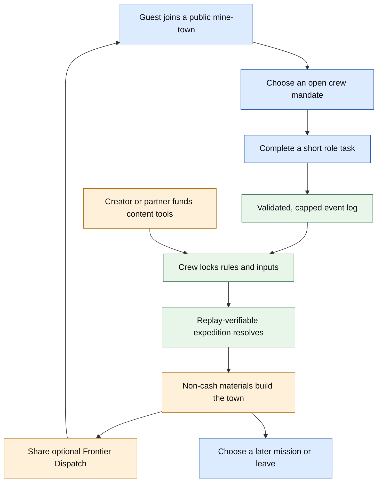

# Frontier Guilds — recommended SolMiners successor

*Decision memo · 2 October 2026 · Design hypotheses are clearly marked; factual SolMiners observations are cited.*

**Recommend Frontier Guilds.** In plain language: it keeps the memorable mine, named miners, dramatic reveals, and checkable outcomes, but makes players useful to one another by giving them short complementary jobs that visibly build a shared town. That is a much stronger reason to come back than holding an asset and waiting.

**The framing is non-negotiable:** design for a compelling, **voluntary return loop**, not harmful or manipulative addiction. No project can responsibly promise **passive income or financial gains**. The recommended v1 has no live money, token requirement, paid chance, purchase-linked odds, referral reward, or claim that play, holdings, receipts, or cosmetics will appreciate.

---

## 🧭 Decision frame

The successor should preserve the theatrical and technical primitives, while replacing capital-weighted passivity with legible agency:

1. **Keep:** a themed mine-world, a named identity, short public resolutions, rare discoveries, a durable history, and a replayable audit trail.
2. **Change:** eligibility becomes validated play and complementary cooperation—not token holdings, wallet size, trading volume, or time spent away.
3. **Bound:** no real-money prize, sponsor fee, or onchain settlement is needed to prove the core loop. If ever considered, it must be pre-funded, capped, disclosed, jurisdiction-reviewed, and separable from participation.
4. **Judge by behavior, not spectacle:** a new person must understand the rule, affect a result, want a second voluntary session, and be able to leave with no loss or streak penalty.

The five concepts below are **options, not five presumed winners**. Frontier Guilds and Agent Roguelite have the strongest product theses; MineOS is a credible B2B wedge but risks premature platform scope; RaidCast is distribution-dependent; Miner Passport has real utility potential but carries the highest issuer-quality and privacy burden.

## ⛏️ Reverse-engineered baseline: what to retain and what not to copy

| Primitive | Verified current observation | Strength worth retaining | Constraint to redesign |
|---|---|---|---|
| Mine + creator model | SolMiners presents a Pump.fun-launched coin as a themed mine. Its public pages state creator fees are split 80% to the mine’s SOL reserve, 10% to the mine owner, and 10% to the platform.[^1][^2] | One community gets one legible world, owner identity, and shared visual object. | Its activity depends on trading-fee flow; a successor needs non-trading content and a non-financial value source. |
| Holder-created agent | A wallet holding at least $50 qualifies for an agent; checks occur every five minutes. Gear power rises with the size of the holding and level with eligible hold time; below the retention threshold the agent retires and level resets.[^1] | Named miner, gear, level, profile, and history create compact identity and status. | The primary participation and power pathway is capital-weighted and largely passive. Replace it with play-earned, capped role mastery. |
| Short random round | Rounds are scheduled every 60 seconds. A funded round normally uses 25% of the reserve; winners are randomly chosen from eligible agents without repeats, receive a random ore, and split the pot by ore value and power.[^1] | Fast anticipation, rare-reveal spectacle, understandable result feed, and a recurring appointment moment. | Random SOL payouts coupled to an asset invite investment/income interpretation. Use bounded non-cash outcomes and skillful inputs instead. |
| Replay-verifiable draw | The documented verifier commits a server seed with roster and pot, takes a later Solana blockhash as public seed, reveals the secret, and replays winner, ore, and payout computation in the browser.[^1] | A public commitment/reveal recipe makes the result inspectable. | A verified algorithm does **not** establish token value, prudent trading, or a financial outcome. Keep verifiability narrowly scoped to the game event. |
| Public social objects | Public mine and miner pages display reserve, round/finding history, named miner, gear/level, best find, and SOL found.[^2][^3] | Discoveries and profile history are naturally shareable social artifacts. | Public financial balances should not be the status hierarchy in a successor; show contribution, craft, and crew history instead. |

**Design read.** The baseline’s real strengths are theatrical identity, recurring anticipation, collectible discovery, and an inspectable result—not the token itself. Its observed action loop is passive holding; both eligibility and payout weight vary with holdings, while the reserve is funded by creator fees from trading.[^1][^2] These facts make it unsuitable as evidence that a standalone game retains users. They also make a “more frequent payout” successor a weak idea.

> **Evidence boundary:** all SolMiners live figures and page values in this memo are **time-sensitive page observations, not growth proof**, revenue proof, payout forecasts, or evidence of retention. The cited pages describe mechanics and examples; they do not validate the proposed concepts.

## 🧩 Five-concept portfolio

### 1. Frontier Guilds — **recommended**

| Field | Design |
|---|---|
| **One-line aha** | Turn a coin community into a living mine-town where every member has a job, every expedition leaves a public trace, and the next district is built by coordinated crews—not passive holders. |
| **First target user** | Crypto-curious browser players and existing mine communities who enjoy collectible identity and short cooperation but do not want to trade, stake, or spend to participate. |
| **Exact first 60 seconds** | **0–10s:** enter as a guest, select a call-sign, and join a public town—no wallet, purchase, or holding. **10–25s:** see a live three-minute emergency and three open mandates: Scout, Engineer, Archivist. **25–45s:** complete one role-specific micro-action—map a safe route, place a support beam, or tag evidence. **45–60s:** watch the route’s first checkpoint, see contributor names, claim a non-transferable badge, and vote on one of three next district tiles. |
| **Core loop** | Pick an open complementary mandate → complete one bounded, validated task → a 3–8 person crew locks its route → deterministic resolution produces discovery, damage, and attribution → spend play-earned materials on a shared town → return for a new daily micro-expedition or weekly district chapter. |
| **SolMiners mechanics preserved** | Themed mine, named agents, rare discoveries, short public rounds, a visible “pool” concept, public result feed, durable history, and a replayable commitment/reveal proof pattern.[^1][^2] |
| **Key improvement** | Participation is contribution-capped and role-complementary. No role strength, access, or probability is bought with a holding. |
| **Attention / share moment** | A 15-second **Frontier Dispatch**: route silhouette, three named roles, surprise ore/discovery, district change, and a one-click replay link that checks the locked inputs and attribution. |
| **Social layer** | Crews of 3–8 fill Scout, Engineer, and Archivist gaps; public crews accept solo players; a weekly Round Table chooses one non-financial rule modifier for the next chapter. The analogue is shared goals and bounded roles—not shared wallets or EVE-style asset-risk delegation.[^4][^5] |
| **Real value source** | Persistent community history, player-authored town districts, role mastery, and easier recognition/organization of contributors. Later revenue hypotheses: fixed-price cosmetics, optional town-customization/moderation subscription, or clearly labeled creator-sponsored chapter production. |
| **Economic boundary** | All gameplay materials are earned, non-transferable, non-redeemable, and non-cash. Never sell power, odds, action tickets, or invitations. Any later sponsor pool is pre-funded, fixed-cap, free to enter, disclosed before the event, legally reviewed, and separate from core eligibility. |
| **Onchain / offchain design** | The browser game, event stream, moderation, matching, private telemetry, and anti-cheat remain offchain. Optional later Solana writes contain only a town/crew identifier, rule and outcome digest, optional sponsor escrow/claim root, and opt-in receipt. Solana accounts are state containers whose data can be changed only by their owner program, supporting this narrow boundary.[^6] |
| **Authority model** | The service validates tasks and is authoritative for live state; it cannot silently revise a locked event because the canonical input root, rules version, seed commitment, and final event digest are public. The client verifier is the dispute path; a moderator may pause/cancel for safety, not rewrite a settled run. |
| **Anti-abuse controls** | Guest/passkey identity; account, device, and session rate limits; one mandate per account/round; server-side action validation; contribution caps and cooldowns; timing and duplication anomaly review; public revocation/appeal log; no referral incentive; no unrestricted wallet delegation. |
| **Nearest alternatives** | EVE corporations provide a useful role/shared-goal analogue but also illustrate why unrestricted shared assets are unnecessary here.[^4] Guild Wars 2 demonstrates accessible, varied weekly guild missions tied to collective progression.[^5] Star Atlas is adjacent mine/craft/community territory, but Frontier Guilds deliberately avoids speculative access and an onchain game-state dependency.[^7] These are design analogues, not evidence of demand for Frontier Guilds. |
| **MVP in Manus Studio** | Responsive React/Canvas town map; guest identity; one district; three role cards; one three-minute expedition; server event log and rate limits; five discovery rarities; commit/reveal plus browser replay; construction meter; crew feed; cosmetic/badge inventory. Use test data and fictional resources only. No wallet, token, contract, or live-money feature. |
| **Strongest falsifier** | In a four-week prototype with at least 30 invited users, fewer than **25%** of first-time users complete a second expedition within seven days **or** crew interviews say complementary roles are less motivating than simply watching a round. Do not add rewards or tokens to disguise this failure. |
| **Top execution risk** | Social density: role gaps could cause waiting, exclusion, or coordination friction. Counter with public matching, solo substitutions, asynchronous contributions, short missions, and equal-value role rewards; kill rather than scale if this does not work. |

### 2. Agent Roguelite: Deep Shift — strong single-player fallback

| Field | Design |
|---|---|
| **One-line aha** | Name a three-miner squad, spend a finite risk budget on a branching route, and receive a replayable expedition story where composition and decisions—not wallet balance—matter. |
| **First target user** | Browser-first players who enjoy short roguelite runs, buildcraft, collection, and optional asynchronous squad input. |
| **Exact first 60 seconds** | **0–10s:** land in a mine lobby with three free agents and an explicit no-purchase/no-wallet notice. **10–25s:** select an agent, tool, and squad name. **25–40s:** choose one of three route maps and allocate exactly 10 Heat across visible forks. **40–50s:** lock choices and see the committed run header; optionally invite one friend to add a sidegrade tool. **50–60s:** first checkpoint begins with an immediate route choice and transparent event log. |
| **Core loop** | Earn sidegrade agents/tools through quests → compose a three-agent squad → allocate 10 Heat across route forks → lock choices before seed reveal → deterministic 3–8 minute simulation → inspect replay/counterfactual → receive XP, titles, materials, and decorations → choose another route. |
| **SolMiners mechanics preserved** | Named agent identity, public profile/history, mine theme, recurring random discovery spectacle, visible eligibility, and a replayable commitment/reveal result.[^1][^2] |
| **Key improvement** | Risk Budget + Squad Draft creates legible decisions before uncertainty; agents are sidegrades earned through play, not holding-size power. |
| **Attention / share moment** | A compact expedition card shows squad, route silhouette, Heat spend, pivotal decision, rare event, and a replay URL. Friends may fork the seed in practice mode and compare legal counterfactuals. |
| **Social layer** | Up to five asynchronous squadmates may each contribute one agent, tool, or route preference by a deterministic deadline; solo play remains complete and useful. |
| **Real value source** | Play, mastery, authored seasonal content, identity, and fixed-price cosmetics/replay presentation packs. This is a product hypothesis; it needs paid-conversion research only after voluntary retention works. |
| **Economic boundary** | No token, paid chance, loot box, paid power, price prediction, or financial return claim. Any sponsor-funded perk is fixed, capped, pre-funded, and not required to play. |
| **Onchain / offchain design** | Server-authoritative deterministic TypeScript simulation, private loadouts, matching, and replay stay offchain. Publish signed run packages and a local verifier. An optional later receipt can anchor only final run hash/rules version; it never gates the run. |
| **Authority model** | Ruleset, roster, normalized choices, and seed commitment define a valid run. The service executes it, but a public verifier recomputes the transcript after reveal. New runs pause during outage; committed packages remain verifiable. |
| **Anti-abuse controls** | Signed sessions; roster-slot binding; rate limits; replay-flood detection; seasonal best-of-N rather than infinite farming; suspicious claims quarantined; rotating service keys; public versioned balance patches. |
| **Nearest alternatives** | Slay the Spire is a route, trade-off, and build-synergy analogue—not proof that a browser mine roguelite will retain.[^8] Dark Forest shows that commitments and verifiable actions can support game systems, but its zero-knowledge scope is unnecessary for this MVP.[^9] |
| **MVP in Manus Studio** | Deterministic TypeScript resolver; 9 agents, 12 tools, 6 route nodes, 20 events, one five-minute mode, solo plus one async squad slot, local identity, signed JSON receipt, replay viewer, and share card. Pilot 20–50 testers; keep chain and wallet out of v1. |
| **Strongest falsifier** | After two weeks, fewer than **20%** voluntarily start a second run or fewer than **15%** of runs meaningfully change route/tool choices, while replay cards and squad invitations do not outperform an auto-resolve control. |
| **Top execution risk** | It can degrade into opaque auto-resolve. If players cannot explain why a result happened, the technical proof does not rescue the product. Expose tool math and counterfactual replay before expanding content. |

### 3. RaidCast — creator-format bet, not the default recommendation

| Field | Design |
|---|---|
| **One-line aha** | A creator opens a transparent 60-second raid; viewers make one free map call and tiny skill move, then share a replayable proof card of what the community changed. |
| **First target user** | Live-stream viewers wanting more agency than chat, and creators seeking a repeatable social format without asking viewers to trade or wager. |
| **Exact first 60 seconds** | **0–10s:** open a shared raid room that shows rules, a map-seed commitment, and either “no prizes” or a clearly non-financial fixed budget. **10–25s:** join anonymously or with a passkey and select one of three map calls. **25–40s:** perform one ten-second scan/shield/route micro-skill. **40–55s:** the creator launches the raid and the locked route animates. **55–60s:** the result freezes into a proof-card preview with named contribution. |
| **Core loop** | Creator schedules a finite map and disclosed budget → viewers choose a capped map call and complete a micro-skill → roster locks → deterministic 60-second resolution → cosmetic/contribution recognition and receipt → next scheduled raid. |
| **SolMiners mechanics preserved** | Named mine/agent spectacle, short recurring reveal, visible reserve/pool, public result feed, and replay proof.[^1][^2] |
| **Key improvement** | **Squad Calls** turn spectators into capped co-authors of the route; no holding, paid influence, or prediction is required. |
| **Attention / share moment** | A Raid Receipt renders seed commitment/reveal, map-call split, rare find, route, and the contributor’s role as a small card/GIF with a replay link. |
| **Social layer** | The audience makes one shared route decision per phase; the creator hosts but cannot modify locked inputs. Familiar live polls and social embeds are relevant distribution analogues, not outcome evidence.[^10][^11] |
| **Real value source** | Entertainment, creator-community belonging, clip-worthy rituals, and later creator tools—not token appreciation. A zero-budget room must remain fun. |
| **Economic boundary** | Free entry; non-cash cosmetics and badges by default. Do not use purchase-linked odds, audience deposits, winner-take-all pools, or creator-fee language that implies yield. Any physical/cash prize would require pre-funding, age/geo controls, terms, and counsel. |
| **Onchain / offchain design** | React/Canvas room plus WebSocket/SSE live state, server transcript, deterministic replay worker, and downloadable signed receipt. Optional later chain record: raid ID, rules hash, final Merkle root, and claim status only—not chat, clicks, roster history, or map state. |
| **Authority model** | Creator configures theme and budget before lock. Platform resolver signs the frozen ruleset. Moderator can pause/cancel with a visible incident record; neither creator nor moderator may rewrite inputs after lock. |
| **Anti-abuse controls** | One action per account/session/phase; rate limits; replay checks; bot/risk scoring; optional passkey for a scarce claim; mute/block/report; creator emergency stop; no paid influence. |
| **Nearest alternatives** | Twitch Predictions demonstrate creator-resolved viewer interaction but are deliberately a contrast: RaidCast removes staking/pool logic.[^10] Discord Activities demonstrates that browser social experiences can run in an iframe on desktop, mobile, and web.[^11] |
| **MVP in Manus Studio** | One room: guest/passkey join, three calls, one ten-second micro-skill, one 60-second resolver, visible rule/reserve panel, creator configuration page, commit/reveal, replay page, and generated proof card. Fictional credits/cosmetics only. |
| **Strongest falsifier** | Across 10–15 free raids with varied creators, fewer than **25%** of first-time viewers complete a call/skill action, fewer than **10%** return in seven days, and replay/share use remains negligible. |
| **Top execution risk** | Creator programming quality and moderation, not renderer complexity. The product is weak if viewers only care when a financial incentive is present. |

### 4. Miner Passport — utility and identity bet

| Field | Design |
|---|---|
| **One-line aha** | One named miner follows a person across creator worlds: complete meaningful missions, prove a contribution, and carry an access badge wherever that issuer is recognized. |
| **First target user** | Community-native creators, fans, moderators, indie-game players, and newcomers who want pseudonymous identity and credible contribution history without buying a token. |
| **Exact first 60 seconds** | **0–10s:** enter a free guest world and select name, palette, and calling: Maker, Scout, or Keeper. **10–25s:** inspect one Mission Card with evidence, deadline, issuer, access unlocked, and anti-abuse rule. **25–45s:** perform a 20-second browser task, such as a guided annotation or tiny prototype test. **45–60s:** receive an animated discovery and plain-language receipt showing issuer, evidence class, expiry/revocation, and unlocked access; choose public or private presentation. |
| **Core loop** | Discover a world → choose an opt-in Mission Card → make a bounded contribution → service/reviewer validates → receive signed receipt → compose receipts across roles for access → return for new missions, expeditions, or seasonal identity evolution. |
| **SolMiners mechanics preserved** | Named miner/persona, themed home world, evolving profile and discovery record, legible recurring result, and inspectable proof trail.[^1][^2] |
| **Key improvement** | A portable proof graph links role-diverse contribution to actual community access; the status object is an issuer-bound receipt, not an asset balance. |
| **Attention / share moment** | A miner dossier shows character, world map, three role badges, and a one-line contribution story; a cross-world expedition gives every named contributor an animated final report. |
| **Social layer** | Three different receipt types—maker, helper, curator—compose into a tier that can unlock a playtest, moderation queue, RSVP priority, or Discord-linked role with consent. Discord’s linked-role model is an integration analogue.[^12] |
| **Real value source** | Lower creator cost to identify contributors, moderate missions, run playtests, and control access; user value is recognition and legitimate utility. It is not a universal merit score. |
| **Economic boundary** | Receipts are non-transferable by default, have no redemption value or marketplace, and never constitute employment, credit, investment, or financial eligibility. No paid entry into chance-based rewards. |
| **Onchain / offchain design** | Stable pseudonymous Miner ID plus passkey; private evidence stays in an encrypted application store. Signed receipts export as JSON/QR presentations. Optional chain anchoring is a final receipt-set hash or status pointer only. W3C’s model supports issuer/holder/verifier concepts but explicitly cautions that cryptographic verifiability does not make a claim universally true.[^13] |
| **Authority model** | Issuer signs Mission Card; verifier service validates task evidence; reviewer/issuer registry, rules version, appeal workflow, and revocation list make authority visible. A receipt proves issuer attestation, not intrinsic quality. |
| **Anti-abuse controls** | Per-miner/device limits; passkeys; mission caps; evidence similarity checks; progressive friction; optional least-privilege proof-of-personhood signal for scarce missions; sampled human review; expiry and appeals; guest fallback. |
| **Nearest alternatives** | Human Passport is a useful credential/Sybil-resistance analogue; W3C VC 2.0 is the right data-model reference; neither establishes demand for a gamified contribution passport.[^13][^14] |
| **MVP in Manus Studio** | Four themed worlds, seeded Mission Cards, guest/passkey identity, three deterministic mission types, server scoring, signed JSON receipts, public receipt verifier, local issuer registry clearly labelled as test data, and one creator-admin flow. Add a consented Discord demo only after core use works. |
| **Strongest falsifier** | Within 2–4 weeks, at least **60%** of activated users do not voluntarily complete a second mission without financial reward **or** three pilot creators cannot name a concrete access/moderation/playtest benefit worth publishing a second mission for. |
| **Top execution risk** | Credential theater and privacy: an issuer signature proves who signed, not whether contribution is good, and cross-world profiles can become surveillance. Do not scale before quality, deletion, selective presentation, and revocation work. |

### 5. MineOS — creator infrastructure bet

| Field | Design |
|---|---|
| **One-line aha** | Turn any community into a living mine: members take visible jobs, cooperate through seasons, and receive a replayable proof card showing exactly how the world resolved. |
| **First target user** | Creators, game studios, community operators, and launchpads that want a branded engagement layer without requiring a token purchase, holding, trade, or wager. |
| **Exact first 60 seconds** | **0–10s:** open a creator-branded mine with no wallet or payment. **10–25s:** see the live roster, season clock, free action cap, rules, and five role previews. **25–40s:** select a role. **40–55s:** perform a 10–20 second support-beam, hazard, or route-clue task and see the signed event in the log. **55–60s:** preview a sample round result and a share card that identifies role, rule version, and receipt status without financial language. |
| **Core loop** | Creator configures mine template and season → players choose capped free role actions → event snapshot locks → deterministic resolver reveals route/discovery → replay, cosmetics, and voluntary next-season choice → creator sees completion, retention, and abuse signals. |
| **SolMiners mechanics preserved** | Themed mine, named agent profile, gear/level/discovery history, recurring short resolution, visible pool/reserve metaphor, and auditable result.[^1][^2] |
| **Key improvement** | **Seasonal Crew Jobs** make each free action meaningful and impose equal action caps; creators configure a world without a capital-weighted eligibility rule. |
| **Attention / share moment** | A Crew Receipt card/GIF shows player job, decisive team choice, discovery, rule version, action count, and verification link. |
| **Social layer** | Five jobs—Scout, Builder, Cartographer, Safety Checker, Archivist—join a shared route policy vote and creator-authored micro-challenges. |
| **Real value source** | B2B software: branded worlds, embeds, season authoring, moderation controls, analytics, exports, and webhooks. Consumer value is voluntary collaborative play and creator storytelling. |
| **Economic boundary** | Paid workspace tools are paid by the creator, not used to buy player odds or power. Any optional prize is pre-funded and disclosed; v1 uses cosmetics, access passes, and no financial performance language. |
| **Onchain / offchain design** | Browser UI, API, database, and live stream stay offchain. Optional receipt adapter writes only season configuration hash, settled round hash, and final claim root—not real-time actions or telemetry. An iframe/SDK is the first embed; host-native adapters are later. |
| **Authority model** | MineOS signs canonical batches and hash-chains snapshots. Creator can configure only before lock; moderator can quarantine unsafe events with an audit record; replay endpoint exposes seed commitment, reveal, resolver version, and rules JSON. |
| **Anti-abuse controls** | Guest/passkey identity, action caps, rate limits, device/IP risk review, duplicate-account review, creator moderation, transparent appeals, no referral reward, and no required wallet delegation. |
| **Nearest alternatives** | Galxe provides quest/credential campaign precedent and Farcaster specifies embed-oriented mini apps; MineOS is a narrower game/season layer rather than evidence that creators will pay for one.[^15][^16] |
| **MVP in Manus Studio** | One mine skin, one seven-day season, five roles, three deterministic micro-challenges, a 60-second resolution, guest/passkey identity, event log, replay page, moderation console, and generated share cards. Manually onboard 3–5 communities; no wallet or chain transaction. |
| **Strongest falsifier** | After three independently recruited communities run two seasons, fewer than **25%** of activated players return for a second session/season **or** creators cannot launch a branded season in under 30 minutes without operator help. |
| **Top execution risk** | Premature platform complexity and uncertain willingness to pay. A general creator protocol should not be built until a single manually configured mine shows voluntary repeat and repeat creator use. |

## 📊 Transparent weighted scorecard

**All scores are design judgments (1 = weak, 5 = strong), not forecasts, benchmarks, or research results.** Total = `Σ(score × weight) ÷ 5`, yielding a score out of 100. Weights deliberately privilege an immediate understandable hook and player agency over crypto novelty.

| Concept | Instant hook 20% | Player agency 20% | Social / shareability 15% | Voluntary repeat 15% | Economic durability 10% | Safety / trust tractability 10% | Studio buildability 10% | Exact calculation | Total / 100 | Decision reading |
|---|---:|---:|---:|---:|---:|---:|---:|---|---:|---|
| **Frontier Guilds** | 4.5 | 4.5 | 4.5 | 4.0 | 4.0 | 4.0 | 4.0 | `(4.5×20 + 4.5×20 + 4.5×15 + 4.0×15 + 4.0×10 + 4.0×10 + 4.0×10) ÷ 5` | **85.5** | Best balance of spectacle, cooperation, offchain-first feasibility, and a non-financial return reason. Social-density risk is material. |
| **Agent Roguelite: Deep Shift** | 4.5 | 4.5 | 3.5 | 4.0 | 4.0 | 4.5 | 4.5 | `(4.5×20 + 4.5×20 + 3.5×15 + 4.0×15 + 4.0×10 + 4.5×10 + 4.5×10) ÷ 5` | **84.5** | Nearly tied; clearest solo loop and easiest proof architecture, but less naturally communal or creator-distributed. Keep as fallback. |
| **MineOS** | 4.0 | 4.5 | 4.5 | 4.0 | 4.5 | 3.5 | 3.5 | `(4.0×20 + 4.5×20 + 4.5×15 + 4.0×15 + 4.5×10 + 3.5×10 + 3.5×10) ÷ 5` | **82.5** | Solid business-model story, but too broad before one mine loop proves itself. |
| **RaidCast** | 4.5 | 3.5 | 5.0 | 3.5 | 3.5 | 3.0 | 4.5 | `(4.5×20 + 3.5×20 + 5.0×15 + 3.5×15 + 3.5×10 + 3.0×10 + 4.5×10) ÷ 5` | **79.5** | Strongest share surface; creator quality, moderation, and prize misinterpretation make it a later channel, not a base product. |
| **Miner Passport** | 3.5 | 4.5 | 3.5 | 4.0 | 4.5 | 3.5 | 4.0 | `(3.5×20 + 4.5×20 + 3.5×15 + 4.0×15 + 4.5×10 + 3.5×10 + 4.0×10) ÷ 5` | **78.5** | Potentially durable utility, but insufficiently playful at first glance and operationally hard to make trustworthy. |

**Why Frontier Guilds wins despite a narrow margin:** it attacks the baseline’s two structural weaknesses simultaneously—capital-weighted passivity and fee-flow dependence—without demanding roguelite content volume, creator-led live programming, or cross-community credential governance on day one. Its central uncertainty, social coordination, is measurable early and cheaply.

## 🏗️ Detailed design: Frontier Guilds

### 90-second first journey

| Time | Player experience | System action / decision value |
|---|---|---|
| 0–10s | Lands on a town map; chooses a call-sign and a high-contrast role preference. Copy says: “Play free. Your work builds the town. Nothing here is an investment.” | Create pseudonymous guest session and accessibility preferences; display current chapter and rules version. |
| 10–20s | Sees a three-minute “Cart Below the Ice” incident with one open Scout, Engineer, and Archivist slot. Taps a role to view **what it can affect** and **what it cannot**. | Show live role capacity, expected task duration, and additive—not monetary—contribution cap. |
| 20–35s | Chooses Scout and completes a short route-reading task: identify two stable tiles from visible clues. | Validate client action server-side; write accepted/rejected event with reason. No client-selected inventory or score. |
| 35–48s | The contribution appears in the crew log as “Scout route evidence accepted.” A public crew needs two other roles; player can wait, join a public crew, or do a one-minute solo practice task. | Match open roles; show that every player has a useful fallback. Avoid forced social waiting. |
| 48–60s | Crew locks. UI displays rule version, accepted-action count, roster pseudonyms, input digest, server-seed commitment, and the scheduled public-anchor policy. | Canonicalize inputs, create Merkle root, sign the locked package, and prevent late edits. |
| 60–75s | Animated first checkpoint resolves; the player sees how their route evidence reduced a cave-in risk. The outcome can still vary, but the causal link is explicit. | Run fixed deterministic resolver using locked inputs and entropy recipe; append hash-chained checkpoint. |
| 75–90s | Receive an ore/material and a non-transferable “Ice Route Scout” mark, see the town’s construction meter move, and choose **Share dispatch**, **Inspect replay**, or **Leave safely**. | Issue signed receipt; generate accessible share card; do not gate exit, create a streak, or present a purchase prompt. |

### System and authority boundaries

| Layer | Owns / may do | Must not do |
|---|---|---|
| **Browser client** | Renders map, performs accessible micro-task UI, signs/holds session nonce, displays proof, independently replays public event package. | Decide inventory, task validity, contribution weight, roster, or reward eligibility. |
| **Game API + resolver** | Authenticate session, validate action rules, match crew, enforce caps, lock canonical inputs, execute versioned resolver, sign receipts, maintain incident log. | Rewrite accepted inputs after lock, change a ruleset mid-run, expose private telemetry, or custody user funds. |
| **Moderation service** | Quarantine an abusive action before lock; pause/cancel a safety incident; reverse a cosmetic/record after documented review; handle appeals. | Silently alter a settled transcript or use moderation discretion to choose an outcome. |
| **Object store / database** | Hold raw events with retention rules; serve signed proof bundles and public redacted replay data. | Be treated as a decentralized source of truth; raw event retention is operational policy, not immutable truth. |
| **Optional independent verifier** | Recompute canonical hashes, entropy derivation, resolver output, contribution attribution, and receipt signature. | Access private device/IP signals or adjudicate social disputes. |
| **Optional Solana adapter** | Write a final digest/receipt or constrained pre-funded settlement root only after explicit opt-in. | Store clicks, chat, raw evidence, continuous state, private telemetry, or request blanket wallet authority. |

### Canonical event schema

The event log is **append-only by application policy**, signed in batches, and hash-linked. A signature proves what the service attested; it does not magically make a server decentralized. Public replay packages use pseudonymous IDs and omit device/IP/risk data.

| Field | Type / example | Purpose and privacy boundary |
|---|---|---|
| `event_id` | UUID | Idempotency and audit handle. |
| `event_type` | `role_selected`, `task_submitted`, `task_validated`, `crew_locked`, `round_resolved`, `receipt_issued`, `moderation_action` | Versioned business event. |
| `event_at` | ISO-8601 UTC | Sequencing; client time is never authoritative. |
| `season_id`, `chapter_id`, `expedition_id` | opaque strings | Partition gameplay and retention analytics. |
| `actor_pid` | rotating pseudonymous ID | Public attribution without publishing email, wallet, IP, or device identifier. |
| `role` | `scout` / `engineer` / `archivist` | Role-specific validation and capped contribution. |
| `rules_version`, `resolver_version` | semantic version + immutable hash | Replay uses the exact published logic. |
| `action_digest` | SHA-256 of canonical task input | Enables replay without publicizing raw private evidence. |
| `validation` | status, reason code, normalized score | Explains accept/reject decision; anti-abuse features remain private. |
| `contribution_units` | integer, cap-limited | Explicit, non-cash attribution; never a token balance. |
| `input_root` | Merkle root | Commits accepted roster/actions at lock. |
| `server_seed_commit` | SHA-256 domain-separated commitment | Binds resolver before reveal. |
| `entropy_policy`, `public_anchor_ref` | `two_party_v1`; optional block reference | Lets a verifier know exactly which entropy recipe applied. |
| `prev_event_hash`, `event_hash`, `service_sig` | hash chain + rotating-key signature | Detects post-hoc alterations to published batches. |
| `receipt_digest`, `revocation_status` | hash + status pointer | Portable final record, with an explicit correction/revocation route. |

**Illustrative canonical lock package (not a contract):**

```json
{
  "schema": "frontier-guilds/round-lock/v1",
  "expedition_id": "exp_2026_10_02_0042",
  "rules_hash": "sha256:…",
  "resolver_hash": "sha256:…",
  "roster_root": "sha256:…",
  "accepted_actions_root": "sha256:…",
  "role_caps": {"scout": 100, "engineer": 100, "archivist": 100},
  "lock_at": "2026-10-02T20:10:00Z",
  "server_seed_commit": "sha256:…",
  "entropy_policy": "two_party_commit_reveal_v1",
  "service_key_id": "svc-2026-q4-a"
}
```

### Commit–reveal and verifiable-outcome model

**Goal:** make a player able to check *what the published rules did with locked inputs*. Do not call this “trustless,” do not claim it proves all inputs were honest, and do not use it to imply investment safety.

1. **Pre-lock:** publish immutable `rules_hash`, resolver hash, role caps, deadline, and `server_seed_commit = H(domain || expedition_id || server_seed || input_root_placeholder)`. The service keeps a 256-bit server seed private.
2. **Player entropy:** each accepted role task includes `player_salt_commit = H(player_salt)`. After the crew lock, the client reveals the salt. Missing or invalid salt resolves to its earlier commitment digest, a deterministic fallback that does not change eligibility or cause a financial loss.
3. **Lock:** canonicalize accepted actions; construct roster/action Merkle roots; publish and sign the lock package. Inputs arriving after lock are visibly rejected.
4. **Resolve:** derive `player_salt_root` from the sorted valid reveals and use `H(domain || server_seed || player_salt_root || input_root || rules_hash)` as the resolver entropy. The versioned resolver determines only published game outcomes—route events, discoveries, damage, and bounded materials.
5. **Reveal and replay:** reveal `server_seed`, salts/fallbacks, canonical input package, checkpoint hashes, and final receipt. A small browser verifier recomputes all values and flags mismatch.
6. **Stronger later option:** for an externally funded, high-scrutiny event, add an independently verifiable randomness source only after its cost, network support, and incident policy are validated. Chainlink VRF is an example class of mechanism: it describes random values accompanied by an onchain-verified cryptographic proof.[^17] It is **not** required for this MVP and does not solve identity, rules, or legal questions.

**Why this is adequate for v1:** it makes the resolver and its locked inputs inspectable without making every task onchain. It is not adequate for a money-like prize until independent security review, source-of-funds, contest law, operational controls, and a credible dispute policy are in place.

### Optional onchain settlement path

Default: **no chain write**. The game must be fully playable and verifiable with signed downloadable JSON proof bundles and a public key registry.

| Phase | Optional chain action | Preconditions | Explicit exclusions |
|---|---|---|---|
| **Receipt pilot** | Player-opt-in record of `expedition_digest`, `rules_hash`, `receipt_uri_hash`, and issuer key ID in a program-controlled receipt account. | A partner has a concrete portability/verifiability need that signed offchain proof cannot satisfy; privacy review; clear deletion/presentation policy. | No chat, names, raw actions, telemetry, or gameplay inventory. |
| **Sponsor claim pilot** | A pre-funded, capped claim Merkle root; claimant signs only a bounded claim instruction. | Security audit, counsel on jurisdictions/age/eligibility, written sponsor agreement, treasury key policy, incident/refund plan, and no required purchase/holding. | No deposits, pooled wagers, discretionary payout selection, or unrestricted wallet delegation. |
| **Do not do in v1** | No per-action state, NFTs as core progression, market/trading layer, token gating, yield language, or shared wallet. | Never. | Everything that makes play depend on financial speculation. |

If the adapter is built, use program-derived accounts and a distinct key scope for receipt issuance versus any future settlement. This follows the basic Solana ownership model—only an account owner program changes its data—but it does **not** remove smart-contract, RPC, signing, privacy, or legal risk.[^6]

### Playable economy: valuable without speculation

| Element | Earn / use | Hard boundary |
|---|---|---|
| **Ore marks** | Earned for validated role tasks; spend on visual town repairs, lore cabinet entries, and cosmetic route markers. | Non-transferable; no cash value; no withdrawal; no market; daily/weekly cap. |
| **Blueprint fragments** | Crew-completion output; combine for district appearance and new *choice variety*, not numerical combat/payout power. | No sale, no random paid pack, no wallet-balance boost. |
| **Mandate badges** | Role mastery record used to surface suitable public-crew openings. | Revocable after adjudicated abuse; not an employment/credit/reputation score outside the game. |
| **Town vote seals** | One earned vote per validated participation window; choose between disclosed story modifiers. | Not purchasable; equal per account; affects rules/content, never financial odds. |
| **Cosmetics, later** | Clearly priced optional call-sign frames, mine themes, or dispatch layouts. | No loot boxes, no power, no expiration pressure, no bundle that unlocks eligibility. |

A sponsor, if ever added, pays for **content production** or a fixed, separately governed event—not for user deposits or a promise of economic return. The town must be satisfying when sponsor support is zero.

### Season structure

| Cadence | What happens | Fairness / retention guardrail |
|---|---|---|
| **Daily** | 1–3 optional micro-expeditions, each 3–8 minutes. | No streak loss; public crew or solo substitute; contribution cap prevents grinding. |
| **Weekly chapter** | One district objective with three role mandates and a Round Table modifier choice. | Newcomer build slots are reserved; early crews cannot permanently own power. |
| **Four-week season (proposed test cadence)** | Four districts form one town story; archive dispatches and award cosmetic archive plaques. | Reset competitive counters and route modifiers while preserving non-power history; no “must play now” paid asset. |
| **Off-season / incident window** | Replay, accessibility fixes, balance notes, moderation appeals, and next-season preview. | Publish changes before the next lock; no retroactive resolver changes. |

The proposed four-week cycle is a testable content rhythm, **not** a claim about optimal retention.

### Creator / partner embed

- **Embed modes:** `preview` (watch/read only), `join` (guest session), and `host` (schedule/configure before lock). A partner passes theme, chapter metadata, and callback URL—not a private resolver key.
- **Safe configuration surface:** theme, accessibility copy, lore, public roles, chapter schedule, cosmetic art, and fixed non-financial access perks. A host cannot alter rule hash, task cap, seed policy, or locked roster after publishing.
- **SDK/webhooks:** send `expedition.locked`, `expedition.resolved`, `receipt.issued`, `receipt.revoked`, and `moderation.flagged`; export signed receipt JSON and aggregate, consented analytics. An iframe-first web app is realistic; Discord’s official Activities documentation describes web apps running in an iframe on desktop, mobile, and web, which is a potential later distribution adapter.[^11]
- **Partner success test:** an operator publishes a safe chapter from a template without code; a partner can verify a receipt in a new tab; the same content works outside the partner host.

### Expected resource and cost model

These are **planning ranges and formulas, not vendor benchmarks or invented price claims**. Obtain actual cloud, moderation, legal, security, RPC, and chain-fee quotes once the pilot geography, event volume, and partner requirements are selected.

| Component | Pilot assumption / range | Cost driver and decision implication |
|---|---|---|
| **Product scope** | 1 responsive 2D mine, 3 role task types, 1 resolver, 1 replay page, 20–50 pilot testers, 3–8 players per crew. | Roughly 4–6 implementation weeks for one full-stack game builder plus product/design support is a scope estimate, not a delivery guarantee. Do not build a content marketplace. |
| **Event volume** | Assumption: 3–8 players × up to 5 accepted actions × 0.5–2 KB normalized event = **12–80 KB** of normalized event data per expedition, before media/log overhead. | Storage and egress scale with action count, replay views, image cards, and retention period. Keep raw anti-abuse data separate and short-lived. |
| **Application services** | One API/resolver service, relational database, object store for proof bundles/cards, signed-key service, and basic telemetry/error monitoring. | Monthly cost is `C_app + C_db + C_object + C_egress + C_observability`; select a provider only after measuring pilot requests and replay traffic. |
| **Human operations** | Product owner plus a named moderation/appeal owner; occasional engineering on-call during public sessions. | The binding cost may be human review, not compute. Do not launch scarce or valuable claims until response-time and escalation ownership are funded. |
| **Optional chain** | Zero writes in v1. Receipt pilot: at most one final digest per opted-in expedition or chapter; settlement pilot only after a separate review. | `C_chain = number_of_writes × (network fee + RPC/provider charge) + security/operations`. Security/audit and operational key management are likely more consequential than raw transaction fees. |
| **Security/legal** | Threat model before external pilot; independent review before any fund/claim path; counsel before prize, sponsorship, or personal-data expansion. | These are gating workstreams, not optional “later polish.” |

## 🔬 Decisive experiments and kill criteria

Run these **before** live money, creator-fee routing, sponsor claims, mainnet writes, or wallet-gated access. Pre-register the instrument, cohort definition, and calculation before viewing results; do not move goalposts by adding rewards after a miss.

| Test | Minimum setup | Success signal | Kill / pause criterion | Decision if passed |
|---|---|---|---|---|
| **48-hour comprehension** | 30 newly recruited guests; test immediately and 48 hours later without an FAQ. Ask: “What affects an expedition?”, “What does verification prove?”, and “Can this provide income?” | At least **70%** answer all three correctly: validated role work affects play; verifier checks locked rules/inputs; no income/financial gain is promised. | Fewer than **55%** fully correct **or** more than **10%** describe it as passive income, investment, or a wager. | Keep guest-first onboarding; revise language/UI before recruiting more users. |
| **7-day voluntary repeat** | 60 activated guests; no wallet, cash, or referral incentive; at least two public crew windows. | At least **25%** complete a second expedition within 7 days, and at least half of repeaters choose a different role or route. | Under **20%** second-expedition completion **or** under **15%** meaningful choice variation. | Test chapter cadence and public matching, not monetization. |
| **14-day incentive-off** | Randomize activated users: normal non-cash cosmetic feedback vs. no badge/material feedback after first run. Both retain the same core game and may leave freely. | Incentive-off cohort reaches at least **15%** voluntary second session by day 14 and retains at least **50%** of the cosmetic cohort’s repeat rate. | Either threshold misses. This means the core loop is too dependent on extrinsic reward; halt all sponsor/prize planning. | Invest in causal feedback, social usefulness, and replay clarity rather than rewards. |
| **Creator / partner integration** | Three independent partner communities each use a template-based embed; measure setup from blank template and first player completion. | At least **2 of 3** publish a chapter in **≤30 minutes** without engineer intervention; ≥20% of partner visitors complete a first task; no unresolved rule-change/receipt dispute. | Fewer than two self-serve launches, or any partner needs custom resolver changes to host safely. | Keep iframe/SDK; defer host-native adapters and platform roadmap. |
| **Replay trust / abuse drill** | Seed 10 known-invalid actions, one late submission, one bad signature, and one moderation cancellation in staging; have independent testers use the verifier. | All invalid events are rejected or visibly marked, final digest mismatches are detected, and a cancellation produces no fake outcome. | Any silent acceptance, invisible correction, or unauditable reward issuance. | Do not connect a wallet; repair authority boundaries first. |

These thresholds are **decision thresholds**, not industry benchmarks. Failure is valuable: Deep Shift is the fallback if Frontier Guilds fails because social coordination is the issue rather than the mine-and-proof aesthetic.

## 🧱 Winner user and value loop



## 🛠️ Technical feasibility call

| Status | Scope | Call |
|---|---|---|
| **Build now** | React/Canvas 2D map; guest/passkey identity; accessible role tasks; server-authoritative API; deterministic TypeScript resolver; signed hash-linked event log; commit/reveal; browser verifier; share-card generation; public crew matching; basic moderation console. | All are conventional browser/service work and adequate to test the core thesis without a wallet. |
| **Mock or defer** | Wallet connect; Solana receipt; external VRF; sponsor escrow; cash/physical claims; creator fee routing; Discord/Farcaster native adapters; cross-world identity; AI-generated task content. | Use clearly labelled fake receipts, fictional resources, and one iframe/share URL. Mocking preserves the product question without prematurely importing security, legal, chain-latency, or platform risks. |
| **Requires security, legal, and commercial validation** | Any money-like reward, prize promotion, sponsor-funded claim, KYC/age/geo restriction, public credential portability, user-generated content at scale, wallet signing, onchain program, escrow, or partner data export. | Obtain threat model/audit scope, jurisdiction-specific contest/consumer/privacy/tax advice, terms and incident policy, sponsor contract, data-processing review, key custody model, and support/escalation owner. |

**Specific question to answer before choosing a chain write:**

> **Which named external verifier or partner needs a publicly anchored receipt or constrained settlement, what exact claim must it verify, and why can a signed offchain proof bundle plus public key registry not satisfy that need?**

If there is no concrete answer, do not write to a chain. “Because it is onchain” is not user value, and an anchored digest does not validate a game’s rules, identity, or financial safety by itself.

## 🧑‍⚖️ Founder decisions required

1. **Commit to the product promise:** approve a written v1 policy that rejects passive-income, appreciation, “earn,” yield, trade-to-play, referral-pressure, paid-randomness, and holding-threshold language.
2. **Choose the initial bet:** Frontier Guilds with a 30–60 person offchain pilot, or Deep Shift if the team prefers a solo-first product. Do not build both as production products simultaneously.
3. **Name the first community and content owner:** who supplies one town theme, one weekly chapter, inclusive moderation, and two public crew windows? Without this, social density cannot be tested.
4. **Approve the kill thresholds unchanged:** 48-hour comprehension, 7-day repeat, 14-day incentive-off, and partner integration gates above must govern the roadmap before any financial feature is considered.
5. **Set the first durable value model:** choose one hypothesis—fixed-price cosmetics, community customization subscription, or creator-sponsored content tools—and test willingness to pay only after voluntary repeat passes. Do not combine them in v1.
6. **Decide identity/privacy posture:** guest-first pseudonymous ID, data-retention period, public-attribution default, revocation/appeal authority, and whether a user can export/delete private evidence.
7. **Set the authority and incident policy:** name the resolver-key owner, moderation authority, rule-change window, cancellation semantics, correction disclosure, and independent reviewer for any future claim path.
8. **Make the chain decision evidence-led:** keep chain writes at zero unless the specific external-verifier question above has a documented answer and the associated security/legal/commercial gates are funded.

## 📚 References

[^1]: SolMiners, “[How it works](https://solminers.xyz/how-it-works)” — direct product-page source for holding thresholds, gear/level rules, round timing, reserve use, ore/power distribution, and documented commit/draw/replay mechanism. Accessed 2 October 2026.
[^2]: SolMiners, “[SolMiners mine](https://solminers.xyz/mine/8acLTgfVBH5zExB2ez3kE3B7xH2xevsRusii7d8UfdPc)” — direct mine-page source for reserve, agent, round, ore, and fee-allocation observations. Accessed 2 October 2026.
[^3]: SolMiners, “[Miner profile: Flint Minecart](https://solminers.xyz/miner/Cu1NnAPQZx61rhzZW3syiP4q6TLEk5T9DsjDh5nrBNB3)” — direct profile-page source for public miner stats, agent state, and finding history. Accessed 2 October 2026.
[^4]: CCP Games, “[Player Corporations — EVE Academy](https://www.eveonline.com/eve-academy/corporations)” — direct discussion of shared goals, projects, roles, fleets, and associated trust/asset risks.
[^5]: ArenaNet, “[Guild Halls: Missions for All](https://www.guildwars2.com/en/news/guild-halls-missions-for-all/)” — direct discussion of shared guild missions, weekly variation, accessibility, and collective progression.
[^6]: Solana, “[Accounts](https://solana.com/docs/core/accounts)” — direct documentation of account state and owner-program modification rules.
[^7]: Star Atlas, “[What is Star Atlas?](https://build.staratlas.com/introduction/what-is-star-atlas)” — adjacent browser/4X, mining, crafting, transport, guild, and Solana-settlement reference.
[^8]: Mega Crit / Steam, “[Slay the Spire](https://store.steampowered.com/app/646570/Slay_the_Spire/)” — direct product description of changing layouts, risk/safe paths, build interactions, and daily comparisons.
[^9]: Dark Forest Team, “[Announcing Dark Forest](https://blog.zkga.me/announcing-darkforest)” — direct explanation of commitments and zero-knowledge proofs for verifiable actions/hidden state.
[^10]: Twitch, “[Predictions API](https://dev.twitch.tv/docs/api/predictions/)” and “[Channel Points Predictions](https://blog.twitch.tv/en/2020/12/12/channel-points-predictions-let-your-viewers-guess-your-destiny/)” — direct references for creator-resolved audience participation, cited as a contrast rather than a model for staking.
[^11]: Discord, “[Activities Overview](https://docs.discord.com/developers/activities/overview)” — direct documentation that Activities are web apps in an iframe across Discord desktop, mobile, and web clients.
[^12]: Discord, “[Configuring App Metadata for Linked Roles](https://docs.discord.com/developers/tutorials/configuring-app-metadata-for-linked-roles)” — direct integration reference for user-consented external criteria/roles.
[^13]: W3C, “[Verifiable Credentials Data Model v2.0](https://www.w3.org/TR/vc-data-model-2.0/)” — direct standard for issuer/holder/verifier concepts, presentation, validity, privacy, and the limitation that cryptographic verifiability does not alone prove claim truth.
[^14]: Human Passport, “[Documentation](https://docs.passport.xyz/)” and “[Human Passport](https://passport.human.tech/)” — direct references for credential/stamp and Sybil-resistance concepts.
[^15]: Galxe, “[Quest introduction](https://docs.galxe.com/quest/introduction)” — direct campaign/quest and credential-platform reference.
[^16]: Farcaster, “[Mini Apps specification](https://miniapps.farcaster.xyz/docs/specification)” — direct embed/distribution mechanism reference.
[^17]: Chainlink, “[VRF documentation](https://docs.chain.link/vrf)” — direct description of random values and onchain-verifiable cryptographic proofs.
