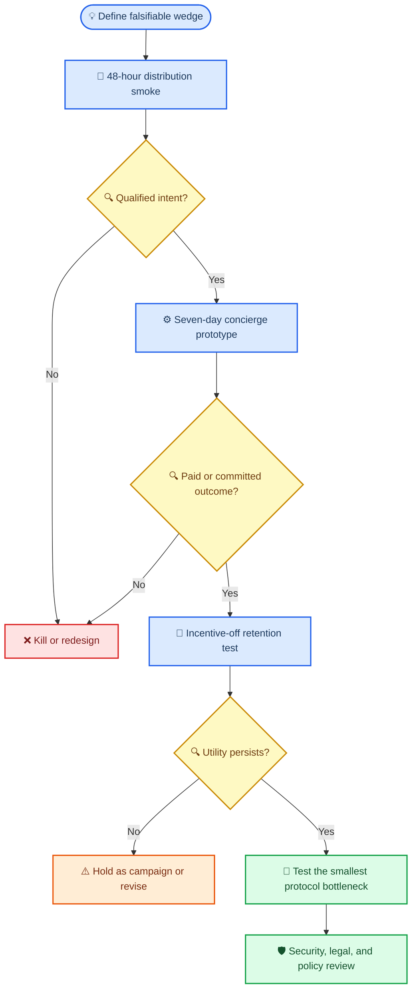

# Rapid product lab: ten Solana product-direction hypotheses

_Product-direction decision memo · 1 October 2026 · Evidence supplied with the candidate evaluations_

---

## ⚡ Rapid experiment framework

**Decision rule:** reduce uncertainty before building protocol. The lab is not selecting a winner from desk research; it is buying the cheapest credible evidence that a narrowly defined group will take a costly action, return when the incentive is removed, and prefer the proposed wedge to a familiar substitute.

### Evidence gates and operating sequence

| Gate | Timebox and minimum artifact | What is being tested | Advance only when | Kill, hold, or redesign when |
| --- | --- | --- | --- | --- |
| **0. Claim hygiene** | Before recruitment; one-page test card | A specific user, job, alternative, action, and metric | The team can state what would falsify the concept and has a no-custody/manual fallback | The concept depends on a vague audience, a promised network effect, or protocol work before a behavioral test |
| **1. Distribution smoke** | **48 hours**; landing page, Discord post, two message variants, and interview script | Can the named community be reached and does it understand the job? | At least **25 qualified exposures**, at least **5 high-intent actions** (deposit intent, pre-registered rule acceptance, request creation, or moderator install), and interviews surface a repeatable problem | Fewer than 5 high-intent actions, or users consistently choose the incumbent after seeing the exact alternative |
| **2. Concierge/prototype** | **Seven days**; manual operations are allowed | Will people pay, commit, share, or complete the core workflow under stated rules? | The candidate-specific paid/commitment threshold below is met; no severe safety event; the team can explain the source of demand rather than clicks | The candidate-specific falsifier fires; operational work is required to conceal a weak workflow |
| **3. Incentive-off retention** | Next 7–14 days; remove prize, deposit rebate, free concierge labor, or paid acquisition | Is the underlying utility present after the first novelty/reward? | At least **30%** of qualified completers return, create/refer one comparable workflow, or accept a paid continuation without an added incentive | Return/reuse is below 15%, or usage disappears when rewards, subsidies, or founder labor stop |
| **4. Distribution before protocol** | Only after Gates 1–3 | Whether a custom program, indexer, or wallet flow improves a measured bottleneck | A manual control demonstrates a bottleneck that on-chain verification, settlement, or shared state can remove | A spreadsheet, payment link, existing wallet, or incumbent product performs equivalently |
| **5. Build / compliance gate** | Before real custody, prizes, automated release, or broad launch | Whether the proposed implementation is safe and permitted for the test population | Written architecture/security review and scoped counsel review identify a feasible, bounded launch path | The model requires prohibited/unknown handling of funds, misleading safety claims, or an unresolved jurisdictional blocker |

> **Guardrail:** Treat signed-up interest, likes, poll votes, waitlists, and “this is cool” feedback as *discovery*, not demand. Count money, a refundable reservation, completed setup, a scheduled commitment, a real request, or a deliberate return.

### 48-hour smoke test

1. Select **one named community** and one narrowly defined use case; do not aggregate several audiences.
2. Publish a plain-language promise and a fully specified substitute comparison (for example, “use this versus your current Discord spreadsheet”). Randomize two distribution messages, not the underlying rules.
3. Ask for one **costly but reversible action**: a refundable reservation, a completed request, a rule pre-registration, a calendar commitment, or a moderator-approved install.
4. Conduct five short interviews with both completers and non-completers. Record the alternative they use today, the objection, and the exact condition that would make them switch.
5. Stop acquisition at 48 hours and decide from the predeclared counts. Do not widen the audience to rescue a weak signal.

### Seven-day concierge/prototype test

Run the smallest real workflow with manual verification, a static database, a human moderator, or a supervised existing payment rail where needed. Instrument the entire funnel: qualified exposure → start → completion → core outcome → share/referral → repeat intent. Run a control whenever practical: reminder-only versus deposit, screenshot versus wallet proof, ordinary link versus explanatory preview, or current workflow versus concierge flow. The objective is to distinguish **incremental value** from novelty.

### Incentive-off retention test

After the first outcome, keep the product available but remove the artificial accelerator: no prize pool, no free set-up, no paid referral, no additional rebate, and no founder chasing. Measure a comparable next action over 7–14 days. For B2B candidates, the analogue is a paid renewal/letter of intent after the concierge period. A product that cannot survive this test may still be a campaign tool, but it should not be modeled as a durable network or subscription business.

### Anti-Sybil, safety, and legal/compliance checks

| Check | Minimum test control | Escalate / stop condition |
| --- | --- | --- |
| **Identity and Sybil resistance** | One entry per verified Discord account plus one payment identity or wallet; account-age/member-tenure rule; rate limits; public eligibility and appeal rule | Repeated wallet splitting, duplicate QR use, scripted deposits, coordinated referral abuse, or unverifiable roster identity changes the outcome |
| **Funds and custody** | Prefer no custody, refundable reservations, paper mode, or a reviewed existing rail; segregate test funds and disclose every manual action | The experiment needs the lab to hold pooled funds, arbitrate release automatically, or move funds without an approved process |
| **Privacy and consent** | Pseudonymous handles by default; opt-in wallet display; collect only test data required for the metric; document retention/deletion | A public link would expose sensitive wallet, attendance, or location data without informed consent |
| **Safety claims** | Use “what we could verify” and uncertainty language; no “safe,” “guaranteed,” or investment-performance claim | A user could reasonably rely on the product’s label to sign, trade, transfer, or forgo independent judgment |
| **Counsel and policy review** | Obtain scoped advice before prizes, pooled/released funds, public trading scores, minors, payment initiation, or cross-border rollout; obtain community/admin permission | Counsel, platform policy, or the test venue cannot support the proposed activity under the disclosed rules |

---

## 🔍 Existing obsessive behaviors

These candidates begin with an observable repeated behavior—competing, collecting, playing, or showing up—rather than a broad technology thesis. The evidence supports adjacent jobs; the unproven question is whether the narrower Solana-native wedge changes behavior.

### Conviction Circuit (OB1)

| Field | Decision view |
| --- | --- |
| **Plain-language explanation** | A weekly, small-community SOL-perps league in which traders publish a direction, invalidation, and risk cap before the week, then receive a score for discipline and auditable execution—not a signal-selling service. |
| **Mechanism** | Discord intake → signed/paper pre-commitment → read-only wallet or screenshot reconciliation → standings → optional proof card shared back to Discord. Start with paper mode and manual audit; do not custody, copy trades, or pool capital. |
| **Why Solana matters** | Solana transaction records expose signatures, accounts, and instructions that can corroborate a permitted wallet’s timing and program interactions; Jupiter documents order and trigger-order features that make a discipline score plausible. This advantage matters only if attestation beats screenshots in the test.[^1][^2] |
| **Known alternatives / competitors** | TradingView’s The Leap contests, Hyperliquid’s public trading venue, Jupiter plus social screenshots, Polymarket’s outcome markets, and ordinary journals/bots all cover pieces of competition, execution, or public claims.[^3][^4][^5] |
| **Opportunity confidence** | **Moderate-low.** Adjacent contest behavior and the technical primitive are evidenced; the extra thesis/consent burden and willingness to return are not. |
| **Critical risk** | A public score, prize, or risk language can create legal/reputational exposure; reconciliation of partial fills, keeper flows, liquidations, and wallet splitting can also make the ranking feel unfair. |
| **Strongest falsifier** | In one 100-member target server, fewer than 15 pre-register by day 3, fewer than 10 finish the week, or fewer than three voluntarily share/invite after seeing the proof card. Screenshots or venue leaderboards performing as well is also a falsifier. |
| **Cheap experiment** | Run a seven-day, no-prize paper/verified hybrid: 100-member Discord, two scorecard mocks, thesis fields, daily manual standings, audit five wallets, and A/B wallet-attested versus screenshot-only proof. Advance only if onboarding is under five minutes, fewer than 20% of entries are disputed, and the stated participation/share thresholds clear. |

### FanBrief (OB2)

| Field | Decision view |
| --- | --- |
| **Plain-language explanation** | A fan group pools a small USDC amount for one concrete creator request; the creator accepts a brief, deadline, and minimum, then delivery releases funds and unlocks the work for backers. |
| **Mechanism** | Share one brief → collect contributions toward a threshold → creator accepts/declines → manual delivery confirmation/release or refund. The first test is a disclosed concierge process, not a custom escrow contract. |
| **Why Solana matters** | Solana Actions/Blinks can make a transaction request portable as a URL, but they do not solve escrow, delivery, disputes, or refunds. The advantage is worth building only if portable USDC contribution meaningfully improves conversion over a card fallback.[^6][^45] |
| **Known alternatives / competitors** | Ko-fi commissions, Kickstarter campaigns, Patreon memberships, and manual Discord collection each solve a nearby creator-funding job; Ko-fi explicitly supports commission terms, slots, and upfront payment.[^7][^8][^9] |
| **Opportunity confidence** | **Medium-low.** Creator monetization is established, but collective funding of one small, time-bounded request is unproven. |
| **Critical risk** | Creator acceptance/delivery is subjective; custody, refund, copyright, consumer-protection, and wallet onboarding concerns can dominate the user experience. |
| **Strongest falsifier** | With five creator-approved $200–$500 briefs shown to at least 100 targeted fans, fewer than two pools reach minimum with five distinct payers, or no creator accepts a funded brief within seven days. |
| **Cheap experiment** | Pre-negotiate five tightly scoped cover/live-session briefs. Use a disclosed supervised multisig or existing rail, a card/wallet diagnostic fallback, and real refundable contributions. Track qualified views, distinct payers, time to first five, comprehension of refund/release terms, and creator acceptance. |

### DropProof (OB3)

| Field | Decision view |
| --- | --- |
| **Plain-language explanation** | A fair allocation and verified live pickup flow for scarce signed prints: refundable deposit, transparent queue, QR handoff, condition record, and optional transferable provenance for later resale. |
| **Mechanism** | Artist posts a capped drop → buyer places refundable deposit → queue/serial assignment → QR pickup with condition photos → provenance activation. Use a signed database receipt first; do not mint before value is demonstrated. |
| **Why Solana matters** | Token Metadata can carry collection information, and Token-2022 extensions include transfer-hook capabilities. Those records can make a serial/provenance claim portable, but they cannot prove that the physical object was not swapped and may have compatibility limits.[^10][^11] |
| **Known alternatives / competitors** | Shopify preorders/waitlists, Eventbrite-style QR check-in, StockX-style authentication, artist receipts, and Solana marketplaces/NFT mints are credible substitutes. Shopify explicitly positions preorders and limited drops for demand capture; StockX describes an authentication process for resale goods.[^12][^13][^14] |
| **Opportunity confidence** | **Medium-low.** Scarcity, deposits, QR redemption, and authentication are established patterns; incremental willingness to pay for on-chain provenance is not. |
| **Critical risk** | On-chain provenance proves a record rather than the physical print; wallet friction, bot allocation, refund handling, and event staffing can overwhelm the wedge. |
| **Strongest falsifier** | A normal preorder plus signed certificate converts at the same rate/price, while fewer than 15% select or pay for the provenance/resale option. |
| **Cheap experiment** | With one artist, A/B a normal refundable $5 deposit against the same flow with optional serial/provenance promise. Cap at 50 deposits, rate-limit by payment identity, send serial previews, demonstrate a manual QR/condition handoff, and ask buyers what must be on-chain before building it. |

### ScrimGrid (OB4)

| Field | Decision view |
| --- | --- |
| **Plain-language explanation** | An organizer-first collegiate Valorant league with scheduling, verified outcomes, transparent prize splits, and portable cross-campus team history. It is not a generic tournament page. |
| **Mechanism** | Captains reserve a season → Discord scheduling → manual/API result verification → standings and team history → separately held prizes/settlement after rules are met. |
| **Why Solana matters** | An auditable USDC payout trail and atomic multi-instruction settlement could help with many small prize splits. It does not verify gameplay, prevent cheating, or solve organizer disputes; the test should use a fiat/USDC reservation without custody first.[^15] |
| **Known alternatives / competitors** | Riot VALORANT Premier, FACEIT, Challengermode, Matcherino, and Discord plus bracket tools already serve seasons, standings, organizer tooling, and payouts.[^16][^17][^18][^19] |
| **Opportunity confidence** | **Medium.** The recurring team-competition job is clear, but the independent collegiate layer may be a thin wrapper on first-party and third-party incumbents. |
| **Critical risk** | First-party distribution, anti-cheat/result verification, campus rules, minor participants, prize rules, tax/KYC, and organizer labor create a high operating load. |
| **Strongest falsifier** | Fewer than eight of 40 qualified captains place a refundable reservation for a specific six-week season, or fewer than 60% accept two fixed match windows and the stated verification/payout rules. |
| **Cheap experiment** | Recruit through 8–12 campus servers; run 15 interviews, an eight-team manual scrimmage, and a $10 refundable reservation for one clearly specified season. A/B “portable history” against “automatic prize routing” and measure deposits, schedule commitment, verified results, and captain referrals. |

### CoLearn Escrow (OB5)

| Field | Decision view |
| --- | --- |
| **Plain-language explanation** | A coding cohort makes small refundable attendance commitments; qualifying participants receive their refund and a pre-agreed shared rebate benefit. The product sells follow-through, not token collectibles. |
| **Mechanism** | Organizer sets rules → participants deposit → attendance is manually verified with join time plus an end-of-session check-in → refunds/rebate settle → repeat contract is offered. |
| **Why Solana matters** | Solana Actions/Solana Pay and fee sponsorship can make a small, sponsor-paid USDC commitment feasible, but attendance verification and disputes remain application work.[^6][^20][^44] |
| **Known alternatives / competitors** | Focusmate’s synchronous accountability, stickK commitment contracts, Beeminder-style pledges, and ordinary Discord/Zoom/spreadsheet workflows cover adjacent behavior. A cited education-incentive study also cautions that effects can be bounded and fade.[^21][^22][^23] |
| **Opportunity confidence** | **Medium-low.** Accountability and financial commitment have visible demand; crypto deposit plus group rebate beating reminders is unproven. |
| **Critical risk** | Deposits can create unfair settlement disputes, shame/social pressure, and pooled-fund compliance exposure; a reminder-only control may perform as well. |
| **Strongest falsifier** | From at least 12 real learners, fewer than eight fund a $5 contract, fewer than six attend two of three sessions, the organizer declines a second cohort, or the reminder-only control performs within 10 percentage points with less friction. |
| **Cheap experiment** | Run three sessions in seven days with 12–20 learners, gas sponsored, a $150 non-deposit cost ceiling, manual edge-case adjudication, and a pre-registered reminder-only comparison. Measure deposit completion time, attendance lift, clarity, disputes, operator minutes, and incentive-off willingness to repeat. |

---

## 🌐 Broad user needs and whitespace hypotheses

These candidates start from cross-cutting needs—payments, safety context, payment control, contracts, and agent spend. Their common risk is that an incumbent can solve the job more comfortably unless the shared Solana primitive removes a measured pain.

### StableReceipt (UN1)

| Field | Decision view |
| --- | --- |
| **Plain-language explanation** | A non-custodial request-and-receipt layer for crypto-native agencies: scope, invoice ID, payee, USDC checkout, transaction-linked proof, and CSV export. |
| **Mechanism** | Agency creates a request → payer completes a sponsored USDC transfer → a receipt binds the stated scope/reference to the signature → payee can export or reuse the request template. |
| **Why Solana matters** | Solana payment guidance covers references/memos and fee abstraction, which fit a wallet-native, reconciliation-oriented request. The wedge is narrow because Stripe also supports USDC payment flows on Solana.[^24][^25] |
| **Known alternatives / competitors** | Deel, Stripe, PayPal invoicing, Wise batch payments, direct wallet transfers, and agency spreadsheets all address some combination of invoicing, payout, compliance, or reconciliation.[^25][^26][^27][^28] |
| **Opportunity confidence** | **Medium-low.** Invoicing/payout is an established job, yet the standalone receipt layer must prove a material time saving for crypto-native agencies. |
| **Critical risk** | The receipt may be cosmetic; wrong address, refunds, scope acceptance, sanctions/KYC/tax questions, and fee-sponsorship abuse can erase a light product’s advantage. |
| **Strongest falsifier** | Across two agencies and 25 editors, fewer than 10 requests complete, fewer than six editors reuse the flow, reconciliation time does not fall at least 30%, or no agency accepts a $49+ paid pilot. |
| **Cheap experiment** | Instrument 10–15 recent payments, then manually run 10 new requests with a hosted receipt page and CSV export. Compare half against the current process, record payer completion/time-to-payment/reconciliation minutes, and ask each editor to forward a receipt to one outside client. |

### ActionGuard (UN2)

| Field | Decision view |
| --- | --- |
| **Plain-language explanation** | A read-only Discord context layer that explains what a Solana Action/deep link appears likely to change before a user returns to their existing wallet to sign. It is a second opinion, not a safety guarantee. |
| **Mechanism** | Detect Action URL → fetch metadata/transaction only where permitted → decode common asset, program, signer, and authority effects → show timestamped “verified/unknown” report → user decides whether to proceed in their wallet. |
| **Why Solana matters** | Solana Actions standardize metadata plus a signable-transaction flow, while inspectable instructions/accounts can support a human-readable delta. Wallet warnings and transaction-security tools show both the need and the strength of existing solutions.[^6][^29][^30] |
| **Known alternatives / competitors** | Phantom transaction/domain warnings, Blockaid transaction security, Dialect registration/interstitials, wallet previews, generic Discord URL scanners, Google Safe Browsing, and VirusTotal are the relevant comparison set.[^29][^30][^31][^32] |
| **Opportunity confidence** | **Moderate-low.** The context problem is real, but a separate bot may be redundant and safety errors carry asymmetric downside. |
| **Critical risk** | A false negative can facilitate loss; a false positive can block legitimate activity. Dynamic/personalized endpoints, stale reports, privacy, moderation liability, and reputation brigading compound the risk. |
| **Strongest falsifier** | Across three communities, fewer than 10% of eligible exposures produce a report open/request, fewer than 20% of report viewers reach handoff, or comprehension does not improve by 10 points versus ordinary preview/control. Moderator preference for deletion/blocking over a second opinion is also decisive. |
| **Cheap experiment** | Build only a moderator-approved read-only bot/report page. Randomize 50–100 real/seeded benign/ambiguous links into bot-unfurl versus control; never ask for signatures. Advance only with ≥25% report opens, ≥60% viewer comprehension, ≥20% repeat use on subsequent eligible links, and no severe false-positive incident. |

### BillControl (UN3)

| Field | Decision view |
| --- | --- |
| **Plain-language explanation** | A neutral dashboard for Solana subscription/allowance users to see plans, expected charges, caps, expiry, and revocation/migration options across participating merchants. |
| **Mechanism** | Vendor provides canonical plan metadata/deep link → user scans a public wallet read-only → dashboard normalizes plan terms and alerts → user can choose a protocol-level revoke where available. |
| **Why Solana matters** | Solana’s subscriptions/allowances documentation describes shared program state for recurring authorization, which could enable cross-merchant inspection and revocation. The opportunity depends on real multi-plan density, not the existence of the primitive.[^33] |
| **Known alternatives / competitors** | Rocket Money, Privacy.com merchant-locked cards, Stripe Billing customer portals, merchant-specific plan pages, wallets, and explorers all cover pieces of discoverability, budgeting, or cancellation.[^34][^35][^36] |
| **Opportunity confidence** | **Medium-low.** The primitive exists, but consumer urgency and merchant willingness to expose a neutral cancellation/control surface remain speculative. |
| **Critical risk** | Most wallets may have zero or one relevant plan; merchants may view cancellation support as churn; incorrect merchant labels/projections or revoke semantics can cause user harm. |
| **Strongest falsifier** | Fewer than 10 of 30 target users activate a read-only scan, fewer than five of ten interviews identify a real recurring-control problem, zero users request a follow-up/revoke action, or fewer than two of three vendors commit to a metadata/link pilot. |
| **Cheap experiment** | Use three real plan examples and a read-only fixture-backed dashboard; recruit 30 developers through vendor communities, run ten usability tests, and sell a small vendor/user pilot. Stop on any incorrect cap/cadence/expiry/puller fixture. |

### MilestoneSafe (UN4)

| Field | Decision view |
| --- | --- |
| **Plain-language explanation** | A Discord-native USDC micro-contract for creative work with acceptance criteria, versioned delivery evidence, partial releases, and an opt-in local mediator roster—without a talent marketplace. |
| **Mechanism** | Brief and bid in an existing server → capped milestone terms → delivery hash/version record → approve, partially release, or route to mediator. Start as a concierge process with no bespoke escrow. |
| **Why Solana matters** | Low-fee, atomic USDC settlement and transaction references can improve a wallet-ready cross-border release flow. They cannot decide subjective creative quality, resolve legal disputes, or provide fiat off-ramp.[^24][^15] |
| **Known alternatives / competitors** | Upwork fixed-price milestones, Fiverr milestones, LaborX, direct bank/PayPal/Wise arrangements, and a trusted moderator/multisig all address staged payment or delivery trust.[^37][^38][^39] |
| **Opportunity confidence** | **Moderate-low.** Milestone-payment pain is established, but the Discord-native slice may be too narrow relative to incumbent protections and familiar fiat rails. |
| **Critical risk** | Subjective disputes, mediator bias/collusion, escrow characterization, sanctions/AML/tax issues, wallet risk, and Discord scams can turn a light coordination layer into a heavy operations business. |
| **Strongest falsifier** | Two creator servers cannot produce three independent wallet-ready client/freelancer pairs willing to fund a real capped job, or participants choose incumbent/direct payment after seeing exact terms and fee. |
| **Cheap experiment** | Obtain admin consent for two servers; publish one $200–$300 fixed brief and named mediator terms; recruit 10–15 known members; manually operate one capped/test escrow path and at least one release. Compare onboarding minutes, fee, release wait, and preference against current rails. |

### AgentBudget Passport (UN5)

| Field | Decision view |
| --- | --- |
| **Plain-language explanation** | A developer console and CLI that grants a bounded, revocable USDC budget to one agent/receiver and produces a receipt tying each paid tool call to an agent, project, run, and repository. |
| **Mechanism** | Developer configures policy → agent uses a limited allowance or payment path → approved receiver is paid → receipt/export records context → owner can revoke/expire. |
| **Why Solana matters** | Solana allowances are designed for capped, revocable delegated spend, and x402 illustrates pay-per-request payment patterns. The remaining hard problem is reliably constraining receivers/routing and attribution, not merely moving USDC.[^33][^40][^41] |
| **Known alternatives / competitors** | Ramp agent/virtual cards, Stripe Issuing virtual cards, x402 alone, corporate cards, custom scripts/multisigs, and API keys address portions of spend policy, merchant acceptance, and reconciliation.[^41][^42][^43] |
| **Opportunity confidence** | **Medium-low.** The technical primitive and buyer requirements are credible; a $10/day crypto-native developer wedge may not create enough independent willingness to pay. |
| **Critical risk** | A console may add setup without reducing risk; receiver spoofing, agent compromise, replay/idempotency, policy gaps, privacy, compliance, and tiny absolute revenue are material concerns. |
| **Strongest falsifier** | Of ten small teams already using paid APIs, fewer than three activate a real allowance and fewer than two run five paid calls in seven days, or no team accepts a $25/month or 0.5%-of-spend pilot after comparing a card/x402/custom script. |
| **Cheap experiment** | Build a devnet-first console/CLI with a $10/day, 24-hour allowance, one known receiver, revoke action, and contextual receipt. Give ten teams a 30-minute setup; observe paid calls, blocked calls, revocation, export, repeat use, and stated substitute. |

---

## 📊 Weighted ranking and interpretation

### Scoring method

The ranking is a **decision heuristic, not a measurement**. It turns the supplied evidence and risks into a transparent first-pass judgment; it must be replaced by observed smoke-test, paid-action, and incentive-off data. Scores use a 1–5 ordinal judgment, then weight the dimensions below to 100 points.

| Dimension | Weight | What a high score means |
| --- | ---: | --- |
| Repeated pain / behavior | 20 | A frequent, concrete job is already visible |
| Distribution wedge | 20 | A named community/channel can be reached cheaply and the artifact can be shared |
| Solana-specific increment | 15 | Shared state, attestation, settlement, or allowance meaningfully improves the workflow |
| Test speed and clarity | 15 | A seven-day manual experiment can produce a binary/behavioral read |
| Risk tractability | 15 | Safety, compliance, privacy, and operations can remain bounded in the first test |
| Monetization path | 15 | A plausible buyer and paid continuation exist after utility is demonstrated |

| Rank | Candidate | Pain 20 | Distribution 20 | Solana 15 | Test 15 | Risk 15 | Monetization 15 | **Judgment score /100** | Decision read |
| ---: | --- | ---: | ---: | ---: | ---: | ---: | ---: | ---: | --- |
| 1 | **ActionGuard** | 12 | 16 | 12 | 15 | 9 | 9 | **73** | Cheapest distribution/comprehension test; safety framing is non-negotiable |
| 2 | **Conviction Circuit** | 16 | 16 | 12 | 12 | 6 | 9 | **71** | Strong social behavior; test in paper/no-prize mode first |
| 3 | **StableReceipt** | 16 | 12 | 12 | 12 | 9 | 9 | **70** | Concrete B2B workflow; must prove 30% reconciliation gain against incumbents |
| 4 | CoLearn Escrow | 16 | 12 | 9 | 12 | 6 | 9 | **64** | Strong behavior; pooled-incentive and control risks reduce priority |
| 5 | AgentBudget Passport | 12 | 12 | 12 | 12 | 9 | 6 | **63** | Real primitive, but developer willingness to pay is still thin |
| 6 | BillControl | 12 | 12 | 12 | 12 | 9 | 6 | **63** | Test density and vendor integration before consumer product work |
| 7 | FanBrief | 12 | 12 | 9 | 12 | 6 | 9 | **60** | Payment-based testable, but escrow/delivery burden is substantial |
| 8 | DropProof | 12 | 12 | 9 | 12 | 6 | 9 | **60** | Test provenance premium before chain integration or event operations |
| 9 | MilestoneSafe | 12 | 12 | 9 | 9 | 6 | 9 | **57** | Existing platforms solve core job; disputes create service risk |
| 10 | ScrimGrid | 16 | 9 | 9 | 9 | 3 | 9 | **55** | Strong activity but first-party incumbents and operating burden are heavy |

> **Interpretation note:** A rank is a triage device, not a build authorization. CoLearn Escrow ranks fourth but remains behind the top three in test order because its first meaningful test introduces pooled-incentive, fairness, and compliance work.

### Top three test order — not a final winner

1. **ActionGuard — first.** Run the 48-hour Discord distribution smoke and seven-day read-only comprehension study first. It tests a shareable safety/context wedge without asking anyone to transfer funds or sign a transaction. Advance only if the report changes understanding and earns repeat moderator/community use; otherwise stop rather than hardening a redundant preview layer.
2. **Conviction Circuit — second.** Use paper mode and no prize/custody to test whether Discord users will pre-commit, view standings, and voluntarily share proof. Only add wallet attestation if it beats screenshot/manual validation on completion, disputes, or sharing.
3. **StableReceipt — third.** With two crypto-native agencies, test payment-request completion and the 30% reconciliation-time reduction against their current process. This is the first top-three test that can request a paid continuation, but only after the manual workflow proves net benefit.

This order deliberately tests **distribution and behavioral pull before protocol complexity**: a read-only context artifact, then a manual social league, then a tightly scoped payment-workflow comparison. It does **not** declare any candidate a winner. Re-rank after every gate, and do not carry a failed metric forward as a qualitative “learning” success.

---

## 🧭 Portfolio-level conclusions

- **Do not build a general Solana app.** Each survivor needs a named community, an incumbent comparison, one costly action, and an incentive-off measure.
- **Prefer read-only or manual-first tests.** The candidates with escrow, automatic release, prize pools, financial stakes, or automated safety verdicts should not skip the legal, policy, security, and dispute gate.
- **Treat Solana as a measured increment.** The decisive question is whether attestation, portable settlement, standardized Action decoding, or shared allowance state improves a specific conversion, reconciliation, trust, or control metric versus a familiar substitute.
- **Make incumbents part of the experiment.** A high-quality control is not a generic landing page; it is the user’s current spreadsheet, screenshot, payment rail, wallet preview, card, or tournament workflow presented under the same conditions.

---

## 🔗 References

[^1]: Jupiter. “Limit Orders.” https://docs.jup.ag/user-docs/trade/spot/limit-orders
[^2]: Solana. “Transactions.” https://solana.com/docs/core/transactions
[^3]: TradingView. “The Leap.” https://www.tradingview.com/the-leap/
[^4]: Hyperliquid. “Hyperliquid App.” https://app.hyperliquid.xyz/
[^5]: Polymarket. “Documentation.” https://docs.polymarket.com/
[^6]: Solana. “Actions.” https://solana.com/docs/tools/actions
[^7]: Ko-fi. “Commissions.” https://ko-fi.com/commissions
[^8]: Kickstarter. “Fulfillment.” https://www.kickstarter.com/fulfillment
[^9]: Patreon. “Patreon.” https://www.patreon.com/
[^10]: Solana. “Token Extensions.” https://solana.com/docs/tokens/extensions
[^11]: Solana. “Transfer Hook Extension.” https://solana.com/docs/tokens/extensions/transfer-hook
[^12]: Shopify. “Shopify Pre-orders.” https://www.shopify.com/blog/shopify-pre-orders
[^13]: StockX. “Our Process.” https://stockx.com/about/our-process/
[^14]: Magic Eden. “Magic Eden.” https://magiceden.io/
[^15]: Solana. “How Payments Work.” https://solana.com/docs/payments/how-payments-work
[^16]: Riot Games. “Announcing VALORANT’s Premier Alpha Test.” https://playvalorant.com/en-us/news/announcements/announcing-valorant-s-premier-alpha-test/
[^17]: FACEIT. “FACEIT.” https://www.faceit.com/en/
[^18]: Challengermode. “Challengermode.” https://www.challengermode.com/?lang=en
[^19]: Matcherino. “Matcherino.” https://matcherino.com/
[^20]: Solana. “Fee Sponsorship.” https://solana.com/developers/cookbook/transactions/fee-sponsorship
[^21]: Focusmate. “Focusmate.” https://www.focusmate.com/
[^22]: stickK. “stickK.” https://www.stickk.com/
[^23]: National Bureau of Economic Research. “Financial Incentives and Student Achievement.” https://www.nber.org/papers/w22107
[^24]: Solana. “Payments.” https://solana.com/docs/payments
[^25]: Stripe. “Stablecoin Payments.” https://docs.stripe.com/payments/stablecoin-payments
[^26]: Deel. “Contractor Management.” https://www.deel.com/solutions/payroll/contractors/
[^27]: PayPal. “Invoice.” https://www.paypal.com/us/business/accept-payments/invoice
[^28]: Wise. “BatchTransfer Freelancer Payment Platform.” https://wise.com/us/blog/batchtransfer-freelancer-payment-platform
[^29]: Phantom. “Domain and Transaction Warnings.” https://docs.phantom.com/developer-powertools/domain-and-transaction-warnings
[^30]: Blockaid. “Transaction Security.” https://blockaid.io/transaction-security
[^31]: Google. “Safe Browsing.” https://safebrowsing.google.com/
[^32]: VirusTotal. “How It Works.” https://docs.virustotal.com/docs/how-it-works
[^33]: Solana. “Subscriptions Overview.” https://solana.com/docs/payments/subscriptions/overview
[^34]: Rocket Money. “Manage Subscriptions.” https://www.rocketmoney.com/feature/manage-subscriptions
[^35]: Privacy. “Merchant Cards.” https://www.privacy.com/merchant-cards
[^36]: Stripe. “Customer Management.” https://docs.stripe.com/customer-management
[^37]: Upwork. “How Fixed-Price Payment Protection Works for Freelancers.” https://support.upwork.com/hc/en-us/articles/211063748-How-Fixed-Price-Payment-Protection-works-for-freelancers
[^38]: Fiverr. “Working with Milestones.” https://help.fiverr.com/hc/en-us/articles/360010560178-Working-with-Milestones
[^39]: LaborX. “LaborX.” https://laborx.com/
[^40]: Chainstack. “Solana Agent Allowances and x402.” https://docs.chainstack.com/docs/solana-agent-allowances-x402
[^41]: x402. “x402.” https://www.x402.org/
[^42]: Ramp. “Virtual Cards for AI Agents.” https://ramp.com/blog/virtual-cards-for-ai-agents
[^43]: Stripe. “Virtual Cards.” https://docs.stripe.com/issuing/cards/virtual
[^44]: Solana. “Solana Pay Overview.” https://solana.com/docs/tools/solana-pay/overview
[^45]: Solana. “Solana Actions and Blinks Simplify Transactions Onchain.” https://solana.com/news/solana-actions-blinks-simplify-transactions-onchain
