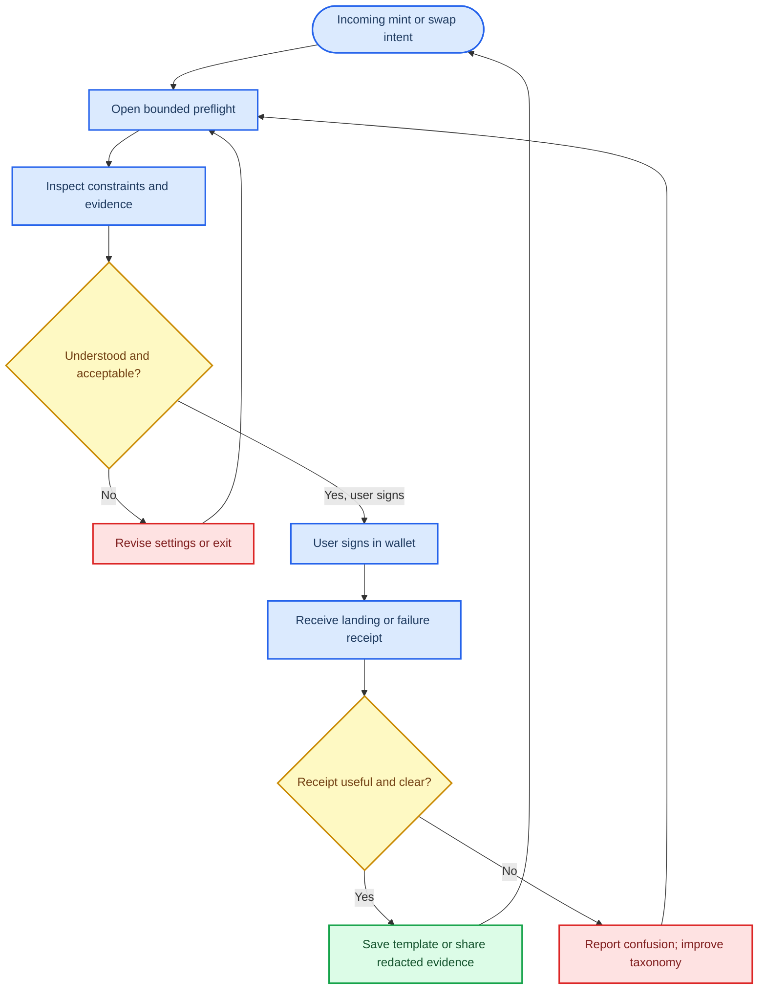

# Viral trader product lab: a defensible Solana product direction

*Decision memo for product, design, engineering, and risk leadership — 1 October 2026; based on the supplied primary-source research and explicitly separating observed mechanics from design inference.*

---

## 🎯 Direct answer and strategic thesis

**Recommendation: build an approval-only, intent-to-receipt preflight for Solana spot swaps.** Its concrete mechanism is a **Bounded Intent Receipt**: before a user signs, it translates a proposed swap into (1) the exact mint and route, (2) maximum spend, minimum receive, price impact and fee ceiling, (3) freshness and execution state, and (4) observable token-authority, extension, and liquidity-change facts. After the user signs manually, it generates a comparable receipt explaining whether the transaction landed, failed, or differed from its quote.

The immediate user **“aha”** should be: _“I can finally see what I am authorizing, the economic bounds that are actually enforced, and what happened afterward—without trusting a new wallet, trader, or score.”_ A representative first sentence is: **“Spend at most 0.50 SOL; receive at least 281,400 `$MINT` under this transaction; quote is 1.2 seconds old; here are the authority and liquidity facts we observed.”** This is more specific than “a safer trading platform,” and more useful than another discovery feed.

> **No idea, feature, incentive, or mechanism guarantees virality, adoption, safety, profitability, or success.** The thesis is a testable product bet: clarity at the irreversible moment of signing may earn repeated use, and redacted receipts may be shareable because they preserve evidence rather than hype.

### Why this is the most defensible thesis

| Decision criterion | Why the Bounded Intent Receipt wins | What must be true to win |
| --- | --- | --- |
| Immediate legibility | It answers a universal, moment-of-action question: “What happens if I sign this?” rather than asking the user to learn a new market, feed, or social graph | The first screen must be understandable in under 20 seconds and avoid a false binary “safe/unsafe” verdict |
| Genuine utility | Solana and Jupiter already expose route, quote, minimum-output, simulation, and transaction-state primitives, but they are split across venue UI, wallet review, RPC, and explorers.[^1][^2][^3] | The product must reduce ambiguous/failed actions or improve post-trade comprehension—not merely add another confirmation screen |
| Solana-native advantage | Solana state exposes mint/freeze authorities, Token-2022 extensions, fees, account changes, simulation logs, slot context, and explicit priority-fee controls that can be rendered before signing.[^3][^4][^5] | Freshness and uncertainty must be first-class, because the state can change after review |
| Distribution without volume incentives | A redacted, read-only receipt can travel through token pages, wallets, Discord, Telegram, and X without authorizing a trade or promising returns | Recipients must open evidence and not treat the receipt as a trade call |
| Safety tractability | The app can remain non-custodial and approval-only: it reads public data, builds/simulates a candidate transaction, and asks the user’s wallet for every signature | No persistent seed, delegate, vault custody, auto-buy, copy-trade, or silent change to slippage/fees |
| Honest monetization | A transparent subscription for saved templates, history, alerts, and team/API audit views is aligned with understanding; optional disclosed integration revenue must not be tied to trading volume | Users must value the explanation even when they do not trade |

**Strategic positioning:** do not compete first on “find the next winner,” faster clicks, public PnL, or social trading. Compete on the decision contract: **inspect → constrain → sign yourself → explain outcome → reuse or share evidence.** Pump.fun proves that an instant market and live spectacle can be legible; Jupiter demonstrates integrated routing and conditional intent; Hyperliquid demonstrates visible execution state; Polymarket demonstrates a compact, shareable information object. None proves that a new Solana product will retain users, and none should be copied wholesale.[^6][^7][^8][^9]

### What this strategy deliberately declines

| Declined growth shortcut | Reason |
| --- | --- |
| Copy trading, trade advice, or ranked “winning” wallets | These turn a transparency utility into an endorsement and create timing, suitability, conflict, and manipulation risk |
| Pooled funds, custody, token launches, or synthetic PnL | They expand legal, operational, and trust scope while weakening the thesis of individual, bounded authorization |
| Referrals for trading volume, streaks, PnL leaderboards, and urgency countdowns | They reward churn, recruitment, or attention rather than informed use; regulators have specifically raised concerns about game-like trading engagement.[^10][^11] |
| Automatic fund movement by an agent | A model may prepare and explain; a user must approve every action with a wallet signature. No exception in the initial product |
| A universal “risk score” or “safe token” badge | Authority, extension, liquidity, and route observations are useful but cannot prove future behavior, legitimacy, or execution quality |

## 🧭 Product-mechanism map

The map distinguishes documented product mechanics from interpretation. The **repeat loop** and **distribution reading** are design analyses, not causal growth claims.

| Product | Atomic user value | Repeat loop | Distribution surface | Mechanism we must not copy |
| --- | --- | --- | --- | --- |
| Pump.fun | A creator can create an SPL coin and make it immediately tradeable on a deterministic bonding curve without separately seeding liquidity; a trader sees a live curve and can buy/sell.[^6][^12] | **Hypothesis:** narrative → tradeable coin → curve/trending state → attention and sharing → more browsing/trades | Home, discovery, live/trending, leaderboards, caller/friend follows, and shareable token narratives; the iOS listing describes these social discovery surfaces.[^13] | Early-buyer urgency baked into a bonding curve; permissionless pseudonymous launches and activity rewards can amplify sniping, wash activity, impersonation, and attention-led speculation. A vendor analysis of selected Pump.fun tokens is a warning signal about low liquidity, not a finding that every token is fraudulent.[^14] |
| Hyperliquid | One fast, non-custodial workspace combines live order-book context, order types, leverage/margin modes, and position controls.[^7][^15] | **Hypothesis:** fast feedback and integrated controls → repeat execution → more developer/API participation → better two-sided usability | Web app, wallet connection, WebSocket/API integrations, docs, referrals, vault/staking/leaderboard surfaces.[^16][^17] | Leverage, liquidation, points-era activity, or referrals as a proxy for durable love. Its terms disclose loss, liquidity, technology, and jurisdictional risks; Solana cannot inherit Hyperliquid’s chain-specific execution qualities by copying its interface.[^17] |
| Jupiter | A trader gets one routed Solana swap quote instead of manually comparing many venues; limit/DCA tools turn a swap into an explicit conditional intent.[^1][^2] | **Hypothesis:** discovery → inspect → routed action or standing order → portfolio/alerts → return | Spot/Portfolio/Limit/Recurring/Perps, mobile and web pairing, SmartMoney observation, APIs, widget/CPI integrations.[^18][^19] | Presenting wallet rankings as endorsements, hiding vault/keeper/non-fill states, or treating gasless/MEV-resistant language as a universal guarantee. Jupiter itself warns that stop-loss output and fills are not guaranteed.[^2] |
| Polymarket | One binary, time-bounded question maps a price to a legible tradable probability and has an explicit resolution process.[^8][^20] | **Hypothesis:** news → probability → watch/trade/share → new information → updated probability → resolution | Readable market URLs/slugs, public market data, order-book APIs, real-time feeds, embeds, alerts.[^21][^22] | Using a probability as truth, or importing event-contract trading without resolution governance and legal review. The CFTC’s 2022 order is evidence that regulatory architecture can dominate product portability.[^23] |
| Robinhood | A user enters familiar dollars, sees fractional ownership, and can schedule recurring contributions.[^24][^25] | **Hypothesis:** small first action → understandable ownership → scheduled contribution → portfolio review | Mobile onboarding, app-store discovery, watchlists/notifications, referral/reward offers, and social/influencer promotion | Game-like engagement, zero-cost rhetoric that conceals execution economics, or rewards that nudge excessive trading. SEC and FINRA actions illustrate why polished consumer UX does not remove disclosure, supervision, best-execution, or operational obligations.[^10][^11] |
| TikTok | A compact, immediately understandable content object is discovered in a personalized stream with explicit positive and negative feedback controls.[^26] | **Hypothesis:** watch → react/remix → share → better personalized discovery | For You feed, creator tools, embeds, short-video posts, and share flows; the content-posting API requires preview, consent, user controls, and disclosure.[^27] | Optimizing trading content for watch time, likes, shares, or virality. Those are attention signals, not evidence quality or suitability |
| Discord | A member is routed by intent to persistent forum topics, roles, channels, tags, and scheduled events rather than only a scrolling chat.[^28][^29] | **Hypothesis:** focused topic → question/feedback → searchable evidence archive → return with new context | Community onboarding, forum posts, events, announcements, bots, and server discovery.[^28][^30] | Paid signal rooms, opaque role hierarchy, social-status trust proxies, or coordinated buy instructions. FINRA describes investment-group impersonation and coordinated-purchase scams as a material failure mode.[^31] |

### Transferable pattern, not copied product

The transferable unit across these products is **a legible atomic object**: a coin/curve, a live order, a route quote, a probability, a dollar order, a short artifact, or a forum post. The product opportunity is to make the Solana trading atomic object an **evidence-bearing execution intent** rather than a speculative signal.

| Borrow | Adapt | Reject |
| --- | --- | --- |
| Pump.fun’s instant comprehension | One pre-sign card with an unambiguous action and state | Curve-FOMO, token creation, activity-paid promotion |
| Hyperliquid’s visible execution state | Pending/accepted/confirmed/finalized states and explicit partial/failure explanations | Leverage-first onboarding and point/rebate-led retention |
| Jupiter’s aggregation and bounded orders | Quote, route, simulation, expiry, minimum receive, and human-readable status | “Best” claims without route provenance and stop-loss certainty |
| Polymarket’s compact share card | Timestamped, source-linked receipt with an interpretable status | Gambling-like calls to action and unresolved/ambiguous claims |
| Robinhood’s dollars-first clarity | Maximum spend and fee budget in the user’s familiar unit | Engagement mechanics designed to increase trading frequency |
| TikTok’s remix and feedback | Attributed revisions of evidence cards, stale/misleading controls | Algorithmic engagement as the quality objective |
| Discord’s persistent forum context | One mint/intent/topic per evidence thread, tags, moderation, archive | Chat-driven coordination of financial action |

## ✅ Ten non-negotiable success conditions

These are gates, not a feature backlog. A condition tagged **Fact** is grounded in the research; **Hypothesis** is an assumption to test; **Measurement** is the acceptance evidence. Product leadership should not graduate a condition because it “feels viral.”

| # | Non-negotiable condition | Fact | Hypothesis | Measurement and gate |
| --- | --- | --- | --- | --- |
| 1 | The first screen is intelligible before wallet connection | **Fact:** Jupiter quotes expose output, minimum output, price impact, route plan, and context slot; Solana simulation exposes program logs and errors.[^2][^3] | A single bounded-action card lowers hesitation more than a feature-rich terminal | In moderated first-use tests, at least 8/10 target users accurately explain maximum spend, enforced minimum receive, and the difference between quote and outcome without prompting |
| 2 | Every financial field states whether it is enforced, estimated, or observed | **Fact:** an RPC accepting `sendTransaction` does not guarantee processing/confirmation; simulation is pre-broadcast state, not a later execution guarantee.[^3][^32] | Explicit uncertainty earns more trust than a green “safe” label | At least 90% of testers correctly classify three randomly shown fields; no release if users interpret estimate as guarantee |
| 3 | The product stays approval-only and non-custodial | **Fact:** Solana transactions have explicit signer sets; token delegation exists but expands authority and is not needed for an approval-only v1.[^33][^34] | Users will accept one manual signature when the review is materially clearer | Security review finds no seed capture, private-key storage, automatic signing, delegate approval, or fund-moving background task |
| 4 | It makes Solana-specific state useful, not decorative | **Fact:** mint/freeze authority and Token-2022 extensions are observable, behavior-changing primitives; priority fees influence scheduling likelihood but do not guarantee execution.[^4][^5][^35] | Authority/extension/liquidity freshness explains surprises users cannot infer from price alone | At least 60% of tested users open one evidence item when a non-default state is present; false “safe” interpretation remains below 10% |
| 5 | It improves an execution or understanding outcome | **Fact:** routes, liquidity, blockhash, fee, and state can change between simulation and inclusion.[^2][^3] | Better preflight reduces avoidable over-slippage, duplicate retry, and unexplained failure | Relative to a matched no-preflight baseline, reduce ambiguous post-trade support questions or avoidable aborted/retried actions by a pre-registered threshold (initial target: 20%) |
| 6 | It supports repeat use without rewarding volume | **Fact:** recurring/conditional orders create standing intent, but outputs/fills may not be guaranteed.[^2][^25] | Users return for templates, comparisons, alerts, and receipts—not a next-token feed | Seven-day return among activated users and second inspection per user are primary; volume, token price, and follower count are explicitly excluded from the north-star dashboard |
| 7 | A receipt is shareable without becoming a trade recommendation | **Fact:** readable share objects and persistent topics are distribution primitives on Polymarket and Discord; their causal effect on adoption is unproven.[^21][^29] | Redacted evidence cards can earn qualified opens from peers | Measure receipt-open → evidence-open → save/simulate; do not optimize share count alone. Recipient must see “not advice; no signing authority” before any action |
| 8 | Discovery is provenance-first and conflict-aware | **Fact:** Jupiter warns that token indicators and AI-aggregated social news do not guarantee safety and may contain lookalikes/errors; DEX Screener distinguishes paid boosts/ads from market fields.[^18][^36] | Separating on-chain fact, heuristic, sponsor claim, and unknown reduces false confidence | Audit 50 surfaced cards weekly: 100% require source/time/method labels; paid or unverifiable inputs are visibly labeled or withheld |
| 9 | Failure is a product state, not a dead end | **Fact:** Solana failure can still incur fees; transaction confirmation needs a signature-status check.[^32][^33] | A usable diagnosis and safe retry choice creates more trust than silent failure | At least 80% of failed-test-transaction participants identify whether retrying could duplicate exposure; top five error classes receive plain-language recovery paths |
| 10 | Compliance and abuse gates exist before public distribution | **Fact:** financial promotion, event contracts, and group investment communications can introduce regulatory and consumer-protection constraints.[^11][^23][^31] | Conservative scope preserves the option to distribute broadly | Counsel-approved jurisdiction/disclosure policy, abuse reporting, rate limits, sponsor/conflict labels, accessibility review, and incident owner must exist before any open social embed |

## 🔎 Trader pain and opportunity map

The gap is real only if the product eliminates a costly handoff—not if it merely rearranges tools users already trust.

| Pain / job | Existing alternatives | Opportunity | Why the gap could be illusory | Falsifying evidence |
| --- | --- | --- | --- | --- |
| “Before I sign, what exactly can change and what is my worst allowed execution?” | Jupiter Swap/Ultra, wallet previews, Solana simulation/RPC, Jito-aware sending | Unite route, minimum output, price impact, priority budget, token behavior, freshness, and post-trade diff in one intent receipt | Jupiter and wallets may already be sufficient; an extra screen can make quotes stale or add cognitive load | Users complete the same task faster and explain it equally well without the layer, or receipt use does not lower ambiguity/failure questions |
| “This token suddenly appeared everywhere—what changed, and which evidence is real?” | Jupiter token pages, Birdeye event feeds, DEX Screener, Solscan, Helius, X/Telegram/Discord | A provenance ledger that separates on-chain events from paid promotion, community claims, and model inference | Early markets have inherently sparse or adversarial information; composite explanations can be gamed | Experts prefer raw tools, alerts have low save/open rates, or source labels do not change decisions |
| “Can this mint’s authorities, extensions, liquidity, or market access change after I buy?” | Explorer, RugCheck-type dashboards, Jupiter safety indicators, raw token-program data | A time-stamped authority/liquidity change sentinel tied to the user’s selected mint and transaction size | Static authority checks miss custom program logic, compromised keys, off-chain coordination, and liquidity can change too quickly | Users read “observed” as “safe,” or alert lead time is too short to produce a useful action |
| “Why did my swap fail or land differently than expected?” | RPC logs, explorer signatures, support tickets, wallet history | Turn raw logs into a receipt: quote versus minimum versus actual, fee/slot state, and a safe next action | The true reason may be multi-causal or unverifiable from public data; a simple story risks hallucination | Human reviewers cannot agree on error classifications or users act on incorrect causal explanations |
| “How can I share a trade process without sharing my wallet, positions, or a buy call?” | Screenshots, Discord messages, X posts, TradingView ideas, wallet trackers | Redacted receipts and evidence cards that retain mint, timestamp, constraints, and sources while stripping wallet identity | People may prefer social status, PnL screenshots, or live calls; evidence cards may not be inherently shareable | Recipients do not open evidence or authors only share cards after favorable outcomes |
| “Which trader claims deserve attention without doxxing wallets or enabling copying?” | eToro-style profiles, Vybe/Solana Tracker/Birdeye PnL data, Nansen-like labels | Selective disclosure of bounded, independently recomputed claims—not a leaderboard or copy engine | Privacy can remove the context followers need; proof UX/cost may be too complex | Users cannot explain proof scope or do not value it over public wallet links |
| “How can a group watch, discuss, and learn without becoming a signal room?” | Discord forums/events, Telegram polls, group chats, DAO tools | Evidence-first watchroom with source tags, dissent, scheduled post-mortems, and individual-only actions | Existing chats plus wallet links may be good enough; moderation burden can erase value | Non-speculative groups do not return to structured threads or moderation cost exceeds retained value |
| “Can a helper turn alerts into understandable drafts without taking control?” | Manual wallets, Jupiter Trigger, bots, exchange APIs, Hummingbot | Propose-only assistant that decodes/simulates a transaction; every action still needs user signature | The assistant adds latency, hallucination risk, and another trust boundary | Users do not accept proposals faster/more accurately than manual UI, or model error exceeds a pre-set safety threshold |

**Priority inference:** the first four pains sit immediately adjacent to a manual signature and can be validated without asking people to trust a new market, social graph, or wallet authority. The proof, community, and assistant concepts are useful option paths, but all require a stronger trust base.

## 🧪 Eight product concept cards

All eight concepts are deliberately **not** competitor-free and **not** guaranteed viral. They are practical product hypotheses constrained by the following boundaries: no copy trading, no trade advice, no pooled funds, no custody, no token launches, no synthetic PnL, no volume-based trading referrals, and no fund-moving automation without an explicit user approval for every transaction.

### 1. Bounded Intent Receipt — recommended

| Field | Concept definition |
| --- | --- |
| One-line aha | “Before I sign, I can see exactly what my swap can spend, what it must receive, what changed, and what is only an estimate.” |
| Named first user | A self-custodial Solana spot trader who finds tokens through Jupiter, Birdeye, Discord, or a wallet but distrusts raw transaction previews |
| Precise job | Convert a chosen mint and input amount into an understandable, bounded, manually signed transaction and a post-trade explanation |
| Minimal core interaction | Paste/open a mint → enter amount and max slippage/fee → inspect a four-panel preflight → choose `Sign in wallet` or `Do not sign` → see receipt |
| Why Solana is necessary, not decorative | The value comes from Solana’s inspectable mint/authority/Token-2022 state, Jupiter route metadata, simulation logs, blockhash/slot freshness, and compute/priority-fee fields.[^2][^3][^4][^35] |
| Share / repeat loop | Save a bounded template; after any landing/failure, compare expected/minimum/actual; share a redacted evidence receipt that deep-links to read-only inspection. The loop is a hypothesis, not a virality claim |
| Closest alternatives | Jupiter Swap/Ultra, wallet previews, Solana simulation/RPC, explorer history, Birdeye token pages |
| What is actually novel | One signed “decision contract” spanning pre-sign constraints, classified observations, simulation, freshness, and post-trade attribution—not a generic swap UI or a safety score |
| Safety / compliance boundary | Non-custodial; no advice, rating, auto-trade, custody, delegation, or claim of safe/best execution. Every live transaction requires the user’s wallet signature |
| Strongest falsifier | If current Jupiter/wallet flows already yield equal comprehension and the layer does not reduce ambiguity, errors, or support burden, it is friction—not product |
| 48-hour smoke test | A read-only Figma/web prototype using 12 archived swap scenarios; recruit 10 target users, randomize screen order, measure whether they explain spend/minimum receive/freshness/authority state and choose the correct “sign vs walk away” action |
| Seven-day manual test | Concierge 20 users through read-only preflights and manually generated receipts for their intended swaps; do not execute for them; compare repeat inspection, evidence opens, saved templates, and error comprehension with a no-preflight cohort |

### 2. Authority and liquidity Change Sentinel

| Field | Concept definition |
| --- | --- |
| One-line aha | “I get a time-stamped explanation when this mint’s observable controls, transfer behavior, or usable liquidity changes.” |
| Named first user | A repeat buyer or holder of emerging Solana tokens who cannot monitor program state and liquidity continuously |
| Precise job | Observe selected mints; distinguish authority/extension/liquidity events from price chatter; decide whether to inspect, not whether to buy/sell |
| Minimal core interaction | Add mint → choose alert budget and event classes → receive an evidence card with old/new state, source signature/slot, coverage limits, and an `Inspect` link |
| Why Solana is necessary, not decorative | Mint/freeze authority, Token-2022 transfer-fee/hook/pause/delegate extensions, accounts, pools, slots, and signatures are machine-readable on Solana.[^4][^5][^37] |
| Share / repeat loop | Watchlist → material change card → inspect / mute / explain false positive → tuned alert settings; optionally share a neutral change receipt |
| Closest alternatives | Jupiter token-page indicators, Solscan/explorers, RugCheck-style dashboards, Birdeye alerts, Helius parsed events |
| What is actually novel | It is a delta-first, time-stamped event explanation tied to the user’s holding and transaction-size context—not a one-time “scan” or universal risk grade |
| Safety / compliance boundary | No “rug detected,” no trading prompt, no auto-sell, no safety guarantee. “Unknown/not observed” is a first-class state; alerts are rate-limited |
| Strongest falsifier | Material events occur too late, too noisily, or too ambiguously to help; users mistake factual state changes for a recommendation |
| 48-hour smoke test | Replay 30 historical mint/pool events in a clickable inbox; ask 12 users what changed, what is unknown, and what they would inspect next—not what they would trade |
| Seven-day manual test | A researcher sends manually curated, source-linked alerts for 25 watched mints to 15 users; measure alert-open, inspect, mute, false-positive, and confusion rates |

### 3. Provenance Pulse

| Field | Concept definition |
| --- | --- |
| One-line aha | “In 15 seconds, I can see what changed, where it came from, and which parts are fact, heuristic, paid claim, or unknown.” |
| Named first user | An intermediate Solana trader overwhelmed by new-token feeds and social posts |
| Precise job | Triage whether a market/narrative event deserves investigation, with a reversible audit trail rather than an alpha claim |
| Minimal core interaction | Open a mint/event → read `Why now` and `Why trust this` panels → expand raw signatures/source URLs/method → save, mute, or open the preflight |
| Why Solana is necessary, not decorative | It joins real-time Solana mint/pool/swap/holder/developer/funder signals with direct signatures and public account state; it is not merely a social-news wrapper.[^18][^38][^39] |
| Share / repeat loop | Evidence brief → user saves/mutes/flags → rules adapt → newer brief has better relevance; a share preserves sources and timestamps, not a prediction |
| Closest alternatives | Jupiter discovery/token pages, Birdeye listing feed, DEX Screener, Helius, explorers, X/Telegram/Discord |
| What is actually novel | A signal ledger that visibly separates on-chain facts, observed heuristics, issuer claims, paid placement, and model inference with methodology versioning |
| Safety / compliance boundary | No “buy now,” smart-money endorsement, model-generated certainty, or covert paid placement. Sponsorship, source gaps, and lookalike risk are explicit |
| Strongest falsifier | Experts find raw tools faster and novices ignore provenance when an asset is moving; the composite layer then adds latency and false confidence |
| 48-hour smoke test | Create 15 static briefs from supplied public events and 15 deliberately ambiguous variants; test source recall, fact-versus-inference classification, and save/mute choice with 12 participants |
| Seven-day manual test | Publish a twice-daily, human-curated provenance digest to 30 opt-in users with no trade links; measure repeat opens, source opens, corrections, mutes, and whether users ask for more evidence rather than calls |

### 4. Execution Error Replay

| Field | Concept definition |
| --- | --- |
| One-line aha | “My failed or surprising swap becomes a five-line explanation and a safe next choice, not an explorer scavenger hunt.” |
| Named first user | A trader who has a pending, failed, expired, or unexpectedly executed Solana swap |
| Precise job | Classify transaction outcome; compare intent, quote, simulation, and final state; prevent duplicate exposure on retry |
| Minimal core interaction | Paste signature → see status ladder and diffs → choose `Requote`, `Reduce size`, `Raise fee within cap`, or `Stop` |
| Why Solana is necessary, not decorative | Solana exposes signatures, logs, inner instructions, balances, context slots, blockhash behavior, compute usage, and confirmation statuses.[^3][^32][^33] |
| Share / repeat loop | A receipt teaches the user’s next preflight; anonymized error taxonomy can improve wording and fallback paths |
| Closest alternatives | Explorer transaction pages, raw RPC logs, wallet history, Jupiter support/route diagnostics |
| What is actually novel | A retry-safety model that states whether the original action may have landed, rather than merely translating error logs |
| Safety / compliance boundary | It never rebuilds/signs automatically; it does not infer a definitive cause when multiple causes are plausible; no “recover funds” promises |
| Strongest falsifier | Error sources cannot be reliably classified from public data or the existing wallet error is already clearer/faster |
| 48-hour smoke test | Card-sort and comprehension test on 25 anonymized transaction outcomes; score correct retry/no-retry decisions and perceived confidence |
| Seven-day manual test | Operate a private “paste-signature clinic” with analyst-reviewed explanations for 30 cases; audit agreement between two reviewers and track recontact/support deflection |

### 5. Redacted Evidence Card Studio

| Field | Concept definition |
| --- | --- |
| One-line aha | “I can share my process—mint, constraints, evidence, and outcome—without sharing my wallet or telling anyone to trade.” |
| Named first user | A thoughtful community member who currently posts screenshots of a chart, transaction, or thesis |
| Precise job | Package a time-bounded observation or completed intent as a verifiable, read-only artifact for critique or education |
| Minimal core interaction | Select fields → redact wallet/amount as ranges if desired → preview card → publish an expiring link with source and methodology labels |
| Why Solana is necessary, not decorative | Mint addresses, transaction signatures, route/simulation snapshots, and account-state evidence can be linked and verified by recipients without platform custody |
| Share / repeat loop | Card → peer opens sources, adds correction or branch → author revises with lineage → archive becomes reusable training data for the community |
| Closest alternatives | Screenshots, X threads, Discord forum posts, TradingView ideas, explorer links, Jupiter token pages |
| What is actually novel | The share unit preserves constraint/freshness/provenance and blocks signing; it is not a PnL screenshot, referral link, or copy-trade instruction |
| Safety / compliance boundary | Required `not advice` and conflict/sponsor fields; no followers/PnL ranks, no auto-follow, no private pending order details, moderation and report controls |
| Strongest falsifier | Recipients prefer screenshots and do not inspect underlying evidence, making the artifact too dense for social distribution |
| 48-hour smoke test | Give 15 users an existing screenshot and an evidence-card variant; compare comprehension, source-open, willingness to share, and perceived pressure |
| Seven-day manual test | Seed a moderated Discord forum with 25 cards from a small beta; track qualified opens, corrections, report rate, and whether conversations remain evidence-focused |

### 6. Bounded Performance Proof Card

| Field | Concept definition |
| --- | --- |
| One-line aha | “I can prove a narrow, time-bounded trading claim without exposing my balances, wallet graph, or live positions.” |
| Named first user | A serious pseudonymous trader who wants credibility but will not dox a wallet |
| Precise job | Publish a reproducible claim schema—evaluation window, realized/unrealized method, active days, concentration, and drawdown context—for independent verification |
| Minimal core interaction | Choose claim template → connect read-only wallet proof → approve disclosures → receive a card marked verified, self-attested, stale, disputed, or unknown |
| Why Solana is necessary, not decorative | Public-key history enables recomputation; Solana’s privacy model and Token-2022 confidential-balance work reveal both opportunity and limits for selective disclosure.[^40][^41] |
| Share / repeat loop | Evaluation epoch ends → refresh proof → followers inspect method/status → disputes improve schema/verifier quality; it is not a performance leaderboard |
| Closest alternatives | Vybe, Solana Tracker, Birdeye wallet PnL, public wallet dashboards, eToro-style profiles |
| What is actually novel | Privacy-preserving, bounded claims with methodology and proof status rather than a short-window ROI badge or a public address |
| Safety / compliance boundary | No automatic copying, investment advice, ranking, or live-position broadcast. Explicit privacy/correlation limitations, multiple windows, realized/unrealized separation, dispute process |
| Strongest falsifier | The proof removes context users need, costs too much to verify, or recreates influencer authority behind a cryptographic badge |
| 48-hour smoke test | Test mock proof cards against standard PnL screenshots with 12 followers; ask what claim is proved, what is unknown, and whether they would ask a better question |
| Seven-day manual test | Manually compute five volunteer proof cards using a disclosed spreadsheet method and independent checker; track clarity, privacy objections, disputes, and repeat requests |

### 7. Watchroom with individual action previews

| Field | Concept definition |
| --- | --- |
| One-line aha | “My group can preserve what we are watching, why, and what happened—without a synchronized-buy room.” |
| Named first user | A DAO, hackathon, research club, or token community moderator who loses context in chat |
| Precise job | Coordinate attention and post-mortems with sources, roles, time-bounded polls, dissent, and individual read-only action previews |
| Minimal core interaction | Create a topic card → attach sources/event → members tag, poll, RSVP, and add evidence → each user may open an individual preview, never a group trade |
| Why Solana is necessary, not decorative | Solana Actions/Blinks can render a previewable signed message or transaction inside compatible surfaces, while requiring wallet review/signing; non-financial actions are the safer initial wedge.[^42] |
| Share / repeat loop | Topic → question/poll/RSVP → scheduled outcome/post-mortem → searchable archive → reusable invite link |
| Closest alternatives | Discord forums/events, Telegram polls, group chats, DAO governance, TradingView alerts |
| What is actually novel | A financial-context object that keeps dissent, conflicts, sources, and individual authorization explicit—not a chat bot that posts buy links |
| Safety / compliance boundary | Start with non-speculative uses (votes, attendance, public-good contributions, bounties). No buy countdowns, paid shilling, volume/referral rewards, custody, copy trading, or group execution |
| Strongest falsifier | Existing Discord/Telegram behavior is sufficient, or moderation/abuse cost overwhelms the contextual benefit |
| 48-hour smoke test | Run two structured research/watch sessions with existing communities using a static topic template; compare source recall and post-event retrieval against normal chat |
| Seven-day manual test | Operate one Discord forum pilot for a non-financial event or DAO decision; measure completed artifacts, search/retrieval, report rate, return attendance, and moderation time |

### 8. Propose-only execution copilot

| Field | Concept definition |
| --- | --- |
| One-line aha | “I can ask why an alert matters and get a constrained transaction draft, but it cannot move a cent until I approve it.” |
| Named first user | A busy, intermediate Solana trader who manages a small watchlist and wants fewer raw-alert tabs |
| Precise job | Interpret user-provided alert/context; prepare a deterministic preflight and a simulation-backed transaction draft for manual review |
| Minimal core interaction | Ask a question or open an alert → review factual evidence and draft → edit caps → simulate → `Sign in wallet` or discard |
| Why Solana is necessary, not decorative | Explicit transaction signer sets, simulation, token-account permissions, and composable quote construction make a draft inspectable; they also make authority boundaries concrete.[^3][^33][^34] |
| Share / repeat loop | Users save human-readable rule templates and receipts; peers can inspect template constraints without receiving signing authority |
| Closest alternatives | Jupiter Trigger, manual wallets, Hummingbot/Condor, exchange APIs, hosted rule bots |
| What is actually novel | A hard separation between natural-language explanation and deterministic transaction decoding/simulation, with every live action user-signed |
| Safety / compliance boundary | No root key, no delegate, no automatic execution, no leverage default, no advice/suitability claim. The model cannot alter transaction fields after the user reviews them; unknown programs escalate to stop |
| Strongest falsifier | Users prefer direct venue UI, or model summaries are insufficiently reliable to justify a new trust boundary |
| 48-hour smoke test | Wizard-of-Oz test: an analyst transforms 20 user alerts into standardized, cited drafts; compare understanding and time-to-decision with raw alerts |
| Seven-day manual test | Invite 10 users to a read-only/paper mode; log proposal acceptance, correction, abandonment, and unsafe-program escalation; permit no live signing during the test |

## 📊 Transparent weighted ranking

**Scores below are design judgments, not user data.** A 1 means weak/unproven and a 5 means strong relative potential under the stated boundaries. Weighted score = `score ÷ 5 × criterion weight`; it is a decision aid, not a forecast.

| Criterion | Weight | Scoring meaning |
| --- | ---: | --- |
| Aha clarity | 20 | Can a target user repeat the promise after a first screen? |
| Repeated utility | 20 | Is there a non-speculative, recurring job? |
| Share / distribution surface | 15 | Can a useful, non-authoritative object travel through existing surfaces? |
| Solana increment | 15 | Is Solana state/composability essential to the wedge? |
| Trust / safety tractability | 15 | Can the boundary be enforced and explained without a false promise? |
| Cost to test | 10 | Can the riskiest assumption be tested within days without production custody/execution? |
| Monetization | 5 | Is there a user-aligned paid path that does not rely on trade volume? |

| Rank | Concept | Aha 20 | Repeat 20 | Share 15 | Solana 15 | Safety 15 | Test 10 | Monetize 5 | Weighted / 100 | Why it ranks here |
| ---: | --- | ---: | ---: | ---: | ---: | ---: | ---: | ---: | ---: | --- |
| 1 | Bounded Intent Receipt | 5 | 5 | 4 | 5 | 4 | 5 | 4 | **93** | Sharp action-time value; can be tested read-only and is native to observable Solana execution state |
| 2 | Authority and liquidity Change Sentinel | 4 | 4 | 3 | 5 | 5 | 4 | 3 | **82** | Strong safety boundary and retention potential, but alert fatigue limits distribution |
| 3 | Provenance Pulse | 4 | 4 | 4 | 5 | 3 | 3 | 4 | **78** | Addresses attention overload and feeds the first concept, but risks becoming an opaque composite score |
| 4 | Execution Error Replay | 4 | 3 | 2 | 4 | 5 | 5 | 3 | **74** | Operationally valuable and cheap to test; lower distribution surface makes it a feature path, not the first growth narrative |
| 5 | Redacted Evidence Card Studio | 4 | 3 | 5 | 3 | 3 | 4 | 3 | **72** | Best distribution object, but depends on a credible core receipt and moderation |
| 6 | Propose-only execution copilot | 4 | 4 | 3 | 5 | 2 | 2 | 3 | **69** | Useful later, yet an LLM trust boundary and safety validation make it premature as the wedge |
| 7 | Bounded Performance Proof Card | 3 | 4 | 4 | 5 | 2 | 2 | 3 | **68** | Distinctive long-term option with severe privacy, methodology, and trust complexity |
| 8 | Watchroom with individual action previews | 3 | 3 | 4 | 3 | 2 | 4 | 3 | **62** | Potentially broad, but community abuse/moderation can dominate value |

**Ranking interpretation:** the numerical order alone is not the roadmap. Build **Intent Receipt** first; add **Error Replay** into its post-trade path even though it ranks fourth numerically; then test **Change Sentinel** and **Provenance Pulse** as retention/discovery adjacencies. Defer social sharing, reputation, community, and assistant layers until the core action-time utility is proven.

## 🛠️ Detailed design briefs for the top three

### 1. Bounded Intent Receipt

| Brief item | Decision |
| --- | --- |
| Exact first-screen promise | **“Before you sign: see maximum spend, minimum receive, route and fee limits, quote freshness, and the observable token controls we found. Estimates are not guarantees.”** |
| 60-second first-use journey | **0–5s:** user opens from a mint link or pastes address. **5–12s:** select input amount, not a recommendation. **12–25s:** card renders maximum spend, expected/minimum receive, price impact, route count, fee/priority fee, quote slot/time. **25–38s:** authority/extensions/liquidity panels show `observed`, `changed`, or `unknown` with source links. **38–48s:** user expands `What is enforced?`; sees slippage/minimum-output/expiry versus UI estimates. **48–60s:** chooses `Sign in wallet`, `Save as template`, or `Do not sign`. No transaction is sent before wallet confirmation |
| State / authority boundary | Read-only public/indexed data and user-entered mint/amount/settings. The app may request a fresh quote and simulate a candidate transaction. It never stores a secret, connects a delegate, holds funds, signs, broadcasts, auto-retries, changes a user cap, or sends an action after a wallet prompt. The wallet shows the final transaction; user signature is the sole authorization |
| Data required | Mint + token metadata; mint/freeze/close authority where applicable; Token-2022 extension parse; quote input/output/minimum output/price impact/route plan/context slot; liquidity/depth at selected size; simulation logs/errors/account deltas/compute; base/priority fee and blockhash expiry; post-sign signature status, actual balance deltas, and receipt timestamp. Cite every non-observed field as estimate/heuristic |
| Non-goals | Token recommendation, “safe” score, project legitimacy, price prediction, MEV guarantee, best-execution claim, token discovery feed, custody, perpetuals/leverage, recurring delegated spending, or social ranking |
| Event metrics | `preflight_opened`, `quote_ready`, `field_expanded`, `enforced_vs_estimate_quiz_passed`, `wallet_sign_requested`, `wallet_sign_cancelled`, `signature_seen`, `receipt_opened`, `receipt_shared`, `template_saved`, `error_explained`, `support_contacted`. Segment by informed cancellation; do not treat signing as sole success |
| Kill criteria | Kill/re-scope if: fewer than 60% of target users can explain spend/minimum receive/freshness after the first session; median preflight adds more than 15 seconds without a comprehension gain; no material reduction in ambiguous outcomes versus baseline after 30 evaluable cases; or users read observed authority facts as a safety certification despite copy/UX revision |
| Smallest build | Web-only, one Jupiter-compatible SOL-to-SPL spot route, one wallet, no account creation, no alerts, no sharing. Pull fresh quote + simulation; render four panels (execution, token behavior, liquidity, uncertainty); submit only after a native wallet signature; store redacted local receipt. Add manually curated rules for five error categories |

**Design note:** Jupiter documents quote minimum output, price impact, route metadata, and context slot; Solana documents that simulation and RPC acceptance are not confirmation. The product must represent that distinction rather than paper it over.[^2][^3][^32]

### 2. Authority and liquidity Change Sentinel

| Brief item | Decision |
| --- | --- |
| Exact first-screen promise | **“Track what can change around a mint: authorities, token behavior, and observable usable liquidity. Every alert shows source, time, scope, and what we cannot determine.”** |
| 60-second first-use journey | **0–10s:** paste/select a mint from portfolio. **10–20s:** baseline shows authority and extension state, pool/liquidity snapshot, and data coverage. **20–30s:** user selects only three alert classes and a daily alert budget. **30–42s:** example alert demonstrates old/new values and a raw-signature link. **42–52s:** user selects `Inspect in preflight`, not a trade CTA. **52–60s:** user confirms watchlist. Initial notifications are in-app/email digest, not push spam |
| State / authority boundary | Product reads chain/indexer state and sends notifications. It receives no signing authority, cannot sell, cannot alter user positions, and does not label a mint fraudulent or safe. Alerts say “observed change” and enumerate coverage/method limitations |
| Data required | Mint/Token-2022 state at baseline and current slot; authority history; token-account and pool/liquidity snapshots; selected user holdings (read-only optional); source signatures/program IDs; indexer coverage/latency; user alert rules and mute history |
| Non-goals | Price alerts, alpha calls, automatic exits, honeypot label, global risk score, social rankings, identity attribution, or perfect bot/insider detection |
| Event metrics | `watch_added`, `baseline_viewed`, `alert_delivered`, `alert_opened`, `evidence_opened`, `inspect_clicked`, `mute`, `false_positive_reported`, `unknown_state_seen`, `notification_budget_hit`, `return_after_alert` |
| Kill criteria | Kill/re-scope if: fewer than 30% of delivered material alerts are opened; more than 15% are reported as irrelevant/misleading; users cannot distinguish “authority changed” from “sell now” in testing; or reliable data latency exceeds the useful decision window for the selected events |
| Smallest build | Watchlist of up to five mints, mint/freeze/extension changes plus two named liquidity snapshots, in-app digest, source/slot view, and explicit `unknown` status. Use human review for all outbound alerts in the first manual pilot |

**Design note:** authorities and Token-2022 extension configuration are verifiable, but they do not establish legitimacy or future behavior. The alert copy must preserve that narrow claim.[^4][^5]

### 3. Provenance Pulse

| Brief item | Decision |
| --- | --- |
| Exact first-screen promise | **“Why is this in front of you? See the event, the sources, the method, and the missing evidence—without a buy recommendation.”** |
| 60-second first-use journey | **0–8s:** open a mint from a link/feed. **8–18s:** read `Why now` (e.g., new pool, material liquidity delta, verified announcement) and time/slot. **18–30s:** read `Why trust this` with evidence classes—on-chain fact, heuristic, source claim, paid, or unknown. **30–42s:** expand one primary source or signature. **42–52s:** save, mute, flag, or open a Bounded Intent Receipt. **52–60s:** set one relevance preference; no Quick Buy control |
| State / authority boundary | Read-only data aggregation and user preferences. Human/editorial or model-generated text is always labeled with source links and method version. It can never sign, quote an auto-selected trade, or direct funds |
| Data required | Event stream for mint/pool/swap/holder/developer indicators; source URLs/handles; paid-placement metadata; timestamp/slot; method definitions; confidence/coverage; user topical mute/save settings; correction/report trail |
| Non-goals | Feed addiction, universal ranking, AI certainty, social influencer recommendations, paid boost without disclosure, wallet copying, or in-feed execution |
| Event metrics | `brief_impression`, `why_now_open`, `why_trust_open`, `primary_source_open`, `method_open`, `save`, `mute`, `correction_report`, `paid_label_seen`, `preflight_open`, `seven_day_return` |
| Kill criteria | Kill/re-scope if: users open fewer primary sources than a plain chronological feed; fact/inference classification is below 80% in tests; corrections exceed a pre-set editorial capacity; or engagement rises only when provenance labels are hidden/downplayed |
| Smallest build | A web list of 20 manually curated briefs/day for one category, each with two evidence panels and no execution. Use fixed templates and no personalized ranking until evidence classification is validated |

**Design note:** Jupiter’s Organic Score and token indicators are explicitly relative/caveated, Birdeye supports new-listing streams, and DEX Screener exposes paid visibility constructs. These are ingredients for provenance—not evidence that any composite score predicts quality.[^18][^36][^38]

## 🧫 Experiment portfolio and compounding loop

### Sequential portfolio: earn the right to expand scope

| Phase | Duration | Objective | Method | Primary success signals | Stop / learn condition |
| --- | --- | --- | --- | --- | --- |
| 1. Aha and comprehension | 48 hours | Test whether Bounded Intent Receipt is immediately legible | Clickable prototype plus 12 archived/routed scenarios; 10–15 target users; no wallet connection and no live transactions | Correct explanation of maximum spend, minimum receive, freshness, and observed-versus-guaranteed state; voluntary `Save template` intent | If wording/structure cannot reach 80% correct classification after one revision, abandon the “one-screen aha” assumption |
| 2. Concierge usefulness | Seven days | Test repeat value and receipt clarity in realistic workflow | 20 opt-in users request manual preflight/receipt help for intended or recent swaps. Researchers only explain; users sign themselves at their own venue or do nothing | Second inspection, receipt reopen, evidence open, correct retry/no-retry comprehension, lower ambiguous-outcome reports | If repeat use depends on live trade volume or users consistently bypass the preflight, move to Error Replay only or stop |
| 3. Instrumented beta | Seven days after phase 2 gate | Validate a smallest live build under manual operations guardrails | One wallet and one Jupiter-compatible spot route, no notifications except in-app, support review for every failure class | Time-to-understood-preview, informed cancellation, successful manual sign, receipt open, support contacts per completed intent | Pause release on any security boundary breach, false safety interpretation, material unclassified failure, or unacceptable support load |
| 4. Incentive-off test | 14 days | Separate utility from novelty, rewards, social pressure, and concierge effect | Remove gift cards, direct researcher reminders, and share prompts; leave only transparent product utility and normal error support | Unprompted weekly return, second preflight, template reuse, receipt reopen, user-reported clarity; measure qualified evidence shares as secondary | If activation/return collapses when incentives and human prompting stop, do not call the loop organic or product-market fit |
| 5. Adjacency test | Seven days per concept | Decide whether Sentinel or Provenance Pulse compounds the core | Randomly offer one read-only adjacency after preflight/receipt; no feed ranking or trading CTA | Incremental return and evidence inspection without increased false-confidence rate | Reject if it raises attention/opens but not comprehension or if it drives pressure-to-trade behavior |

### Instrumentation principles

- Pre-register thresholds before looking at results; retain anonymized qualitative reasons for cancellation and confusion.
- Treat an informed **“do not sign”** as a successful decision, not a failed conversion.
- Do not use volume, token price, follower count, referrals, or number of social posts as proof of product love.
- Analyze by experience level, wallet type, stale quote, failure outcome, and transaction size bands; exclude exact wallet addresses from product analytics where possible.
- Require a safety review before introducing notifications, public shares, AI summaries, or any integration that increases action pressure.

### Compounding loop for the recommended concept

The loop intentionally compounds **understanding and reusable evidence**, not speculation. A cancellation path is a healthy outcome; a shared card has no signing authority; and the diagram does not assert that any loop will create network effects.

## 📚 Sources

[^1]: Jupiter. “Spot.” *Jupiter User Documentation*. https://docs.jup.ag/user-docs/trade/spot
[^2]: Jupiter. “Swap API.” *Jupiter Developer Documentation*. https://developers.jup.ag/docs/swap
[^3]: Solana. “simulateTransaction RPC Method.” *Solana Documentation*. https://solana.com/docs/rpc/http/simulatetransaction
[^4]: Solana. “Set Authority.” *Solana Documentation*. https://solana.com/docs/tokens/basics/set-authority
[^5]: Solana. “Token Extensions.” *Solana Documentation*. https://solana.com/docs/tokens/extensions
[^6]: Pump.fun. “PUMP Program README.” *pump-public-docs*. https://github.com/pump-fun/pump-public-docs/blob/main/docs/PUMP_PROGRAM_README.md
[^7]: Hyperliquid. “HyperCore Overview.” *Hyperliquid Documentation*. https://hyperliquid.gitbook.io/hyperliquid-docs/hypercore/overview
[^8]: Polymarket. “Markets and Events.” *Polymarket Documentation*. https://docs.polymarket.com/concepts/markets-events
[^9]: Polymarket. “Prices and Orderbook.” *Polymarket Documentation*. https://docs.polymarket.com/concepts/prices-orderbook
[^10]: U.S. Securities and Exchange Commission. “SEC Charges Robinhood Financial With Misleading Customers About Revenue Sources and Failing to Satisfy Duty of Best Execution.” *SEC Press Release 2020-321*. https://www.sec.gov/newsroom/press-releases/2020-321
[^11]: FINRA. “FINRA Orders Robinhood Financial to Pay $3.75 Million in Restitution and $26 Million in Fines.” *FINRA News Release*. https://www.finra.org/media-center/newsreleases/2025/finra-orders-robinhood-financial-pay-375-million-restitution
[^12]: Pump.fun. “Coin Creation.” *pump-public-docs*. https://github.com/pump-fun/pump-public-docs/blob/main/docs/instructions/COIN_CREATION.md
[^13]: Pump.fun. “pump.fun: Meme Coins.” *Apple App Store*. https://apps.apple.com/cy/app/pump-fun-meme-coins/id6717572591
[^14]: Solidus Labs. “Solana Rug Pulls & Pump Dumps Crypto Compliance Report.” *Solidus Labs*. https://www.soliduslabs.com/reports/solana-rug-pulls-pump-dumps-crypto-compliance
[^15]: Hyperliquid. “Order Types.” *Hyperliquid Documentation*. https://hyperliquid.gitbook.io/hyperliquid-docs/trading/order-types
[^16]: Hyperliquid. “WebSocket API.” *Hyperliquid Documentation*. https://hyperliquid.gitbook.io/hyperliquid-docs/for-developers/api/websocket
[^17]: Hyperliquid. “Terms of Use.” *Hyperliquid App*. https://app.hyperliquid.xyz/terms
[^18]: Jupiter. “Token Page.” *Jupiter User Documentation*. https://docs.jup.ag/user-docs/trade/spot/token-page
[^19]: Jupiter. “Jupiter Mobile.” *Jupiter User Documentation*. https://docs.jup.ag/user-docs/global/mobile
[^20]: Polymarket. “Resolution.” *Polymarket Documentation*. https://docs.polymarket.com/concepts/resolution
[^21]: Polymarket. “Market Data Overview.” *Polymarket Documentation*. https://docs.polymarket.com/market-data/overview
[^22]: Polymarket. “Market Details.” *Polymarket Documentation*. https://docs.polymarket.com/market-data/market-details
[^23]: U.S. Commodity Futures Trading Commission. “CFTC Orders Blockratize, Inc. d/b/a Polymarket.com to Pay $1.4 Million Penalty and Cease Offering Event-Based Binary Options Contracts.” *CFTC Press Release 8478-22*. https://www.cftc.gov/PressRoom/PressReleases/8478-22
[^24]: Robinhood. “Fractional Shares.” *Robinhood Support*. https://robinhood.com/us/en/support/articles/fractional-shares/
[^25]: Robinhood. “Recurring Investments.” *Robinhood Support*. https://robinhood.com/us/en/support/articles/recurring-investments/
[^26]: TikTok. “How TikTok Recommends Content.” *TikTok Support*. https://support.tiktok.com/en/using-tiktok/exploring-videos/how-tiktok-recommends-content
[^27]: TikTok. “Content Sharing Guidelines.” *TikTok for Developers*. https://developers.tiktok.com/doc/content-sharing-guidelines
[^28]: Discord. “Community Onboarding FAQ.” *Discord Support*. https://support.discord.com/hc/en-us/articles/11074987197975-Community-Onboarding-FAQ
[^29]: Discord. “Forum Channels: Space for Organized Conversation.” *Discord Blog*. https://discord.com/blog/forum-channels-space-for-organized-conversation
[^30]: Discord. “Community Servers.” *Discord Developer Documentation*. https://docs.discord.com/developers/platform/community-servers
[^31]: FINRA. “Investment Group Imposter Scams.” *FINRA Investor Insights*. https://www.finra.org/investors/insights/investment-group-imposter-scams
[^32]: Solana. “sendTransaction RPC Method.” *Solana Documentation*. https://solana.com/docs/rpc/http/sendtransaction
[^33]: Solana. “Transactions.” *Solana Documentation*. https://solana.com/docs/core/transactions
[^34]: Solana. “Spend Permissions.” *Solana Documentation*. https://solana.com/docs/payments/advanced-payments/spend-permissions
[^35]: Solana. “Fees.” *Solana Documentation*. https://solana.com/docs/core/fees
[^36]: DEX Screener. “API Reference.” *DEX Screener Documentation*. https://docs.dexscreener.com/api/reference
[^37]: Solana. “Transfer Fees Extension.” *Solana Documentation*. https://solana.com/docs/tokens/extensions/transfer-fees
[^38]: Birdeye. “New Token Listing.” *Birdeye API Reference*. https://docs.birdeye.so/reference/new-token-listing
[^39]: Helius. “Funded By.” *Helius Documentation*. https://www.helius.dev/docs/wallet-api/funded-by
[^40]: Solana. “Privacy on Solana.” *Solana Documentation*. https://solana.com/privacy
[^41]: Solana. “Confidential Transfers.” *Solana Documentation*. https://solana.com/docs/tokens/extensions/confidential-transfer
[^42]: Solana. “Actions and Blinks.” *Solana Documentation*. https://solana.com/docs/tools/actions
