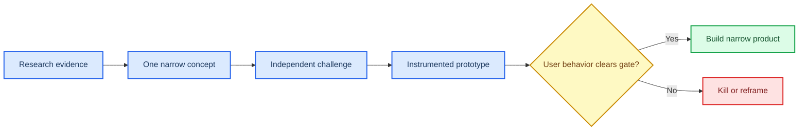

# Opportunity map: bounded, evidence-carrying participation

_Product-discovery synthesis of ten structured research tracks; decisions are hypotheses to be tested through observed behavior, not market predictions._

---

## 🧭 The product thesis

> **Decision:** The most credible product direction is a **browser-native, host- or partner-led participation utility**: a person takes one bounded action, can see what it changed, and receives an outcome, proof, or handoff that remains useful after the moment ends. The initial product should be useful with a link, work without a wallet or token, retain human control over consequential decisions, and create a reusable artifact for the participant, host, or named beneficiary.

The desired product properties are:

- **Instantly legible:** a new participant can understand the action and likely consequence in one sentence, then complete it with little or no account setup.
- **Real but bounded agency:** the input changes a visible state, a host decision, a next action, or an attributable outcome; it is not decorative voting.
- **Durable value:** the result becomes useful memory, evidence, a decision record, a handoff, a practice artifact, or a receipt—not merely a completed session.
- **Voluntary return and sharing:** repeat use must follow a new useful moment, a completed consequence, or a recipient who needs the artifact; it cannot depend on streak loss, referral unlocks, artificial scarcity, prize pressure, or rank anxiety.
- **Operationally responsible:** privacy controls, rights choices, moderation, deletion, accessibility, and correction are product surfaces rather than later operations.
- **Partner-compatible:** a standalone web link remains the baseline, while integrations are earned only where they remove a real host workflow burden.

**Non-negotiables.** No token, wallet, mining loop, chain transaction, paid chance, custody, or financial-return framing is required to join, act, rank, return, or receive value. AI may assist, but users must be able to inspect, approve, edit, reject, and reverse material work. For high-consequence domains, the product can clarify evidence and route a user to the responsible party; it does not autonomously execute the decision.

**Ruled out at this stage.** The evidence does not support leading with a new destination social network, generic AI chat, a tokenized game, a universal leaderboard, speculative collectibles, or chain infrastructure before a conventional product has demonstrated a user-visible portability problem. It also does not establish guaranteed virality, adoption, market size, willingness to pay, or an absence of competition. Every territory below is a testable hypothesis, not a validated market claim.

## What the evidence supports

The following are **exactly 12 opportunity primitives**: documented adjacent mechanisms that can be recombined only after testing their fit, economics, and safety in a narrow use case.

| # | Opportunity primitive | Verified mechanism | User benefit | Failure condition | One source |
| --- | --- | --- | --- | --- | --- |
| 1 | Friction-light entry | A host-owned room can accept browser/phone entry by code without a player account. | A group can start before installation or identity setup becomes the activity. | The host or shared screen is absent, leaving a cold visitor with no reason to act. | Jackbox support[^1] |
| 2 | Tiered live agency | An in-player extension can use channel context and present interaction in panels, overlays, or components. | A viewer can make a bounded contribution without leaving the live moment. | Latency, setup, platform limits, or shallow votes make contributors passive spectators. | Twitch developer documentation[^2] |
| 3 | Three-minute participation kernel | Education integrations can capture real-time responses and return attendance, reporting, or feedback into an existing workflow. | The participant gets an immediate checkpoint while the host receives a usable result. | The interaction becomes an extra tab or produces no change to the next session. | Kahoot integrations[^3] |
| 4 | Inspectable transformation | Source-grounded AI can answer from uploaded material with citations and produce a derivative artifact. | A person can turn their own material into a usable first draft while retaining a way to inspect it. | Output is generic, inaccurate, or hard to revise, so the user returns to one-off chat or a specialist tool. | Google NotebookLM[^4] |
| 5 | Rights-aware contribution receipt | A remix can retain a link to its original source, and creators can control reuse permissions. | A contributor can understand where an input came from and whether reuse is allowed. | Attribution is mistaken for consent, or deletion and rights changes do not propagate. | YouTube Help[^5] |
| 6 | Negotiated household handoff | Shared lists can assign people, hold subtasks and attachments, and issue context-sensitive alerts. | Household work can move from vague obligation to an editable owner and done-state. | The system records tasks but adds guilt, surveillance, or a permanent coordinator role. | Apple Support[^6] |
| 7 | Graduated evidence and review | Structured records can be filtered automatically and escalated to expert review with supporting media. | A small contribution can carry an honest confidence level instead of a false claim of certainty. | Review cost, abuse, or volunteer burnout exceeds the value of the verified result. | eBird Support[^7] |
| 8 | Replay-to-practice proof | Replays and comparison ghosts can expose a technique or route for another attempt. | A performer can see a turning point, and a viewer can try the same bounded challenge. | The evidence is too specialized or unreadable for a non-expert to learn or act. | Trackmania documentation[^8] |
| 9 | Evidence-first consumer control | Consumer-authorized financial-data access can be bounded by purpose, revocation, and deletion expectations. | A person can inspect a concrete change and choose a safe next action without handing over control. | Stale, duplicated, or misclassified data creates false alarms that destroy trust. | CFPB[^9] |
| 10 | Selective, portable capability proof | Verifiable-credential standards define issuer-holder-verifier exchange and privacy-aware presentations. | A person can show a scoped claim without publishing an entire identity or history. | Cryptographic validity is mistaken for a rigorous assessment or a trusted issuer. | W3C[^10] |
| 11 | Evidence-carrying achievement record | Open Badges can include issuer, criteria, evidence, demonstrations, endorsements, and sharing. | A real participation or learning moment can travel with its context rather than a bare badge. | Metadata has no practical value if an independent recipient does not use it in a decision. | 1EdTech[^11] |
| 12 | In-context web social utility | Activities can run as web apps inside an existing group surface with SDK-managed client communication. | A group can act while already assembled, rather than rebuilding presence in a new destination. | OAuth friction, client differences, disconnections, or policy changes make the integration costlier than the session value. | Discord developer documentation[^12] |

## What to avoid

- **Mining, tokens, collectibles, or token-as-product loops.** They make the financialized asset the reason to participate rather than the completed social, practical, or learning outcome. A signed export or ordinary database is the default until a demonstrated portability problem cannot be solved more safely off-chain.
- **Money-promise framing.** Do not promise savings, eligibility, returns, winnings, or financial improvement. In a money-adjacent flow, show the source evidence, bounded options, uncertainty, responsible actor, and receipt; leave authorization and execution with the user or official provider.
- **Generic AI chat as the product.** An open prompt box has no defined completion test, no reliable provenance boundary, and weak reason to return. Start with a constrained outcome, user-supplied material where relevant, visible decisions, and an editable artifact.
- **Forced referral, streak, scarcity, or guilt loops.** These can manufacture activity without voluntary value and can drift into manipulative design; the FTC identifies misleading scarcity and privacy steering among dark-pattern concerns.[^13]
- **Chain-before-user-value.** Public immutability does not establish truth, rights, assessment quality, safety, or partner acceptance. It can also conflict with recovery, deletion, correction, and sensitive-data handling. Test signed, private, revocable records first.
- **Unbounded live or public UGC as the opening surface.** Broad text, media, and identity exposure create moderation, harassment, privacy, and rights burden before a host has received a useful outcome. Live platforms document safety operations and creator controls as core infrastructure, not optional polish.[^14]
- **Global rank, paid entry, prizes, or contest-adjacent loops.** They shift effort toward status, resource advantage, and gaming; they also introduce policy and operational ambiguity that is unnecessary for the core thesis.
- **Autonomous consequential action.** Do not allow an agent to send, cancel, purchase, publish, grade, award, or otherwise finalize a meaningful real-world action without a clear user or responsible-party approval state.

## Cross-space gap map

| Track | Demand job | Adjacent alternatives | Opportunity gap to test | Evidence confidence |
| --- | --- | --- | --- | --- |
| Social play | Start something together immediately | Party rooms, live chat, audience modes | Fair agency across host, primary players, and a larger audience, ending in a contributor-visible artifact | Medium-high for mechanisms; low-medium for unmet demand |
| AI agency | Turn personal material into a meaningful project | Source-grounded assistants, design copilots, tutoring | One persistent project that joins sources, decisions, revisions, provenance, and export | Medium-high for mechanisms; medium for the integrated thesis |
| Creator formats | Make an audience contribution matter | Community posts, polls, remix, forums | Brief-to-selection-to-use-to-credit without creating another inbox | Medium-high for mechanisms; medium for the integrated thesis |
| Household relief | Coordinate recurring obligations fairly | Shared calendars, lists, task gamification | Editable planning labor, negotiated handoffs, and calm recovery rather than task surveillance | Medium-high for mechanisms; low-medium for the wedge |
| Identity and mastery | Show what I can do without a follower graph | Contribution profiles, reputation, badges, credentials | Legible, privacy-controlled proof with calibrated review and co-credit | Medium-high for mechanisms; medium for verifier demand |
| Collective action | Complete a small useful local mission | Challenges, geocaching, citizen-science projects, meetups | Solo-valid proof that gains value through corroboration and a named beneficiary action | Medium-high for mechanisms; low-medium for the thesis |
| Competition and spectacle | Perform, improve, and make a turning point watchable | Segments, ghosts, clips, puzzles | Human-readable proof that turns viewing into a safe next attempt without a global ladder | High for mechanisms; medium for the thesis |
| Financial control | Understand a change and choose a safe next step | Budgeting, subscription assistance, benefit finders, bank alerts | Source-line explanation, bounded options, and verified receipts without delegation or promises | High for mechanisms; low-medium for the control-layer thesis |
| Chain rail | Carry meaningful participation across issuers | Ticket collectibles, platform inventories, credential databases | Off-chain-first, selective, non-financial record that independent partners actually honor | High for technical constraints; low-medium for portability demand |
| Partner wedges | Improve a recurring host session in context | Embeds, LMS tools, activities, extensions | Short module that returns a host-operational artifact and is voluntarily reused | Medium-high for mechanisms; low-medium for host demand |

**Read-across.** The shared gap is not “more engagement.” It is a reliable bridge from a **small understandable action** to a **durable, inspectable consequence** for a participant and a responsible recipient. The most credible opening conditions are a recurring host or named beneficiary, a restricted input format, an immediately visible result, and a conventional privacy/rights model.

## Five cross-track product territories to explore next

These are **territories, not named solutions or commitments**. Each deliberately joins multiple tracks while remaining narrow enough for a concierge test.

| Territory | Core human desire | One-second understandable win | Durable value source | Healthy growth loop | Partner wedge | Chain stance | Strongest falsifier |
| --- | --- | --- | --- | --- | --- | --- | --- |
| Recurring group decision moments | Be heard and help a group move forward | “Add one input; see the group’s next move.” | Decision history, rationale, and a reusable next-session prompt | A useful recap is brought into the next recurring meeting or cohort, where a new prompt creates fresh value | Cohort leaders, educators, community operators | No chain; records remain editable, exportable, and host-governed | People contribute once but neither use the recap nor rejoin a second real decision without prompting |
| Evidence-to-action packets | Reduce uncertainty without surrendering control | “See what changed and choose one safe next step.” | Source-linked explanations, approved choices, action receipts, and corrected personal context | A resolved packet reveals the next legitimate review only when a new material event occurs | Caseworkers, providers, caregiver networks, consumer-support partners | No chain; private evidence and revocable access are central | Users prefer raw statements or existing alerts after seeing a correct packet, or false positives make the explanation untrustworthy |
| Cooperative handoff rituals | Share responsibility without being managed | “Claim, trade, or ask for help on one real obligation.” | Editable household context, completion definitions, handoff history, and recovery patterns | A completed handoff reduces the next coordination message; the recipient invites another person only when required to finish work | School-week, meal, care, or renewal routines with existing community distribution | No chain; sensitive context must be correctable and deletable | Members avoid assigning or accepting real work, or the system increases messages, guilt, or coordinator burden |
| Challenge-to-teach artifacts | Demonstrate progress and help another person attempt it | “Try this short task; see the turning point.” | Attributed challenge rules, proof packets, comparison history, and practice paths | A useful attempt becomes a readable teaching artifact that leads a viewer to try the same challenge voluntarily | Clubs, educators, niche creators, and practice communities | No chain initially; signed records only if cross-community verification becomes a real request | Viewers watch but do not attempt, and performers do not return without rank, prizes, or streak pressure |
| Partner-acknowledged micro-contributions | Matter to a real place, person, or project | “Do this small task; see what the steward uses.” | Permissioned evidence, corroboration history, beneficiary action, and consented contributor credit | A steward’s visible use creates the next finite mission; contributors share the mission because the beneficiary needs help, not for referral credit | Parks groups, accessibility organizations, field courses, recurring creator series | Off-chain, signed, revocable receipt first; consider an interoperable rail only if multiple independent partners honor the same claim | Verified work is not acted on or acknowledged by the named steward, and participants do not return without rewards |

## Transparent scoring rubric for future candidates

Each future candidate will be scored from **0–5** on each criterion, multiplied by the stated weight, for a maximum weighted score of 100. A score is evidence-backed only when it comes from observed behavior, operational tests, or partner workflow evidence—not enthusiasm in interviews. **No territory is scored yet**: next-stage concepts need deeper work before their claims can be compared fairly.

| Criterion | Weight | What a high score would require |
| --- | ---: | --- |
| Instant comprehension | 15% | New users can accurately explain the action and its immediate outcome without facilitation |
| Meaningful agency | 15% | A participant action predictably changes a visible state, decision, or recipient action |
| User value | 15% | The resulting artifact, proof, or relief is used for a real task beyond the session |
| Voluntary repeat | 15% | Users return for a second relevant use without reward, loss aversion, or repeated reminders |
| Voluntary sharing | 10% | Users share an artifact or invite a needed collaborator because it helps the recipient |
| Partner distribution | 10% | A partner can launch and reuse the format with low setup and a measurable workflow benefit |
| Durable economics | 10% | The value created can plausibly support bounded infrastructure, moderation, support, and partner costs without coercive monetization |
| Studio buildability | 5% | A narrow first version can be built, operated, and instrumented with an appropriately small technical surface |
| Safety and operational feasibility | 5% | Privacy, rights, accessibility, moderation, correction, and incident paths are feasible for the initial scope |

**Scoring discipline.** A candidate may not compensate for weak safety, agency, or durable economics with a high engagement score. Any candidate that requires tokens, money promises, forced referral, streak pressure, opaque AI action, or unbounded public UGC to clear a score should be rejected rather than optimized.

## Research plan for the next stage

Run a concierge and paper-prototype pass before software. Each territory receives **one distinct concept designer and one distinct red team**; neither may evaluate another territory’s work. The stated proof is the minimum work product required before a prototype is authorized.

| Territory | Distinct concept designer: must prove before prototype | Distinct red team: must prove before prototype |
| --- | --- | --- |
| Recurring group decision moments | **Designer A** must run three manually facilitated, real recurring sessions and show that at least 8 of 10 participants can state the action and expected consequence unaided, while two hosts reuse the resulting recap in their next session. | **Red Team A** must test a decision where a participant’s preferred option loses and show whether the selection rationale still feels legible rather than performative; document every case in which the recap did not change a host action. |
| Evidence-to-action packets | **Designer B** must guide 10 people through one real document or account-change packet and show that at least 7 locate the cited source line and complete or deliberately decline one bounded next step without staff acting for them. | **Red Team B** must seed stale, ambiguous, and no-change cases; prove the format says “no action” when warranted and does not overstate confidence, eligibility, savings, or completion. |
| Cooperative handoff rituals | **Designer C** must facilitate five households through one recurring operation and show that at least 3 households complete a handoff involving two people, with the recipient explicitly accepting, trading, or declining rather than being silently assigned. | **Red Team C** must probe illness, travel, privacy disagreement, unequal labor, and missed work; prove the record can be corrected and that the flow does not create a public score, guilt message, or surveillance concern. |
| Challenge-to-teach artifacts | **Designer D** must use five short paper-defined challenges and show that at least 6 of 10 viewers independently attempt one after inspecting a completed proof, while performers identify the turning point in their own attempt. | **Red Team D** must test cheating, inaccessible rules, unreadable proof, and skill mismatch; prove that a comparison can remain useful without a global rank, prize, or high-risk stunt. |
| Partner-acknowledged micro-contributions | **Designer E** must work with one named steward on 20 finite missions and show that at least 8 completed submissions meet the predeclared evidence contract and that the steward uses or acknowledges at least 4 results. | **Red Team E** must test privacy, trespass, unsafe locations, duplicated proof, false claims, and rejected submissions; prove the workflow clearly differentiates attempted, corroborated, accepted, acted-on, and archived states. |

## Decision funnel

## Exact gate for prototype work

A territory moves from concierge work into a software prototype **only if all six conditions are observed in the same narrow use case**. Interview statements, survey intent, waitlist signups, and incentivized referrals do not count.

1. **Comprehension:** at least 8 of 10 target participants complete the core action without facilitator correction and can accurately describe its expected consequence before seeing the result.
2. **Meaningful consequence:** at least 6 of 10 completed actions produce a visible, predeclared state change, accepted handoff, host decision input, recipient use, or verified evidence state; decorative acknowledgement does not count.
3. **Voluntary repeat:** at least 40% of first-time participants choose a second relevant use within 14 days after one neutral invitation, with no prize, streak, rank, discount, or referral unlock.
4. **Recipient reality:** at least two independent hosts, stewards, or responsible recipients actually use the produced artifact in their next workflow or decision and voluntarily request another run.
5. **Trust and operations:** no unresolved high-severity privacy, rights, safety, or deception incident occurs; all participants can access a plain-language correction, deletion, and escalation path, and manual review effort stays within the team’s predeclared per-result budget.
6. **No prohibited crutch:** the observed behavior occurs without a wallet, token, mining loop, financial promise, forced referral, fear-of-loss notification, paid chance, global rank, or unapproved autonomous action.

Failure on any condition is a **kill or reframe** decision, not an invitation to add retention mechanics. Passing this gate authorizes only an instrumented narrow prototype; it does not validate a market, distribution channel, scale, revenue model, or long-term retention.

## Sources

[^1]: Jackbox Games Support. “How do I get started playing Jackbox Games?” https://support.jackboxgames.com/hc/en-us/articles/15794771245975-How-do-I-get-started-playing-Jackbox-Games

[^2]: Twitch Developers. “Extensions.” https://dev.twitch.tv/docs/extensions/

[^3]: Kahoot. “Higher education integrations.” https://kahoot.com/higher-ed-integrations/

[^4]: Google. “NotebookLM Audio Overviews.” https://blog.google/innovation-and-ai/products/notebooklm-audio-overviews/

[^5]: YouTube Help. “Remix content on YouTube.” https://support.google.com/youtube/answer/10623810?hl=en&co=GENIE.Platform%3DAndroid

[^6]: Apple Support. “Share and collaborate in Reminders on iPhone.” https://support.apple.com/guide/iphone/share-and-collaborate-iph2a8f9121e/ios

[^7]: eBird Support. “The eBird review process.” https://support.ebird.org/en/support/solutions/articles/48000795278-the-ebird-review-process

[^8]: Trackmania Documentation. “Watch replays.” https://doc.trackmania.com/play/watch-replays/

[^9]: Consumer Financial Protection Bureau. “CFPB finalizes personal financial data rights rule to boost competition, protect privacy, and give families more choice in financial services.” https://www.consumerfinance.gov/archive/newsroom/cfpb-finalizes-personal-financial-data-rights-rule-to-boost-competition-protect-privacy-and-give-families-more-choice-in-financial-services/

[^10]: W3C. “Verifiable Credentials Data Model v2.0.” https://www.w3.org/TR/vc-data-model-2.0/

[^11]: 1EdTech. “Open Badges.” https://www.1edtech.org/standards/open-badges

[^12]: Discord Developer Documentation. “Activities overview.” https://docs.discord.com/developers/activities/overview

[^13]: Federal Trade Commission. “FTC report shows rise in sophisticated dark patterns designed to trick and trap consumers.” https://www.ftc.gov/news-events/news/press-releases/2022/09/ftc-report-shows-rise-sophisticated-dark-patterns-designed-trick-trap-consumers

[^14]: Twitch Safety. “Community Guidelines.” https://safety.twitch.tv/s/article/Community-Guidelines
