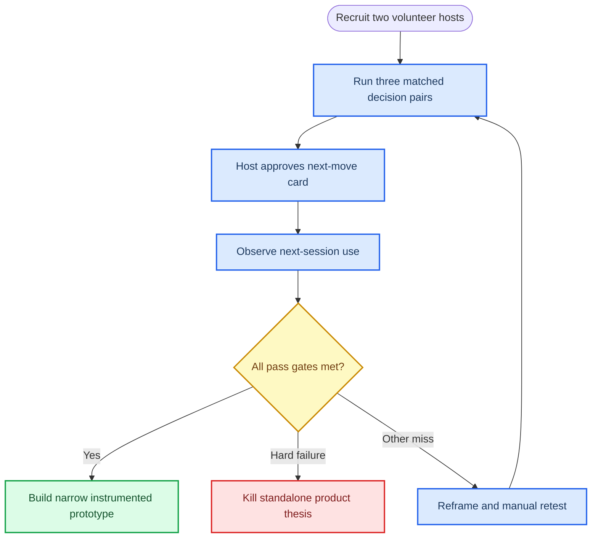

# Concept portfolio: concierge-test priority

_Research synthesis for product discovery: five bounded participation concepts, their independent red-team challenges, and the next concierge decision. Scores and recommendations are hypotheses to test through observed behavior, not market forecasts._

---

## 🧭 Direct conclusion

**Test next: Decision Relay, reframed as a follow-through card for one recurring volunteer-planning workflow.** It has the best **evidence-to-effort ratio**, not a proven path to scale: a low-risk, manual, paired comparison can directly test its only defensible distinction—whether a compact, honest next-move card is used in the following session and reduces total host coordination versus the host’s existing poll/chat/notes routine. The test is cheap enough to run before software and can falsify the concept quickly.

**Runner-up: StewardSignal, reframed as a private verification queue for one accessibility-maintenance partner.** It has the clearest prospective partner consequence, but it requires a steward with real review capacity, safe mission boundaries, and a live form/email baseline; that makes the first experiment operationally heavier. It becomes the lead if a named accessibility partner can commit to the specified closure service level before two suitable recurring volunteer hosts can be recruited.

The ranking changes if the Decision Relay comparison shows no unprompted next-session card use, no reduction in total host minutes, or participant confusion about whether input was advice or a governing decision—especially if StewardSignal beats a partner’s incumbent form/email flow by the predeclared review-cost threshold while producing real closures. Conversely, any high-severity privacy, rights, safety, harassment, or deception incident stops its concept rather than being “fixed” with engagement mechanics. **No concept is guaranteed to become viral, widely adopted, or commercially viable.**

The underlying discipline is deliberately off-chain and non-coercive: use link-first, editable, access-controlled records; keep consequential decisions with responsible humans; and do not use tokens, wallets, financial promises, rankings, streaks, prizes, scarcity, referrals, or autonomous real-world action. The FTC identifies misleading design and privacy steering among the dark-pattern practices that can impair choice.[^1]

## 📦 The five concepts

### 1. Decision Relay — recurring group decision follow-through

| Design element | Concept specification |
| --- | --- |
| **One-sentence hook** | In two minutes, add your view to one live question and leave with the group’s next move—and why. |
| **User and context** | An adult, host-led weekly cohort, club, class, or volunteer team choosing among a few real options and needing a lightweight browser ritual rather than full deliberation software. |
| **Atomic outcome** | A participant knows what their input will influence, submits one bounded choice, and later sees an approved next-move card with result, governing rule, rationale, owner, first action, and check-back date. |
| **First 30 seconds** | Open a link or six-character code; read the consequence statement; choose one of two to five options; optionally select a structured reason; see confirmation and response-count progress. No account, install, wallet, or token. |
| **Core loop** | Host frames one question, options, declared rule, close time, owner, and check-back; participants submit one choice; host closes and approves an editable card; the next real session marks the move done, changed, blocked, or open and launches a new prompt. |
| **Durable value** | An editable, exportable decision history links input, rule, result, minority concern, follow-through, and the next-session prompt. |
| **Voluntary sharing / return** | Participants return for a new real decision or to inspect what happened; hosts reuse the card at the next session. A link is shared only with a needed collaborator or recipient—never for a referral unlock. |
| **Partner wedge** | One recurring host segment, initially volunteer coordinators or cohort facilitators, whose known manual follow-up artifact can be replaced by a one-screen card. |
| **Business hypothesis** | A host or organization may pay for recurring rooms, templates, accessible exports, retention controls, and co-host administration **only after** measured reuse replaces coordination work; participants remain free. |
| **No-chain / chain decision** | **No chain.** Editable, private records and signed off-chain exports better fit correction, deletion, and host governance. Reconsider only after independent partners demonstrate a portability need that a signed export cannot meet. |
| **Closest alternatives** | Loomio already offers discussion, polls/proposals, outcomes, next steps, history, templates, and review dates; Doodle provides familiar link-based group polling; chat, forms, minutes, and calendars have near-zero marginal adoption cost.[^2][^3] |
| **Top risks** | The card becomes a nicer meeting minute; the host remains the framer, interpreter, approver, and coordinator; a plurality may lose without participants understanding the actual authority rule; even structured reasons can create privacy and moderation burden. |
| **Strongest falsifier** | Participants contribute once but neither inspect/use the recap nor see it used in the next real session, while hosts return to their existing workflow. That would show a lightly improved poll, not a recurring decision utility. |

**Red-team narrowing.** The promise must distinguish **binding decision**, **advice**, **consent check**, and **unresolved concern**. A host override is permissible only if the predeclared rule allows it and the card records why; calling advisory input a decision would be false agency. Keep free text and AI grouping out of the first test. A room-code/browser pattern lowers entry friction but does not solve the need for a live host and assembled group, as the host-dependent participation model in Jackbox illustrates.[^4]

### 2. Proofstep Packet — counselor-assisted statement-change review

| Design element | Concept specification |
| --- | --- |
| **One-sentence hook** | Turn one confusing credit-card statement change into a cited explanation, a user-approved clarification draft or deliberate no-action, and a private review receipt. |
| **User and context** | A U.S. consumer reviewing one changed credit-card statement or billing-error notice, with a nonprofit financial counselor as the named human recipient in the narrowed test. |
| **Atomic outcome** | Within five minutes, the user locates the cited source line, chooses or deliberately declines one bounded next step, and receives a receipt explicitly marked **prepared, not submitted**. |
| **First 30 seconds** | Open a browser link, choose start without an account, upload one statement, and see progress for reading, comparison, and source checking. Nothing is sent automatically. |
| **Core loop** | Upload one statement and optionally a prior version; inspect source-linked change, no-change, or insufficient-evidence cards; choose no action, prepare a clarification, prepare a draft, or share a redacted packet; edit/approve every field; retain or delete the receipt. |
| **Durable value** | A portable user review record separates source text, system interpretation, user correction, selected action, recipient handoff, and not-sent status. |
| **Voluntary sharing / return** | A new material statement or unresolved packet creates a legitimate return; a user shares only when a named counselor/helper needs the cited record. |
| **Partner wedge** | One nonprofit financial-counseling program runs a counselor-assisted statement-change review, not a general consumer-finance product. |
| **Business hypothesis** | A partner may pay for privacy controls, redaction, retention, accessibility, and case export only if staff reuse reduces re-created summaries and stays within review cost. No fee is tied to savings, refunds, disputes, approval, or outcomes. |
| **No-chain / chain decision** | **No chain.** Encrypted storage plus signed export is enough; correction, deletion, and revocable sharing are more important than public immutability. |
| **Closest alternatives** | The issuer’s statement and authenticated support/dispute flow are authoritative for account action; FTC billing-error guidance and the CFPB complaint route are established consumer paths; a counselor or a saved statement plus note is a low-tech alternative.[^5][^6][^7] |
| **Top risks** | The layer adds sensitive upload, OCR, redaction, access, deletion, and review risk without changing issuer authority; users can mistake a prepared draft for a filed dispute or legal conclusion; pending, posted, duplicate-looking, or unreadable cases can create false confidence. |
| **Strongest falsifier** | After an accurate source-linked review, users still prefer issuer materials alone and recipients ask for a recreated human summary, showing that the packet is not worth the privacy and operating cost. |

**Red-team narrowing.** Test only: “Is the change clearly explained, or should the user ask the issuer for clarification?” Exclude fraud claims, deadline determinations, payment withholding, cancellation, debt collection, and autonomous submission. Regulation Z and FTC guidance make the issuer-directed billing-error process consequential; a third-party packet must never imply it has been filed or is legally sufficient.[^5][^6]

### 3. Relay Ritual — private, expiring exception handoff

| Design element | Concept specification |
| --- | --- |
| **One-sentence hook** | Make one unusual household change legible and reversible: I can do it, I cannot, or I need another person. |
| **User and context** | A two-to-six-person adult household or care circle handling an exception to an existing routine, such as a changed pickup, meal, pet-care, or renewal plan. The initial test excludes children as users and any claim of official authorization. |
| **Atomic outcome** | Within three minutes, a real exception reaches an explicit, participant-initiated state—accepted, declined, or help requested—with a minimal expiry-bound receipt of the agreed plan. |
| **First 30 seconds** | Open a signed link, read obligation, due window, and done-state; choose **I can do it**, **I cannot**, or **I need another person**; acceptance is required only when ownership is ambiguous. |
| **Core loop** | Frame a bounded exception; offer rather than silently assign; the recipient accepts/revises/declines; close with a proportionate check or confirmation; expire the card after the event and short recovery window. |
| **Durable value** | Only a short, correctable recovery note is retained when a participant says it removed future explanation work; operational details otherwise expire. |
| **Voluntary sharing / return** | Return occurs when another genuine exception arises; sharing occurs only to bring in the person needed to complete the plan. No streak, labor total, or overdue pressure. |
| **Partner wedge** | None in phase one. A school, care, or meal organization may distribute a neutral template later, but must not view identifiable household labor, private notes, or official-looking authorization. |
| **Business hypothesis** | Viable only if a household or partner obtains measured coordination relief that covers secure storage, support, accessibility, and incident response. Longer history is not assumed to be a paid benefit. |
| **No-chain / chain decision** | **No chain.** Household context is sensitive and must be correctable, deletable, and revocable. |
| **Closest alternatives** | Apple Reminders supports shared lists, assignment and reassignment; Todoist supports shared projects, assignees, comments, attachments, and notifications; a recurring reminder plus group chat is often lower friction for exceptions.[^8][^9] |
| **Top risks** | Protocol tax adds a second coordination surface; a durable record becomes a labor-surveillance trail; decline may not be freely chosen under household pressure; link forwarding, notification previews, deletion scope, and power imbalance create safety concerns. |
| **Strongest falsifier** | In a counterbalanced real-use comparison, the minimal card does not reduce total coordination work by at least 25%, increases clarification/missed obligations, or participants fear that decline or history could be used against them. |

**Red-team narrowing.** Do not test a household task manager. Test an **expiring exception card** beside the family’s existing reminders and chat, with no attachments, dashboards, recurring inheritance, partner access, or labor analytics. Privacy controls must cover changing access and clear retention expectations, not just an edit button.[^10]

### 4. CueCard Relay — host-authored practice transfer

| Design element | Concept specification |
| --- | --- |
| **One-sentence hook** | Try a tiny low-risk skill task, state the cue that changed your approach, and give one named peer a comparable attempt. |
| **User and context** | Adults in one recurring, low-risk coding, language, craft, or accessibility-practice group; a coach, educator, or club host supplies the task and recipient group. Minors and risky/medical/fitness tasks are excluded. |
| **Atomic outcome** | Within ten minutes, a performer creates a one-screen practice brief—task, what changed, what to notice, and what to try next—and a recipient can make an unsupervised comparable attempt. |
| **First 30 seconds** | Open a shared link; read task, success condition, time limit, permitted adaptation, and stop note; submit a structured text/still/existing-link cue; no recording, account, wallet, or auto-publication. |
| **Core loop** | Host defines a task; performer supplies one existing evidence item and a falsifiable cue; recipient answers one noticing question and attempts the task; host selects useful cards for the next real session. |
| **Durable value** | A private, correctable micro-lesson gives the performer practice memory, the recipient a specific next attempt, and the host a reusable briefing template. |
| **Voluntary sharing / return** | Return follows a new relevant challenge or an actual recipient retry; sharing is limited to a peer/coach who needs the brief. |
| **Partner wedge** | A recurring adult practice host who can reuse two approved briefs in the next session and measure preparation/feedback minutes. |
| **Business hypothesis** | A host may pay for workflow value only if the brief improves delayed transfer over strong controls while not adding net review work. |
| **No-chain / chain decision** | **No chain.** A private conventional record plus export is sufficient; delete/withdraw/correct needs outweigh immutability. |
| **Closest alternatives** | A raw clip or existing replay plus timestamp and human cue is the primary control; Trackmania demonstrates replay-to-attempt inside its native activity, and Onform offers capture and coaching-media workflows.[^11][^12] |
| **Top risks** | A self-described turning point may be post-hoc rather than causal; the product adds authoring and review steps to a clip-plus-cue workflow; rights, accessibility, storage, and deletion costs can overwhelm the learning benefit. |
| **Strongest falsifier** | In a randomized comparison, clip-plus-timestamp-plus-cue is non-inferior on delayed comparable attempt and needs less host time, or the treatment fails to beat both clip and written-instruction controls by 20 percentage points. |

**Red-team narrowing.** This is not PivotProof’s capture-heavy card platform. It is a manual, non-public **CueCard Relay** experiment using text, a still, or an existing link. WCAG 2.2 makes equivalent non-video access and keyboard-operable flows central constraints, not post-launch polish.[^13]

### 5. StewardSignal — private partner verification queue

| Design element | Concept specification |
| --- | --- |
| **One-sentence hook** | Complete one safe access check, submit only the requested evidence, and see a named steward accept, correct, use, or close it. |
| **User and context** | Adults already near a public place who can safely observe one specified accessibility condition; one campus, park, or accessibility steward owns a bounded geography and one recurring maintenance workflow. |
| **Atomic outcome** | A permissioned receipt records requested task, structured observation, human-reviewed status, concrete partner use or reasoned closure, and contributor-selected credit/privacy setting. |
| **First 30 seconds** | A link names the five-minute mission, steward, safety boundary, evidence fields, privacy, and promised response time; the contributor selects structured answers, may add safe private media, previews sharing, and submits. |
| **Core loop** | Steward publishes a finite mission and evidence contract; contributor chooses a safe task; submits proportional structured evidence; steward labels it; steward records a ticket, correction, recheck, visit-plan change, or reasoned no-action; contributor receives a correction/deletion-capable receipt. |
| **Durable value** | A correction-ready evidence packet and actual outcome record can inform a future visit or the steward’s maintenance plan, but only when a real partner action is attached. |
| **Voluntary sharing / return** | A truthful closure or a new mission generates return; a redacted receipt is shared only when a recipient needs the place information. |
| **Partner wedge** | One named accessibility-maintenance steward running one mission type, one geography, a response-time promise, and a private review queue. |
| **Business hypothesis** | The partner may pay for lower review/clarification cost, controlled intake, and outcome reporting only if the browser flow beats current form/email/spreadsheet work on partner minutes per usable result. |
| **No-chain / chain decision** | **No chain.** Role-controlled, versioned, revocable records fit sensitive place/media data; a chain would not establish current accessibility, consent, or competent review. |
| **Closest alternatives** | Wheelmap and OpenStreetMap already cover public place-access information; eBird shows that review workflows need distinct accepted/unconfirmed states and reviewer operations; the partner’s form/email queue is the true incumbent.[^14][^15][^16] |
| **Top risks** | The receipt is decorative without a maintenance or planning consequence; missions can expose contributors to traffic, trespass, confrontation, sensitive media, or stale observations; status complexity creates an expensive review operation. |
| **Strongest falsifier** | The browser flow is not at least 25% better than the partner’s current form/email route on minutes per usable result, creates more clarification/duplicates, or accepted work is not tied to an actual partner outcome. |

**Red-team narrowing.** Test one private verification queue—not a public map, contributor network, portable credential, or AI-assisted mission platform. Treat **unknown**, **cannot safely assess**, **temporary obstruction**, and **duplicate** as valid results; default to no public sharing and structured observation before media.

## 🛡️ Concise red-team comparison

| Concept | Preserved dissent | What a fair test must prove | Portfolio consequence |
| --- | --- | --- | --- |
| **Decision Relay** | Loomio is a serious end-to-end counterexample, while a poll plus notes may already be sufficient; host authority can make participation merely procedural.[^2] | Compared with the incumbent, a next-move card is used without researcher prompting, lowers total host work, and makes the limits of input legible even when the plurality loses. | Lead only as a narrow follow-through-card test, not a new general decision destination. |
| **Proofstep Packet** | Issuer workflows, FTC guidance, and CFPB escalation already carry authority, deadlines, recipient, and status; a new sensitive translation layer can do harm.[^5][^6][^7] | A counselor-assisted review record is at least as accurate and no slower than incumbent practice, is never mistaken for a filed/legally sufficient action, and is reused without re-creation. | Lowest-priority concierge; do not launch direct-to-consumer. |
| **Relay Ritual** | Reminders plus chat are deeply embedded; a formal acceptance/receipt can create protocol tax, coercion, or a household labor audit trail.[^8][^9] | A minimal exception card reduces total coordination work by at least 25% without more misses or private reports of pressure. | Reframe to a private, expiring exception layer or stop. |
| **CueCard Relay** | A raw clip/replay plus one human cue may deliver the same teaching value with less authoring; capture expands rights and accessibility obligations.[^11][^12] | A structured brief beats both clip-plus-cue and written-instruction controls on delayed independent retry while host effort stays bounded. | Third priority, contingent on a host with a low-risk adult practice group. |
| **StewardSignal** | A map plus form/email/spreadsheet may be simpler; review states do not themselves create impact, and field observation carries safety/media risk.[^14][^15][^16] | One named steward produces prompt, real closures and at least a 25% improvement in partner minutes per usable result against baseline. | Backup lead because the partner outcome is concrete but operating dependence is higher. |

The dissent is not a checklist to paper over. Each counterexample is the control condition or kill criterion. A favorable survey, waitlist, or one-time completion does not answer it.

## 📊 Design-judgment scorecard

**Method.** Each cell shows **raw 0–5 score → weighted points**. Weighted points equal `raw / 5 × weight`; totals are out of 100. These are transparent **design judgments, not measured outcomes**, and they do not override any safety or kill gate.

| Concept | Instant comprehension 15% | Meaningful agency 15% | User value 15% | Voluntary repeat 15% | Voluntary sharing 10% | Partner distribution 10% | Durable economics 10% | Studio buildability 5% | Safety / operational feasibility 5% | **Total / 100** |
| --- | ---: | ---: | ---: | ---: | ---: | ---: | ---: | ---: | ---: | ---: |
| **Decision Relay** | 4 → 12 | 3 → 9 | 3 → 9 | 3 → 9 | 2 → 4 | 3 → 6 | 2 → 4 | 5 → 5 | 4 → 4 | **62** |
| **StewardSignal** | 4 → 12 | 3 → 9 | 3 → 9 | 2 → 6 | 2 → 4 | 4 → 8 | 3 → 6 | 4 → 4 | 3 → 3 | **61** |
| **CueCard Relay** | 4 → 12 | 3 → 9 | 3 → 9 | 2 → 6 | 3 → 6 | 3 → 6 | 2 → 4 | 4 → 4 | 3 → 3 | **59** |
| **Relay Ritual** | 4 → 12 | 2 → 6 | 2 → 6 | 2 → 6 | 2 → 4 | 2 → 4 | 1 → 2 | 4 → 4 | 2 → 2 | **46** |
| **Proofstep Packet** | 3 → 9 | 2 → 6 | 2 → 6 | 2 → 6 | 2 → 4 | 2 → 4 | 2 → 4 | 3 → 3 | 1 → 1 | **43** |

**Interpretation.** Decision Relay’s lead is narrow: its high buildability and tractable safety surface offset only modest scores for agency, sharing, economics, and partner distribution. StewardSignal nearly ties on design judgment because a named partner can create a concrete state change, but its safety and reviewer-capacity dependencies demand more setup. Proofstep’s low feasibility score is a consequence of financial sensitivity and false-confidence risk, not a claim that consumers’ underlying problem is unimportant.

## 🧪 Ranking and the one lead concierge experiment

| Rank | Concept to test | Decision now | Why this order is about evidence-to-effort |
| ---: | --- | --- | --- |
| **1** | **Decision Relay — follow-through card** | **Run the lead concierge experiment.** | Six low-risk, manually produced sessions can test a direct behavioral contrast with current poll/chat/notes, including a plurality-loss case, without document upload, household power dynamics, public media, or a specialist review operation. A failure is highly diagnostic. |
| **2** | **StewardSignal — private verification queue** | **Backup only.** | The evidence target is concrete—partner action and review cost—but requires a named steward, safe local missions, closure capacity, and an incumbent baseline. Activate only if that partner is already committed and the Decision Relay recruiting condition is not met. |
| **3** | **CueCard Relay** | Hold for a controlled host-led learning test. | It needs randomized controls, delayed independent attempts, and careful non-video accessibility; it is still operationally lighter than a capture platform. |
| **4** | **Relay Ritual** | Do not advance beyond a tightly scoped exception comparison. | Embedded alternatives and coercion/surveillance risks mean a demonstrable 25% coordination reduction is a prerequisite, not a nice-to-have. |
| **5** | **Proofstep Packet** | Do not advance now. | Financial-document safety, authority confusion, and incumbent issuer workflows raise the cost of a fair test far above its present evidence. |

**Chosen lead concierge experiment: Decision Relay only.** The test does **not** blend it with StewardSignal, CueCard Relay, a household handoff, or a financial packet. Its task is not to prove product-market fit or scale; it is to decide whether the proposed retained artifact earns one more real use than an existing workflow.

**Chosen backup concierge experiment: StewardSignal only.** Activate it only if the named accessibility steward commits to the specified baseline comparison, response-time promise, and closure capacity before lead recruitment begins; do not run it in parallel with the lead.

## 🔬 Lead concierge experiment: Decision Relay follow-through card

### Exact population and partner

- **Partner:** one community-garden nonprofit that already runs two separate adult volunteer teams and agrees that each coordinator remains the sole operational decision-maker.
- **Hosts:** **two independent coordinators**, each responsible for a separate recurring team.
- **Participants:** **8–12 adults per team** (target 20–24 total), already scheduled for two planning huddles per week. Exclude minors and topics involving employment, benefits, discipline, health, identity, allegations, or safety-critical work.
- **Narrow decision type:** selection among two or three pre-vetted, low-risk next-session work blocks or shared-tool allocations. Each decision must have a named owner and an observable seven-day outcome.
- **Comparison unit:** **three matched pairs** of real planning decisions across the two teams over 14 calendar days. In every pair, one comparable decision uses the host’s normal poll/chat/notes routine and one uses the Decision Relay concierge card. Counterbalance the order across hosts where scheduling permits.

### Concierge artifact

The facilitator creates a single **one-page next-move card**—a plain link/PDF after the host approves it—with exactly these fields:

1. question and two-to-three options;
2. consequence statement and governing rule shown before response;
3. response window and participant count;
4. result labeled as **binding selection**, **advisory input**, or **deferred**;
5. any host override with a one-sentence reason;
6. one structured minority concern, if present;
7. owner, first action, check-back date, and status;
8. audience, correction, deletion, and escalation contact.

The first pass uses one-choice input plus a **structured reason code** (`availability`, `tools`, `impact`, `other concern`, `prefer not to say`) and no free text. The facilitator manually calculates results and formats the card; no software, AI grouping, public feed, integration, identity graph, or autonomous notification is involved.

### Facilitator script

The facilitator reads this verbatim before each Relay condition; they do not explain it again after a participant starts:

> “You are being asked to choose one option for **[question]**. Your response is **[binding selection / advice to the coordinator / consent check]** under this rule: **[rule]**. By **[close time]**, you will be able to see the result, whether the coordinator used the input or chose differently, who owns the first action, and the check-back date. You may choose ‘prefer not to say’ as a reason, stop before submitting, or ask for deletion of your response. This is a research comparison of the planning format, not an evaluation of you.”

At close, the facilitator says only: “The coordinator has approved this card. It will be sent through the team’s normal channel.” The host—not the facilitator—records any override, selects the owner, and opens the card at the next huddle. The facilitator sends no reminder to inspect, reuse, or repeat.

### Event log and measurement plan

| Event / measure | Definition and capture | Why it matters |
| --- | --- | --- |
| `pre_submit_comprehension` | Before submission, participant writes or selects the consequence and governing rule; score unaided correct/incorrect. | Tests instant comprehension and honest agency. |
| `response_state` | Opened, started, submitted, abandoned, corrected, deleted; timestamp and non-identifying participant code. | Measures completion and friction without collecting unnecessary identity data. |
| `rule_outcome` | Predeclared rule, plurality/selection, host action, override flag, override rationale. | Detects false agency when a result is reframed after input. |
| `state_change_7d` | Within seven days: action occurred, owner accepted, decision deferred with reason, or no change; host supplies evidence link/note. | Separates a real consequence from decorative acknowledgement. |
| `recap_inspection` | Card opened through normal-channel link, plus five-field recall at the next huddle: result, rationale, owner, first action, check-back date. | Tests whether the durable artifact is actually used. |
| `next_session_use` | Host opens the prior card without researcher prompt and marks done/changed/blocked/open before the next decision. | Primary proof that the product is more than a poll. |
| `host_minutes` | Setup, response monitoring, moderation, card approval, correction, follow-up, and check-back minutes in both conditions. | Tests the economic/workflow hypothesis against the incumbent. |
| `participant_agency_check` | Private post-session item: distinguish group result, host decision, advice, and unresolved concern; record a report of implied influence. | Catches procedural legitimacy without actual influence. |
| `second_relevant_use_14d` | Participant voluntarily joins a second real planning decision after one neutral invitation through the ordinary channel. | Tests voluntary repeat, not a curiosity click. |
| `incident_log` | Privacy, harassment, rights, accessibility, correction/deletion, unsafe prompt, or deception concern; severity and resolution owner. | Enforces the operational gate. |

### Privacy, consent, and operations

- Obtain written host agreement and participant research consent before the first session; participation in the actual volunteer planning process remains available through the team’s normal method if a person declines research data collection.
- Use a random participant code and the minimum contact information necessary for the one follow-up invitation; do not collect demographics, exact availability, health, household, or employment data.
- Show audience and rule before response. Use structured reason codes only; do not permit free text, anonymous comments, AI grouping, or public sharing.
- Permit correction or deletion requests via the named facilitator within 24 hours; remove the contribution from the research copy and card where feasible, while retaining a non-identifying audit marker that a concern was raised only if needed to preserve the decision record.
- Restrict raw logs to the research facilitator and designated project lead; encrypt storage; delete direct identifiers and raw response records within 30 days of the final check-back, retaining only aggregated findings thereafter.
- Pause immediately for any unresolved high-severity privacy, rights, safety, harassment, accessibility, or deception incident. The host keeps responsibility for the actual volunteer decision; the experiment never assigns people or directs off-platform action.

### Pass threshold, kill threshold, and cap

**Pass only if all conditions are met in this one narrow segment:**

1. At least **8 of 10** participants state the consequence and governing rule unaided before submitting.
2. At least **6 of 10** completed inputs yield a documented, predeclared state change or responsible host action within seven days.
3. At least **40%** of first-time participants make a second **real planning** use within 14 days after one neutral invitation.
4. **Both hosts** use the card in their following planning huddle without facilitator prompting and request another run.
5. The Relay condition reduces median **total host minutes per decision by at least 20%** against its matched incumbent condition, with no added moderation/correction burden.
6. No unresolved high-severity incident occurs, correction/deletion is demonstrable, and no prohibited crutch is needed.

**Kill immediately** if any high-severity incident is unresolved; participants cannot distinguish advice from a governing decision; either host fails to use the card unprompted in the next huddle; or the Relay condition adds total host work without a concrete next-session use. **Reframe rather than build** if a numerical pass condition misses without a hard-stop incident; do not add ranks, prizes, scarcity, streaks, referrals, tokens, wallets, chain anchoring, or autonomous action to chase the metric.

**Cost and time cap:** run for **14 calendar days**, at most **six real decisions**, **24 facilitator/analyst hours**, and **US$1,200 all-in**. There is no participant payment, referral incentive, prize, or repeat-use reward; normal volunteer expenses, if any, are not tied to research behavior.

### What changes after the result

| Result | Decision |
| --- | --- |
| **Pass every gate** | Authorize only the narrow Studio prototype below; retain volunteer planning as the initial use case and measure the same event log. |
| **Card used but no time saving** | Reframe as a host-owned template/service artifact; do not build a standalone room or assume SaaS economics. |
| **Comprehension or agency fails** | Rewrite the participant promise and decision labels once in a manual retest; if it still fails, kill the concept. |
| **No unprompted card reuse or second real use** | Kill the standalone product thesis; preserve the best card format as documentation only. |
| **Safety/rights incident or reliance on prohibited crutch** | Stop immediately; do not proceed to software. |

## 🧱 First Studio prototype scope — only after a concierge pass

**Condition precedent:** Build this scope **only** if the lead concierge clears every pass gate above. A pass authorizes an instrumented narrow prototype, not a launch, market validation, or evidence of long-term retention.

### Build

In two to four weeks, build one mobile-web flow for the same adult volunteer-planning use case:

- host room creation with question, two-to-three options, explicit input label, rule, close time, owner, first action, and check-back date;
- link/code participant entry with pre-submit consequence/rule check, one choice, and structured reason code;
- response count and deterministic rule-aware result;
- host close, explicit override reason when applicable, edit/approve next-move card, and status check-back;
- same participant/host event instrumentation as the concierge, plus Markdown/PDF card and CSV aggregate-log export;
- keyboard-complete flow, focus visibility, semantic labels, contrast, reduced motion, and screen-reader submission/result states.

### Keep mocked

- Card assembly and any wording assistance remain facilitator/host-authored; **no AI summarization or reason grouping**.
- Participant identity remains a display name or random code; host recruitment, consent, deletion triage, and escalation remain human-operated.
- Partner distribution is a manual invitation through the volunteer organization’s existing channel; no integration or administrator console.

### Do not build

Do **not** build chat, comments, free-text reasons, anonymous discussion, public feeds, profiles, social graph, general deliberation, scheduling, calendar integration, notifications, payments, ads, analytics dashboards, badges, leaderboards, referrals, wallet/token/chain features, or autonomous assignments/actions. These surfaces do not answer the lead hypothesis and would obscure it with avoidable moderation, privacy, or retention mechanics.

## 🔀 Concierge-to-build funnel

## 🔗 References

[^1]: Federal Trade Commission. “FTC report shows rise in sophisticated dark patterns designed to trick and trap consumers.” https://www.ftc.gov/news-events/news/press-releases/2022/09/ftc-report-shows-rise-sophisticated-dark-patterns-designed-trick-trap-consumers

[^2]: Loomio. “Important decisions need a place of their own.” https://www.loomio.com/

[^3]: Doodle. “Group scheduling and time coordination.” https://doodle.com/en/

[^4]: Jackbox Games Support. “How do I get started playing Jackbox Games?” https://support.jackboxgames.com/hc/en-us/articles/15794771245975-How-do-I-get-started-playing-Jackbox-Games

[^5]: Consumer Financial Protection Bureau. “§ 1026.13 Billing error resolution.” https://www.consumerfinance.gov/rules-policy/regulations/1026/13

[^6]: Federal Trade Commission. “Using credit cards and disputing charges.” https://consumer.ftc.gov/articles/using-credit-cards-and-disputing-charges

[^7]: Consumer Financial Protection Bureau. “Submit a complaint about a financial product or service.” https://www.consumerfinance.gov/complaint/

[^8]: Apple Support. “Share and assign reminders on your iPhone or iPad.” https://support.apple.com/en-us/105124

[^9]: Todoist Help. “Collaborate with friends or family in Todoist.” https://www.todoist.com/help/todoist/features/collaborate-with-friends-or-family-in-todoist-tzkGUy

[^10]: Apple. “Privacy control.” https://www.apple.com/privacy/control/

[^11]: Trackmania Documentation. “Watch replays.” https://doc.trackmania.com/play/watch-replays/

[^12]: Onform. “The ultimate mobile video coaching platform.” https://onform.com/

[^13]: W3C. “Web Content Accessibility Guidelines (WCAG) 2.2.” https://www.w3.org/TR/WCAG22/

[^14]: Wheelmap. “Find wheelchair accessible places.” https://wheelmap.org/

[^15]: OpenStreetMap Wiki. “Key:wheelchair.” https://wiki.openstreetmap.org/wiki/Key:wheelchair

[^16]: eBird Support. “The eBird review process.” https://support.ebird.org/en/support/solutions/articles/48000795278-the-ebird-review-process

## 🧭 Three founder decisions required before recruitment

1. **Commit to the narrow lead population:** approve adult community-garden volunteer planning only, including the exclusion list and the rule that the host—not the product—makes operational decisions.
2. **Commit to a real test posture:** approve the paired incumbent comparison, the 14-day / US$1,200 cap, no participant incentives, and the rule that an unprompted non-reuse result kills the standalone thesis.
3. **Commit to the safety boundary:** approve structured reasons only, no AI/free text/public sharing, the stated correction/deletion retention plan, and immediate stop authority for the named project lead.
