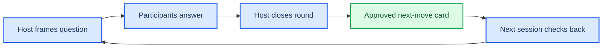

# Decision Relay: the next-move card for recurring groups

_Concept design for the “Recurring group decision moments” territory; grounded in the supplied opportunity map and current adjacent-product research._

---

## 📋 Product definition

**Decision Relay** is a browser-first, host-led ritual for recurring groups: each person answers one bounded prompt, the host closes the input into a visible next-move card, and the next session begins by checking what happened.

> **One-sentence hook:** “In two minutes, add your view to one live question and leave with the group’s next move—and why.”

The first wedge is a weekly cohort, club, class, or volunteer team that already meets and repeatedly chooses among a small set of options. It is not a public forum, generic chat room, or replacement for formal governance. The host defines the question, options, decision rule, deadline, and responsible owner; participants provide a bounded input and can add one short, optional reason.

The product deliberately combines the opportunity map’s friction-light entry, short participation kernel, inspectable decision record, and reusable next-session prompt. Existing products establish that decision records and reasoning matter: Loomio positions discussion, voting, outcomes, and reasoning as a searchable path from question to result, while also supporting configurable rules, quorum, anonymous voting, and exports.[^1][^2] Decision Relay is narrower: it optimizes for a **short recurring moment with a visible follow-through**, not a full deliberation suite.

### The atomic outcome

A participant can state, before submitting, **what their input is expected to influence**; after the host closes the round, they can see the selected next move, the decision rule, the reason summary, the owner, and the check-back date. A host gets a concise, editable recap that can be opened at the next meeting.

### Why this is a distinct concept

Close alternatives solve adjacent jobs:

| Alternative | What it does well | Gap Decision Relay tests |
| --- | --- | --- |
| Loomio | Full discussions, configurable polls, outcomes, reasoning, and exportable records[^1][^2] | More setup and deliberation than a recurring 2–5 minute checkpoint needs; no intentionally small “close → check back” ritual as the core unit |
| Doodle | Group polls for finding a suitable time and calendar coordination[^3] | Optimizes scheduling, not a substantive group choice with rationale and follow-through |
| Chat, email, or meeting minutes | Familiar, low procurement friction | Inputs fragment; the decision and its rationale become hard to retrieve or compare in the next session |
| Poll forms | Fast collection of answers | Usually stop at aggregation; the host still has to explain the decision and carry the result forward |
| In-meeting show of hands | Immediate and social | Weak durable record, poor asynchronous access, and little visibility into what changed afterward |

This is a hypothesis, not a claim of no competition or guaranteed adoption.

## 🔄 Core loop

1. **Host frames one bounded question.** The host chooses 2–5 options, a decision rule (majority, consent check, ranked choice, or host decides after input), a close time, and the next-move fields: owner, first action, and check-back date.
2. **Participant enters by link or short code.** No wallet, token, app install, or account is required for the first response. The opening screen states: “Your answer will help choose ___; the host will publish ___ by ___.”
3. **Participant makes one choice.** They select one option and optionally add a 240-character reason or concern. They may choose “prefer not to say” where the host allows it. The UI shows whether responses are named or anonymous before submission.
4. **The group sees bounded progress.** During the open window, participants see response count and the host’s declared close rule—not a global rank, streak, prize, or pressure timer. If the host enables it, participants see option-level counts only after submitting.
5. **Host closes and approves the recap.** The system drafts a recap from the selected option, reasons, and host-entered context. If AI clusters reasons, it shows the source snippets and cluster labels; the host must edit or approve them. No AI sends messages, assigns consequential work, or finalizes the decision.
6. **The next-move card becomes the artifact.** It contains the question, participation window, result, decision rule, selected move, minority concerns, owner, first action, check-back date, and an edit history. The host can mark the result “decided,” “deferred,” or “needs another round.”
7. **Next session starts with a check-back.** The host opens the card, marks the move as done, changed, blocked, or still open, adds one sentence of evidence, and launches the next bounded question. Participants can see what their prior input changed without being shamed for non-participation.

## 🎯 Voluntary return and durable value

A user returns voluntarily because the product answers a practical question they already have: **“Did our input change anything, and what happened next?”** The return trigger is a new real group decision or a check-back on a prior card, not a streak, scarcity notice, reward, or fear of losing status. A participant may also return to inspect an exportable history of decisions that affect their cohort, but the primary value is the next live moment.

The durable artifact is a **decision history** that remains useful after the session:

- a plain-language record of the question, options, rule, result, and unresolved concerns
- a visible chain from input to selected next move to check-back state
- a reusable prompt template for the next session
- an export to Markdown, PDF, or CSV controlled by the host
- participant-level visibility governed by the host’s privacy setting, with deletion/correction requests

The artifact matters to the host because it reduces repeated explanation and makes the next meeting start from the last known state. It matters to participants because it makes agency legible even when their preferred option loses. The product must show “your input was counted; the group chose X under rule Y; concern Z remains open,” rather than pretending every input wins.

## 🤝 Recipient and partner wedge

The initial paying or sponsoring partner is the **recurring host**: a cohort facilitator, educator, club organizer, community operator, or volunteer coordinator. Their job-to-be-done is not “collect opinions”; it is “close a small decision and carry the consequence into the next gathering without reconstructing context from chat.”

The recipient uses the artifact because it is operationally shaped:

- **Before the session:** copy a previous prompt template and edit one question
- **During the session:** observe response completion without exposing unnecessary identity data
- **At close:** approve a one-screen recap with owner and date
- **At the next session:** mark the prior move’s state and launch the next prompt
- **Afterward:** export a decision log for minutes, a coordinator handoff, or a cohort archive

The host remains the responsible decision-maker. Decision Relay may summarize, but it does not decide, notify external systems, assign a person without approval, or publish outside the invited group. A partner wedge is plausible because existing decision products already emphasize configurable participation, outcomes, reminders, privacy, and exports; the test is whether a deliberately smaller, recurring workflow earns reuse rather than merely duplicating a poll tool.[^2]

## 💰 Economic hypothesis and agency safeguards

**Economic hypothesis:** hosts or organizations will pay a bounded subscription for recurring rooms, templates, decision-history retention, exports, accessibility support, and admin controls when the artifact demonstrably replaces follow-up coordination or repeated meeting time. A free room can support learning; paid value begins with multiple recurring rooms, retention policy, co-hosts, and export formats—not with participant fees or paid chance.

Value capture does not compromise agency:

- participants join free and without a wallet or financial commitment
- no ads or behavioral sale are required in the core prototype
- the host chooses the audience, privacy mode, and decision rule in plain language
- AI is optional, source-linked, editable, and human-approved; deterministic aggregation is the default
- every card has correction, deletion, and “reopen decision” controls
- no public leaderboard, forced referral, streak loss, prize, token, mining, rank anxiety, or artificial deadline pressure

**Chain decision: no chain.** A conventional database with editable, exportable, access-controlled records is sufficient. Public immutability would conflict with correction and deletion needs and would not prove that a group decision was fair or that a host acted on it. Only a demonstrated, multi-partner portability requirement could reopen this decision, and then a signed off-chain export should be tested first.

## ⚙️ Minimum Studio prototype (two to four weeks)

Build one narrow, instrumented web flow for a weekly cohort:

- host creates a room with question, 2–5 options, decision rule, close time, visibility, owner, and check-back date
- participant opens a share link or six-character code, reads the expected consequence, submits one choice, and optionally adds a short reason
- live results show response count and option counts according to the host’s rule
- host closes the round and edits/approves a next-move card
- participant and host can reopen the card and see result, rationale snippets, owner, date, and status
- next-session check-back changes status to done, changed, blocked, or open and launches a new prompt from the prior template
- export one card as Markdown/PDF and the room log as CSV
- accessibility baseline: keyboard-complete flow, visible focus, semantic labels, contrast, reduced-motion option, mobile browser layout, and screen-reader announcement of submission state
- instrumentation: comprehension prompt before submit, completion rate, time to submit, result-view rate, card approval time, check-back completion, second-use within 14 days, and host reuse

Avoid building chat, a social feed, integrations, identity graphs, autonomous notifications, or general-purpose AI. If clustering is included, constrain it to host-approved reason snippets and display “AI-suggested label” alongside the source text and edit history.

## 🔍 Critical assumptions and tests

1. **The bounded consequence is understandable.** Test: before submitting, 8 of 10 participants can accurately state what their answer will influence without facilitator correction.
2. **A short reason improves the host’s next move without creating moderation burden.** Test: compare option-only versus option-plus-reason in three real sessions; record whether the host changes or clarifies the move using a reason.
3. **A losing minority still sees the record as legitimate.** Test a contested decision; ask preferred-option losers to identify the rule, result, unresolved concern, and next check-back, and document every “performative input” report.
4. **The next-move card is used, not merely viewed.** Test: two hosts bring the card into their next recurring session and mark a real status change.
5. **The next session creates voluntary return.** Test: at least 40% of first-time participants choose a second relevant use within 14 days after one neutral invitation, with no incentive or repeated reminders.
6. **Hosts reuse the format.** Test: two independent hosts request another run after using the recap in their next workflow.
7. **Privacy and identity modes are acceptable.** Test named, anonymous, and host-only reason visibility; no unresolved high-severity privacy or rights incident is allowed.
8. **The product is meaningfully different from a poll.** Test whether hosts describe the retained card and check-back as the reason to reuse, rather than only the initial vote.

## 🧪 Concierge test and prototype gate

Run three manually facilitated sessions before building beyond the thin flow. Use real recurring groups, not hypothetical interviews:

- Session 1: a low-stakes choice with clear options and a scheduled check-back
- Session 2: a choice where the host selects an option that is not the plurality preference
- Session 3: a choice with a meaningful minority concern and a deferred outcome

The facilitator manually creates the recap, reads the decision rule aloud, and returns the card at the next gathering. Capture participant comprehension, perceived agency, whether the host uses the card, whether the next move changed, and the manual effort per result.

Authorize the Studio prototype only if the territory gate is met in the same narrow use case: 8/10 comprehension; 6/10 actions producing a visible state change; 40% voluntary second use within 14 days; two independent hosts using the artifact and requesting another run; no unresolved high-severity privacy, rights, safety, or deception incident; and no prohibited engagement crutch. This operationalizes the opportunity map’s stated prototype gate rather than treating enthusiasm, survey intent, or a waitlist as evidence.

### Strongest falsifier and kill criteria

**Strongest falsifier:** participants contribute once but do not inspect or use the recap, and hosts do not bring it into the next real session. That would show the product is only a lightly improved poll, not a recurring decision utility.

Kill or reframe if any of the following occurs:

- participants cannot explain the consequence before submitting
- hosts override the declared rule without recording why, making the result feel performative
- the card does not change a next-session agenda, owner, or status
- a second use requires repeated reminders, rewards, status pressure, or forced invites
- reason capture creates harassment, sensitive-data exposure, or moderation cost beyond the predeclared budget
- hosts prefer existing chat, forms, or Loomio after seeing the card because the additional workflow is not worth it

## 🔗 References

[^1]: Loomio. “Important decisions need a place of their own.” https://www.loomio.com/

[^2]: Loomio. “See a decision take shape.” https://www.loomio.com/how-it-works/

[^3]: Doodle. “Group scheduling and time coordination.” https://doodle.com/en/

[^4]: Jackbox Games Support. “How do I get started playing Jackbox Games?” https://support.jackboxgames.com/hc/en-us/articles/15794771245975-How-do-I-get-started-playing-Jackbox-Games

[^5]: Kahoot. “Higher education integrations.” https://kahoot.com/higher-ed-integrations/

[^6]: Federal Trade Commission. “FTC report shows rise in sophisticated dark patterns designed to trick and trap consumers.” https://www.ftc.gov/news-events/news/press-releases/2022/09/ftc-report-shows-rise-sophisticated-dark-patterns-designed-trick-trap-consumers
