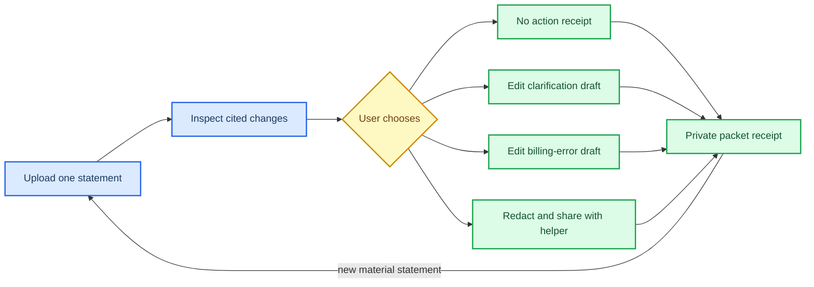

# Proofstep Packet

*Context: an evidence-to-action packet helps a person understand one material change, choose a safe bounded next step, and leave with a receipt without surrendering control. This concept narrows the first test to U.S. credit-card statement changes and billing-error notices, not financial advice or autonomous dispute handling.*

---

## Product in one sentence

**Proofstep Packet turns one confusing credit-card statement change into a cited explanation, a user-approved next-step draft or deliberate “no action,” and a private receipt that the user can keep or share with a human helper.**

The product is browser-first: a user opens a link, uploads one statement or notice and, optionally, the prior statement. The first version does not connect to a bank, send a message, dispute a charge, make a payment, or promise savings. It is a decision-support and record-making layer around a user-owned document.

## Target user and context

The initial user is a U.S. consumer who receives a statement with a changed amount, unfamiliar charge, missing credit, fee, or payment posting and wants to know whether there is a concrete next step. A secondary user is a nonprofit financial counselor or credit-union member-support worker who needs a compact, reviewable packet rather than a long email thread.

The narrow wedge is intentionally compatible with existing consumer protections. FTC guidance says consumers can dispute certain credit-card billing errors, should write to the billing-inquiries address, include identifying details and a description of the error, keep copies, and may request a return receipt.[^1] Regulation Z specifies that a qualifying billing-error notice must identify the consumer and account, describe the believed error as far as possible, and meet timing and resolution requirements.[^2] Proofstep does not determine whether a legal right applies; it shows the relevant source line and routes the user to the issuer’s official instructions.

## Atomic outcome

Within five minutes, the user can answer three questions from the packet:

1. **What changed?** One or more statement lines are highlighted against the prior statement or the user’s stated baseline.
2. **Why do I think that?** Each finding links to the exact page, line, or crop in the uploaded source; “not found,” “ambiguous,” and “no material change” are valid outcomes.
3. **What is one safe next step?** The user chooses one bounded option: save as no action, prepare a clarification request, prepare a billing-error draft, or share a redacted packet with a named helper. The user edits and approves any draft before export.

The completion receipt records the source files, extracted finding, confidence label, selected option, user edits, timestamp, and whether anything was sent. It explicitly says **prepared, not submitted** unless the user exports it themselves.

## First 30 seconds

The landing page says: **“Upload one statement. See the exact line that changed. Decide what you want to do—nothing is sent for you.”**

The user chooses **Start without an account**, sees a three-item privacy promise (local session by default, redact before sharing, delete when finished), uploads a PDF or image, and is shown a progress state with the actual work: “Reading page 2,” “Comparing dates and amounts,” and “Checking that every finding has a source location.” If the file is unreadable or unsupported, the product stops and asks for a clearer page rather than inventing a result.

## Core loop

The loop is not “check every day.” It reopens when a new statement creates a material change or when the user deliberately revisits an unresolved packet. A no-change result is a successful outcome, not a failed engagement event.

## What the packet contains

- **Change card:** old value, new value, date, and the source location for each detected change.
- **Reason card:** document text or image crop, extraction confidence, comparison basis, and a plain-language explanation that distinguishes “shown,” “inferred,” and “unknown.”
- **Action card:** exactly one selected next step, with an adjacent “No action” path and the official issuer contact or billing-inquiries address taken from the source where available.
- **Draft card:** a user-editable clarification or dispute draft containing only approved fields. It never claims that an error, refund, eligibility, or savings has been established.
- **Receipt card:** immutable-in-session event history for upload, finding, edit, export, share, deletion, and “not sent.” The user can download a PDF/JSON copy or delete the workspace.
- **Human handoff:** optional redaction preview and a named recipient field. Sharing is off by default and requires a second confirmation.

AI may assist with OCR, line matching, and a draft explanation, but its material work is visible as highlighted source spans, confidence labels, and a “show how this was found” panel. The user can correct, reject, or replace every generated field. This follows the product implication of NIST’s AI Risk Management Framework: risk management should improve trustworthiness considerations in AI design, development, use, and evaluation.[^3]

## Why a user returns voluntarily

A user returns because a **new statement is a new evidence event**, not because the product threatens a streak or rewards a visit. The durable memory is the prior decision and receipt: what was seen, what was deliberately declined, what was prepared, and what remains unresolved. When the next statement arrives, the user can compare it against that context in seconds instead of reconstructing the history.

The product should send, at most, a neutral user-configured reminder such as “A packet is waiting for your review.” It must not use countdowns, shame, preselected sharing, or “you are losing progress” language. The FTC identifies disguised ads, buried terms, difficult cancellation, and privacy-steering as examples of dark patterns that can impair consumer choice.[^4]

## Why a recipient or partner uses the artifact

A counselor or support worker receives a one-page, source-linked packet instead of an unstructured screenshot and a narrative that must be retyped. The recipient can see the user’s selected question, the exact statement evidence, what the user has already approved, and what remains unknown. A recipient can then answer, correct, or escalate without taking control of the account.

The first partner wedge is a nonprofit financial-counseling program or credit-union support desk that already helps members understand statements. The partner launches a branded link and sets a redaction policy; it does not receive raw documents by default. A second wedge is an employer or library financial-wellness program that wants a bounded self-service handoff but should not receive account details unless the user explicitly shares them.

The artifact is useful because the user’s action is legible to the recipient: **observed**, **user-selected**, **prepared**, **shared**, or **not sent**. The CFPB complaint workflow demonstrates why status and recipient response matter: submitted complaints are routed to companies for response, and the CFPB says most companies respond within 15 days.[^5] Proofstep can borrow the expectation of a visible status trail without pretending to be a regulator or submitting anything to one.

## Close alternatives and the gap

- **Raw issuer statements and alerts:** authoritative but optimized to present the account’s record, not to compare a change, explain its source, and preserve a human-approved decision history.
- **Issuer dispute forms and phone support:** the proper channel for an actual dispute, but they begin after the consumer has already interpreted the document and assembled the facts.
- **General budgeting apps:** useful for account history and categorization, but often require account connections and are not designed around one source-cited notice or a recipient-ready handoff.
- **Consumer complaint portals:** useful escalation routes when a company does not resolve an issue, but they are not a first-pass interpretation or private evidence packet.[^5]
- **OCR, document Q&A, and generic AI chat:** can extract text or answer questions, but a blank prompt does not impose a completion test, provenance boundary, no-action state, or approval receipt.
- **Human counselors and spreadsheets:** often provide the best judgment and accountability, but packet preparation is repetitive and hard to hand back to the consumer in a portable, corrected form.

The gap to test is therefore not “better alerts.” It is **a small, inspectable bridge from statement evidence to a user-owned, recipient-usable decision record**.

## Value capture without compromising agency

The business model is partner-funded workflow software, not a fee on a consumer’s outcome. A counseling organization or credit-union support operation pays for private workspace administration, configurable redaction, retention controls, case export, accessibility support, and aggregate operational reporting that excludes document content by default. A free direct-use path remains available for a single packet during the test.

The product must not sell document contents, rank users by financial distress, or monetize a “successful dispute.” Partners pay for reduced staff rework and better handoffs, while the user retains the decision, the source document, the draft, and the choice to share. Any future paid consumer tier would need to offer storage or accessibility value rather than promise savings, approval, refunds, or improved credit outcomes.

## Chain decision

**No chain.** The packet needs correction, deletion, privacy, and revocable sharing. A normal encrypted database plus a signed export is safer and faster for the first test. A public ledger is not uniquely necessary: it would not establish that the source is true, that the interpretation is legally correct, or that a recipient accepts the packet. Revisit only if multiple independent partners explicitly require interoperable verification of a non-sensitive receipt and the same claim can be made revocable and privacy-preserving off-chain first.

## What must be true for the design to win

- Users can locate the cited source line and explain the change without staff translating it.
- The product frequently says **no material change**, **insufficient evidence**, or **ask a human** when those are the honest outcomes.
- The chosen next step is narrow enough to be safe: inspect, save, clarify, prepare, or share—not send, pay, cancel, or dispute autonomously.
- A recipient can act on the packet without requesting the same evidence again.
- Users trust the receipt enough to keep it, correct it, or bring it to a human helper.
- Privacy, deletion, correction, accessibility, and redaction work in the first release rather than as policy text.
- Extraction and review costs stay below the partner’s value of reduced rework.

## What would kill it

The concept should be killed or reframed if users prefer the issuer’s raw statement or existing alert after seeing a correct packet; if false positives or missed changes make the source-linked explanation untrustworthy; if recipients still ask users to resend everything; if users interpret a prepared draft as a legal finding or completed dispute; if handling sensitive statements creates an unacceptable privacy or security burden; or if repeat use requires reminders, fear, rewards, or financial promises.

## Minimum Manus Studio prototype (two to four weeks)

**Week 1 — constrained evidence surface.** Build a browser flow for PDF/image upload, session-only storage, page previews, manual fixture documents, OCR/extraction display, source-span highlighting, and a clear unsupported/unreadable state. Use a fixed test corpus of synthetic statements with known changes, no-change cases, stale dates, duplicate charges, ambiguous labels, and misleading layout.

**Week 2 — packet and approval loop.** Add the change card, confidence labels, “no action,” clarification draft, billing-error draft, redaction preview, edit/reject controls, and receipt export. The draft renderer must show “prepared, not submitted” and must not contain a submit button.

**Week 3 — partner handoff and instrumentation.** Add a recipient view reachable only by an explicit share link, packet status states, deletion, correction, accessibility checks, and event instrumentation for upload success, cited-line inspection, action selection, deliberate no-action, edits, export, share, and deletion.

**Week 4 — concierge-backed pilot.** Run the prototype with 10 people using one real or consented document each, with a counselor available for escalation. Keep humans behind the scenes for extraction review and safety triage; do not hide corrections. Test mobile browser use, screen-reader labels, keyboard navigation, redaction, and whether users understand that nothing was sent.

## Concierge test

Designer B’s required test is 10 guided sessions on one real document or account-change packet. Success requires at least **7 of 10** participants to locate the cited source line and complete or deliberately decline one bounded next step without staff acting for them, matching the opportunity map’s gate. The facilitator records time to first correct explanation, source-line location, action choice, corrections, confidence calibration, and whether the receipt is kept or shared.

The red-team pass seeds stale documents, ambiguous labels, a no-change statement, a duplicate-looking but valid charge, an unreadable scan, and a case where the safest result is “ask the issuer or counselor.” It must verify that the packet does not overstate confidence, eligibility, savings, legal rights, or completion. Any high-severity privacy, rights, safety, or deception incident stops the pilot.

## Prototype gate

Advance only if the same narrow use case meets all of these conditions:

- 8 of 10 participants complete the core action without facilitator correction and state the expected consequence beforehand.
- 7 of 10 locate the cited source line and complete or deliberately decline a bounded next step.
- At least 6 of 10 produce a genuine state change in the packet: corrected finding, approved draft, shared handoff, or explicit no-action decision.
- Two independent partner recipients use the packet in their next workflow and request another run.
- At least 4 of 10 participants voluntarily return for a second relevant statement within 14 days after one neutral invitation, with no prize, streak, rank, referral unlock, or fear-of-loss message.
- No unresolved high-severity incident occurs, and manual review stays within a predeclared per-packet budget.

Failing any condition means kill or reframe, not adding engagement mechanics.

## Strongest falsifier

After a correct, source-linked packet, **at least 6 of 10 users still choose to use only the issuer’s raw statement or existing alert, and fewer than 2 of 5 partner recipients use the packet without asking for a re-created summary**. This would show that the explanation-and-receipt layer is not valuable enough to justify its privacy, review, and workflow cost.

## References

[^1]: Federal Trade Commission. (2022). “Using Credit Cards and Disputing Charges.” https://consumer.ftc.gov/articles/using-credit-cards-and-disputing-charges

[^2]: Consumer Financial Protection Bureau. (2026). “§ 1026.13 Billing error resolution.” https://www.consumerfinance.gov/rules-policy/regulations/1026/13

[^3]: National Institute of Standards and Technology. (2023). “AI Risk Management Framework.” https://www.nist.gov/itl/ai-risk-management-framework

[^4]: Federal Trade Commission. (2022). “FTC Report Shows Rise in Sophisticated Dark Patterns Designed to Trick and Trap Consumers.” https://www.ftc.gov/news-events/news/press-releases/2022/09/ftc-report-shows-rise-sophisticated-dark-patterns-designed-trick-trap-consumers

[^5]: Consumer Financial Protection Bureau. (2026). “Submit a complaint about a financial product or service.” https://www.consumerfinance.gov/complaint/
