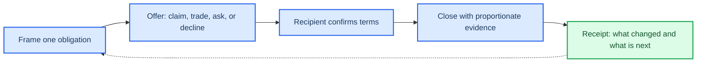

# Relay Ritual: cooperative handoffs without a manager

_Concept design for the Cooperative handoff rituals territory; browser-first, off-chain, and scoped for a two-to-four-week Manus Studio test._

---

## 🎯 One-sentence hook

**Relay Ritual lets a trusted household claim, trade, ask for help, and close one real obligation through an explicit, reversible handoff card—without assigning a permanent coordinator or turning completion into surveillance.**

## 👥 Target user and context

The first wedge is a two-to-six-person household or small care circle managing a recurring, deadline-bound operation: school-morning preparation, weekly meal pickup, medication refill coordination, pet care, or a shared renewal. The group is trusted, but availability changes. The problem is not discovering another checklist; it is making responsibility explicit when the usual person cannot do it, while preserving a graceful “not me” option.

The browser is the distribution surface. A household starts a room from a link, names a routine, and invites only the people needed for that routine. A participant can use a display name or initials. Sensitive details are optional and private by default. Existing shared-list products already support collaborative editing and assignment, but they require a shared account ecosystem or expose a broad list context.[^1] Todoist similarly supports shared projects and assignment.[^2] Relay Ritual is deliberately narrower: one obligation, one decision, one accountable recipient, then a clean close.

## ✅ Atomic outcome

Within three minutes, one real obligation has a **human-confirmed state**: `claimed`, `traded`, `help requested`, `declined`, or `closed`. The recipient has explicitly accepted, changed the terms, or declined. The room retains a compact receipt stating what “done” meant, who accepted it, what changed, and whether the obligation is closed. A silent assignment never counts as acceptance.

## ⚡ First 30 seconds

1. The host opens “Tonight’s school pickup” from a browser link and sees four buttons: **Claim**, **Trade**, **Ask for help**, and **Not available**.
2. The host enters only the minimum: due window, definition of done, and optional private note.
3. The host shares a short room link. The recipient opens it without installing an app, selects a display name, and sees the same four choices.
4. The first accepted action updates the card immediately. No feed, public score, streak, guilt copy, or coordinator dashboard appears.

## 🔄 Core loop

1. **Frame one obligation.** A person creates a bounded card with a due window and a plain-language completion test.
2. **Offer, do not assign.** The card is offered to the room with a neutral prompt: “Who can take this, trade it, or ask for help?”
3. **Make the handoff explicit.** A recipient chooses `claim`, proposes a trade with another available member, asks for a named helper, or declines with an optional reason visible only to the room.
4. **Confirm terms.** The current holder and recipient approve the revised owner, due window, and done-state. A change is reversible until close.
5. **Close with evidence appropriate to the task.** The holder selects a low-burden close method: a check plus note, recipient confirmation, or optional attachment. Proof is never required for ordinary low-risk chores.
6. **Carry forward the useful context.** The next occurrence starts from the last accepted definition and any recovery note, not from a guilt message or a blank chat thread.

## 📦 Durable value

The durable artifact is a **handoff receipt**, not a badge. It records the obligation’s definition of done, accepted holder, trade or help request, timestamps, changes, closure state, and a human-editable recovery note. A household can export or delete a receipt. For a recurring routine, the next card can inherit “what worked last time,” such as “leave the key with the neighbor” or “pickup moved to 5:30.” This makes the record useful outside the moment while keeping it correctable; privacy control should include what is shared, where, and when, plus correction and deletion paths.[^3]

## 🔁 Why a user returns voluntarily

A user returns because a **new real obligation** needs a fair handoff, not because the product threatens loss. The next visit is triggered by a household’s own routine or a recipient’s new request. The previous receipt reduces explanation work: members can reuse the last accepted done-state, change only the variable that changed, and avoid reconstructing context in messages. A neutral reminder may say “Pickup card opens tomorrow” but never “you are late,” show comparative labor, or imply that declining is a moral failure. This avoids manipulative patterns such as obscured choice, misleading urgency, or pressure to disclose data.[^4]

## 🤝 Why a recipient or partner will use the artifact

The recipient uses the card because it answers the questions a chat thread leaves unresolved: **what exactly is needed, by when, who accepted it, and what changed?** A helper can accept only a bounded subtask, and the original holder can see that it was received without monitoring location or continuous activity. A school-week coordinator, caregiver network, or meal co-op partner gets a reusable routine template and a redacted completion receipt rather than another inbox. The partner wedge is a recurring operation where the partner already distributes a finite schedule and benefits when fewer exceptions need manual chasing.

The product must not claim that every partner will adopt it. Close alternatives—Apple Reminders, Todoist, Cozi, shared calendars, and ordinary group chat—already solve parts of the problem. Relay wins only if recipients prefer its explicit acceptance and recovery context enough to use it in the next occurrence, while participants experience fewer coordination messages.

## 💡 Value capture without compromising agency

The economic hypothesis is **bounded subscription or partner licensing**, not per-action monetization. A household can use a free single routine with a limited retention window. A paid household plan can add multiple routines, export, longer history, and access controls. A community partner can pay for a small number of branded routine templates and aggregate operational summaries that contain no individual labor ranking. There is no advertising based on household data, sale of personal obligation history, paid chance, reward, or fee for declining work.

Revenue is justified only if the artifact measurably replaces coordination labor or prevents missed handoffs. The product does not monetize pressure. If users do not save meaningful coordination time or partners do not reuse the receipt, the correct decision is to kill or reframe rather than add gamification.

## 🚫 Chain decision

**No chain.** The artifact is sensitive, mutable, and often needs correction or deletion. A conventional private database with exportable JSON/PDF receipts is sufficient. A chain is not uniquely necessary for household trust, and public immutability would conflict with the product’s safety requirement that a member can correct or delete context. No wallet, token, mining, token gating, or financial return is involved.

## 🧪 Minimum Manus Studio prototype

Build one browser room for the narrowest test case: **weekly school pickup handoffs**.

- A host creates a room and one recurring pickup card.
- Four action buttons implement claim, trade, ask for help, and decline.
- Every handoff requires recipient acceptance; the UI shows the state transition live.
- A card has due window, definition of done, optional private note, and optional attachment.
- Close supports check-plus-note and recipient confirmation; no camera, location, calendar, or messaging integration is required.
- The receipt view shows only the room’s accepted facts and offers edit, export, and delete.
- Anonymous or display-name entry is allowed through a signed room link; account creation is deferred.
- Instrument comprehension, time to accepted handoff, acceptance/decline/trade mix, completion, edits, repeat use, number of follow-up messages, and coordinator interventions.
- Human approval is visible for every material state change. AI is not required. If later used to suggest a concise done-state from a user note, the suggestion must show its source text and require edit/approve/reject.

This is a deliberately small surface that can be built and instrumented in two to four weeks without autonomous external actions or unbounded public user-generated content.

## 🔍 What must be true to win

- **Comprehension:** 8 of 10 target participants can explain the four choices and expected consequence before acting.
- **Meaningful handoff:** at least 3 of 5 households complete a real two-person handoff with explicit accept, trade, or decline, matching the [supplied opportunity map’s](../01-opportunity-map.md) proposed concierge bar.
- **Less coordination work:** the next occurrence produces fewer clarification messages or coordinator interventions than the household’s normal method.
- **Recipient reality:** at least two independent household or community hosts reuse the receipt in a subsequent routine.
- **Agency and trust:** people can decline without penalty, edit or delete the record, and understand exactly who can see each note.
- **Voluntary repeat:** at least 40% of first-time participants choose a second relevant use within 14 days after one neutral invitation, with no reward, streak, rank, scarcity, or referral unlock, matching the [supplied opportunity map’s](../01-opportunity-map.md) prototype gate.

## ⚠️ What would kill it

The concept should be killed or reframed if members avoid accepting real obligations and use it only as a decorative board; if explicit confirmation adds more messages than it removes; if the host becomes a permanent dispatcher; if illness, travel, unequal labor, or privacy disagreement cannot be handled without shame; if a “proof” requirement feels like surveillance; if recipients do not use the receipt in their next workflow; or if a household prefers chat or existing reminders after experiencing a correct handoff. A successful prototype would not by itself prove market size, virality, or lack of competition.

## 🧑‍🤝‍🧑 Concierge test

Run five households for one recurring school-week operation over 14 days. Facilitate the first card manually, then provide the browser prototype for the second occurrence. Recruit households with a known backup person and at least one recent missed or renegotiated obligation. Observe without coaching after the initial explanation.

For each household, record: whether the participant states the expected consequence unaided; whether the recipient accepts, trades, asks, or declines; time to accepted handoff; number of clarification messages; whether the obligation closes; whether the receipt is consulted next time; who performs coordination labor; and whether any privacy or guilt concern is raised. Offer one neutral invitation for a second use and no incentive. Separately red-team illness, travel, an unequal workload, a request to hide a note from one member, and a correction/deletion request.

## 🚦 Prototype gate

Authorize continued prototype work only if the same narrow use case clears all of these: 8/10 comprehension; 6/10 completed actions with a visible accepted handoff or close; 3/5 households completing a two-person handoff; at least 40% voluntary second use within 14 days; two hosts reusing a receipt; no unresolved high-severity privacy, safety, or deception incident; and no prohibited retention crutch. This gate is behavioral, not a survey or waitlist test, consistent with the [supplied opportunity map](../01-opportunity-map.md).

## ❌ Strongest falsifier

**After seeing a correct accepted handoff and receipt, households still default to chat or existing reminders for the next real occurrence, while follow-up messages and coordinator effort do not decrease.** That result means the explicit ritual is overhead rather than relief; adding points, streaks, rankings, or guilt would not repair the core value failure.

## 🔗 References

[^1]: Apple Support. “Share and collaborate in Reminders on iPhone.” https://support.apple.com/guide/iphone/share-and-collaborate-iph2a8f9121e/ios

[^2]: Todoist Help. “Collaborate with friends or family in Todoist.” https://www.todoist.com/help/todoist/features/collaborate-with-friends-or-family-in-todoist-tzkGUy

[^3]: Apple. “Privacy Control.” https://www.apple.com/privacy/control/

[^4]: Federal Trade Commission. “FTC Report Shows Rise in Sophisticated Dark Patterns Designed to Trick and Trap Consumers.” https://www.ftc.gov/news-events/news/press-releases/2022/09/ftc-report-shows-rise-sophisticated-dark-patterns-designed-trick-trap-consumers
