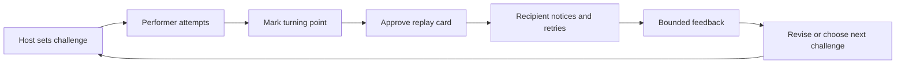

# Challenge-to-teach artifact concept: PivotProof

*Context: One original concept in the “challenge-to-teach artifacts” territory. A browser-first product where a person attempts a short, bounded skill task, identifies the moment their approach changed, and publishes a compact, replayable teaching artifact for a named recipient or small practice group. This is a product hypothesis, not a market-size or virality claim.*

---

## Product definition

**PivotProof** turns a 2–5 minute challenge into a “watch, notice, try” card: a performer records one attempt, marks the turning point, explains the cue that mattered, and gives the next person a one-click retry. The artifact is deliberately small: challenge rules, attempt clip or screen capture, turning-point timestamp, performer’s explanation, accessibility notes, and a replay/try button.

**One-sentence hook:** “Try a tiny skill challenge, mark the moment your approach clicked, and hand someone a replay they can attempt themselves.”

**Territory:** Challenge-to-teach artifacts.

**Target user and context:** A learner or hobbyist in a recurring practice setting—coding club, language cohort, music lesson, craft group, accessibility meetup, or niche creator community—who wants evidence of progress without a public follower graph. The recipient is a peer, coach, educator, or named small group that needs a concrete next attempt rather than a polished tutorial library.

**Close alternatives, and the gap:** YouTube tutorials and clips explain after the fact but rarely capture the learner’s own turning point; Loom/ScreenPal capture a walkthrough but do not structure a bounded attempt or recipient retry; Trackmania-style replays make technique inspectable but are specialized and not inherently teaching-oriented; Kahoot-style activities capture quick responses but not a durable, attributable proof packet. PivotProof combines the short challenge, self-identified turning point, and recipient retry in one bounded artifact. It does not claim to be superior to these alternatives; it tests whether the combination creates a useful handoff.

## Atomic outcome

Within 10 minutes, the performer can complete one challenge and produce a recipient-readable artifact that answers four questions: **What was the task? What changed? What should I notice? What can I try next?** The recipient can understand the turning point and start a comparable attempt without needing the performer present.

The artifact is not a grade or credential. It records an attempt, the performer’s own explanation, and optional human review status: `attempted`, `self-explained`, `peer-checked`, or `coach-annotated`. Any “correctness” claim must be tied to predeclared challenge criteria and a named reviewer.

## First 30 seconds

1. Open a shared link; no account or wallet is required to try a challenge.
2. See a one-sentence task, estimated time, allowed materials, and an accessible alternative input mode.
3. Press **Start attempt**. The browser shows a simple timer and a visible “mark turning point” button; recording is opt-in and previewable before sharing.
4. On completion, answer: “What changed?” with a short text, voice, or typed caption. The system does not auto-publish.

## Core loop

1. **Host defines a challenge:** task, success condition, maximum duration, safety/accessibility notes, and recipient group.
2. **Performer attempts it:** browser capture is optional; structured checkpoints can stand in for video.
3. **Performer marks the turning point:** timestamp or step, plus a plain-language cue (“I slowed down before the turn”).
4. **Human-approved assembly:** PivotProof creates a draft card containing the rules, evidence, turning point, explanation, and replay prompt. If AI is used, it only proposes a transcript, chapter label, or concise summary; the performer can inspect, edit, reject, or remove every proposal before publication.
5. **Recipient retries:** recipient opens the card, scrubs directly to the turning point, answers one noticing question, and attempts the same or adapted challenge.
6. **Feedback closes the loop:** recipient marks “helped,” “unclear,” or “not accessible,” and may add one bounded note. The performer can revise or withdraw the artifact.
7. **History becomes practice memory:** each approved attempt remains in a private group timeline, allowing comparison against one’s own earlier attempt without a global rank.

## Durable value

For the **performer**, the artifact is a private, searchable record of what changed in their own technique, not merely a completion tick. For the **recipient**, it is a compact teaching aid with a concrete next action. For the **host**, it is a reusable session object: challenge criteria, common turning points, accessibility notes, and evidence of where learners got stuck. Export is a self-contained HTML/PDF card with captions and a link back to the source attempt; deletion and correction propagate to the hosted artifact.

The pedagogical hypothesis is deliberately modest: retrieval practice and explaining to another person can support learning, but the literature is mixed on whether explanation itself adds benefit beyond retrieval.[^1][^2] Therefore the test measures observable retry quality and recipient comprehension, not a promised learning gain. Interactive questions and learner-controlled replay are included because evidence reviews report better subsequent performance and satisfaction in some video-learning studies when questions and control are added.[^3]

## Why a user returns voluntarily

A performer returns when there is a **new real challenge** or when a previous artifact gets useful recipient feedback—not because a streak, rank, prize, or loss is threatened. A recipient returns because the next card is a short, relevant attempt embedded in an existing practice session. The product should make the second use materially different: another technique, a harder constraint, an accessibility adaptation, or a correction to an earlier explanation. A neutral reminder is allowed; repeated nudging is not.

## Why a recipient or partner uses it

A coach or host gets a ready-to-run micro-lesson and a structured view of where learners’ approaches diverge, without asking them to edit every video. A peer receives a link that tells them exactly what to notice and do next. The partner wedge is a recurring 20-minute session: the host launches one challenge link, selects 2–3 approved artifacts for the next meeting, and exports a recap. PivotProof wins only if it removes preparation or feedback work rather than adding another inbox.

## Value capture and user agency

Start with a **host subscription** for private cohorts or studios, priced by active practice group rather than attention or participant data; offer a limited free tier for one small group to keep link-first entry credible. Later, charge for host workflow features—templates, retention controls, review queues, exports, and accessibility reporting—not for chance, reach, ranking, or recipient access. Performers retain deletion, visibility, download, and correction controls. No ad targeting, resale of practice data, wallet, token, chain, or financial-return promise is part of the design.

## Chain decision

**No chain initially.** A conventional database plus signed export is sufficient for an editable, revocable practice record. Public immutability conflicts with deletion, correction, privacy, and evolving challenge criteria. Revisit only if multiple independent communities demonstrate a concrete need to verify the same scoped claim across systems; a cryptographic signature would still not prove skill quality or issuer trust. This follows the opportunity map’s off-chain-first stance and the distinction between a verifiable credential’s validity and a trusted assessment.[^4]

## Minimum Studio prototype (2–4 weeks)

Build one narrow use case, such as “beginner fingerstyle guitar: clean chord change” or “screen-reader user: navigate a labeled form.” The Studio prototype needs:

- public challenge link with a host-created task and explicit success criteria;
- keyboard-accessible attempt flow with timer, checkpoint prompts, and optional webcam/screen recording;
- turning-point marker and typed/captioned explanation;
- draft artifact preview with editable title, transcript, captions, privacy, and deletion controls;
- recipient view with jump-to-turning-point, one noticing question, and **Try it** button;
- recipient outcome: attempted / helped / unclear / inaccessible plus one short note;
- private host dashboard showing artifacts by status, not a global leaderboard;
- event instrumentation: task comprehension, attempt completion, artifact approval, recipient retry, feedback, revision, deletion, and time-to-review.

**AI boundary:** use no AI in the first build unless it saves a clearly bounded editing step. If enabled, it may transcribe or suggest a turning-point label, visibly marked “AI draft,” with human approval required before storage or sharing. It may not grade, publish, invite, message, or alter challenge criteria autonomously.

**Accessibility baseline:** target WCAG 2.2 AA practices for perceivable, operable, understandable, and robust web content; provide keyboard operation, captions/transcript, high contrast, reduced-motion behavior, clear focus, non-video alternative evidence, and explicit consent before camera/microphone use.[^5]

## Critical assumptions

- A bounded challenge can be understood unaided by at least 8 of 10 target participants.
- Performers can identify a meaningful turning point without a coach doing the interpretation for them.
- At least 6 of 10 recipients who inspect an artifact will independently attempt the challenge.
- The artifact makes the recipient’s next attempt clearer than a raw clip or ordinary tutorial link.
- Hosts will reuse approved artifacts in a subsequent real session and spend less preparation/feedback time.
- A private, revocable record is trusted more than a public score or permanent credential for the initial use case.
- Accessibility alternatives preserve the instructional value of the artifact for users who cannot or do not want to record video.
- Moderation, consent, rights, storage, and correction can be handled within a predeclared manual-review budget.

## Concierge test

Run five paper-defined challenges with one club, educator, or practice group. For each challenge, manually facilitate 2 performers and 2 recipients (10 viewers/recipients total). Give performers a simple capture template and manually assemble the replay card; do not disclose a product roadmap. Measure: unaided task explanation before attempt; whether performers mark a specific turning point; whether recipients can state what to notice; independent retry within 24 hours; recipient “helped/unclear/inaccessible”; host reuse in the next session; review minutes; and any consent, safety, rights, or accessibility failure. Test at least one non-video path and one deliberately difficult or ambiguous challenge.

## Prototype gate

Authorize the Studio prototype only if the same narrow use case meets all six gates: **8/10** participants understand and complete the action unaided; **6/10** completed actions create a legible, predeclared proof state; **40%** choose a second relevant use within 14 days after one neutral invitation; at least **two hosts/recipients** actually use the artifact in their next workflow and request another run; no unresolved high-severity incident occurs and manual review stays within budget; and no token, wallet, prize, rank, forced referral, streak-loss, paid chance, or unapproved autonomous action is needed. These thresholds are inherited from the opportunity map’s explicit prototype discipline, not market validation.

## Strongest falsifier and kill conditions

The strongest falsifier is: **recipients watch or skim the card but do not independently attempt the challenge, while performers do not create a second artifact unless rank, prizes, or streak pressure is added.** If that happens across two use cases, kill the concept rather than adding retention mechanics. Also kill or reframe if raw clips perform as well with less host effort; hosts do not reuse artifacts; turning points are too subjective to be legible; accessibility alternatives are second-class; or privacy/rights review makes each artifact more expensive than the workflow value it creates.

## Sources

[^1]: Washington University Center for Teaching and Learning, “Using Retrieval Practice to Increase Student Learning,” https://ctl.wustl.edu/resources/using-retrieval-practice-to-increase-student-learning/ (retrieval practice, feedback, and longer-term retention claims).
[^2]: Kobayashi, K., “The Retrieval Practice Hypothesis in Research on Learning by Teaching: Current Status and Challenges,” *Frontiers in Psychology* (2022), https://pmc.ncbi.nlm.nih.gov/articles/PMC9130926/ (evidence and uncertainty around explaining to others versus retrieval).
[^3]: Brame, C. J., “Effective Educational Videos: Principles and Guidelines for Maximizing Student Learning from Video Content,” *CBE—Life Sciences Education* (2016), https://www.lifescied.org/doi/10.1187/cbe.16-03-0125 (interpolated questions, learner control, and guiding questions).
[^4]: W3C, “Verifiable Credentials Data Model v2.0,” https://www.w3.org/TR/vc-data-model-2.0/ (scoped credential model; does not itself establish assessment quality or trust).
[^5]: W3C Web Accessibility Initiative, “WCAG 2 Overview,” updated 17 September 2026, https://www.w3.org/WAI/standards-guidelines/wcag/ (WCAG principles and applicability to dynamic web and AI interfaces).
[^6]: Trackmania Documentation, “Watch replays,” https://doc.trackmania.com/play/watch-replays/ (close mechanism: replay/comparison as inspectable technique evidence).
[^7]: 1EdTech, “Open Badges,” https://www.1edtech.org/standards/open-badges (close mechanism: evidence-carrying achievement records and issuer criteria).
