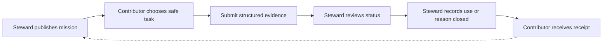

# StewardSignal: finite access checks that a named steward can use

*Context: This concept develops the opportunity map’s territory of partner-acknowledged micro-contributions. It is a browser-first, off-chain product hypothesis—not a validated market claim. The first wedge is a parks or accessibility organization that needs current, narrowly scoped observations about a small set of public places.*

---

## Product in one sentence

**StewardSignal lets a person complete one safe, five-minute access check, attach only the evidence requested, and see a named steward accept, correct, use, or close the result.**

The first mission set is deliberately concrete: “Check whether the north entrance has a step-free route, readable opening hours, and an unobstructed door; submit a checklist and optional photo from a public vantage point.” A mission never asks a contributor to enter restricted property, confront anyone, move an obstruction, or infer a person’s disability.

This is not a new accessibility map. Wheelmap already lets people search for and mark wheelchair-accessible places, while AccessNow supports searching, rating, reviewing, and discovering accessibility information across place categories.[^1] [^2] StewardSignal’s wedge is the **closed loop between a named steward’s finite request and an acknowledged operational decision**: each mission has an evidence contract, a status trail, and a recipient who must say what happened next.

## Target user and context

The contributor is a person already near a place they can safely observe: a wheelchair user, disabled traveler, caregiver, neighbor, student, visitor, or volunteer. They do not need specialist knowledge, an account, a wallet, or a public profile. They choose missions that fit their route and can decline anything unsafe or inaccessible.

The first partner is one named steward: for example, an accessibility nonprofit maintaining a neighborhood access guide, a park district updating trail and facility information, or a field-course coordinator checking a venue before a cohort visit. The steward predefines the mission, evidence contract, geographic boundary, review SLA, and permitted use. The partner—not an algorithm and not the contributor—decides whether a submission is accepted, needs clarification, acted on, or archived.

The initial scope should be one steward, one city or campus, and no more than 20 mission templates. This keeps moderation, privacy, and correction paths feasible in a two-to-four-week Manus Studio test.

## Atomic outcome

A contributor completes one mission and receives a **portable contribution receipt** showing:

- what was requested;
- what they submitted and when;
- which evidence fields were accepted, disputed, or omitted;
- the steward’s human status decision;
- whether the result changed a guide, maintenance queue, visit plan, or other named workflow;
- the contributor’s chosen credit setting: private, first name, alias, or no credit.

The receipt is useful even when the answer is “unknown,” “not safe to verify,” or “needs steward follow-up.” It prevents a failed submission from being represented as a verified fact.

## First 30 seconds

A shared link opens directly to a mission card: **“Check the step-free north entrance at Riverview Library. Takes about five minutes. Do not enter restricted areas. You may submit without a photo.”** The card names the steward, the requested fields, the safety stop condition, the retention period, and the expected response time.

The person taps **Start**, answers three structured observations (yes / no / cannot tell), optionally adds one photo or note, previews exactly what will be shared, and taps **Submit for steward review**. A confirmation screen shows “Submitted — awaiting review,” not “verified.” No feed, points, streak, leaderboard, or referral prompt appears.

## Core loop

1. **Steward publishes a bounded mission.** The mission specifies place, task, safe observation boundary, evidence fields, expiry, and intended use.
2. **Contributor chooses one mission.** The browser explains time, accessibility, privacy, and stop conditions before work begins.
3. **Contributor submits proportional evidence.** The default is structured answers; a photo, timestamp, or short note is optional and only requested when it materially helps review.
4. **System creates an inspectable packet.** AI may transcribe a note, detect missing fields, or suggest a neutral summary, but it shows the source and requires contributor and steward approval before any material text is saved or sent.
5. **Steward reviews and labels the result.** States are distinct: `attempted`, `needs clarification`, `corroborated`, `accepted`, `acted on`, `rejected`, and `archived`.
6. **Steward records use.** The partner links the accepted result to one outcome, such as “updated access guide,” “opened maintenance ticket,” “changed visit plan,” or “no action—duplicate/insufficient evidence.”
7. **Contributor receives a receipt.** They can correct, delete, withdraw optional media, change credit, or share a redacted receipt. A new mission appears only when the steward has a real next need.

## Why a user returns voluntarily

Return is earned by a new, relevant mission or by a visible consequence of the last one. A contributor may revisit because a place on their route needs a different field checked, because the steward asks for a time-bounded recheck after a change, or because the receipt helps them plan a future visit. The product does not manufacture return with loss, rank, scarcity, payment, or social pressure.

A steward’s response is the retention mechanism: “Your check changed the public access note” is a credible reason to do another finite check. If the steward cannot use or acknowledge work, the product should not ask for more of it.

## Why the partner uses the artifact

The partner gets a small, reviewable queue rather than an unbounded inbox. Every item conforms to a predeclared evidence contract, carries consent and provenance, and can be filtered by place, date, field, confidence, and status. The steward can export a CSV or a redacted evidence packet, then record the operational outcome in the same browser flow.

This pattern is grounded in adjacent practice: eBird separates automated flags from human review and distinguishes accepted records from unconfirmed records when documentation is insufficient.[^3] Oakland’s Adopt-A-Drain program similarly names a public-works purpose, gives volunteers a bounded local task, and provides an impact-reporting path.[^4] StewardSignal combines those mechanisms with an explicit “what did the partner do?” state rather than treating submission as impact.

## Durable value and value capture

The durable artifact is a **permissioned evidence packet plus partner outcome record**, not a badge or a speculative asset. It can remain useful to the contributor as a visit-planning receipt, to the steward as a correction-ready source, and to an authorized downstream partner as a redacted export. All records are editable, revocable, and deletable according to the steward’s stated retention policy.

The initial economic hypothesis is partner-paid workflow software: a nonprofit, campus, park district, or access-guide operator pays for mission templates, controlled intake, review queue, exports, retention controls, and an auditable acknowledgement trail. Contributors pay nothing and do not receive financial promises. A small pilot can be concierge-priced or grant-funded, but willingness to pay must be tested with a real steward’s budget owner rather than inferred from enthusiasm.

Value capture preserves agency because the partner pays for reduced review and coordination burden, while the contributor chooses whether to participate, what evidence to attach, what name to display, and whether to withdraw or delete. The system must never sell a person’s sensitive accessibility experience as an advertising profile.

## Partner wedge and close alternatives

The wedge is **a recurring access-information refresh for one steward’s known places**, not global crowdsourcing. The partner launches a link from its existing newsletter, venue page, volunteer briefing, or field-course checklist. The first integration is a CSV export and a simple partner dashboard; APIs can wait until repeated use proves a real workflow bottleneck.

Close alternatives include:

- **Wheelmap:** broad public place marking with a simple accessibility signal; its value is discovery and map coverage, not a steward-owned mission-to-action receipt.[^1]
- **AccessNow:** map-based discovery, rating, reviewing, and MapMission events; it is closer to community mapping than to a private, partner-acknowledged evidence queue.[^2]
- **OpenStreetMap wheelchair tagging:** a flexible open mapping substrate, useful for geographic data but not inherently a named steward’s review SLA or contributor-consent workflow.[^5]
- **Adopt-a-Drain programs:** strong precedent for finite, local, recurring stewardship and impact reporting, but the task and evidence model is environmental maintenance rather than access information.[^4] [^6]
- **Forms, email, and spreadsheets:** likely the true incumbent for a small partner. StewardSignal wins only if structured evidence, consent, status clarity, and acknowledgement save enough review time to justify switching.

This design does not claim to be viral, competition-free, or superior at map coverage. Its testable distinction is accountable closure.

## Chain decision

**No chain.** An ordinary database with signed, versioned receipts, role-based access, audit history, and export is sufficient. A public chain would not establish that an entrance is accessible, that a photo was consented to, or that a steward acted. It would make correction and deletion harder, especially for location-linked accessibility information. Revisit an interoperable credential only if multiple independent stewards actually ask to honor the same scoped claim; until then, use private, revocable records.

## Minimum Studio prototype (2–4 weeks)

Build a browser-first vertical slice with four roles and no external autonomous actions:

- **Contributor:** open mission link, read safety/consent, complete a 3–5 field form, attach optional media, preview redaction, submit, view receipt, request correction/deletion
- **Steward:** create from a mission template, define evidence contract and retention, review queue, change status, write a one-sentence use outcome, export redacted CSV/PDF
- **AI assist (visible and optional):** extract checklist fields from a contributor note and draft a neutral summary with highlighted source spans; contributor and steward each approve or edit before persistence
- **Instrumentation:** completion rate, evidence-contract pass rate, review time, status distribution, acknowledgement/use rate, correction/deletion requests, repeat mission within 14 days, and unsafe-task abandonment

Use seeded missions for one real or simulated partner workflow. Keep media private by default, strip unnecessary metadata, show a human-readable audit trail, and make the safe stop path as prominent as Submit. The prototype should not publish a public map, issue credentials, send maintenance requests, or edit a partner system automatically.

## Critical assumptions

- A named steward has a recurring information gap that is important enough to review, not merely interesting to observe.
- Contributors can complete the chosen mission safely without entering restricted areas or exposing another person’s identity.
- A short structured evidence contract produces more usable review material than an open comment box.
- Stewards will acknowledge a result honestly even when they reject it, mark it unknown, or cannot act immediately.
- At least one partner workflow benefits from a shared status model: attempted, corroborated, accepted, acted on, and archived.
- Contributors value a truthful receipt or visible use enough to return for a new relevant mission without rewards or pressure.
- Privacy, deletion, correction, accessibility, and media retention can be operated by a small team within a predeclared cost.
- The partner can pay for workflow value without requiring contributor payment or monetizing sensitive data.
- An off-chain signed record satisfies the initial portability and trust need.

## Concierge test

Run 20 missions with one named accessibility or parks steward over two weeks. The steward writes each mission and evidence contract in a shared template; a researcher manually sends links, reviews submissions, and records the partner’s actual use. Invite contributors through the partner’s existing audience, not paid referrals.

The designer must predeclare which evidence is sufficient and must log every rejection, duplicate, unsafe stop, correction, and delayed response. For each accepted result, the steward must state the concrete use or explain why no action was possible. Ask contributors to choose their credit and media permissions before submission, then test withdrawal and deletion with at least two records.

The test passes to software only if it meets the opportunity-map gate in this narrow use case: at least 8 of 10 completed submissions meet the evidence contract, the steward uses or acknowledges at least 4 of 8 completed results, at least 40% of first-time contributors voluntarily choose a second relevant mission within 14 days after one neutral invitation, and no unresolved high-severity privacy, rights, or safety incident occurs.

## Prototype gate

Proceed to the Studio prototype only when the steward has requested another run, review effort is within the agreed per-result budget, and two independent partner-side reviewers can correctly interpret the status labels and use the export. Also require that at least 8 of 10 participants can explain the task and expected consequence before starting, and that at least 6 of 10 submissions produce a visible state change, accepted handoff, partner use, or verified evidence state.

A pass authorizes an instrumented narrow prototype, not a scale or market conclusion. The first build should be killed or reframed if the partner’s workflow remains easier in a form or spreadsheet.

## Strongest falsifier: what would kill it

The concept is killed or reframed if verified submissions are not acted on or acknowledged by the named steward, if contributors return only when offered rewards or pressure, or if the evidence contract creates no review advantage over email. It is also killed if safe, consented observation is too rare to fill 20 missions, if media and location data create unacceptable privacy risk, or if stewards cannot distinguish “not observed” from “verified.” Do not respond to these failures by adding tokens, rankings, streaks, public exposure, or automated consequential actions.

## Sources

[^1]: Wheelmap, “Wheelmap.org,” https://wheelmap.org/

[^2]: AccessNow, “Discover Accessible Places,” https://accessnow.com/

[^3]: eBird Support, “The eBird review process,” https://support.ebird.org/en/support/solutions/articles/48000795278-the-ebird-review-process

[^4]: City of Oakland, “Adopt-A-Drain,” https://www.oaklandca.gov/Community/Volunteer-Opportunities/Adopt-A-Drain

[^5]: OpenStreetMap Wiki, “Key:wheelchair,” https://wiki.openstreetmap.org/wiki/Key:wheelchair

[^6]: Adopt-a-Drain, “How to Adopt A Storm Drain,” https://ca.adopt-a-drain.org/

[^7]: Opportunity map, “Bounded, evidence-carrying participation,” internal project context, `/home/ubuntu/asentxia-web-final/docs/research/product-discovery-lab/01-opportunity-map.md`
