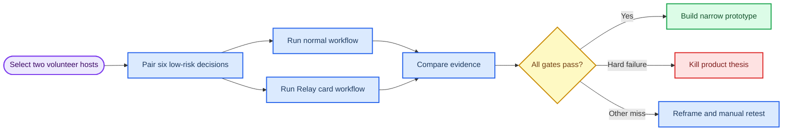

# Decision Relay concierge test kit

_A 14-day manual experiment package for testing whether an honest follow-through card beats a volunteer team’s normal poll, chat, and notes workflow — 2 October 2026_

---

## 🎯 What this test decides

This is **not** a product launch, a market-size study, or a test of whether people enjoy voting. It tests one narrow claim:

> A short, approved next-move card makes a recurring team’s decision easier to understand and follow up than its normal planning workflow.

Run the test only with adult participants in a low-risk recurring volunteer setting. Do not use employment decisions, benefits, discipline, health, identity, allegations, safety-critical work, or anything that assigns people without their clear agreement.

The test compares three matched normal-workflow decisions against three matched **Decision Relay** decisions. The card is manually assembled by the facilitator. No software, AI grouping, public sharing, wallet, token, payment, chain write, prize, referral, or automated action is involved.



## 👥 Recruitment and scope

Recruit two independent adult volunteer coordinators who already run planning huddles at least weekly. Each coordinator needs 8–12 adult participants and must have a normal way to make small, low-risk decisions.

A suitable decision has two or three pre-vetted options, a named owner, and an observable result within seven days. Examples include choosing the next garden work block, prioritizing a safe shared-tool repair, or selecting a non-safety-critical volunteer activity. Do not use decisions that affect attendance eligibility, employment, access to benefits, personal privacy, health, safety, or legal rights.

Before collecting research data, obtain host agreement and participant consent appropriate to the partner’s setting. A person must be able to participate in the ordinary team planning process even if they decline the research comparison. This kit is an operating template, not legal advice or a substitute for a partner’s approved consent process.

## 📅 Schedule

| Day | Activity | Owner | Evidence produced |
| --- | --- | --- | --- |
| 0 | Confirm hosts, scope, data handling, and six candidate decisions | Project lead and hosts | Signed host agreement and decision inventory |
| 1 | Pair the six decisions by topic, urgency, and participant group | Facilitator and hosts | Counterbalanced pair sheet |
| 2–11 | Run three normal and three Relay decisions | Hosts and facilitator | Baseline notes, Relay cards, event log |
| 3–18 | Observe seven-day consequences and next-huddle reuse | Hosts and facilitator | State-change evidence and recall sheet |
| 14 | Send one neutral invitation for a second real planning use | Host | Repeat-use event |
| 15–18 | Score gates and decide build, reframe, or kill | Project lead | Decision memo |

Counterbalance the order. Each host should run at least one normal decision and one Relay decision early in the period. Do not place every Relay condition second, because learning alone could make later decisions look better.

## 🧾 Relay card template

Create one card per Relay decision. The host must approve it before distribution and before it appears at the next huddle.

```markdown
# Next-move card: [short question]

**Audience:** [named team / private group]
**Response window:** [open date/time] to [close date/time]
**Input label:** [binding selection | advice to coordinator | consent check | deferred]

## Choice and consequence

> Choose one option for **[question]**. Your response will [plain-language consequence].

**Governing rule:** [for example: most responses select the next work block; coordinator may override only for a stated safety or availability constraint]

| Option | What changes if selected |
| --- | --- |
| [A] | [visible consequence] |
| [B] | [visible consequence] |
| [C, optional] | [visible consequence] |

## Result

- **Participant count:** [number]
- **Selection / input pattern:** [result]
- **Outcome label:** [binding selection | advisory input | deferred]
- **Host action:** [action]
- **Override?** [no | yes — one-sentence reason]
- **Minority concern:** [availability | tools | impact | other concern | none | prefer not to say]

## Follow-through

- **Owner:** [person or role who accepted the action]
- **First action:** [smallest observable action]
- **Check-back date:** [date]
- **Status:** [open | done | changed | blocked]

## Your control

To correct or request deletion of your Relay response, contact [facilitator contact] by [time]. This card is a planning record; it does not assign work or replace the team’s normal decision authority.
```

## 🗣️ Facilitator script

Read this before a Relay condition. Do not add explanation after a participant begins the response.

> “You are being asked to choose one option for **[question]**. Your response is **[binding selection / advice to the coordinator / consent check]** under this rule: **[rule]**. By **[close time]**, you will be able to see the result, whether the coordinator used the input or chose differently, who owns the first action, and the check-back date. You may choose ‘prefer not to say’ as a reason, stop before submitting, or ask for deletion of your response. This is a research comparison of the planning format, not an evaluation of you.”

At close, say only:

> “The coordinator has approved this card. It will be sent through the team’s normal channel.”

The host, not the facilitator, records any override, confirms the owner, and opens the card during the next huddle. The facilitator must not remind people to inspect the card, use it again, or repeat participation.

## 📊 Event log schema

Use a spreadsheet or CSV with the following fields. Store no direct names in the research log; use a random participant code.

| Field | Valid values or format | Purpose |
| --- | --- | --- |
| `decision_id` | `d01`–`d06` | Links evidence across the comparison |
| `condition` | `baseline` or `relay` | Enables matched comparison |
| `host_id` | `h01` or `h02` | Separates independent host results |
| `participant_code` | Random non-identifying code | Supports repeat measurement |
| `pre_submit_comprehension` | `correct`, `incorrect`, `declined` | Tests honest agency |
| `response_state` | `opened`, `started`, `submitted`, `abandoned`, `corrected`, `deleted` | Measures friction and correction |
| `input_label` | `binding`, `advisory`, `consent_check`, `deferred` | Captures actual authority model |
| `rule_outcome` | Plain-language result | Records declared rule and result |
| `override_flag` | `true` or `false` | Detects divergence from participant input |
| `override_reason` | Short host-provided text | Makes override inspectable |
| `state_change_7d` | `action`, `accepted_handoff`, `deferred`, `no_change` | Tests real consequence |
| `recap_opened` | `true`, `false`, `unknown` | Tests artifact inspection |
| `recall_score` | Integer `0`–`5` | Checks result, rationale, owner, first action, and date |
| `next_session_use` | `true` or `false` | Primary retained-artifact signal |
| `host_minutes` | Numeric minutes | Includes setup, close, approval, correction, follow-up, and check-back |
| `agency_check` | `understood`, `unclear`, `implied_influence_reported` | Identifies false agency |
| `second_use_14d` | `true` or `false` | Measures voluntary relevant repeat |
| `incident_severity` | `none`, `low`, `medium`, `high` | Stops unsafe testing |
| `incident_resolution` | Plain-language status | Tracks remediation or stop condition |

## ✅ Scorecard

A pass requires every item below. Count only observed behavior in the same narrow volunteer-planning use case.

| Gate | Pass threshold | Hard stop |
| --- | --- | --- |
| Comprehension | At least 8 of 10 participants correctly state consequence and governing rule before response | Participants cannot distinguish advice from a governing decision |
| Meaningful consequence | At least 6 of 10 completed inputs create a documented predeclared state change or responsible host action within seven days | Host labels advisory or ignored input as participant-controlled decision |
| Voluntary repeat | At least 40% use a second real planning decision within 14 days after one neutral invitation | Repeat requires a reward, rank, streak, scarcity, referral, token, payment, or fear-of-loss pressure |
| Host reuse | Both hosts open the card in their following huddle without facilitator prompting and request another run | Either host does not use the card or needs facilitator rescue |
| Workflow value | Median total host minutes per Relay decision fall at least 20% versus matched baseline, with no added correction/moderation burden | Relay adds total host work without concrete next-session use |
| Safety and control | No unresolved high-severity incident; correction and deletion operate as stated | Any unresolved high-severity privacy, rights, safety, harassment, accessibility, or deception incident |

If a numerical threshold misses but no hard stop occurs, revise the manual format once and retest. Do not add engagement mechanics to force the result. If a hard stop occurs, kill the standalone product thesis for this use case.

## 🔐 Data handling checklist

- Use structured reason codes only: `availability`, `tools`, `impact`, `other concern`, and `prefer not to say`
- Do not collect free text, demographics, exact availability, health, household, employment, or identity information
- Keep raw logs accessible only to the project lead and research facilitator
- Encrypt stored logs and distribute cards through the team’s existing private channel
- Offer correction or deletion through a named contact within 24 hours
- Delete direct identifiers and raw response records within 30 days after the final check-back
- Preserve only aggregated findings after deletion, unless a participant’s request or partner policy requires otherwise
- Pause the experiment for any unresolved high-severity incident

## 🚫 Out of scope

Do not add chat, comments, open text, AI grouping, anonymous discussion, public feeds, profiles, social graph, scheduling, calendar integration, notifications, badges, leaderboards, rewards, payments, ads, referrals, wallets, tokens, chain anchoring, or autonomous assignments. None answers the core question.

## 🧱 Build boundary after a pass

Only after every gate passes, build a small mobile web prototype for the same adult volunteer use case: host question setup, code/link entry, pre-submit comprehension check, one choice, structured reason code, deterministic result, explicit override reason, host approval, next-move card, status check-back, and the same event log.

Keep identity as a display name or random code. Keep card wording, recruitment, consent, deletion triage, escalation, and distribution human-operated. Do not expand to generic deliberation, social networking, or financial/chain features until the first prototype reproduces the concierge evidence.
