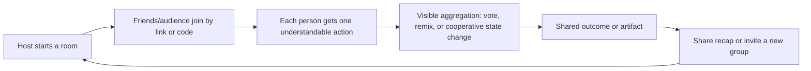

# Social play and shared live experiences

Context: Evidence-driven product discovery lab track on browser-first social games, party play, live events, audience participation, and co-creation. This report separates verified mechanisms from hypotheses and treats virality as unproven.

---

## The opportunity space

The strongest adjacent products do not make spectators wait for a conversion into “real players.” They give each person a small, legible action that changes a shared outcome: submit a prompt, vote, draw, place a bet-free prediction, remix a scene, or help a group solve a timed problem. The browser is useful because it removes the install and account barrier, while a host, stream, Discord call, or event supplies the social context that makes the action meaningful.

The gap is not “another party game.” It is a **shared-agency layer for live groups**: a host can start in under a minute, participants can act from a phone or browser, audience contributions are visible and consequential, and the session produces a replayable artifact or social memory. The product must work for a small private group, then degrade gracefully to a larger audience without turning participation into spam, paid power, or a popularity contest.

## What is verified in adjacent products

### 1. Jackbox: low-friction controllers plus audience-as-player

Jackbox’s official onboarding says the host runs the game on a computer, console, SmartTV, or compatible device while participants use any internet-connected device as a controller by entering a room code at jackbox.tv. It explicitly says no player account is required and that one purchased copy is enough for the group. Most games support an “Audience” that can play along, influence outcomes, or even win. [1]

Jackbox’s Party Pack 7 announcement documents the scale mechanism: games support phones, tablets, and computers as controllers, and specific games can admit up to 10,000 additional audience members who affect the final outcome. [2] This is a concrete example of **tiered agency**: a limited number of people create the primary content, while a much larger audience votes or influences the result.

**Verified mechanism:** one host-owned screen plus browser controllers; anonymous-ish room entry; primary players create; audience votes/influences.

**Product hypothesis:** the same split can support more durable value if audience actions create a shared artifact—such as a finished story, map, playlist, or event recap—rather than only a score.

**Failure condition:** the host must still own or launch the game and provide a visible screen. If no host, streamer, or event organizer is present, cold start is severe. Audience capacity also does not mean every audience member gets meaningful agency; most may become passive voters.

### 2. Discord Activities: distribution inside an existing social presence

Discord documents Activities as web apps hosted in an iframe that use the Embedded App SDK to communicate with Discord clients. They can be multiplayer games or social experiences and run in Discord on desktop, mobile, and web. The SDK exposes connection, user, authentication, and Activity-instance events. [3]

**Verified mechanism:** an experience can be browser-based but launched inside an already active group context, reducing the “where are my friends?” problem. The platform integration supplies identity and presence primitives without requiring the product to build a full social graph first.

**Product hypothesis:** a neutral web experience that can launch from a group chat or voice session has a better first-session probability than a standalone destination. The product should preserve a shareable web URL so it remains usable outside Discord rather than making the platform a permanent gate.

**Failure condition:** platform dependence and iframe/client constraints can cap reach, and the product inherits Discord’s social norms, moderation expectations, and changing SDK policies. A Discord launch is distribution, not proof of repeat use.

### 3. Twitch Extensions and live audience interaction

Twitch says Extensions provide new ways to interact on Twitch and should first serve broadcasters because fans come to engage with the broadcaster. Its design guidance calls for simplified onboarding, progressive disclosure of authorization, clear state feedback, graceful failure, and sensitivity to limited overlay real estate. It also notes that panel extensions can remain active while a broadcaster is offline. [4]

**Verified mechanism:** the broadcaster is the distribution wedge; the extension is valuable when it complements the stream rather than competing with it. A persistent panel can create an offline continuation, while an overlay can make audience actions visible during a live moment.

Twitch’s Community Guidelines also make the operational burden explicit: safety depends on Twitch, streamers, moderators, viewers, reporting, and 24/7/365 Safety Operations. The rules cover harassment, hateful conduct, privacy, intellectual property, illegal activity, spam, and prohibited gambling content. [5]

**Product hypothesis:** an audience-action layer should be designed as a broadcaster utility first: a host can set the rules, pause input, approve submissions, and export the result. “Fun for viewers” is insufficient if the host cannot control risk or recover from a failure.

**Failure condition:** live user-generated input creates moderation, latency, and rights problems. If the action overlays the content, it can reduce rather than increase the broadcaster’s value. Any mechanic resembling gambling, paid chance, or paid influence would also collide with platform policy and the track’s constraints.

### 4. Fortnite Creative/UEFN: co-creation and engagement-based discovery

Epic’s documentation says Fortnite Discover connects players to islands and gives developers a way to find and grow an audience. Discover tests new islands for up to two weeks, then continuously evaluates engagement, retention, social signals, and similarity. Its listed metrics include average playtime, bounce rate, retention, social play, qualified play-through rate, and unique users. Social play includes invitations, returning in a party, and the share of time an island is played in a party. [6]

**Verified mechanism:** co-created experiences need both creation tools and a discovery/evaluation loop. Epic explicitly treats party return and invitations as measurable signals, not merely reach.

**Product hypothesis:** durable value in this space may come from a “small creator to live room” pipeline: participants co-author a bounded world or event, then replay it with friends. The important unit is not an infinite content platform; it is a finished, attributable creation that can be revisited.

**Failure condition:** creator supply does not guarantee discovery. Algorithmic distribution can reward shallow engagement, imitation, or thumbnail optimization. Large platforms also raise the quality bar and make a new product’s distribution wedge difficult.

## A candidate product primitive

A promising primitive is a **live co-creation room**:

1. A host chooses a short format (for example, “build a town,” “direct a mystery,” “make a group poster,” or “decide the next scene”).
2. Participants join with a browser code or link, without installing an app.
3. Every round gives each person one clear action with a visible consequence.
4. The system combines contributions, applies transparent rules, and shows the group what changed.
5. A final artifact—story, map, visual, scorecard, or clip-ready recap—is saved and shareable.
6. The group can replay the same format with a new prompt, not because of a loss-aversion streak but because the social result is different each time.

The key design test is **agency legibility**: within a few seconds, a participant should know what they can do, what changed because of them, and why the group outcome is different. Avoid hidden personalization, opaque AI adjudication, paid influence, artificial scarcity, fear of losing progress, referral pressure, and rank systems that let money buy social power.

## Demand jobs to be tested

- “Give my friends something we can start immediately, even if nobody considers themselves a gamer.”
- “Let my audience do more than chat, without hijacking the stream or creating moderation risk.”
- “Help a group make a memorable thing together, not just consume a round and disappear.”
- “Make remote participation feel socially consequential without requiring synchronized voice, high-end hardware, or a permanent account.”
- “Give a creator or host a reliable format with enough variation that each session feels authored by the group.”

These are **hypotheses about demand**, not verified market facts. They should be tested with observed start-to-first-action time, percentage of joiners who act, host repeat rate, artifact sharing, and unaided invitations—not likes or waitlist signups.

## Current gaps and unmet demand

1. **Audience agency is often shallow.** Voting is understandable but can become repetitive. Many systems let an audience influence a result without giving contributors credit or leaving behind a meaningful artifact.
2. **Host tooling is under-served.** The host needs moderation, pacing, input controls, accessibility options, a way to recover from dropped connections, and a clear explanation of why an outcome occurred.
3. **The small-group/large-audience transition is awkward.** A product can support eight players or thousands of viewers, but often not both with distinct, fair roles.
4. **Cross-platform continuity is weak.** Platform-native experiences are convenient but can become trapped in Discord, Twitch, or a game ecosystem. A portable browser URL and exportable artifact could be a differentiator.
5. **Co-creation lacks closure.** Infinite UGC platforms create supply, but many sessions do not produce a satisfying “we made this” moment. A bounded 5–12 minute creation with a visible end state may be more repeatable.
6. **Moderation is not optional.** User submissions, names, images, voice, and chat need prefilters, host controls, reporting, and clear retention/deletion rules.

## Voluntary repeat use and durable value

Repeat use should come from **social recombination and creative ownership**: the same rules produce a different outcome with a different group, prompt, or event. The durable asset is the group’s output and memory, not a balance, streak, or scarce item. A good loop makes the next session easy to schedule or start while leaving the participant free to stop without losing progress.

Healthy sharing is a consequence of the artifact being worth showing. Examples include a short replay, a before/after transformation, a group-authored poster, a public prompt pack, or a timestamped event recap. Sharing should be optional and should not gate basic participation.

A plausible business model is host- or creator-paid tooling, licensing for events, or sponsorship of clearly labeled prompts and rooms. It should not require paid power, paid rank, paid chance, wagering, prize pools, token gating, or financial returns.

## Why blockchain is unnecessary by default

The core requirements—room membership, real-time state, voting, moderation, identity, permissions, and artifact storage—are faster, cheaper, and easier to reverse on conventional infrastructure. A chain adds wallet friction, transaction latency or fees, key-management risk, and irreversible public records. It does not create shared agency by itself.

A chain would be justified only by a demonstrated user need that conventional systems cannot satisfy, such as: users independently require portable ownership of a finished creation across multiple unrelated hosts; the artifact’s provenance must be independently verifiable; or a community needs a transparent, non-custodial registry where no single operator can rewrite attribution. Even then, use it as an optional export or provenance rail, not as the session’s main loop. Evidence should include repeated user requests, measured cross-platform use, a rights model for the underlying content, and a cost/latency analysis showing net user benefit. No token should be required to join, act, rank, or return.

## Critical constraints and ways the space fails

- **Cold start:** without a host, streamer, event, or friend group, a social room has no energy. The product needs a host-led wedge and a solo preview that demonstrates the mechanic without pretending to be the full experience.
- **Trust and privacy:** room links can be abused; names and submissions can expose personal information. Minimize collection, make room visibility explicit, and provide host controls, blocking, reporting, and deletion.
- **Moderation:** live input can contain harassment, sexual content, hate, doxxing, or spam. Use pre-moderation for public rooms, rate limits, profanity/context filters, moderator queues, and an emergency pause. Never assume the host can handle a large audience alone.
- **Rights and provenance:** participant-created text, images, music, and likenesses may not be safe to publish or monetize. Set clear terms, obtain consent for public sharing, and provide takedown and deletion paths.
- **Platform rights:** Twitch and other platforms can remove content or change APIs. Do not build the entire business on an undocumented integration or a single creator’s channel.
- **Operational burden:** real-time synchronization, reconnect behavior, regional latency, abuse response, accessibility, and event support are product requirements, not polish.
- **Poor economics:** audience scale can increase moderation and infrastructure costs faster than revenue. Measure contribution margin per active room and per thousand audience actions before pursuing large events.
- **Fake agency:** if participant actions only decorate a predetermined result, users will notice. Show causal feedback, publish the aggregation rule in plain language, and test whether users can predict how their action mattered.
- **Repetition fatigue:** one clever voting mechanic is not a content strategy. Variation must come from prompts, group dynamics, and authored formats, not endless notifications or reward inflation.

## Candidate thesis

**A browser-first live co-creation room can become a high-use social utility if it lets a host turn any group or audience into visible, bounded contributors, produces a shareable artifact in minutes, and gives hosts strong moderation and pacing controls.** The wedge is not “a new metaverse” or “a tokenized game.” It is a reliable format for making something together during a call, stream, class, event, or gathering.

### First 30 seconds

A user opens a link, sees a one-sentence prompt and a large “Join room” button, enters a nickname, and immediately performs one action that changes a visible shared canvas or state. The host sees a simple status such as “12 joined / 9 contributed,” can pause or remove input, and can start the next round without configuration screens.

### Durable value source

The value is the social experience plus the resulting artifact: a group-authored output that can be replayed, remixed, revisited, or exported. The system should preserve attribution and consent while avoiding financial or scarcity-based ownership claims.

### Distribution wedge

Start with hosts who already gather people: streamers, Discord communities, remote teams, teachers, event producers, and friend groups. Integrate with existing call/stream contexts where useful, but retain a standalone browser link. The host gets a reason to install or reuse; participants get a no-account join path.

## Strongest falsifier

After testing several formats with real hosts, if most joiners understand the first action but fewer than roughly half contribute, hosts do not run a second session within 7–14 days, and artifacts are rarely shared without incentives, then the thesis is likely false. In particular, a high click-through rate paired with passive spectatorship would falsify the claim that the product creates understandable shared agency.

## Evidence confidence

**Medium-high for existing mechanisms; low-to-medium for the opportunity thesis.** Jackbox, Discord, Twitch, and Fortnite documentation directly verify the adjacent mechanics and constraints. The unmet-demand synthesis and candidate thesis remain hypotheses until validated through controlled host-led pilots with behavioral metrics.

## References

[1]: https://support.jackboxgames.com/hc/en-us/articles/15794771245975-How-do-I-get-started-playing-Jackbox-Games "Jackbox Games: How do I get started playing Jackbox Games?"
[2]: https://www.jackboxgames.com/blog/watch-the-official-trailer-for-the-jackbox-party-pack-7 "Jackbox Games: The Jackbox Party Pack 7 announcement"
[3]: https://docs.discord.com/developers/activities/overview "Discord Developer Documentation: Activities Overview"
[4]: https://dev.twitch.tv/docs/extensions/designing/ "Twitch Developer Documentation: Designing Extensions"
[5]: https://safety.twitch.tv/s/article/Community-Guidelines "Twitch Safety: Community Guidelines"
[6]: https://dev.epicgames.com/documentation/fortnite/how-discover-works-in-fortnite?lang=en-US "Epic Developer Community: How Discover Works in Fortnite"
