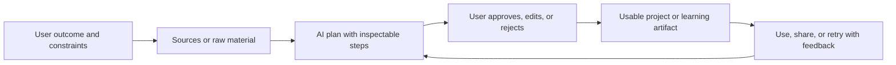

# AI-Native Consumer Agency: Personal Project Studios

**Context:** Track 02 — AI-native consumer agency. This report studies one opportunity space: products in which a person directs AI to turn a personally meaningful goal, source set, or intention into a usable project, artifact, or learning path while retaining authorship and bounded control.

---

## Opportunity space

The opportunity is not “an AI that chats.” It is a **personal project studio**: a persistent workspace where a user states an outcome, supplies sources or raw material, chooses constraints, and directs AI through inspectable stages toward an artifact they can use, revise, learn from, and optionally share.

Examples of jobs include: “turn my trip ideas into a realistic weekend plan,” “help me learn this topic from these papers,” “make a family history booklet from these photos and captions,” or “turn this club’s notes into a playable quiz and study pack.” The user is the director. AI performs bounded transformations, proposes alternatives, cites or shows inputs, and asks for approval before consequential actions. The product’s output is not an AI relationship; it is a **user-owned project with visible provenance**.

This is a product hypothesis, not a verified market fact. The evidence below shows that adjacent products already validate individual mechanics—source-grounded synthesis, prompt-directed creation, adaptive exploration, and guided practice—but they are fragmented by media and use case.

## What is already working: verified mechanisms

### 1. Source-grounded transformation creates a trustable agency loop

Google describes NotebookLM as grounding responses in uploaded material with citations and relevant quotes. Its Audio Overview turns documents, slides, and charts into a generated discussion, and the user can download the result for later listening. Google also explicitly warns that the result reflects the uploaded sources rather than a comprehensive or objective view, and notes experimental inaccuracies.[1]

**Mechanic:** provide sources → choose an intended transformation → receive a usable derivative → inspect citations or source links → refine the request. This is stronger than open-ended chat because the user controls the evidence boundary.

**Failure condition:** if citations are absent, hard to inspect, or do not support the claim, the product becomes a confident summarizer. If the generated derivative is not better than reading the source, repeat use collapses.

### 2. Prompt-to-first-draft compresses the blank-page problem

Canva’s Magic Studio says Magic Design can use a written prompt or uploaded media to create a design, while its presentation flow produces an outline and content that users can personalize. Its Magic Switch converts a design into other formats and languages, and its tools cover images, video, writing, editing, and animation.[2]

**Mechanic:** state intent → AI produces a coherent first draft → user edits at the level of details, style, and constraints → export or share a finished artifact. The durable value is time saved on structure and repetitive adaptation, not novelty from image generation alone.

**Failure condition:** outputs are generic, difficult to edit, or visually impressive but unusable. If users cannot preserve their own taste, voice, or factual responsibility, “AI agency” becomes replacement rather than empowerment and sharing becomes low-trust.

### 3. Bounded steering turns recommendation into exploration

Spotify’s AI DJ chooses a personalized music sequence, gives commentary, refreshes based on feedback, and lets the listener switch the genre, artist, or mood with a tap.[3] Spotify’s Prompted Playlist beta makes the control surface more explicit: users describe a vibe or scenario, set refresh cadence, refine tracks, edit the prompt, see notes explaining fit, and share a prompt that another Premium user can reuse to generate a personalized version.[4]

**Mechanic:** user supplies a direction, not a complete specification → AI proposes a sequence → user accepts, skips, edits, or narrows → the system learns from explicit feedback. Sharing is healthy when it shares a recipe or prompt while preserving each recipient’s agency.

**Failure condition:** personalization becomes opaque preference extraction, the system overfits historical behavior, or refreshes are merely content churn. The loop is not durable unless the user discovers something they value and can explain why it was selected.

### 4. Scenario-based practice makes AI useful for learning without pretending to be a person

Duolingo Max’s documented features include AI-powered Video Call and Roleplay. Roleplay places learners in real-world scenarios such as ordering coffee or asking for directions, then gives feedback on accuracy and complexity. Duolingo says humans write the scenarios and opening messages, experts align them to the course, and users can report inaccurate responses.[5]

**Mechanic:** choose a bounded goal → perform an active task → receive targeted feedback → retry with a changed scenario. This preserves human agency because the user practices and makes decisions; the AI supplies variation and feedback.

**Failure condition:** practice is entertaining but does not transfer to real performance; feedback is wrong; or the product relies on a character persona that encourages emotional dependence rather than skill development.

## Adjacent products and what they leave open

The closest alternatives are not absent; they are specialized:

- **NotebookLM:** source-grounded research and learning derivatives. Strong on evidence boundaries, weak as a general project system spanning multiple artifact types and collaborators.[1]
- **Canva Magic Studio:** AI-assisted visual and communication production. Strong on fast drafts and repurposing, but its center of gravity is design output rather than an auditable chain from goal, sources, decisions, and learning.[2]
- **Spotify DJ and Prompted Playlists:** personalized exploration with explicit steering and shareable prompts. Strong on low-friction repeat use, but the output is consumption rather than a user-owned project that compounds.[3] [4]
- **Duolingo Max:** structured practice and feedback. Strong on bounded learning loops, but narrow to language and dependent on substantial curriculum operations and review.[5]

The gap is therefore not “AI can make things.” The gap is a **cross-domain agency layer** that keeps the user’s goal, inputs, constraints, decisions, revisions, and resulting artifact in one place. It should be narrower than a universal assistant: a project has a declared outcome and a visible completion test.

## Demand jobs and observable outcomes

1. **Make a meaningful thing despite a blank page.** The user wants a first draft that reflects their intent and can be edited, not a generic answer. Observable outcome: time from idea to usable draft falls, and the user makes substantive edits rather than abandoning the result.
2. **Organize scattered material into a decision or story.** The user has links, notes, photos, recordings, or documents and wants a coherent brief, guide, itinerary, study pack, or family artifact. Observable outcome: sources are attached, claims are traceable, and the artifact is used outside the product.
3. **Explore a large choice space without surrendering taste.** The user wants discovery around a mood, constraint, identity, or occasion. Observable outcome: accepted recommendations lead to new saves, purchases, visits, or conversations, while skips improve future fit.
4. **Learn by doing with immediate, relevant feedback.** Observable outcome: the user completes a task, improves on a retry, and can explain the concept or perform it without the AI.
5. **Show identity through a finished object or chosen path.** People share a trip plan, reading map, playlist recipe, mini-course, zine, or project result because it says something about them. Sharing should communicate taste and invite participation, not pressure referrals.

These are hypotheses to test with behavioral data. The product should not infer demand from AI novelty, waitlist size, or social-media screenshots alone.

## Candidate product thesis

**A consumer “project studio” where people direct AI through bounded transformations of their own material to produce useful, inspectable, shareable projects—while every major step remains reversible, attributable, and under human approval.**

The smallest credible wedge is a single project type with high personal salience and repeatable inputs, such as “turn a topic and saved sources into a personalized learn-and-make pack.” A pack might contain a source map, a short explanation, a practice activity, and a shareable artifact. It should be possible to reuse the same workspace for a new topic or goal without rebuilding trust from zero.

The first 30 seconds should demonstrate agency rather than ask for a blank prompt:

1. Choose a concrete outcome: **learn**, **plan**, **make**, or **explore**.
2. Select one starter template with an explicit completion test.
3. Add one source, photo set, link, or short intention.
4. See a three-step plan: **what AI will do**, **what the user decides**, and **what will be produced**.
5. Approve a small first transformation and immediately get a cited, editable result.

A user should be able to reject the plan, change the constraints, or switch models without losing their material. The product must make the person feel like a director with leverage, not a passenger accepting a magical answer.

## Durable value and healthy sharing

Durable value comes from **compounding project memory**, not model novelty. A project accumulates the user’s sources, decisions, edits, preferences, and successful templates. Over time, the system should reduce repeated setup and improve fit while retaining a clear “why this exists” record. Export must remain possible so the user is not held hostage by the platform.

Healthy sharing has two layers. First, share the finished artifact or a read-only project view with provenance, source visibility, and an AI-assistance disclosure. Second, share the reusable recipe—goal, constraints, and transformation steps—so another person can generate their own version from their own material. This is more respectful than duplicating private context or using referral pressure. The recipient should get value even without joining, and the creator should not be ranked or paid for recruiting others.

A durable business model could be subscription for higher limits, private project storage, premium transformation quality, and export formats; or paid project packs with clear prices. It must not depend on paid chance, token gating, financial returns, or fear of losing progress.

## Distribution wedge

The wedge is **artifact-led sharing in communities that already exchange projects**, such as study groups, hobby clubs, family planning, book clubs, trip planning, and creator communities. The shared object is useful on its own: a source map, itinerary, quiz, visual guide, playlist recipe, or workshop plan. Each artifact demonstrates the product’s agency mechanic without requiring a viral claim.

A second wedge is “remix from a friend’s recipe”: the recipient can copy the structure, substitute their own sources, and keep the result private. This creates a natural invitation without referral pressure. Measure downstream completion and repeat project creation, not raw invite counts.

## Why blockchain is unnecessary by default

The core value is transformation quality, provenance, user control, and exportability. A conventional database can store project state, version history, permissions, citations, and audit logs more cheaply and with easier deletion, privacy controls, and moderation. A chain does not make an AI output more accurate, original, safe, or useful. It also does not solve rights ownership: the U.S. Copyright Office is separately examining copyrightability and training, and its report page identifies copyrightability as a distinct legal question.[6]

A chain would be justified later only if evidence shows all of the following:

- users repeatedly need portable, tamper-evident provenance across otherwise competing platforms;
- a specific rights, licensing, or attribution workflow cannot work with signed off-chain records and standard APIs;
- users value that portability enough to tolerate wallet/key complexity and transaction fees;
- the asset is not a speculative token, paid rank, token-gated access pass, or financial-return promise; and
- a prototype demonstrates materially higher trust, reuse, or creator compensation than an ordinary database.

Until then, use ordinary accounts, exportable files, signed manifests, and transparent version history. If a future chain component exists, it should be an optional verification rail, not the main loop.

## Critical constraints and failure modes

- **Cold start:** without personal sources, preferences, or a concrete project outcome, AI outputs are generic. The initial templates must provide useful constraints without forcing users into a persona.
- **Fake agency:** a prompt box can create the feeling of control while the system silently chooses sources, objectives, ranking, or irreversible actions. Show the plan, inputs, model boundaries, and approval points.
- **Trust and factuality:** source-grounding reduces but does not eliminate error. Preserve citations, uncertainty, and a report button. Never market generated explanations as authoritative by default.[1] [5]
- **Privacy and sensitive material:** users may upload journals, family photos, health details, schoolwork, or financial documents. The FTC warns that AI companies can face liability for violating privacy commitments, using data for undisclosed training, or omitting material facts about collection and use.[7]
- **Rights and identity:** Canva instructs users to have rights to images they edit, avoid unpermitted famous brands, characters, or people, review outputs, and disclose AI assistance. It also warns that similar prompts can produce similar work and that copyright protection varies by jurisdiction.[8] A project studio needs input-rights prompts, provenance, takedown, and impersonation safeguards.
- **Moderation:** cross-domain creation increases the surface area for misinformation, harassment, sexual content, impersonation, and copyright abuse. Safety must apply to inputs, transformations, public sharing, and remixing, not only to the initial prompt.
- **Operational burden:** Duolingo’s model illustrates that useful bounded AI requires human-authored scenarios, curriculum alignment, review, and user error reports.[5] The wider the domain coverage, the harder quality assurance becomes.
- **Economics:** multimodal generation, storage, and repeated retries can exceed subscription revenue. Put budgets and limits around expensive steps while keeping limits legible and avoiding manipulative scarcity.
- **Poor learning economics:** a product can generate a polished artifact while weakening the user’s skill. For learning projects, require active recall, explanation, or user edits so completion is not confused with comprehension.
- **Social risk:** public feeds invite spam and low-effort AI content. Default to private projects, small-group sharing, provenance labels, and useful remix permissions rather than engagement-maximizing feeds.
- **Regulatory exposure:** consumer-protection rules apply to claims about privacy, safety, ownership, and performance. The FTC explicitly states there is no AI exemption from existing law.[7]

## Strongest falsifier and test plan

The strongest falsifier is: **when users are given a concrete, source-backed project outcome and transparent control, they still prefer one-off chat or existing specialized tools and do not return to start a second project.**

Run a narrow pilot with one project type and 30–50 users. Require a real outcome, not a toy prompt. Track first-session time to a usable artifact, proportion of AI steps accepted versus edited, citation inspection, export/use outside the product, second-project creation within 30 days, and whether shared artifacts produce organic remixes. Interview users whose artifacts were used in the real world and users who abandoned after the first draft. Kill or narrow the thesis if repeated use is driven mainly by novelty, if users cannot articulate what they controlled, if error correction costs more than doing the work manually, or if sharing produces low-trust AI spam.

## Evidence confidence

**Medium-high for the existence of adjacent mechanisms; medium for the cross-domain opportunity.** Official product documentation verifies that source-grounded derivatives, prompt-directed creation, explicit recommendation steering, and bounded AI practice are real product mechanics. It does not verify that one general-purpose project studio will achieve unusually large scale. The cross-domain thesis remains a hypothesis that requires behavioral evidence on repeat projects, real-world use, trust, and unit economics.

## References

[1]: https://blog.google/innovation-and-ai/products/notebooklm-audio-overviews/ "Google: NotebookLM now lets you listen to a conversation about your sources"
[2]: https://www.canva.com/newsroom/news/magic-studio/ "Canva: Introducing Magic Studio: the power of AI, all in one place"
[3]: https://newsroom.spotify.com/2023-02-22/spotify-debuts-a-new-ai-dj-right-in-your-pocket/ "Spotify Newsroom: Spotify Debuts a New AI DJ, Right in Your Pocket"
[4]: https://support.spotify.com/us/article/prompted-playlists/ "Spotify Support: Prompted Playlists"
[5]: https://blog.duolingo.com/duolingo-max/ "Duolingo Blog: Introducing Duolingo Max, a learning experience powered by GPT-4"
[6]: https://www.copyright.gov/ai/ "U.S. Copyright Office: Copyright and Artificial Intelligence"
[7]: https://www.ftc.gov/policy/advocacy-research/tech-at-ftc/2024/01/ai-companies-uphold-your-privacy-confidentiality-commitments "FTC: AI Companies: Uphold Your Privacy and Confidentiality Commitments"
[8]: https://www.canva.com/help/using-magic-studio-safely-and-legally/ "Canva Help: Using Magic Studio safely and legally"
