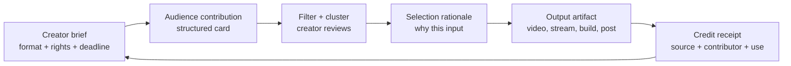

# Creator-owned interactive formats: contribution that survives the stream

**Context:** Evidence-driven product-opportunity track for creator tools and audience-participation formats across video, streaming, communities, and UGC. The target is voluntary repeat use with real audience credit and lower creator operating burden—not token speculation, paid chance, or artificial retention.

---

## Opportunity in one sentence

Build a **portable participation layer** that lets a creator publish a bounded prompt, collect structured audience contributions, show exactly which contributions influenced the episode or session, and close the loop with a reusable “credit receipt” that the contributor can share. The product should make participation legible and useful without requiring the creator to run a second community, manually sort a firehose, or promise money.

This is a product hypothesis, not a verified market fact. The evidence says the component behaviors already work separately: fan-started conversation, remix with source attribution, live voting, organized forum posts, and UGC catalogs. The gap is the cross-format operating layer that turns those behaviors into a repeatable creator-owned format.

## Demand jobs

### Audience jobs

- **“Let my contribution matter.”** A viewer wants to see that a question, clip, design, idea, test result, or vote changed what the creator made—not merely receive a like.
- **“Give me a low-risk way in.”** The first contribution should take seconds, work on mobile, and not require joining an unfamiliar Discord, learning creator-specific etiquette, or appearing on camera.
- **“Help me find my people.”** Participation should expose adjacent contributors and a shared artifact, not just increase comment volume.
- **“Give me portable credit.”** A contributor needs an auditable link or attribution card they can show elsewhere, without needing a financial asset or platform-native follower count.
- **“Let me return for the consequence.”** Repeat use comes from seeing the next episode, build, or stream incorporate the prior contribution.

### Creator jobs

- **Turn passive reach into useful inputs** such as questions, prompts, research leads, challenges, assets, and decisions.
- **Select and explain contributions quickly.** The creator needs a queue with deduplication, rights/permission state, safety filters, and an explicit reason for selection.
- **Preserve authorship while sharing agency.** Audience influence must not make the creator’s voice, editorial judgment, or brand promise ambiguous.
- **Reduce moderation and production work.** The mechanism must not add a parallel inbox, a second publishing calendar, or an unpaid social team.
- **Create discoverable credit.** The selected contributor and source should be visible in the output and easy to share without spammy referral pressure.

## Verified mechanisms and what they prove

The following are verified platform behaviors, not claims that any new product will achieve similar scale.

1. **Fan-initiated, continuous community conversation can reduce pressure to constantly publish.** YouTube’s Communities announcement explicitly says fan-started conversations can continue outside individual videos, with creator control over who can post, and frames this as taking pressure off creators to always make new content. It also reports early examples where fans shared progress, photos, questions, fan art, and game theories. [1]  
   **Failure condition:** fan initiation becomes an unmoderated inbox; the creator cannot distinguish useful signal from repetition, abuse, or off-brand content.

2. **Attribution makes remix contribution discoverable.** YouTube says Shorts made with remixed content are attributed back to the original work, with a source-video link in the Shorts player and source-audio links in the Sound Library. [2]  
   **Failure condition:** attribution is technically present but not socially meaningful; the contributor cannot tell whether the source creator saw, endorsed, or used the contribution, and rights changes can break the chain.

3. **A constrained live decision can be simple and repeatable.** Twitch Polls let monetized streamers ask a question, offer two to five options, show real-time results, and let moderators create/manage polls. Polls can also accept additional Channel Point votes. [3]  
   **Failure condition:** the interaction is only a popularity meter. Pay-to-weight voting, opaque decision rules, or a creator who ignores results creates fake agency and undermines trust.

4. **Interactive extensions can sit inside the viewing surface, but add setup and platform limits.** Twitch Extensions support third-party interactive experiences in the player, panels, and mobile; creators install, configure, activate, and manage slots, while viewers may need to grant permissions. Twitch documents caps of three panel, one overlay, and two component Extensions, plus mobile and console differences. [4]  
   **Failure condition:** every creator must install, configure, debug, and explain another tool. The feature becomes operational burden rather than a format.

5. **Structured community contribution improves retrieval and moderation.** Discord Forum Channels keep discussions in posts instead of a fast-moving chat, support tags, search, permissions, slow mode, closing/locking, and AutoMod. Discord recommends gradual rollout and private moderator testing. [5]  
   **Failure condition:** organization is mistaken for prioritization. Tags and search do not decide which contribution is on-brief, rights-cleared, safe, or worth producing.

6. **Reuse permission must be explicit and reversible.** TikTok lets creators choose who can Stitch, turn reuse off per post, and remove associated Stitch posts. It also warns that removing associated posts can permanently remove the original and all related Duets/Stitches. [6] TikTok Duet likewise requires a public account and lets creators limit access to Everyone or Friends. [7]  
   **Failure condition:** contributors do not understand downstream reuse, deletion propagation, or the difference between attribution and permission. A product that treats a submission as permanently licensed will create rights disputes.

7. **UGC can become a product catalog, but the creator-side value chain needs infrastructure.** Roblox’s UGC Homestore provides a template with mannequins, an integrated catalog, customizable parts, and support for displaying another creator’s catalog only after enabling third-party sales and valid sale locations. [8]  
   **Failure condition:** contribution requires asset production, marketplace eligibility, or sales integration that exceeds the audience’s motivation; the format becomes a storefront rather than a shared creative loop.

8. **Moderation cannot be assumed away by automation.** Twitch recommends AutoMod, verification, delays, blocked terms, and moderators, but also states that human moderation is still needed and that automated systems cannot catch everything or be 100% accurate. [9] Twitch’s guidelines make streamers responsible for taking steps to mitigate harassment, while unauthorized content can be removed under intellectual-property rules. [10]  
   **Failure condition:** the product’s “low burden” claim depends on an AI moderator making final calls, or shifts legal/safety risk to small creators who lack staff.

## Closest alternatives and the gap

- **YouTube Communities + posts/polls:** strongest incumbent for a creator-owned home and fan-started dialogue. Gap: contribution credit is not a first-class object, and the creator still has to identify what changed production.
- **YouTube Remix, TikTok Duet, and TikTok Stitch:** strongest attribution/reuse primitives for video. Gap: they optimize derivative publishing, not structured co-creation with a stated brief, selection rationale, and “used in episode” receipt.
- **Twitch Polls + Extensions:** strongest live participation and in-player interaction. Gap: polls often create a vote rather than a durable artifact; Extensions can increase installation and configuration work.
- **Discord Forums:** strongest low-cost structured community layer. Gap: it is a destination community that the creator must moderate and organize; contribution may remain buried in a server rather than connected to the public work.
- **Roblox UGC Homestore:** strongest adjacent proof that audience-created assets can become discoverable, usable inventory. Gap: it is optimized for marketplace/catalog behavior, not cross-platform editorial participation.

These are real competitors and substitutes. The opportunity is not “community exists nowhere”; it is the narrower coordination problem of **brief → contribution → selection → visible use → contributor credit → next brief** across media formats.

## Opportunity primitives

1. **A creator-owned brief:** one prompt with output type, deadline, eligibility, rights choice, safety boundary, and what “selected” means.
2. **Structured contribution cards:** text, link, image, short video, audio, poll option, or UGC asset with source URL, author, consent state, and machine-readable tags.
3. **Signal compression:** deduplicate near-identical ideas, cluster themes, filter obvious abuse, and surface representative examples; the creator makes the final editorial choice.
4. **Selection rationale:** a short creator-authored reason such as “used for the cold open,” “combined with three other submissions,” or “not selected because rights were unclear.”
5. **Credit receipt:** public, revocable attribution showing the contributor, original source, contribution type, date, and where it appeared. Credit is recognition and provenance, not a financial promise.
6. **Outcome artifact:** a clip, episode timestamp, changelog, gallery, recipe, build, or decision record that makes agency observable.
7. **Format templates:** “choose the next test,” “submit a prompt,” “remix this scene,” “design the next asset,” “find the error,” and “community challenge,” each with bounded moderation and rights defaults.
8. **Portable export:** a link or image card that points to the creator’s canonical record; no referral ladder, paid rank, token gate, or fear-of-loss streak.

## Candidate thesis

**Thesis:** The unusually large opportunity is not another audience chat. It is a **creator-owned contribution operating system** for repeatable interactive formats. It should let a creator turn a single prompt into a bounded, rights-aware intake; choose from compressed signal; publish the result in the creator’s existing channel; and give contributors durable, visible credit. The wedge is “I can prove my audience changed the work without adding a moderator shift.”

This thesis is plausible because each component has an adjacent precedent, but it remains unproven as an integrated product. The product should initially be a thin layer over existing distribution, not a new destination that needs its own empty feed.

### First 30 seconds

A viewer opens a creator’s link from a video description, live overlay, pinned comment, or community post. The page shows one concrete brief: **“Choose the next experiment; submit one option and explain why in 20 seconds.”** The viewer can contribute without signup, sees the rights choice in plain language, and receives a preview of the eventual credit. A creator sees a compact queue with duplicate clusters, safety flags, source links, and a one-click “use and credit” action. The first screen must demonstrate agency immediately; a generic profile, points balance, or token does not.

### Durable value source

Durable value comes from **better creator output and contributor identity**, not financial return. A creator gets structured research, prompts, assets, and decisions that can improve episodes or sessions. A contributor gets recognition, provenance, and a visible history of useful participation. The network becomes more valuable when a creator’s past briefs and outcomes form a searchable canon that helps newcomers contribute at the right level. Repeat use is earned by observable consequences: the next artifact references the prior contribution, and the contributor can verify that claim.

### Distribution wedge

Start with creators who already publish recurring series and have a clear audience promise: explainers, cooking, maker builds, games, book/video essays, and live challenge formats. The distribution unit is not a social feed; it is an embeddable brief card and a shareable outcome/credit card attached to an existing video, stream, community post, or Discord forum. A creator can run one brief manually with no code, then embed it after repeat demand is visible. Audience sharing should point to the contribution or outcome, not require inviting friends for status or rewards.

## Why blockchain is unnecessary by default

A chain does not solve the hardest problems here. It cannot determine whether an idea is original, safe, on-brief, rights-cleared, or actually used. It cannot make a creator’s selection rationale honest. Public attribution, revocation, privacy, moderation, and deletion are better served by conventional databases and signed records. On-chain permanence conflicts with creator and contributor requests to remove content, minors’ privacy, and rights takedowns. A token would also create the prohibited failure modes of financial speculation, paid rank, token gating, and a token-as-main-loop.

A blockchain becomes worth testing only if evidence shows a specific cross-platform problem that normal signed exports cannot solve: for example, **multiple independent platforms and creators need a shared, user-controlled provenance record for licensed contributions**, users actively request portability, and rights holders accept a revocable pointer model. The bar should be a measured user job, not “decentralization” as an aesthetic. A later pilot would need: (a) a non-chain control that users reject for a documented reason, (b) at least two distribution platforms willing to read the same provenance format, (c) explicit consent and deletion semantics, (d) no financial-return expectation, and (e) lower net operational cost after accounting for support and compliance.

## Critical constraints and failure modes

- **Cold start:** A brief with no credible creator or visible consequence is a form, not a format. Begin with existing recurring series and seed the first outcome from the creator’s own backlog.
- **Fake agency:** If selection is predetermined, contributions are decorative, or “community vote” can be ignored without explanation, trust collapses. Every brief needs a stated decision rule and a post-outcome explanation.
- **Moderation:** User submissions create harassment, spam, sensitive material, brigading, and safety issues. Auto-filtering should route uncertainty to human review; it must not make irreversible publication decisions.
- **Rights and consent:** A submission can contain third-party music, faces, trademarks, private information, or an idea that the contributor does not own. Use granular permission choices, provenance, takedown, and a clear distinction between suggestion and license.
- **Creator operations:** A queue can become a second job. The north-star metric should be **creator minutes saved per accepted contribution**, not number of submissions. Enforce bounded prompts, batch review, expiration, and caps.
- **Quality and selection bias:** Clusters can erase minority or novel ideas. Preserve representative examples and let creators inspect raw submissions before final use.
- **Economics:** Small creators may not pay for another SaaS tool. Test a free single-format tier and charge for workflow value such as moderation controls, exports, analytics, and team roles—not audience access or chance of selection.
- **Platform dependency:** APIs, embeds, remix permissions, and attribution surfaces can change. The product must export a readable record and work even if a platform removes an integration.
- **Privacy and minors:** Public credit can expose a pseudonym, voice, face, or location. Default to pseudonymous credit, age-appropriate flows, and deletion that propagates to public displays.
- **Regulatory and policy boundaries:** Avoid prize pools, wagering, paid chance, financial returns, manipulative streaks, and token gating. Treat creator selection as editorial participation, not an investment or gambling mechanic.
- **AI dependence:** AI may compress and flag, but the creator remains accountable for selection, rights, and safety. A product that depends on an autonomous persona to maintain the relationship risks fake intimacy and loss of authorial trust.

## Strongest falsifier and tests

The strongest falsifier is: **after running three recurring briefs with creators who already have active audiences, fewer than 20% of contributors return for a second brief and creators report no measurable reduction in research, moderation, or production time.** That would indicate the “visible agency plus lower burden” loop is not strong enough, regardless of initial novelty.

Test the thesis without building a new network:

1. Recruit 5–10 creators across video, live, and community formats with an existing recurring series.
2. Run two briefs per creator using a simple form, a spreadsheet/queue, and manually generated credit receipts.
3. Measure qualified contribution rate, repeat contribution within 30 days, percentage of selected inputs actually used, creator review minutes per accepted input, moderation incidents, rights disputes, and outcome-card share rate.
4. Interview contributors immediately after seeing the outcome. Ask whether they felt credited, whether they would contribute without a reward, and whether the result changed their willingness to share.
5. Kill or narrow the concept if creators spend more time triaging than they save, or if contributors care primarily about prizes, rank, or speculative value.

## Evidence confidence

**Medium-high for individual mechanisms; medium for the integrated opportunity.** Official documentation verifies the behaviors and constraints across YouTube, Twitch, Discord, TikTok, and Roblox. It does not prove a new cross-platform product will achieve high frequency, creator willingness to pay, or healthy sharing. YouTube’s Communities page reports early reactions from selected communities, so those examples are directional product evidence rather than general population demand. No claim here assumes virality or guaranteed scale.

## References

[1]: https://blog.youtube/news-and-events/a-new-youtube-communities-experience-for-fans-by-fans/ "YouTube: A new YouTube Communities experience for fans, by fans"
[2]: https://support.google.com/youtube/answer/10623810?hl=en&co=GENIE.Platform%3DAndroid "YouTube Help: Create YouTube Shorts with remixed content"
[3]: https://help.twitch.tv/s/article/how-to-use-polls "Twitch Help: How to Use Polls"
[4]: https://help.twitch.tv/s/article/how-to-use-extensions "Twitch Help: How to Use Extensions"
[5]: https://support.discord.com/hc/en-us/articles/6208479917079-Forum-Channels-FAQ "Discord Help: Forum Channels FAQ"
[6]: https://support.tiktok.com/en/using-tiktok/creating-videos/stitch "TikTok Help: Stitch privacy settings"
[7]: https://support.tiktok.com/en/account-and-privacy/account-privacy-settings/duets "TikTok Help: Duet privacy settings"
[8]: https://create.roblox.com/docs/marketplace/homestore "Roblox Creator Hub: UGC Homestore"
[9]: https://help.twitch.tv/s/article/setting-up-moderation-for-your-twitch-channel "Twitch Help: Setting Up Moderation for Your Twitch Channel"
[10]: https://safety.twitch.tv/s/article/Community-Guidelines "Twitch Safety: Community Guidelines"
