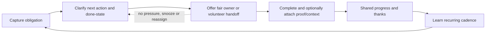

# Cognitive Relief and Recurring Life Utility: Cooperative Household Operations

**Context:** Track 04 for an evidence-driven consumer product discovery lab. This report studies one opportunity space: reducing the recurring coordination and follow-through burden of household life with an optional, non-coercive game layer.

---

## Opportunity space

The opportunity is a **shared household operations layer** for recurring chores, errands, appointments, forms, school logistics, meal planning, and “someone needs to remember this” work. The product is not another generic to-do list. Its job is to turn an unstructured household obligation into a clear next action, an owner, a due window, and a visible handoff—without making one person the permanent project manager.

The demand is credible because existing products already cluster around the same recurring jobs. Cozi describes a shared family calendar, reminders, to-do and chore lists, shopping lists, meal planning, and a daily agenda as one connected family-organizing product [1]. Apple Reminders supports shared lists, assignment, subtasks, attachments, and time- or location-based alerts [2]. Google Tasks supports creating, organizing, assigning, tracking, subtasks, reminders, and recurring tasks inside Workspace [3]. These are verified product capabilities, not proof that a new entrant will win.

The unmet opportunity is the **between-state** that ordinary task tools leave behind: deciding what counts as done, noticing that a recurring obligation is approaching, balancing invisible planning work across people, and making a handoff socially easy. A game layer can help with momentum and acknowledgement, but it cannot substitute for accurate ownership, trustworthy reminders, or real-world completion.

## Demand jobs and evidence

1. **Capture the obligation before it becomes a crisis.** A household member needs a low-friction way to record “renew the school form,” “buy detergent,” or “book the dentist” without opening a project-management system. The existence of shared lists, reminders, and agenda views in Cozi [1] and Apple Reminders [2] verifies that this is a durable product job.

2. **Convert a vague obligation into a next action.** “Plan dinner” may need a recipe choice, ingredients, shopping, and preparation. Cozi’s explicit recipe-to-shopping-list workflow [1] is evidence that reducing cross-list translation is valuable. A new product hypothesis is that the system should preserve the whole chain while exposing only the next useful step.

3. **Distribute ownership instead of broadcasting nagging.** Google Tasks documents task assignment and tracking [3]; Apple documents assigning people in shared Reminders [2]. The gap is behavioral: assignment must feel like a fair handoff, not surveillance or a public scorecard.

4. **Make recurring maintenance visible without creating shame.** Todoist’s Karma awards points for completed tasks, goals, recurring dates, reminders, and streaks, while allowing users to turn Karma off, set days off, use vacation mode, and reschedule [4]. These controls verify that progress feedback can coexist with pressure relief. They also reveal a failure mode: streaks and point loss can make a utility app feel like another obligation.

5. **Create a small moment of completion and mutual recognition.** Habitica verifies a stronger game layer: tasks become habits, dailies, and to-dos; completion earns avatar progression, rewards, and quests; friends can fight monsters together [5]. This demonstrates a mechanism, not evidence that an RPG wrapper is right for household coordination. The more realistic hypothesis is lightweight cooperative progress—shared “done” momentum and gratitude—rather than avatars, punishment, or competitive ranks.

## Verified adjacent mechanisms and what they teach

| Adjacent product or mechanism | Verified fact | Useful lesson | Failure condition |
|---|---|---|---|
| Cozi family organizer | Shared calendar, reminders, to-do/chore lists, shopping lists, recipe/meal planning, and daily agenda are bundled for family coordination [1]. | Utility compounds when related household objects share context. | A broad feature bundle can still leave the hard work—prioritizing, assigning fairly, and resolving ambiguity—to the household administrator. |
| Apple Reminders | Shared lists support collaboration; reminders can include assignees, subtasks, attachments, time alerts, and location alerts [2]. | Native, low-friction collaboration and context-triggered reminders are table stakes. | The product remains a list unless it helps decide ownership and completion criteria. |
| Google Tasks | Tasks can be created, organized, assigned, tracked, broken into subtasks, and made recurring in Workspace [3]. | Integrating with existing calendars and work surfaces lowers capture cost. | A work-oriented task model may not express household negotiation, fairness, or informal handoffs. |
| Todoist Karma | Completion and self-set goals earn points; overdue tasks can lose points; users can disable Karma, set days off, use vacation mode, and restore a recent streak [4]. | Opt-in progress feedback and recovery controls are safer than hard loss mechanics. | Points become a second status system, reward quantity over importance, or punish illness, travel, disability, or caregiving volatility. |
| Habitica | Habits, dailies, and to-dos feed avatar levels, rewards, quests, and cooperative monster battles [5]. | A game can make routine completion legible and socially shared. | Heavy game fiction increases setup cost, trivializes sensitive work, or creates pressure to perform for teammates. |

The table records verified product mechanisms. The proposed product direction below is hypothesis, not a claim about these companies’ outcomes or retention.

## Proposed loop (hypothesis)

The game-like layer should be **instrumental and removable**:

- **Visible progress, not scarcity:** a household sees “this week’s essentials are covered,” not a countdown designed to induce anxiety.
- **Cooperative milestones, not rank:** completing a set of real obligations can unlock a visual “calm week” or a shared celebration. No paid rank, public leaderboard, or comparison to strangers.
- **Choice architecture that preserves agency:** users can snooze, delegate, split, mark “not needed,” or turn off celebrations. A missed task should create a recovery path, not a loss spiral.
- **Meaningful acknowledgement:** a private thank-you, a note about what changed, or a record of reduced back-and-forth is more aligned with relief than collectible rewards.
- **No fake agency:** the system must label suggestions as suggestions, show why a reminder or assignment was proposed, and require confirmation before sending messages, submitting forms, buying items, or changing appointments.

## Current gaps worth testing

- **Fairness is not the same as equal task counts.** A product that counts chores can hide planning, emotional labor, interruptions, and unequal task difficulty. It needs a way to record ownership of the full loop, including anticipating and coordinating, without turning domestic life into an audit.
- **Recurring templates often encode the wrong cadence.** A household needs “after the last load” or “before the next school term,” not only fixed calendar dates. The product must let users correct the cadence and learn conservatively.
- **Handoffs are socially expensive.** “Assign to you” can feel accusatory. A better hypothesis is a private offer with an accept, trade, or ask-for-help state.
- **The value is distributed across a household but adoption starts with one person.** The solo user must receive immediate relief before inviting anyone else; otherwise the app is a coordination tax.
- **Trust is asymmetric.** Calendar, school, health, location, receipts, and household preferences are sensitive. The product should minimize data collection, provide export/delete controls, and make visibility per item explicit.
- **Generic AI can create more work.** Automatic decomposition is only useful when it reduces edits and does not invent deadlines, vendors, legal obligations, or family preferences. High-consequence actions need review and a provenance trail.

## Distribution wedge and first 30 seconds

The best wedge is a **single recurring pain with an observable handoff**, such as “shared school-week reset,” “weekly grocery-and-meal loop,” or “household renewal and paperwork inbox.” The invite should be a useful artifact—a clean shared plan or checklist—not a referral reward. Healthy sharing occurs when another person is needed to complete a real operation, not because the product withholds functionality until contacts join.

In the first 30 seconds, a user should be able to:

1. Choose one template such as groceries, school week, home maintenance, or renewals.
2. See five or fewer suggested next actions with editable “done” definitions.
3. Claim one action, offer another to a household member, or choose “later.”
4. Finish one tiny task and receive a calm progress confirmation.

This is a product hypothesis to test, not verified user behavior. The success criterion is not time in app; it is reduced missed obligations, fewer coordination messages, and repeat voluntary use because the household’s next week is easier.

## Durable value source

Durable value comes from a **trusted household operating memory**: recurring cadence corrections, accepted ownership patterns, item-level visibility, completion history, reusable templates, and integrations that eliminate duplicate entry. The system becomes more useful as it learns the household’s actual routines, but it must remain inspectable and editable. A private, exportable history of what was decided and when is more durable than points or a speculative asset.

A defensible product metric stack would include: time from capture to accepted owner; percentage of recurring obligations completed or consciously rescheduled; reduction in duplicate reminders or coordination messages; distribution of planning ownership; and 4-, 8-, and 12-week voluntary retention. Avoid using streak length, notification opens, or session time as the primary success metric.

## Constraints and ways the space fails

- **Cold start:** no shared value exists until enough household context is entered. Mitigation hypothesis: start from one high-frequency template and provide an immediate, useful plan without requiring a full household graph.
- **Trust and privacy:** sensitive schedules, locations, children’s information, health appointments, and receipts create breach and misuse risk. Privacy-by-default, granular sharing, encryption, deletion, and clear data retention are product requirements, not marketing copy.
- **Moderation and abuse:** if the product adds public templates, community challenges, or open sharing, it inherits user-generated-content duties. Google Play requires terms, robust ongoing moderation, reporting, and blocking [6]. Apple requires filtering, reporting, timely response, blocking, and contact information for UGC [7]. The lowest-risk initial design is private household spaces and curated templates, not a public social feed.
- **Children and family data:** a child-directed experience or actual knowledge of users under 13 can trigger COPPA requirements [8]. Avoid designing around children’s profiles in the first version; support adult-managed household tasks with minimal child data.
- **Rights and content provenance:** recipes, school forms, vendor instructions, and community templates may be copyrighted or inaccurate. Store links and user-owned notes by default; license any included content; show source and date for imported instructions.
- **Operational burden:** integrations break, calendars disagree, reminders become noisy, and support cases involve real missed appointments. Start with reversible, low-consequence actions. Do not autonomously send, purchase, submit, or reschedule without explicit confirmation.
- **Poor economics:** consumer willingness to pay may be modest while support, syncing, storage, privacy, and moderation costs grow. A premium household subscription or employer/benefit distribution could work, but must be tested rather than assumed.
- **Fake-agency risk:** a polished “AI household manager” can create the illusion that work is done when only a suggestion was generated. Every external action needs a visible status: suggested, awaiting approval, sent, confirmed, or failed.
- **Manipulation risk:** fear-of-loss streaks, guilt notifications, competitive chore scores, paid chance, referral pressure, token gating, and rank purchases are incompatible with the stated mission. Recovery, pause, and quiet modes should be first-class.

## Blockchain assessment

A blockchain is unnecessary by default. The core value is private coordination, reliable reminders, integrations, and a shared record that can be edited or deleted. A chain adds key management, transaction fees or infrastructure cost, privacy and deletion complications, app-store/payment complexity, and new support failure modes without improving the central user job. A token would also invite speculation, confuse progress with financial return, and violate the requirement to avoid token-as-main-loop or passive financial returns.

Evidence that could justify a later, narrowly scoped chain experiment would have to be specific: (1) users repeatedly need a portable, user-controlled proof of contribution or completion across unrelated services; (2) multiple independent providers agree to honor the same credential; (3) users explicitly prefer that portability over an ordinary signed export; (4) the data can be public or selectively disclosed without exposing household-sensitive information; (5) the system remains useful without holding a token or paying for chance; and (6) measured reliability, cost, recovery, and legal/privacy performance beat a conventional database. Until all six are demonstrated, use ordinary infrastructure and cryptographic signatures or exports where provenance is needed.

## Candidate thesis and strongest falsifier

**Candidate thesis:** A private, cooperative household operations product can earn durable weekly use if it removes the invisible coordination layer—not merely records tasks—and uses an optional “calm progress” layer to make completion and fair handoffs satisfying without pressure. Its moat is trusted, editable household memory plus low-friction cross-person handoffs, not an asset, persona, or public social graph.

**Strongest falsifier:** In a controlled pilot with households that already use a calendar or list tool, the product fails to produce a sustained reduction in missed or duplicated obligations and coordination messages after 8–12 weeks, while users either stop inviting household members or report that the game layer adds guilt, noise, or administrative work. That result would falsify the thesis even if initial activation and novelty are high.

## References

[1]: https://www.cozi.com/feature-overview/ "Cozi Features Overview"
[2]: https://support.apple.com/guide/iphone/share-and-collaborate-iph2a8f9121e/ios "Apple iPhone User Guide: Share and collaborate in Reminders"
[3]: https://workspace.google.com/products/tasks/ "Google Workspace: Google Tasks"
[4]: https://www.todoist.com/help/todoist/features/introduction-to-karma-OgWkWy "Todoist Help: Introduction to Karma"
[5]: https://habitica.com/ "Habitica: Gamify Your Life"
[6]: https://support.google.com/googleplay/android-developer/answer/9876937?hl=en "Google Play Policy: User Generated Content"
[7]: https://developer.apple.com/app-store/review/guidelines/ "Apple App Review Guidelines"
[8]: https://www.ftc.gov/legal-library/browse/rules/childrens-online-privacy-protection-rule-coppa "FTC: Children's Online Privacy Protection Rule (COPPA)"
