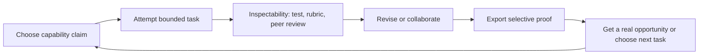

# Identity, mastery, and visible capability

Context: Product-discovery-lab track 05 — research into portable, privacy-controlled proof of capability rather than follower counts, spending, or speculative ownership.

---

## Opportunity space

The opportunity is a **portable proof-of-capability layer built around small, inspectable acts of work**: a person chooses a skill claim, completes a bounded challenge or contribution, receives structured peer or expert review, and exports a selective proof that can be shown to a collaborator, teacher, client, or employer. The product is not a generic social profile and not a leaderboard-first game. Its core object is an evidence bundle: artifact, task brief, constraints, contribution history, review rationale, and the person’s chosen visibility.

This space has real demand signals but no guarantee of mass virality. GitHub already makes contributions, pinned repositories, achievements, and activity timelines visible, while allowing private activity to be anonymized or hidden.[^1][^2] Stack Overflow defines reputation as a rough measure of community trust earned by convincing peers that one knows what they are talking about; reputation also unlocks moderation and participation privileges.[^3] Kaggle combines quality work, medals, tiers, rankings, non-competitive badges, and collaboration across competitions, datasets, and code.[^4] These are evidence that people will repeatedly produce work and accept status signals when the signal is connected to a real contribution.

The gap is cross-domain and audience-specific: existing systems are usually trapped inside one community, optimized for activity volume or competitive rank, or too difficult for a verifier to interpret. A useful new product would let someone prove “I can do this kind of work under these constraints” without exposing a full identity, private repository, follower graph, or lifetime activity stream.

## What is verified versus hypothesized

**Verified facts.** GitHub profiles can show pinned public repositories, achievements, contribution graphs, and detailed contribution activity; private contributions can be shown in anonymized form, and achievements can be hidden.[^1][^2] Stack Overflow reputation is earned primarily through peer-voted questions and answers, and higher reputation grants additional privileges.[^3] Kaggle explicitly uses medals, tiers, rankings, badges, and awards to represent different kinds of progress; rankings decay to reflect recent achievement, while badges support non-competitive exploration.[^4] Duolingo reports that it tested leaderboards in 2018, found that competition worked for many learners, matches people with similar study habits and time zones, and offers an opt-out by disabling public profile visibility.[^5] 1EdTech’s Open Badges specification supports a single verifiable achievement with issuer, earner, criteria, evidence, and optional endorsements; the credential can be shared electronically and imported into wallets.[^6] W3C’s Verifiable Credentials Data Model defines issuer-holder-verifier roles, tamper-evident proofs, privacy considerations, and selective-disclosure/derived-presentation possibilities.[^7]

**Product hypotheses.** A cross-domain “proof card” can create more useful status than a follower count if the proof is quick to inspect, scoped to a specific claim, and backed by a credible reviewer or reproducible test. A bounded challenge can create a repeat loop when the user gets immediate diagnostic feedback, sees a concrete improvement path, and can reuse the resulting proof elsewhere. Selective disclosure should increase sharing because users can show one capability without publishing their whole identity or history. These are hypotheses to validate with behavior, not claims established by the sources.

## Adjacent products and mechanisms

1. **GitHub — contribution history plus privacy controls.** The durable unit is real work attached to a repository, not a self-description. Pinned work makes a portfolio legible; the contribution timeline gives context; anonymized private activity protects confidentiality.[^1][^2] The weakness is that contribution counts are an imperfect proxy for quality, and the proof is most legible to people who already understand software development.

2. **Stack Overflow — peer judgment converted into reputation and privileges.** The mechanism links helpful answers to reputation, then turns accumulated trust into governance capabilities. This is stronger than a decorative badge because the status changes what the user can do.[^3] It also exposes the risk of popularity and voting dynamics: reputation can reflect community fit, topic choice, and moderation norms as much as transferable skill.

3. **Kaggle — artifact quality, competition, and non-competitive progression.** Medals and tiers reward repeated high-quality work; rankings measure recent performance; badges and courses give non-competitive routes; datasets and notebooks make contribution visible.[^4] The product lesson is to separate “I explored and learned” from “I beat a field,” rather than forcing every user into a single rank.

4. **Duolingo — time-boxed comparison and opt-out.** Weekly leagues create a recurring benchmark and a reason to return; matching by study habits and time zone reduces some unfairness; the documented opt-out acknowledges that competition is not universally healthy.[^5] The caution is that XP is a proxy for activity, not necessarily language proficiency. A capability product should avoid confusing visible effort with validated competence.

5. **Open Badges and Verifiable Credentials — interoperable achievement assertions.** 1EdTech’s model makes evidence, criteria, issuer, and endorsements first-class metadata, while W3C defines a standard issuer-holder-verifier exchange with cryptographic proof and privacy considerations.[^6][^7] These are infrastructure standards, not proof that an open consumer network will have trusted issuers or willing verifiers.

## Demand jobs and repeat-use mechanics

The likely jobs are:

- **“Help me know what I can actually do.”** A short challenge should produce a concrete artifact and explain the gap between current and target performance.
- **“Let me be judged on work, not audience size.”** The user needs an evidence-first profile that can omit follower counts and hide unrelated history.
- **“Give me a credible way to show one capability.”** A selective proof link should answer the verifier’s question in under a minute: task, constraints, artifact, evaluation, reviewer, date, and limits.
- **“Help me find people at the right level to learn or collaborate.”** Matching should use demonstrated interests and complementary evidence, not popularity.
- **“Let my contribution count even when I am not the public face.”** Team contributions need attribution that is granular, consented, and revocable.

A healthy repeat loop is: **choose a claim → attempt a bounded task → receive inspectable feedback → revise or collaborate → earn a scoped proof → share only where useful → unlock a harder or adjacent task**. The loop is valuable because each cycle improves skill and produces a reusable artifact; the status is a by-product of work rather than the only reward.

**Healthy sharing** comes from utility: a collaborator requests the proof, a learner sends it to a mentor, or a hiring manager opens it to evaluate a specific claim. Avoid referral pressure, public shame, paid rank, and fear-of-loss streaks. A share should never require exposing private inputs or a permanent social graph.

## Current gaps and opportunity primitives

The strongest gaps are:

- **Cross-context portability:** GitHub, Kaggle, and Stack Overflow proofs are valuable inside their communities but do not provide a neutral, user-controlled layer for comparing unlike evidence.
- **Interpretability:** raw activity graphs and scores rarely state what was tested, under which constraints, or how much help was used.
- **Privacy control:** users need claim-level visibility, expiring links, redaction of private work, pseudonymous participation, and the ability to revoke a proof without deleting the underlying learning record.
- **Attribution:** team work, mentoring, editing, and maintenance are difficult to represent without rewarding only the most visible contributor.
- **Assessment quality:** automated grading can be cheap but brittle; peer review can be meaningful but costly and gameable.
- **Non-competitive progress:** Duolingo and Kaggle show the value of alternatives to rank, but a new product must make personal improvement and contribution as legible as winning.

Useful primitives are **claim cards**, **task templates with explicit constraints**, **artifact lineage**, **rubric-based review**, **reviewer calibration**, **consent-based co-credit**, **selective proof links**, **expiry/revocation**, **portable export**, and **reputation for review quality rather than mere volume**. These are product primitives, not a feature checklist: each must make a proof more credible or a learning loop more useful.

## Candidate thesis

**Candidate thesis (hypothesis):** Build a “proof-of-work portfolio” where people complete small real-world challenges and collaborations, receive structured human-plus-tool evaluation, and carry privacy-controlled capability proofs across communities. The wedge should begin with one high-frequency, artifact-rich domain—such as open-source maintenance, data analysis, design critique, or language practice—then expand only when the same evidence schema and verifier behavior transfer.

The first 30 seconds should show one relevant claim, one sample task, and one finished proof. A new user should be able to choose “I want to demonstrate X,” preview the rubric and privacy options, and either attempt a five-minute task or inspect a real proof without creating a public follower profile. Do not lead with an empty social feed, token, rank, or AI persona.

Durable value comes from **trustworthy evidence and skill improvement**: a growing set of artifacts with provenance, feedback that makes the next attempt better, and proofs that are useful in an external decision. This creates switching cost through accumulated work and calibrated assessment, not lock-in or speculative ownership.

A plausible distribution wedge is **embedded proof requests**: mentors, project maintainers, course instructors, and small teams invite candidates to complete the same bounded task and compare evidence. The recipient opens a proof because it answers a real question. Public sharing can follow, but it should be an optional export—not the acquisition loop.

## Chain assessment

A blockchain is unnecessary by default. Ordinary signed database records, exportable JSON/JSON-LD credentials, HTTPS links, key rotation, and W3C/1EdTech-compatible verification can provide portability, revocation, privacy, and low-cost updates without public metadata leakage or wallet friction.[^6][^7] Public-chain permanence conflicts with editable evidence, deletion requests, confidential work, and claim-level privacy. A token would also create pressure toward speculation, paid rank, or token-as-main-loop, none of which is needed to validate capability.

A chain could be justified later only if evidence shows a specific multi-issuer problem that a neutral append-only registry solves better than federated signatures: for example, independent organizations need to verify the same credential after the issuer disappears; users need a non-custodial portability guarantee across competing providers; and a pilot demonstrates that public-chain costs, privacy leakage, revocation design, key recovery, and compliance are acceptable. Even then, store hashes or status proofs—not artifacts, personal data, reviewer comments, or social graphs—off-chain. The burden of proof is a measurable reduction in verification cost or issuer dependence, not ideological preference.

## Critical constraints and ways this fails

- **Cold start:** without credible tasks and reviewers, proofs are empty; without verifiers, users have no reason to earn them. Start with a narrow domain and one anchor institution or community, not a universal marketplace.
- **Trust and assessment:** fake artifacts, coaching, answer leakage, AI-assisted work, collusive reviews, and rubric gaming can make a proof look precise while being meaningless. Require reproducible tests where possible, disclose assistance, calibrate reviewers, and display uncertainty and scope.
- **Moderation and safety:** user-submitted work can include harassment, copyrighted material, personal data, or unsafe instructions. Moderation and appeals are core operating costs, not later polish.
- **Rights and attribution:** collaborative artifacts may belong to employers, clients, or teams. Consent, license metadata, redaction, co-credit, and revocation must be first-class.
- **Privacy and regulation:** a capability record can become sensitive employment or education data. Minimize collection, support pseudonyms and expiring links, avoid inferring protected traits, and obtain legal review for jurisdictions where credentials affect hiring or admissions.
- **Operational burden:** high-quality human review is expensive; automated evaluation is domain-specific and can drift. Unit economics fail if every proof needs expert labor.
- **Poor economics:** users may value proofs but not pay; employers may prefer incumbent screening; institutions may demand procurement and integrations. Test willingness to pay and verifier completion rates before building a broad network.
- **Fake agency:** an AI coach can make progress feel real while doing the work itself, or a polished generated artifact can impersonate mastery. The product must disclose tool use, preserve process evidence, and reward explanation and revision—not just output polish.
- **Status distortion:** a global leaderboard can reintroduce popularity, time-zone, and resource advantages. Prefer scoped comparisons, personal baselines, and contribution roles; make public rank optional.

## Falsifiers and decision gates

The strongest falsifier is **external verifiers do not change behavior**: after seeing a proof, mentors, collaborators, or hiring decision-makers cannot distinguish it from an ordinary self-claim and do not use it to make a decision. A related falsifier is that users complete one challenge but do not voluntarily return for a second unless offered rank, fear of loss, paid chance, or referral rewards. That would indicate a status toy rather than a durable capability product.

Early evidence should therefore measure: proof-open-to-action rate; percentage of verifiers who can correctly summarize the claim and limits; repeat completion without coercive retention; improvement between attempts; reviewer agreement; abuse and appeal rates; share rate when a real request exists; and cost per trustworthy proof. A promising result is not “many badges.” It is repeated production of better work plus verifiers taking useful action.

## References

[^1]: GitHub Docs, “Contributions on your profile.” https://docs.github.com/en/account-and-profile/concepts/contributions-on-your-profile
[^2]: GitHub Docs, “Manage visibility settings for private contributions and achievements.” https://docs.github.com/en/account-and-profile/how-tos/contribution-settings/manage-visibility-settings-for-private-contributions-and-achievements
[^3]: Stack Overflow Help, “What is reputation? How do I earn (and lose) it?” https://stackoverflow.com/help/whats-reputation
[^4]: Kaggle, “Tracking Your Progress on Kaggle.” https://www.kaggle.com/progression
[^5]: Duolingo Blog, “How do Duolingo Leaderboards work?” https://blog.duolingo.com/duolingo-leagues-leaderboards/
[^6]: 1EdTech, “Open Badges.” https://www.1edtech.org/standards/open-badges
[^7]: W3C, “Verifiable Credentials Data Model v2.0.” https://www.w3.org/TR/vc-data-model-2.0/
