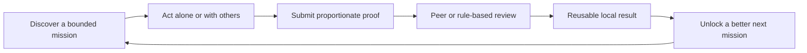

# Collective action: low-friction missions with credible proof

_Track 06 — Communities, missions, and real-world coordination; research memo for the evidence-driven consumer product discovery lab (2026-10-02)_

---

## 📋 Executive read

**Opportunity space.** A lightweight mission layer for everyday places and interests: a person can complete a useful, bounded task alone, while nearby people make the result faster, richer, safer, or more trustworthy. The unit is not “join a social network”; it is **mission → evidence → contribution → visible local progress**.

**Candidate thesis (hypothesis, not verified fact).** The strongest wedge is a *local discovery-and-verification relay*: publish a small mission with a clear finish line (for example, document an accessibility barrier, verify a public amenity, map a trail condition, or collect a structured observation); accept a photo, timestamp, coarse location, checklist, or peer confirmation as proof; make the result reusable by a neighbor, organizer, researcher, or public-interest partner. The product should work with one person and improve with a second person’s independent corroboration or complementary contribution.

This is deliberately not a token loop, paid chance, financial return, referral pressure, or fear-of-loss mechanic. The value is the completed real-world record and the coordination it unlocks.

## 🔍 Verified mechanisms and adjacent products

The table separates observed product behavior from implications for a new product. “Failure condition” is where the mechanism breaks or becomes unsafe.

| Mechanism | Verified evidence | Product implication | Failure condition |
|---|---|---|---|
| **Private shared goals and progress** | Strava Group Challenges let invited athletes set time-bounded goals, track progress, compare results, view a challenge photo stream, and choose competitive or cooperative “group goal” modes. Creators can invite up to 199 followers; the feature is mobile-only and requires subscription/free trial for participation.[^1] | A mission can be legible as a bounded goal with progress, and cooperation can coexist with comparison. Keep a free solo path; do not make social presence a prerequisite. | Leaderboards turn a useful task into performance theater; subscription or invite limits add friction; app-only participation excludes some users. |
| **Action anchored to a physical object and a durable log** | Geocaching directs a participant to a nearby cache, gives navigation and hints, asks them to sign the physical log and replace the container, then log the find online.[^2] | A small, concrete action plus an offline proof artifact creates a repeatable discovery loop and a shared place history. | Physical placement/maintenance, trespass, vandalism, accessibility, and safety become operational liabilities; a digital check-in alone is easy to fake. |
| **Open contribution with optional group projects** | iNaturalist says observations and identifications are the core experience; projects collate observations, can run “bioblitzes,” and can communicate with participants. Its own guidance says projects require sustained engagement, outreach, and active curators; it warns that valuable prizes can incentivize careless or false contributions.[^3] | Make the individual contribution useful before a group exists. Use modest recognition and quality signals, not high-value rewards or volume-only rankings. | “Build it and they will come” fails; moderation and curation cost grows with participation; volume incentives degrade data quality. |
| **Structured records plus expert/automated review** | eBird combines automated filters with regional experts. Unusual records can be flagged for rarity, season, or high count; contributors may add notes, photos, or audio, and volunteer reviewers may contact them.[^4] | Proof should be graduated: low-cost evidence for ordinary missions, stronger evidence or peer review for unusual/high-impact claims. Explain flags as quality work, not punishment. | Review queues, volunteer burnout, false positives, and expertise gaps make “verified” expensive; contributors may hide or alter unusual results. |
| **Real-life event coordination requires a host and safety boundaries** | Meetup requires events to create a growth/community opportunity, have an in-person host, and be honest and transparent about purpose, costs, affiliations, and expectations. It prohibits dangerous/criminal activity, misinformation, financial guarantees, and concealed intentions.[^5] | A digital mission product that triggers physical meetups needs explicit host responsibility, disclosure, reporting, and age/safety policies from day one. | The platform becomes an event-operations and trust-and-safety business; incidents, venue disputes, and misleading missions can overwhelm a small team. |
| **Proof has a privacy trade-off** | Strava activity visibility can be Everyone, Followers, or Only You. Followers/Only You activities may not qualify for public leaderboards or some challenges; public activity can expose maps, photos, and details, while challenge progress may remain visible even when the activity is private.[^6] | Offer coarse location, delayed publication, redaction, private proof shared only with a verifier, and explicit consent. A mission should not require publishing a home/work route. | More privacy reduces discoverability and comparability; more public proof creates stalking, sensitive-location, and re-identification risk. |
| **Recurring volunteer infrastructure can sustain a simple ritual** | parkrun describes free weekly 5K community events organized by local volunteers, with walking, running, volunteering, or spectating as valid participation modes.[^7] | Repeat use can come from a reliable cadence and multiple roles, not from an app streak or prize. | Dependence on local volunteers and course logistics creates uneven coverage and operational fragility. |

### A loop worth testing

The **solo-first** property matters: no empty room should block the first useful action. The group layer should add independent corroboration, task splitting, safety check-ins, or synthesis—not merely likes.

## 🎯 Demand jobs and unmet needs

These are demand hypotheses informed by the mechanisms above, not survey-validated facts:

- **“Help me make a small, visible improvement nearby without organizing a committee.”** The task must be completable in 5–20 minutes and have a clear done state.
- **“Help me discover places or facts I would not notice alone.”** The mission provides a reason to go somewhere, observe carefully, or talk to a local.
- **“Let my contribution remain useful after I leave.”** A structured record, map update, accessibility note, or ecological observation is more durable than a reaction count.
- **“Give me enough evidence to trust a stranger without exposing me.”** Independent confirmations, evidence tiers, and coarse location are preferable to identity theater.
- **“Let me contribute at my capacity.”** Photo, verification, translation, route check, hosting, and data cleanup should be interchangeable roles; walking/running performance cannot be the only status path.
- **“Help me find the right next action.”** A mission should resolve ambiguity: what to do, where, by when, what counts as proof, and who benefits.

The gap is not “another community feed.” Existing products are strong within a domain—exercise, caches, species, birds, events—but leave a cross-domain coordination gap: **small missions with consistent evidence, privacy controls, handoffs, and a durable beneficiary**. That is a hypothesis requiring field interviews and a live pilot, not a claim that incumbents are absent.

## 📚 Opportunity primitives and product shape

1. **Mission cards:** bounded task, estimated time, accessibility, risk level, location precision, evidence required, expiry, and beneficiary.
2. **Solo-valid proof:** photo/checklist/audio/QR/NFC/short note, with time and coarse location by default; no GPS theater when it adds no value.
3. **Evidence ladder:** self-attested → structured media → independent corroboration → qualified review. Escalate only when the claim is unusual or consequential.
4. **Contribution roles:** do, verify, interpret, host, translate, repair, or synthesize. People can improve a mission without doing the physical action.
5. **Handoff state:** open → attempted → needs corroboration → verified → acted on → archived. The beneficiary can acknowledge whether the result changed anything.
6. **Healthy sharing:** share the mission brief or aggregate result, not a pressure link or personal leaderboard. Sharing should recruit a useful role, not a referral.
7. **Local and online modes:** a mission can be a neighborhood observation, a remote document check, or a hybrid event; the proof contract remains explicit.
8. **Organizer tooling:** templates, capacity limits, safety checklist, moderation queue, export, and deletion/retention controls. Avoid requiring a permanent community manager for every mission.

**First 30 seconds (hypothesis).** Show three nearby missions with time, effort, accessibility, and beneficiary labels; let the user tap “Do this solo,” see exactly what counts as proof, and submit a first result without creating a group. After submission, offer one optional action: “verify someone else’s result” or “split the next mission with two nearby people.”

**Durable value source.** The asset is a trusted, permissioned stream of local facts and completed work: better access information, maintained places, higher-quality observations, or resolved community needs. Durability depends on downstream use and correction history, not badges. A mission that no one uses after completion is a failed experiment.

**Distribution wedge (hypothesis).** Start with one dense partner-led use case where a beneficiary already has distribution—e.g., a parks group, accessibility nonprofit, university field course, or neighborhood association. Seed a finite set of missions and a named steward; only expand categories after repeat completion and beneficiary action are demonstrated. Broad “any mission anywhere” launch is a cold-start trap.

## ⚠️ Constraints, failure modes, and falsifiers

- **Cold start:** Without nearby missions, a map is empty; without contributors, missions expire. Seed supply through partners and measure completion, not signups.
- **Trust and fake agency:** A photo can be old, staged, copied, or unrelated. Never imply that a checkmark means truth; show evidence level, timestamp, corroboration, and uncertainty. For consequential claims, route to a qualified authority.
- **Moderation and safety:** Public missions can become harassment, trespass, surveillance, dangerous exploration, political targeting, or doxxing. Require reporting, blocklists, geofenced exclusions, age rules, host requirements, and rapid takedown. Meetup’s policies show the breadth of this burden.[^5]
- **Rights and privacy:** Photos, recordings, faces, private land, sensitive habitats, and accessibility reports have different rights and risks. Default to least-precise location, consent for people, retention limits, and export/delete controls.
- **Operational burden:** Physical missions need maintenance, venue coordination, exception handling, and sometimes insurance. Prefer missions whose beneficiary can accept or reject results asynchronously.
- **Quality economics:** Human review is costly. Automated checks can triage but cannot create expertise. Model a budget per verified result and avoid high-value prizes that invite gaming, consistent with iNaturalist’s warning.[^3]
- **Regulatory and policy exposure:** Do not promise health outcomes, financial gains, or regulated advice; avoid paid chance, wagering, or token gating. Local laws may affect recording, location data, youth participation, volunteering, and liability.
- **Poor unit economics:** A free mission with no beneficiary budget can generate support costs without revenue. Potentially defensible revenue is organizational workflow, verification/export, or sponsored public-interest work—but sponsors must not distort evidence or target vulnerable participants.
- **Uneven access:** GPS, smartphones, transport, language, disability, weather, and neighborhood safety create selection bias. Provide remote roles, offline capture, low-bandwidth mode, and accessibility metadata.
- **Retention theater:** Streaks, expiring rewards, paid rank, and fear of losing status are prohibited design directions. Repeat use must follow useful missions, social reciprocity, and visible real-world outcomes.

**Strongest falsifier.** In a 6–8 week pilot with one partner and 100 invited participants, if fewer than 25% of first-time participants complete a second mission without a prize/referral push, and fewer than 20% of verified results are used or acknowledged by the named beneficiary, then the thesis that reusable local proof creates voluntary repeat use is probably false (or the mission design/partner is wrong). The pilot should also track false-proof rate, median review minutes, safety incidents, privacy opt-outs, and completion by accessibility mode.

## 🔗 Chain assessment

**Blockchain is unnecessary by default.** The core data are mutable, contextual, privacy-sensitive, and often require correction, deletion, moderation, or access control. A conventional database with signed audit logs, role-based permissions, object storage, and exportable evidence is faster, cheaper, easier to moderate, and compatible with privacy obligations. A public chain would make deletion and redaction harder, expose metadata, add wallet/key friction, and not solve the hard problem: whether a person actually completed a mission or whether the result is useful.

**Evidence that could justify a chain later:** only after a live product demonstrates a multi-party coordination problem that cannot be solved by signed server attestations. Specifically, require (1) at least two independent organizations that do not trust one operator, (2) a measured need for portable, tamper-evident provenance across those organizations, (3) user research showing custody/portability value outweighs wallet and privacy costs, (4) a design where no token is required for access, status, or safety, and (5) legal/privacy review showing the immutable record contains no personal or sensitive location data and supports revocation through off-chain pointers. If those conditions are not observed, do not add a chain.

## 📊 Evidence plan and decision rule

Separate **verified facts** above from **product hypotheses** explicitly in experiment notes. The next research sprint should:

- Interview participants and beneficiaries about the last time a small local task failed because coordination or proof was missing.
- Prototype three mission types: one physical discovery, one remote verification, and one recurring event-support task.
- Run a concierge pilot with no token, no prizes, no referral rewards, and no public leaderboard.
- Measure solo completion, second-mission rate, corroboration rate, beneficiary action, review minutes, false-proof reports, safety/privacy incidents, and cost per useful result.
- Kill or narrow the concept if repeat use is driven mainly by social pressure, artificial scarcity, rank, or rewards rather than useful outcomes.

## References

[^1]: Strava. (2026). “How Do Group Challenges Work on Strava?” https://support.strava.com/en-us/articles/15401736-how-do-group-challenges-work-on-strava

[^2]: Geocaching. (n.d.). “Geocaching 101: How to geocache.” https://www.geocaching.com/guide/

[^3]: iNaturalist Help. (2026). “Understanding Projects on iNaturalist.” https://help.inaturalist.org/en/support/solutions/articles/151000176472-understanding-projects-on-inaturalist

[^4]: Cornell Lab of Ornithology / eBird. (2023). “The eBird Review Process.” https://support.ebird.org/en/support/solutions/articles/48000795278-the-ebird-review-process

[^5]: Meetup. (n.d.). “Meetup groups and events policies.” https://help.meetup.com/hc/en-us/articles/360002897712-Meetup-groups-and-events-policies

[^6]: Strava. (2026). “How Do My Activity Privacy Controls Work on Strava?” https://support.strava.com/hc/en-us/articles/216919377-Activity-Privacy-Controls

[^7]: parkrun. (n.d.). “parkrun.” https://www.parkrun.com/
