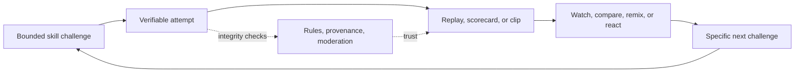

# Competition, spectacle, and replay: proof-of-skill artifacts

Context: Evidence-driven consumer product discovery lab; this track tests research games, prediction-free competition, skill challenges, spectator loops, and replayable artifacts without wagering, loot boxes, pay-to-win, or fear-based retention.

---

## Space definition and demand jobs

This opportunity space is **short, legible tests of skill that produce a verifiable artifact others can watch, compare, remix, or attempt**. The artifact can be a ghost/replay, a 30–60 second clip, a scorecard, a puzzle line, or a before/after improvement. The competitive object is not money; it is a bounded challenge with visible evidence.

The user jobs are:

- **Perform:** Give me a fair, low-friction challenge that I can complete in minutes and understand immediately.
- **Prove:** Let me show what happened, not merely claim a score. Preserve the inputs, rules, and result well enough to earn trust.
- **Improve:** Give me a concrete next attempt. A replay, comparison line, or feedback should make improvement visible.
- **Spectate:** Let me understand why a moment was impressive without already being an expert.
- **Belong:** Give friends, clubs, classrooms, or creators a shared ritual that does not require a cash prize.
- **Create and pass on:** Turn an attempt into a compact, attributed object that another person can watch, remix, or try.

These are hypotheses about demand, not verified market-size claims. Existing products show that the jobs can be served repeatedly, but they do not prove a new product will be unusually large or viral.

## What is verified in adjacent products

### 1. Strava: segmented, real-world comparison needs integrity infrastructure

Strava segments rank athletes whose activity matches a defined GPS trace between a start and finish. Leaderboards are separated by activity type, and Strava prohibits motorized assistance, manipulated GPS, inaccurate virtual data, and duplicate public uploads. Activities are automatically analyzed by an ML system, while users can flag suspect efforts for review. [1]

**Mechanism:** a fixed course plus comparable measurement creates a repeatable “can I beat this?” loop. The nearby people, personal best, and local context make the result socially legible. The important product lesson is not “add a leaderboard”; it is that a leaderboard is only credible when the platform invests in classification, anti-cheat, privacy controls, reporting, and appeals.

**Failure condition:** the result becomes noise or humiliation if the measurement is easy to fake, the course is unsafe, privacy is unclear, or top ranks are dominated by equipment and access rather than the target skill.

### 2. Trackmania: ghost replays convert competition into a tutorial and a new attempt

Trackmania’s documentation describes replay spectating as a way to learn techniques and racing lines. Players can load leaderboard ghosts into a session and spectate a record; replay files can also be opened in the Replay Editor. Some leaderboard-ghost and replay capabilities require a paid access tier. [2]

**Mechanism:** a ghost is a compact, synchronized, non-financial proof. It makes the gap from “my attempt” to “the record” inspectable, and it turns watching into practice. A replay is both content and instruction, so each failed run can produce a reason to try again.

**Failure condition:** a replay is not inherently entertaining. It fails when the viewer cannot read the difference between attempts, the challenge is too specialized, or access/payment fragments the social graph. The paid feature boundary also shows that high-value replay infrastructure can carry operational cost.

### 3. Twitch Clips: spectators are also editors and distributors

Twitch lets logged-in viewers clip up to 60 seconds from a live stream or past broadcast, title it, adjust aspect ratio, publish it, and share it to YouTube Shorts, TikTok, Instagram, Snapchat, X, Facebook, Reddit, or as an embed. Streamers can control clip creation, edit or delete clips, and enable a Clips Leaderboard. Twitch also added a voice command that automatically creates a clip. [3]

**Mechanism:** the audience does not only watch; it marks the moment. A clip compresses a long session into a portable, attributable artifact and can route discovery back to the source. The voice command reduces the cost of capture at the exact emotional peak.

**Failure condition:** clips can be accidental, contextless, copyright-infringing, or abusive. Twitch explicitly notes that it changed creation to require intentional publishing because many clips were created unintentionally. Rights holders can trigger removal, and creator controls mean the supply of artifacts is not fully open. [3] [6]

### 4. YouTube Remix: attribution and templates make sharing generative, not merely promotional

YouTube Shorts can remix audio, video segments, backgrounds, collabs, and templates. Remixed content is attributed back to the original work, and the source is linked in the Shorts player or sound page. YouTube warns that externally uploaded copyrighted material can receive a Content ID claim or takedown. [4]

**Mechanism:** a successful artifact becomes a prompt for the next artifact. Attribution supplies provenance and a path back to the source; templates lower the creative threshold. In a skill product, the equivalent is “try this exact challenge/replay” rather than generic reposting.

**Failure condition:** remixability can become spam or rights exposure. If attribution is weak, creators may lose control; if the format is too derivative, the product becomes a content farm rather than a competition with meaningful skill.

### 5. Chess.com: play, practice, watch, and community form a broad loop

Chess.com presents online play, thousands of puzzles, lessons, bots, live events with move-by-move analysis, player following, and community features in one product. Its public homepage says it has 250+ million players, a company-reported figure rather than independent evidence of active use. [5]

**Mechanism:** the competitive match is not the only unit of value. Puzzles create short practice, live events create spectacle, and analysis creates a reason to revisit a finished game. The same underlying skill has multiple time horizons: seconds for a tactic, minutes for a game, and longer for improvement.

**Failure condition:** complexity and skill gaps can repel new users. If analysis feels like judgment rather than help, or if a large platform’s best content is dominated by elite players, spectators may not convert into participants.

## Shared mechanism: the attempt → proof → audience → next attempt loop

The strongest adjacent evidence is for **boundedness, inspectable proof, and a clear next attempt**, not for an arbitrary social feed. A durable loop should let a viewer understand the stakes in a few seconds, let a participant finish without a large time or money commitment, and preserve enough evidence that “better” is credible.

## Current gaps and unmet demand

1. **Cross-domain proof that remains human-readable.** Strava proves physical effort with sensor data; Trackmania proves a line with a ghost; Twitch proves a moment with video. A general consumer layer could standardize “what was tested, under which rules, with what evidence” without forcing every challenge into a numeric leaderboard.
2. **Spectator value for ordinary people.** Many systems make elite performance watchable but do not explain why an everyday attempt was clever, close, funny, or improved. There is room for annotated deltas: the one decision, timing window, or constraint that changed the outcome.
3. **A fair middle between global ranking and private play.** Global leaderboards over-reward access, incumbency, and optimization. Friends, local groups, skill bands, and “beat your previous self” comparisons can make participation safer and more repeatable.
4. **Replayable artifacts with agency.** A replay should answer “what would you do?” or “can you beat this?” without an AI persona pretending to be a competitor. The artifact needs explicit rules and a human-authored challenge, not simulated intimacy.
5. **Healthy sharing.** Sharing should expose an interesting attempt or invite a voluntary challenge, not use referral pressure, streak loss, guilt, or scarcity. No evidence gathered here proves that sharing alone creates durable retention; this must be tested.

## Opportunity primitives (hypotheses, not verified facts)

- A **challenge card** with one rule, a short time limit, accessibility options, and an explicit evidence format.
- **Proof packets** that bundle the attempt, inputs, timestamp, rule version, result, and privacy setting. For sensor- or video-based challenges, show confidence and allow dispute rather than claiming perfect objectivity.
- **Ghost/compare mode** that overlays a prior attempt, a friend’s attempt, or a reference solution, with no paid rank or stat boosts.
- **Spectator annotations**: one-tap markers such as “turning point,” “near miss,” “clean solve,” or “try this route,” with the performer’s consent.
- **Skill-banded and self-comparison views** rather than a single winner-takes-all ladder.
- **Remixable challenge templates** that preserve attribution, original rules, and source evidence.
- **Replay-to-practice conversion**: a viewer can fork the exact challenge from a clip/replay and receive the same constraints.
- **Time-boxed events** that end cleanly. Avoid a retention mechanic based on losing a streak or fearing exclusion.

A candidate product would begin with one domain where evidence is cheap and rights are clear—e.g., browser-native visual, timing, memory, or dexterity challenges—rather than trying to ingest every sport or game.

## Candidate thesis

**A consumer “proof-of-skill” network could make short challenges worth doing twice: once to perform, and again to produce a replayable, explainable artifact that another person can attempt.** The wedge is not a universal leaderboard or an AI competitor. It is a reliable format for close contests and meaningful improvement, with a spectator experience designed around the decision that made the attempt interesting.

This thesis is deliberately conditional. It earns expansion only if users voluntarily return for new challenges, share artifacts without incentives, and report that watching another attempt changes what they do next.

## First 30 seconds

A new user sees one challenge with a visible 30–90 second duration, a plain-language rule, and a sample replay. They tap **Try**, complete one attempt without signup if possible, and immediately see a side-by-side result against their own prior or a calibrated reference. The result screen offers three equally prominent choices: **Try the one improvement**, **Watch the turning point**, or **Share this proof**. Sharing creates a short artifact with rules and attribution, not a generic invite link. No cash, paid entry, loot box, token gate, or artificial countdown is needed.

## Durable value source

Durable value comes from a growing library of human-authored challenges, trustworthy proof, reusable replay data, and a social graph organized around shared skills rather than passive scrolling. Creators can earn status through challenge quality and teaching value, not paid rank. If monetization is later needed, plausible non-wagering paths include subscriptions for authoring/analytics, team or classroom administration, and sponsorship of clearly labeled events; these are hypotheses requiring unit-economics and user-trust tests.

## Distribution wedge

Start with communities that already produce attempts and replays: speedrun and puzzle groups, educators, clubs, creator channels, and niche sports communities. The initial distribution artifact must stand alone on existing platforms, like a Twitch clip or YouTube Short, while linking to an exact challenge. Do not assume virality. Measure the rate at which an exposed viewer starts the same challenge, completes it, and shares a result without referral pressure.

## Chain assessment

A blockchain is unnecessary by default. The core problems—fair rules, replay storage, moderation, rights, privacy, anti-cheat, and fast playback—are better served by conventional databases, signed server records, object storage, and ordinary identity controls. A chain would add key management, irreversible-public-data risk, cost, latency, and regulatory or platform-review questions without making a short skill result more entertaining or more true.

The exact evidence that could justify a later chain experiment is narrow: (1) users repeatedly need a portable proof-of-skill credential across independent products; (2) multiple unaffiliated platforms agree to verify and consume the same proof schema; (3) users explicitly value user-controlled portability more than account convenience; (4) the artifact can remain private or revocable where required; and (5) a permissioned or conventional signed registry cannot meet the interoperability requirement at lower risk. Even then, the chain should be a verification rail, not a token-as-main-loop, investment, paid rank, prize pool, or financial-return mechanism.

## Critical constraints and failure modes

- **Cold start:** A challenge is boring without enough attempts, but attempts are hard to attract before a compelling challenge exists. Seed with curated events and creators, not empty global rankings.
- **Trust and fake agency:** Automated scoring can misread inputs, and an AI commentator can create the illusion of a real rival. Show evidence, confidence, and rules; keep human authorship and real opponents explicit.
- **Cheating and adversarial behavior:** Any rank can be optimized. Use domain-appropriate telemetry, anomaly review, appeals, and banded comparisons; never promise perfect anti-cheat.
- **Moderation and safety:** Spectator chat, clips, and remixes invite harassment, brigading, doxxing, hate, and harmful stunts. Twitch’s guidelines show that live UGC requires 24/7 operations, reporting, enforcement, appeals, and creator controls. [6]
- **Rights and provenance:** Video, music, game footage, player likeness, and challenge content can be copyrighted or restricted. YouTube and Twitch both make creator controls, attribution, and takedown pathways part of the product surface. [3] [4] [6]
- **Regulatory and platform review:** Apple distinguishes gambling, simulated gambling, contests, and loot boxes in its age-rating taxonomy. A skill contest can still trigger disclosure, age-rating, jurisdiction, or app-review work; paid entry and prizes should be excluded. [7]
- **Privacy and physical safety:** Location traces, faces, voices, and performance data can be sensitive. Do not require public identity or precise location, and avoid challenge designs that reward unsafe behavior.
- **Operational burden:** Review queues, disputes, content storage, rights claims, and abuse response can overwhelm a small team. Scope the first domain so proof is cheap to validate.
- **Poor economics:** Short sessions and portable clips may generate high engagement but weak willingness to pay. Test creator, classroom, club, or subscription value before building a large social network.
- **Dark-pattern drift:** Do not use misleading countdowns, difficult cancellation, buried terms, privacy-steering defaults, loss-based streaks, or referral pressure. The FTC describes these practices as designs that trick or manipulate consumers and has highlighted difficult cancellation, buried terms, and data-steering as examples. [8]
- **Spectacle mismatch:** A technically excellent replay may be unreadable to outsiders. Every challenge needs a plain-language stake and a visible turning point.

## Strongest falsifier and test gates

The strongest falsifier is: **after seeing a proof artifact, viewers do not voluntarily attempt the same challenge or a clearly related next one, and performers do not return without rewards, streak anxiety, or social pressure.**

Run a narrow pilot with 3–5 challenge formats and instrument: first-attempt completion, second-attempt rate within seven days, viewer-to-attempt conversion from shared artifacts, voluntary share rate, dispute rate, moderation minutes per 1,000 attempts, and the fraction of artifacts understandable without context. Stop if replay viewing does not change behavior, if most activity depends on incentives, or if credible proof costs more to moderate than the product can support.

## References

[1]: https://support.strava.com/en-us/articles/15401921-segment-leaderboard-guidelines "Strava Segment Leaderboard Guidelines"

[2]: https://doc.trackmania.com/play/watch-replays/ "Trackmania Watching Replays"

[3]: https://help.twitch.tv/s/article/how-to-use-clips "Twitch How to Create, Edit, and Share Clips"

[4]: https://support.google.com/youtube/answer/10623810?hl=en&co=GENIE.Platform%3DAndroid "YouTube Create Shorts with remixed content"

[5]: https://www.chess.com/ "Chess.com home and product overview"

[6]: https://safety.twitch.tv/s/article/Community-Guidelines "Twitch Community Guidelines"

[7]: https://developer.apple.com/help/app-store-connect/reference/app-information/age-ratings-values-and-definitions/ "Apple Age ratings values and definitions"

[8]: https://www.ftc.gov/news-events/news/press-releases/2022/09/ftc-report-shows-rise-sophisticated-dark-patterns-designed-trick-trap-consumers "FTC Report on dark patterns"
