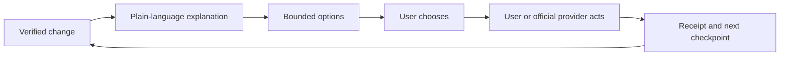

# Financial clarity and consumer control

**Context:** Product-opportunity research for an evidence-driven consumer discovery lab. Scope is financial-adjacent understanding, organization, fee reduction, benefits access, and bounded decisions—not trading, autonomous execution, yields, investment promises, or paid chance.

---

## Opportunity thesis

The strongest opportunity is not “an AI that manages your money.” It is a **proof-first control layer for recurring household money decisions**: show what changed, explain why it matters, present bounded options, and let the person approve or complete the next step. The job is to reduce avoidable leakage and uncertainty without taking custody, making promises, or pretending that a recommendation is an outcome.

The demand is concrete. CFPB data found that more than a quarter of surveyed households had an overdraft or NSF fee in the prior year; among those households, only 22% expected the most recent overdraft and 43% were surprised. Lower-income households were hit more often. [1] In 2023, reported overdraft/NSF fees still totaled $5.83 billion even after large reductions from 2019. [2] This is a large recurring pain pool, but it is not evidence that users want another dashboard. It is evidence that people need timely clarity and an understandable action path.

**Product hypothesis (not verified):** users will voluntarily return when the product repeatedly turns a confusing event into a verified, reversible win: “this bill rose $18; here is the invoice line, the contract/promotion context, three safe options, and the exact next action.” A useful sharing unit is a neutral artifact—a household bill timeline, fee explanation, or benefits checklist—not a referral incentive or public financial status.

## What real adjacent products already prove

### YNAB: repeated planning can be a habit, if the user owns the decision

YNAB’s verified mechanism is a method rather than an automated promise: assign incoming money to intended purposes, plan for irregular expenses, get ahead on bills, and revise the plan as priorities change. [3] Its site explicitly frames the recurring question as “What’s it for?” and separates “for now,” “for later,” “for ease,” and “for change.” That is a durable behavioral loop because the user makes the allocation and can change it without penalty.

**What it proves:** bounded planning can support repeat use and a sense of agency. **What it does not prove:** that users will maintain detailed categorization, or that an untrusted data aggregator can create the same habit. The failure condition is setup and maintenance burden: if importing, categorizing, and reconciling take more effort than the clarity returned, users lapse.

### Rocket Money: detection plus delegated service creates an immediate value moment

Rocket Money says it has 10 million-plus members and combines account linking, recurring-subscription detection, spending insights, alerts, budgets, cancellation assistance, savings, and bill negotiation. [4] The product therefore spans both “understand” and “act,” with a free scanning layer and paid human-assisted services.

Its terms expose the operational and trust boundary that a pitch deck would hide. Bill negotiation may require provider account numbers, passwords/PINs, statements, and authorization for Rocket Money to act as a limited agent; non-Premium users can be charged 35–60% of 12-month savings. Savings may take one to two billing cycles to appear, and the user remains responsible for negotiation-related fees. [5]

**What it proves:** a first-session “find money I did not know I was losing” moment can acquire users; delegated action can monetize. **Failure condition:** credential handling, disputed savings, provider friction, fee surprise, and low-frequency wins can destroy trust and unit economics. A safer opportunity should default to evidence and user-controlled handoff, not opaque delegation.

### USAGov Benefit Finder: discovery is valuable, but eligibility is not entitlement

USAGov’s official finder lets people explore benefits by category and learn how to apply for benefits they may be eligible for, covering food, health, housing/utilities, jobs, education, disability, retirement, and other categories. [6]

**What it proves:** benefit discovery is a legitimate control job with a large surface area and clear public-interest value. **Failure condition:** eligibility varies by jurisdiction, household facts, time, and program rules; an app that says “you qualify” when it only screened for possible eligibility creates serious harm and reputational exposure. The product must label results as “possible fit,” show the rule/source/date, and hand off to the official application channel.

### Open-banking access: the data rail is becoming more permissioned, not automatically trustworthy

The CFPB’s October 2024 personal financial data rights announcement described consumer-authorized access to transaction, balance, payment-initiation, upcoming-bill, and account-verification data, with privacy protections, revocation, default deletion, and limits on unrelated data use. [7] The same announcement described a move away from risky screen scraping and phased compliance dates.

**What it proves:** permissioned financial data access can support competition and consumer choice. **Failure condition:** authorization scope, retention, breach risk, stale or misclassified transactions, connector outages, and regulatory change. “We can connect your accounts” is infrastructure, not product differentiation.

### Subscription cancellation regulation: agency must be simple and non-manipulative

The FTC’s final Click-to-Cancel rule requires sellers to make cancellation as easy as enrollment, obtain informed consent, disclose material terms before charging, and provide a simple mechanism that immediately stops charges. The FTC reported nearly 70 negative-option complaints per day in 2024, up from 42 per day in 2021. [8]

**What it proves:** recurring payments are a high-attention control problem and cancellation is a legitimate user outcome. **Failure condition:** a third-party cancellation assistant that obscures state, delays confirmation, or uses dark patterns will be viewed as recreating the problem. Every handoff needs a receipt, timestamp, status, and escalation path.

## Unmet demand and product primitives

The gap is between passive aggregation and high-risk delegation. Existing tools either ask users to maintain a budget, scan for subscriptions, negotiate with credentials, or point to government programs. A defensible new layer would combine **explainability, evidence, bounded choice, and follow-through** without claiming authority over the user’s money.

Useful primitives:

1. **Change proof:** compare the current bill or transaction against prior periods, show the exact amount/date/merchant, and distinguish confirmed facts from inferred causes.
2. **Decision cards:** present two or three options with cost, downside, reversibility, deadline, and who must act. No “best” option unless the user’s stated constraints make it best.
3. **Permission ledger:** show what data was accessed, for what purpose, when it expires, and how to revoke/delete it. Default to read-only.
4. **Action receipts:** after a user completes a cancellation, dispute, application, or provider contact, store the user-owned evidence and next checkpoint.
5. **Benefits navigator:** ask only the minimum screening questions, provide “possible programs,” cite the official rule or agency, and route the final application to the government/provider.
6. **Household packet:** export a clean, private summary for a partner, caregiver, caseworker, or tax preparer. Sharing is utility-based, not social pressure.
7. **Quiet recurring review:** a monthly or event-triggered review of material changes, with a snooze and a clear “nothing needs attention” state. Avoid fear-of-loss retention.

## Demand jobs, repeat use, and sharing

The core demand jobs are: **“Tell me what changed,” “help me avoid a preventable fee,” “show me what I can safely do next,” “help me find programs I may be eligible for,” and “prove that my action took effect.”** These are more durable than a one-time savings gimmick because household bills, renewals, benefit recertifications, and account changes recur.

Voluntary repeat use should come from **new evidence and reduced uncertainty**, not streaks, loss aversion, ranking, or referral pressure. A user returns when an alert is rare enough to trust, specific enough to act on, and closed with a receipt. Healthy sharing can happen when a person sends a partner a bill explanation or a benefits checklist that makes a joint decision easier; the product should not expose balances, scores, or “savings leaderboards.”

The first 30 seconds should be: “Connect one account read-only or upload one bill; we found one material change; here is the source line and a choice of what to do next.” If no meaningful change is found, say so and let the user leave. Do not require a full financial profile before demonstrating value.

## Business and operating reality

A read-only control layer has weaker immediate monetization than taking a percentage of savings. That is a feature, not a flaw: percentage-of-savings pricing can create disputes over causality, and delegated negotiation creates credential, support, and provider-relationship costs. Possible healthy economics are a transparent subscription for monitoring and evidence storage, employer/nonprofit distribution for benefits navigation, or a clearly disclosed fixed fee for a human-assisted document/action service. The product must never monetize by selling unrelated behavioral profiles or by steering people into financial products.

The operational burden is substantial: bank connectors, merchant identity normalization, receipt parsing, changing benefit rules, accessibility, multilingual content, dispute handling, deletion requests, and support when a provider says “we never received it.” Moderation is relevant if users share community explanations: financial misinformation, doxxing, scams, and illegal evasion must be removed. Community content should be supplementary, dated, and never the source of eligibility or fee claims.

## Why blockchain is unnecessary by default

The core value is private interpretation of user-authorized records plus accountable handoffs. A chain does not improve transaction classification, benefits eligibility, bill comparison, provider APIs, or the legal validity of a cancellation receipt. Putting financial metadata on a public ledger creates an avoidable privacy and deletion conflict. The CFPB’s data-rights framing emphasizes purpose limitation, revocation, and deletion by default. [7]

A blockchain rail would only become worth testing if there is evidence of a specific multi-party problem that ordinary signed databases cannot solve: for example, several independent institutions need a shared, user-controlled proof of an action or entitlement; users need portable consent receipts across providers; and a permissioned design can keep sensitive data off-chain while supporting revocation, audit, and correction. The threshold should be a measured pilot showing lower reconciliation cost or materially higher portability—not novelty, token incentives, or a speculative asset. No token should be required for access, ranking, or retention.

## Critical constraints and falsifiers

- **Trust and privacy:** account data, credentials, bills, and benefits facts are highly sensitive. A breach, unexplained data use, or dark-pattern consent can permanently kill the category.
- **Regulatory boundary:** education, organization, and routing are safer than individualized financial advice, credit decisions, money movement, or acting as a financial institution. Benefits screening must not be represented as an eligibility determination.
- **Fake agency:** a polished “you saved $X” number is not a saving unless the user can see the baseline, provider confirmation, fees, and timing. Users must be able to reject the recommendation and verify the result independently.
- **Connector and data quality:** stale transactions, duplicate charges, missing merchants, and broken bank connections cause false alerts. A product that cries wolf will be uninstalled.
- **Provider and rights friction:** cancellation, disputes, and negotiation may require account-holder authentication or provider-specific workflows. Never imply guaranteed completion.
- **Cold start:** a generic financial dashboard has no reason to be opened. The entry point needs one concrete artifact—a bill, fee, renewal, or benefits question—and must work before linking every account.
- **Economics:** low-frequency wins, expensive support, and connector costs can exceed subscription revenue. Percentage-of-savings models invite disputes and conflicts of interest.
- **Moderation and harm:** user-submitted money advice can become misinformation or predatory lead generation. Keep factual claims tied to dated primary sources.
- **Accessibility and inclusion:** low digital literacy, limited English, disability, unstable connectivity, and households without traditional bank accounts must not be treated as edge cases.

**Strongest falsifier:** after a narrowly scoped pilot, fewer than 25% of activated users complete a verified action or return for a second material review within 60 days, and interviews show that users prefer existing bank alerts or manual provider contact. That would indicate the proposed combination is a feature bundle, not a new high-use product. A second falsifier is that false-positive or stale-data alerts exceed the rate users tolerate, even when the underlying savings opportunity is real.

## Evidence status

**Verified facts:** CFPB fee statistics and survey findings; CFPB’s announced data-rights protections; FTC’s stated cancellation requirements and complaint trend; the published mechanisms and terms of YNAB, Rocket Money, and USAGov. **Product hypotheses:** the control-layer positioning, 30-second onboarding, evidence/receipt loop, sharing behavior, pricing, pilot thresholds, and chain criteria. They require user research and instrumented testing.

## References

[1]: https://www.consumerfinance.gov/archive/newsroom/cfpb-issues-report-showing-many-americans-are-surprised-by-overdraft-fees/ "CFPB Issues Report Showing Many Americans Are Surprised by Overdraft Fees"
[2]: https://www.consumerfinance.gov/data-research/research-reports/data-spotlight-overdraft-nsf-revenue-in-2023-down-more-than-50-versus-pre-pandemic-levels-saving-consumers-over-6-billion-annually/ "CFPB Overdraft/NSF Revenue in 2023"
[3]: https://www.ynab.com/ynab-method "YNAB Method"
[4]: https://www.rocketmoney.com/ "Rocket Money product overview"
[5]: https://www.rocketmoney.com/terms "Rocket Money Terms of Service"
[6]: https://www.usa.gov/benefit-finder "USAGov Find government benefits and financial help"
[7]: https://www.consumerfinance.gov/archive/newsroom/cfpb-finalizes-personal-financial-data-rights-rule-to-boost-competition-protect-privacy-and-give-families-more-choice-in-financial-services/ "CFPB Personal Financial Data Rights announcement"
[8]: https://www.ftc.gov/news-events/news/press-releases/2024/10/federal-trade-commission-announces-final-click-cancel-rule-making-it-easier-consumers-end-recurring "FTC Final Click-to-Cancel Rule announcement"
