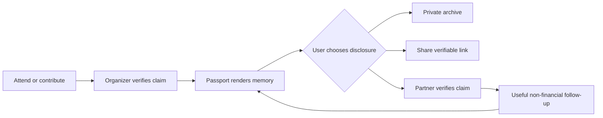

# Chain-rail opportunities: portable provenance for real-world participation

Context: Track 09 — Solana and Robinhood-chain rail opportunities; research cut 2026-10-02. This report treats a chain as an optional back-end rail, not as the product, and separates verified platform facts from hypotheses.

---

## Opportunity space

**Portable, verifiable participation records for live experiences**: a consumer “memory and benefits passport” that lets a person collect proof of attendance or contribution (concert, festival, class, race, volunteer shift, fan club moment), keep it in a normal account or wallet, and optionally present it to independent organizers for recognition, access, or personalization.

The product is not a crypto-mining game, a token-as-main-loop, a financial return, a paid chance mechanism, or token-gated status. Its job is to make a meaningful real-world history useful across otherwise disconnected services. A chain is justified only when the user actually needs **portable provenance and interoperability across independent issuers**—not merely a database record owned by one app.

### Demand jobs (hypotheses to validate)

1. **Remember and prove**: “I was there / completed this / contributed,” without relying on a screenshot or an organizer’s private database.
2. **Carry context forward**: “Let my next venue, class, or community recognize relevant history without rebuilding my profile.”
3. **Turn history into useful next actions**: post-event replays, local recommendations, member benefits, or invitations based on consent—not pressure or fear of loss.
4. **Share a credible story**: a compact, human-readable timeline that friends and communities can verify, while the user controls what is disclosed.
5. **Reduce organizer friction**: issue a durable credential once, then let partner services verify it instead of each building bespoke integrations.

These are hypotheses, not evidence of guaranteed virality. The first test should measure repeated voluntary use after the novelty of the first collectible disappears.

## What is verified

| Mechanism | Evidence | Failure condition |
|---|---|---|
| Solana supports low base fees plus optional priority fees; fees are charged even when a transaction fails. | Solana documents a 5,000-lamport base fee per signature, optional compute-unit priority fee, and failed transactions still being charged. [Solana fee structure](https://solana.com/docs/core/fees/fee-structure) | A consumer flow that exposes fee volatility, failed writes, or wallet funding will add more friction than a normal signed server event. Abstract gas with a sponsored payer or do not use chain. |
| Solana’s Token Extensions can encode transfer rules, non-transferability, metadata, hooks, pause controls, and other state at mint/account creation. Many extensions cannot be added later and some are incompatible. | [Solana Token Extensions documentation](https://solana.com/docs/tokens/extensions) | Product/legal requirements discovered after issuance may be impossible to retrofit. Immutable public records can also conflict with deletion, correction, or privacy needs. Prefer non-transferable credentials and minimal metadata; retain mutable details off-chain. |
| Solana confirmation is fast but operationally non-trivial: recent blockhashes expire in roughly 60–90 seconds; RPC lag, commitment choice, forks, and resubmission matter. | [Solana Confirmation & Expiration](https://solana.com/developers/cookbook/transactions/confirmation) | A flaky issuance moment, mobile handoff, or stale RPC turns an emotional event into a confusing failure. Server-side issuance with retries and a conventional confirmation screen is required. |
| Robinhood Chain is described by Robinhood as a permissionless, Ethereum-compatible Layer 2 for financial services and tokenized real-world assets, with ETH gas and Robinhood Wallet support. | [Robinhood Chain Help Center](https://robinhood.com/us/en/support/articles/robinhood-chain-mainnet/) and [official chain page](https://robinhood.com/us/en/chain/) | The current official positioning is finance/RWAs, not consumer provenance. A non-financial app may inherit regulatory, brand, ecosystem, and availability risk without a user-visible advantage. Do not choose it merely because it is new or has a Robinhood distribution story. |
| Robinhood’s public materials emphasize Stock Tokens, 24/7 trading, DeFi composability, geographic restrictions, and securities-like disclosures; Stock Tokens do not grant rights in the underlying securities. | [Robinhood mainnet announcement](https://robinhood.com/us/en/newsroom/robinhood-accelerates-global-expansion-robinhood-chain-mainnet-stock-tokens-agentic-trading/) and [chain disclosures](https://robinhood.com/us/en/chain/) | Any product that drifts toward yield, trading, collateral, or “ownership” claims risks financial regulation and user harm. This track explicitly rejects those directions. |
| Ticketmaster has integrated blockchain-backed digital collectibles into ticket purchase/entry, claiming 14.5M minted across 4K events; its AFLW example delivered redemption by email and reported 64% unique open rate. | [Ticketmaster: Digital Collectibles Go Global With the AFLW](https://business.ticketmaster.com/digital-collectibles-go-global-with-the-aflw/) | One campaign’s engagement metric is vendor-reported and does not establish durable repeat use, resale demand, or cross-organizer interoperability. A commemorative object without future utility becomes inbox clutter. |
| NBA Top Shot combines licensed digital moments, scarcity tiers, marketplace trading, challenges, and community. | [NBA Top Shot About](https://about.nbatopshot.com/) | Scarcity and challenges can pull the product toward speculation, paid chance, or retention pressure. The adjacent product proves a mechanism exists, not that a new generic collectible will work. |
| Steam demonstrates a strong centralized alternative: an account-bound game inventory and Community Market with platform wallet settlement. | [Steam Subscriber Agreement](https://store.steampowered.com/subscriber_agreement/) and [Steam Community Market](https://steamcommunity.com/market/) | A platform-controlled inventory is simpler when one operator owns the rules, moderation, rights, and settlement. If the proposed passport has only one issuer or one app, a normal database is superior. |

## Adjacent products and mechanisms (not “no competition”)

1. **Ticketmaster Digital Collectibles** — proof-of-attendance/memento issued inside the ticket journey; the strongest adjacent pattern for invisible onboarding and an emotionally salient issuance moment. The gap is that the benefit remains organizer-specific and the collectible’s future role is unclear.
2. **NBA Top Shot** — licensed media + collectability + marketplace + challenges. It shows repeat engagement can come from fandom, discovery, and community, but it also exposes the danger of scarcity/speculation becoming the product.
3. **Steam Community Market** — centralized, familiar, high-liquidity virtual-item exchange. It is the control case: users tolerate centralization when the platform provides identity, discovery, moderation, and easy settlement. A chain must beat this on a specific cross-platform job, not on ideology.
4. **Ordinary ticketing, loyalty, and credential databases** — the default competitors. They win on recovery, refunds, customer support, privacy controls, and low cognitive load. A portable credential is only better when multiple independent organizations actually honor it.

## Product hypothesis: “Open Memory Passport”

A mobile-first product that receives a signed attendance/contribution claim from an organizer, renders it as a beautiful story card, and gives the user three choices: keep private, share a verifiable link, or export to a compatible wallet. Partner organizers can verify a narrowly scoped claim (for example, “attended Festival X in 2026”) and optionally offer a non-financial benefit such as a replay, early notification, community role, or discounted *non-chance* admission. The user can revoke app access and choose what fields are shared; sensitive evidence stays off-chain.

**Opportunity primitives**

- **Issuer-signed credential**: organizer attests to an event or contribution; the app displays issuer, timestamp, and scope.
- **Portable verification link**: a recipient can check authenticity without creating an account or trusting a screenshot.
- **Selective disclosure**: prove the narrow fact needed, not a public diary of locations or behavior.
- **Interoperable benefit hooks**: participating independent services can read the claim and issue a clear utility (content, recognition, reservation priority, or community access), with no token purchase.
- **Human timeline and replay**: the durable surface is a personal story, not a wallet grid.
- **Recovery and correction**: account recovery, issuer correction, and deletion of off-chain personal data are first-class.

## First 30 seconds

The user scans the same event QR code or opens the normal ticket confirmation; no seed phrase, network switch, or token purchase appears. The app says: **“You were there. Save the official memory and see what it unlocks.”** They see a visual card with event name/date/issuer, can add one sentence or photo, and tap “Keep private” or “Share.” If the organizer supports a benefit, it is concrete and immediate (for example, an official replay or next-event notification). A wallet export is hidden under “Advanced,” never required.

## Voluntary repeat use and durable value

Repeat use must come from a growing, personally meaningful record and practical cross-service utility: returning after another event to see a coherent timeline; receiving relevant, consented follow-up; proving a qualification or contribution; and sharing a credible memory with friends. Healthy sharing is artifact-led (“look where I was / what I did”), not referral-led. There is no expiring balance, paid rank, fear-of-loss streak, or reward for recruiting friends.

Durable value is **trusted provenance plus portability**. If five independent organizers honor the same credential format, the user avoids fragmented histories and the organizer avoids rebuilding identity/verification each time. The chain is valuable only if it is the neutral, independently verifiable layer that lets the claim survive a vendor change and be recognized by parties that do not share one database. Even then, public-chain storage should contain only a pseudonymous identifier, issuer signature, timestamp, and content hash; personal content and deletion-sensitive fields remain off-chain.

## Chain assessment: unnecessary by default

Start with a signed database credential and exportable, W3C-compatible presentation. It is cheaper, reversible, easier to moderate, easier to delete/correct, and avoids wallet/RPC/gas failure. A chain adds friction: wallet concepts, key recovery, transaction confirmation, immutable data, RPC operations, indexing, legal review, and potential fees. Solana’s fee/confirmation documentation itself shows failure and expiry cases that a consumer product must hide. Robinhood Chain’s official materials are even more finance-oriented and carry explicit jurisdictional and securities disclosures; that is a poor default for a fan or civic participation passport.

**Evidence that would justify a chain later:** (a) at least 3–5 independent issuers commit to honoring one credential without a shared operator; (b) users repeatedly export/present the same credential across those issuers; (c) users value verification after the issuing app is gone or changed; (d) a public, neutral registry materially reduces integration or fraud costs; (e) privacy counsel confirms the proposed minimal on-chain data and revocation model; and (f) sponsored transactions achieve a successful issuance rate and support cost no worse than the centralized baseline. If those tests fail, stay off-chain.

If the evidence clears that bar, **Solana is the more plausible candidate** for high-volume, low-value attestations because its tooling supports token metadata/extensions and fast settlement, while an application-controlled fee payer can hide gas. Use non-transferable credentials, no speculative market, and a chain-agnostic export format. Choose Robinhood Chain only if a verified user research result shows its wallet/ecosystem reaches the target audience and its RWA/financial positioning creates a concrete interoperability benefit; current official materials do not establish that.

## Critical constraints and failure modes

- **Cold start/network effects**: a passport is worthless until independent issuers and recipients honor it. Solve with one high-frequency vertical first (events, classes, or races), then test cross-issuer demand.
- **Trust and fake agency**: an app cannot make a claim true merely by writing it onchain. Organizers, ticket systems, anti-bot checks, and clear issuer identity remain the source of truth. Never market immutability as authenticity.
- **Rights and moderation**: event photos, performer clips, names, locations, and minors’ data require rights management and takedown/correction pathways. Do not put raw media or personal data on a public chain.
- **Privacy and safety**: attendance histories can reveal routines, health, religion, or political activity. Use selective disclosure, private defaults, pseudonyms, and easy revocation.
- **Operational burden**: QR abuse, duplicate claims, lost accounts, issuer key rotation, customer support, indexing, chain outages, and cross-chain fragmentation can exceed the cost of a conventional credential service.
- **Regulatory boundary**: avoid financial assets, yield, lending, wagering, prize pools, or investment language. Robinhood Chain’s Stock Token restrictions and disclosures are a warning that “ownership” wording is legally loaded.
- **Poor economics**: collectibles with no repeat utility become marketing spend; secondary markets concentrate value and invite fraud. A B2B issuer fee or paid organizer tooling may work, but the consumer claim must remain useful without speculation.
- **False retention**: challenges, scarcity, expiring benefits, or streaks can create compulsive behavior rather than value. Measure return visits prompted by genuine utility and memory, not notifications or artificial scarcity.
- **Interoperability theater**: if only the issuing company can verify or redeem a claim, it is a centralized database with blockchain branding. The falsifier is a partner refusing to accept a credential without a custom commercial agreement.

## Strongest falsifier and test plan

**Strongest falsifier:** after receiving a free, beautiful attendance record, fewer than 20% of users voluntarily return within 60 days for a second real-world use (new event, share, verification, or benefit), and fewer than three independent issuers agree to verify the same credential without a bespoke integration. This would show that the “portable provenance” job is invented or too weak; do not add a chain.

Run a concierge pilot with one organizer and two external partner services. Randomize ordinary emailed receipt versus passport card; measure claim completion, 30/60-day return, voluntary shares, partner verification success, correction/deletion requests, support minutes per claim, and cost per active user. Only after cross-issuer behavior is observed should the team A/B test a chain-backed registry against signed off-chain credentials.

## Bottom line

The promising space is not “build on Solana” or “build on Robinhood Chain.” It is **portable proof of meaningful participation that produces utility across independent services**. The product should win on memory, trust, and interoperability while feeling like a normal consumer app. Blockchain is a later neutral-registry option, justified by demonstrated cross-issuer demand and lower verification friction—not by speed claims, collectible fashion, or the hope of virality.

## Sources

- [Solana Fee Structure](https://solana.com/docs/core/fees/fee-structure)
- [Solana Token Extensions](https://solana.com/docs/tokens/extensions)
- [Solana Transaction Confirmation & Expiration](https://solana.com/developers/cookbook/transactions/confirmation)
- [Robinhood Chain official overview](https://robinhood.com/us/en/chain/)
- [Robinhood Chain Help Center](https://robinhood.com/us/en/support/articles/robinhood-chain-mainnet/)
- [Robinhood Chain mainnet and Stock Tokens announcement](https://robinhood.com/us/en/newsroom/robinhood-accelerates-global-expansion-robinhood-chain-mainnet-stock-tokens-agentic-trading/)
- [Ticketmaster Digital Collectibles and AFLW case](https://business.ticketmaster.com/digital-collectibles-go-global-with-the-aflw/)
- [NBA Top Shot About](https://about.nbatopshot.com/)
- [Steam Subscriber Agreement](https://store.steampowered.com/subscriber_agreement/)
- [Steam Community Market](https://steamcommunity.com/market/)
