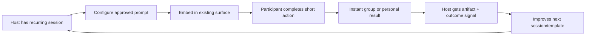

# Partner Wedges: Embedded Participation That Pays Back the Host

Context: **Track B2B embedding and partner distribution** — product mechanics that make creators, communities, platforms, educators, and businesses voluntarily embed or distribute a consumer experience because it creates measurable value for them. Evidence gathered 2026-10-02.

---

## Executive thesis

The most credible opportunity is not “a viral game with a partner button.” It is a **portable, host-owned participation module**: a 30–180 second interactive prompt, challenge, poll, learning check, or co-creation moment that a host can place inside an existing surface (stream, community, course, event, storefront, newsletter, or member portal). The module should return a concrete artifact or signal the host already needs: a qualified preference signal, attendance/understanding data, a reusable community artifact, a moderation-safe activity, or a measurable lift in session completion.

The host distributes it because it improves the job they already do; the participant repeats because each session produces visible progress, social context, or a useful result—not because of fear of loss, paid chance, token scarcity, or referral pressure. The product should start as a web component/SDK and integrate with existing identity and analytics. A blockchain is unnecessary by default.

**Important distinction:** the sources below verify that embedded products, platform SDKs, integrations, review gates, and host-facing analytics are real mechanics. They do **not** prove demand for a new product. The candidate product and unmet-demand claims are hypotheses to test.

## Verified mechanisms from adjacent products

| Mechanism | Verified evidence | Failure condition |
|---|---|---|
| **Embed in the host’s native surface rather than sending users away.** | Typeform’s Embed SDK supports inline/full-page, popup, slider, popover, and side-tab modes; its docs explicitly say embedded forms look like part of the host site so people do not leave the page. It requires HTTPS (or localhost) and a Typeform account. [Typeform Embed SDK](https://www.typeform.com/developers/embed/) | If the module slows the page, breaks responsive layouts, leaks data, or feels like an ad, hosts remove it. HTTPS/CSP and browser compatibility are real integration gates. |
| **Use the host’s social graph and context to make a shared activity launchable.** | Discord Activities are web apps in an iframe, launched from an App Launcher entry point or an interaction callback. The Embedded App SDK handles client communication, connected users, events, authorization, and mobile support. [Discord Activities overview](https://docs.discord.com/developers/activities/overview) [Activity lifecycle](https://docs.discord.com/developers/activities/how-activities-work) | OAuth scopes, permission prompts, client differences, disconnections, and SPA/iframe constraints create support burden. A host cannot guarantee every community member will authorize or have a compatible client. |
| **Let a creator add an interactive layer to an existing audience moment.** | Twitch Extensions are webpages inside Twitch, in panel, overlay, or component views. They can access channel context, chat, identity/status signals, follows, and permitted transactions through the Extension Helper. [Twitch Extensions](https://dev.twitch.tv/docs/extensions/) | Twitch review can remove an Extension at any time; sandboxing, CSP allowlists, mobile load limits, and required review assets constrain product design. Platform policy forbids many off-site incentives and prohibits NFTs. [Twitch policies](https://dev.twitch.tv/docs/extensions/guidelines-and-policies/) |
| **Make integration valuable when it removes workflow duplication.** | Kahoot markets LMS, Google Classroom, Zoom, slide-sync, SSO, grading, attendance, and reports. It explicitly claims LMS integration centralizes course materials and automates grading/attendance; Zoom integration avoids screen sharing or a second device and collects real-time feedback. [Kahoot integrations](https://kahoot.com/higher-ed-integrations/) | The product becomes a costly “extra tab” if it cannot sync roster, identity, results, or content. Institutional procurement, accessibility, privacy, and content quality can dominate technical integration. |
| **Align partner economics with measurable merchant outcomes.** | Shopify offers apps, themes, storefronts, services, referrals, APIs, documentation, and a partner program. It reports $1.3B paid to partners in 2025 and describes recurring revenue and merchant growth as partner value, while noting these are Shopify claims and not an independent causal study. [Shopify Partner Program](https://www.shopify.com/partners) | A partner marketplace is not automatic distribution. Discovery, approval, attribution, platform fees, API changes, and crowded app stores can make acquisition economics poor. |
| **Treat security, rights, and moderation as part of the product.** | Twitch requires submitted Extensions to pass review, restricts network/content sources through CSP, requires user identity access for user content, and requires broadcaster review/reject/remove controls for published content. [Twitch Extension policies](https://dev.twitch.tv/docs/extensions/guidelines-and-policies/) | User-generated prompts, images, music, or public results create moderation queues, copyright claims, harassment risk, and local-law exposure. “The host will moderate it” is not an operating plan. |
| **Preserve host attribution and respect platform-owned UX.** | YouTube’s IFrame player API requires an `origin` security parameter; `widget_referrer` distinguishes the embedded widget provider from the actual traffic source. The player also retains platform behaviors such as related-video treatment and branding constraints. [YouTube player parameters](https://developers.google.com/youtube/player_parameters) | A host may reject an experience that hijacks attribution, changes platform behavior, collects unconsented data, or makes the surface look unofficial. |

## Adjacent products and what they teach

1. **Typeform** — low-friction embed and response capture. The host’s job is lead collection or feedback; the product wins by being native-looking and instrumentable. Lesson: the first wedge should be copy-paste/SDK integration plus reliable event callbacks, not a new social network.
2. **Kahoot** — participation is embedded into an existing instructional job, with reports, attendance, and LMS/Zoom workflow fit. Lesson: repeat use follows an institutional cadence (class, training, meeting), not a generic daily streak.
3. **Discord Activities** — shared play is distributed through an existing group graph and launched in-context. Lesson: social value is strongest when the activity begins where the group already talks, and when presence/identity are handled by the platform.
4. **Twitch Extensions** — creator-mediated distribution with a visible on-stream surface. Lesson: a creator will place an experience beside content only if it improves the show or community, and platform review/policy is part of the roadmap.
5. **Shopify apps/partners** — ecosystem distribution tied to merchant outcomes and recurring partner revenue. Lesson: B2B distribution compounds only when the integration owner can explain ROI and the channel has durable incentives.
6. **YouTube embeds** — a counterexample to “embed means full control.” Lesson: host products must accept platform policy, attribution, branding, playback, privacy, and deprecation constraints.

These are **closest alternatives/mechanisms**, not claims of direct competition. The opportunity must earn a distinct job and distribution advantage rather than copying a quiz, poll, or widget.

## Demand jobs to test

### Host jobs

- **Creator/streamer:** “Give my audience a meaningful thing to do during the content, without stealing attention, requiring another app, or creating moderation debt.”
- **Community operator:** “Turn recurring discussion into a lightweight, safe shared artifact or decision signal I can summarize and bring back next week.”
- **Educator/trainer:** “Check understanding and participation inside the teaching flow, with a report I can act on and no duplicate roster/admin work.”
- **Platform/product team:** “Add a participation primitive that increases session completion or contribution without building identity, realtime state, moderation, analytics, and abuse controls from scratch.”
- **Business/merchant:** “Collect preference or product-fit signals in a way that improves conversion or onboarding, while keeping consent and attribution clear.”

### Participant jobs

- “Give me a quick, legible result that helps me decide, learn, create, or belong.”
- “Let me participate with the identity/context I already have, and let me see the group’s outcome without exposing more than I intended.”
- “Make my contribution portable as a shareable artifact or progress record, not a disposable click.”

## Opportunity primitives (hypotheses, not verified facts)

1. **Host-configured prompt blocks:** a host chooses an objective (teach, decide, warm up, qualify, co-create) and supplies approved content; no open-ended AI persona required.
2. **Three-minute session kernel:** one prompt, one participant action, one group synthesis/result. It must work anonymously or with existing platform identity.
3. **Result artifact:** a consensus card, learning checkpoint, recommendation set, event recap, or audience-generated visual the host can reuse in the next session.
4. **Host analytics:** completion, response distribution, repeat host usage, time-to-launch, moderation actions, and downstream action—not vanity “virality.”
5. **Portable integration layer:** web component first; then Discord Activity, Twitch Extension, LMS/LTI, Zoom, and storefront adapters only where a measured host job exists.
6. **Safety rails:** closed vocabularies, host approval, rate limits, age-appropriate defaults, audit log, export/delete controls, and clear consent. User-submitted media should be deferred until moderation economics are proven.
7. **Attribution and revenue sharing:** a transparent host dashboard and optional paid tier/revenue share tied to verified value (e.g., qualified completions or licensed seats), never paid rank or referral pressure.

## Candidate thesis

Build **“participation infrastructure for hosts”**: a library and authoring tool for short, reusable, moderated interactive moments that can be embedded in a host’s existing surface and return an operational artifact. The differentiated wedge is not “more games”; it is **one-click deployment plus an outcome the host can use immediately**.

A credible initial vertical is educator-led communities and recurring cohort programs (classes, bootcamps, professional communities), because cadence and outcome measurement are clearer than broad consumer entertainment. A second wedge could be creator streams, but only after proving that the module increases meaningful chat participation or content completion without distracting from the creator.

### First 30 seconds

Participant sees a native card in the surface they already opened: “Answer one question about today’s topic in 20 seconds.” They choose from a small, legible set of options or submit a short response. The card immediately returns a useful result—“your group’s top trade-off,” “what to review next,” or “the shared plan”—and offers a consentful share/export. No wallet, token, paid chance, countdown panic, or forced referral.

### Durable value source

Durable value comes from **repeated host workflow utility and accumulated structured context**: a teacher gets a better next lesson, a community gets a decision record, a creator gets a safer and more legible participation layer, and a business gets higher-quality first-party signals. The defensibility is integration reliability, host-specific templates, moderation/safety operations, and longitudinal outcome data—not speculative asset appreciation.

### Distribution wedge

Start with 10–20 design partners who already run recurring sessions and own a distribution surface. Give them a setup that takes under 10 minutes, branded-but-platform-respectful UI, and a weekly “what changed” report. Require each pilot to name the host metric before launch: completion, attendance, qualified responses, repeat session creation, or time saved. Expand only when a host voluntarily embeds the module in at least three recurring sessions and participants complete it without direct incentive.

## Integration friction and operating cost

**Cold start:** A module needs a host audience and a reason to be used now. A consumer-only launch has no graph; a B2B-only launch can have slow sales. Falsify the wedge if pilots require founder-led facilitation every time or if hosts will not schedule a second session.

**Identity and privacy:** Prefer host-provided opaque IDs, minimal scopes, explicit consent, and deletion/export controls. Discord’s documented authorization handshake and Twitch’s user-content identity requirements demonstrate that identity is not a free API detail. Do not centralize sensitive student/employee data without a clear legal basis and retention policy.

**Moderation and rights:** Open text/media makes the product a UGC platform. Begin with constrained responses and host approval. If the product accepts images, music, or public submissions, budget human review, appeals, takedowns, copyright handling, and abuse response before launch. Twitch’s broadcaster review/remove requirements are a useful lower bound, not a complete compliance strategy.

**Platform dependency:** Treat each adapter as a reversible channel. Maintain a plain web fallback, versioned APIs, health checks, and exportable data. Platform reviews and policy changes can disable distribution; YouTube’s retained branding/related-video behaviors and Twitch’s review rights show why “we control the embed” is false.

**Accessibility:** Keyboard operation, focus management, screen-reader labels, reduced motion, captions/alt text, color contrast, and mobile performance are table stakes. An embedded iframe that traps focus or cannot be used with assistive technology creates partner support and legal risk.

**Economics:** Do not assume consumer ad revenue will subsidize a partner product. Price against host value (seats, active sessions, or measured workflow savings), keep marginal realtime and moderation costs bounded, and model platform take-rates. A free widget with costly bespoke integration is a services business, not a scalable product.

**Fake-agency risk:** If “participation” only changes a cosmetic score while the host ignores the result, users will correctly perceive it as engagement theater. Every primitive must specify what decision, learning action, artifact, or content change follows from the result.

## Blockchain assessment

**Unnecessary by default.** The core requirements—embedded UI, short-lived session state, host analytics, consent, moderation, access control, and export—are cheaper, faster, more private, and easier to correct in conventional infrastructure. Public ledgers add latency, irreversible records, key management, fees, regulatory ambiguity, and an incentive to financialize participation. They do not solve cold start, moderation, rights, platform approval, or host ROI.

The chain becomes worth testing only if evidence later shows a **specific non-financial user value** that ordinary signed records cannot provide: (1) multiple unaffiliated organizations need to verify the same portable achievement without trusting one operator; (2) users explicitly request user-controlled portability across competing hosts; (3) the credential’s provenance materially improves hiring/admission/access decisions; and (4) a privacy-preserving, revocable, low-cost design passes legal/security review. Even then, test a signed off-chain credential or standard first; use a chain only if it reduces a demonstrated trust/portability failure. No token-as-main-loop, token gating, passive return, paid prize pool, wagering, paid rank, or fear-of-loss retention mechanic is justified.

## Strongest falsifier and decision gates

**Strongest falsifier:** Across at least 10 recurring hosts, fewer than 30% voluntarily reuse the module three times within four weeks, or repeat use fails to improve a predeclared host metric versus the host’s existing workflow, after integration is made genuinely low-friction. This would indicate that the “host value” is narrative rather than operational.

Run tests in this order:

1. Concierge prototype with one constrained primitive and manual synthesis; measure repeat host sessions and participant completion.
2. Copy-paste web embed with event callbacks; measure time-to-launch, page impact, accessibility defects, and downstream host action.
3. One platform adapter (Discord **or** LMS, not all at once); measure authorization drop-off and support tickets.
4. Only after repeat value: creator/partner marketplace, paid plans, deeper APIs, or cross-host portability.

## Source quality and confidence

**Evidence confidence: medium-high for verified mechanics, low-medium for opportunity demand.** Official documentation and primary product pages verify the integration patterns, constraints, and host-facing value propositions. Kahoot and Shopify include vendor claims (e.g., engagement, conversion, partner payments) that should be treated as marketing claims rather than causal evidence. The product thesis, unmet-demand prioritization, and falsifier are hypotheses requiring field validation.

## Direct sources

- [Typeform Embed SDK](https://www.typeform.com/developers/embed/)
- [Discord Activities overview](https://docs.discord.com/developers/activities/overview)
- [Discord Activity lifecycle](https://docs.discord.com/developers/activities/how-activities-work)
- [Twitch Extensions documentation](https://dev.twitch.tv/docs/extensions/)
- [Twitch Extensions Guidelines and Policies](https://dev.twitch.tv/docs/extensions/guidelines-and-policies/)
- [Kahoot! integrations](https://kahoot.com/higher-ed-integrations/)
- [Shopify Partner Program](https://www.shopify.com/partners)
- [YouTube IFrame Player parameters](https://developers.google.com/youtube/player_parameters)
