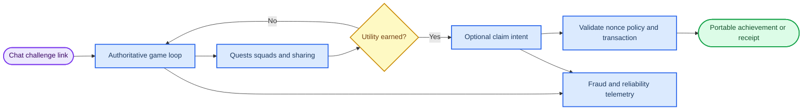

# Solana gaming market intelligence: a trust-first path to viral distribution

_Evidence synthesis for product decision-making · 1 October 2026 · Prepared solely from the supplied research record_

---

## Executive decision

**Recommendation — pursue a wallet-optional, Telegram-native competitive arcade as the product wedge; use a Blink/Action-compatible microgame only as a distribution experiment; defer transferable token launches, bonding curves, swaps, and real-value prediction/wagering.** The defensible opportunity is not another tokenized game loop. It is a **trust-first social game and campaign layer**: instant chat play, authoritative results, optional portable achievements, and clearly bounded utility after a player has already found the game worthwhile.

> **Strongest supported white-space thesis:** A chat-native competitive game can use Telegram for near-zero-friction play and social distribution, while using Solana selectively for portable, utility-first achievements or settlement—not for login, routine progression, in-app crypto checkout, or a speculative economy. This joins the evidence for Telegram game distribution and validated Mini App identity, Solana’s nonce-based wallet authentication, campaign/points infrastructure, and the identified anti-Sybil and incentive failure modes.[^8][^9][^11][^27][^48]

| Decision | Position | Why the evidence supports it | What would change the decision |
| --- | --- | --- | --- |
| **Core product** | Build a small persistent arcade loop: score-attack or cooperative challenge, squads, quests, and durable status | Telegram supports HTML5 games, deep links, sharing, and social scores; off-chain progression avoids transaction friction; utility-first points/achievements can be selectively settled.[^8][^9][^27] | The loop fails to retain players when rewards are paused, or chat sharing does not generate durable re-entry |
| **Solana role** | Optional claim/achievement ownership and later narrow settlement | Solana messages can authenticate wallet control without an on-chain login transaction; Actions can expose wallet-previewable intent, but require client/wallet validation and fallback.[^11][^17][^18] | Claims do not add measurable utility or their wallet-return/failure rate damages the core funnel |
| **Distribution role of Blinks** | Treat as an incremental URL surface, never the only client | Actions/Blinks are shareable interfaces, but rendering depends on client capability, trust, registration, and wallet support; ordinary web fallback is required.[^17][^18][^20] | Measured Action render-to-confirmation materially beats normal deep-link/web funnels across target clients |
| **Economic model** | Sponsor/creator-funded campaigns, capped non-transferable points, optional Stars goods in Telegram | Solana Foundation rewards patterns support points, vesting and Merkle claims; Telegram requires Stars/XTR for in-app digital goods and prohibits crypto as the in-app payment currency.[^13][^14][^27] | Durable player demand and compliant operations demonstrate a separately reviewed reason to introduce transferable value |
| **Avoid at launch** | Bonding curves, swap flows, buy-in/payback framing, cash-redeemable chance, real-value prediction markets | Curve trading and migration add fairness, execution, authority, and market-abuse exposure; P2E activity can track token value; virtual-value wagering and event contracts have material regulatory risk.[^1][^22][^24][^40][^52] | Only separately validated, counsel-reviewed products with bounded exits, controls, and player value independent of asset appreciation |

### Facts, hypotheses, and falsifiers

| Label | Meaning in this report |
| --- | --- |
| **Fact** | A direct synthesis of the supplied source-backed evidence; it is cited close to the claim |
| **Hypothesis** | A product inference or testable strategic proposition, not an established market fact |
| **Falsifier** | A pre-defined observation that would weaken or reject a hypothesis; it should be instrumented before scale |

**Fact.** Telegram documents game/Mini App entry points, start parameters and server validation of initialization data. Its reported Mini App audience is a platform claim and **not** evidence of unique game players or Solana users.[^8][^9][^10]

**Fact.** Solana offers useful optional ownership and distribution primitives—nonce-based message authentication, Actions, Token-2022, compressed NFTs, and configurable fee mechanics—but each introduces client compatibility, security, state, and operational constraints.[^11][^17][^41][^42][^5]

**Hypothesis.** A player-first arcade with no buy-in will earn more durable, fraud-adjusted retention than a token-first launch because competition, social status, and useful access remain when market rewards are absent.

**Falsifier.** Randomized no-reward, taps-only, quests/badges, and social cohorts show that non-incentivized sessions, D7/D28 retention, squad completion, and utility unlock use collapse when rewards pause; bot-adjusted outcomes are no better than a token-first control.[^27][^24]

## Scope, method, and decision criteria

This is a synthesis of eight independently researched evidence packs supplied for this decision. It does not add market-sizing data, user interviews, legal opinions, or live on-chain measurements. Official protocol and platform documentation is treated as support for technical/platform behavior; peer-reviewed research, regulator statements, and credible reporting are used for comparative economic and policy risk. Third-party or vendor performance claims are not elevated beyond that status.

| Evidence domain | Primary decision use | Important limitation |
| --- | --- | --- |
| Bonding curves and launch mechanics | Understand why token-launch UX is not a game loop | Documented mechanics do not establish durable demand, fair distribution, or a safe deployed configuration |
| Telegram Mini Apps | Evaluate low-friction game distribution and wallet sequencing | Platform audience statements are not game-player counts; webview and wallet behavior varies by client |
| Actions/Blinks | Evaluate URL-native claim/receipt/equip flows | Unfurling, trust prompts, wallets, CORS, and fallback are client-dependent |
| Move-to-earn and SocialFi | Identify retention and incentive failure modes | Comparative examples do not prove causal outcomes for a new game |
| Prediction/PvP and launch risk | Bound wagering, oracle, bot, and compliance exposure | Counsel and market-specific analysis are required before any transferable-value launch |
| Solana primitives | Choose a measured, replaceable implementation path | Wallet, indexer, RPC, and extension support must be verified in target clients |

**Fact.** A Solana transaction has a 5,000-lamport-per-signature base fee; priority fees are optional, transactions can fail after fees are charged, and congestion/write locks/recent-blockhash validity affect launch reliability.[^5][^6]

**Fact.** A token’s mint/freeze authority, token program/extensions, ownership accounts, metadata/update authority, and ATA/rent implications are security and trust primitives, rather than cosmetic details.[^7][^41][^53]

**Falsifier.** A claimed “one-click” ownership flow is not viable if controlled cross-client tests show recurrent stale-blockhash, simulation, write-lock, wallet-handoff, or return-to-game failures—regardless of nominal transaction cost.[^5][^16]

## Evidence synthesis

### Distribution: Telegram is the low-friction front door, not a wallet substitute

**Fact.** Telegram’s Gaming Platform supports HTML5 games in chats, inline distribution, Play buttons, high scores, and user-initiated score sharing. Mini Apps can be launched through multiple surfaces and carry start parameters; server-side HMAC/Ed25519 validation of `initData` is required to avoid trusting the client.[^8][^9]

**Fact.** Telegram reports 400 million monthly bot/Mini App users in June 2024 and later 500 million monthly Mini App users. These are company-reported platform figures, not a measure of game demand, unique game users, or Solana adoption.[^10]

**Fact.** Digital goods or services sold inside Telegram apps must use Stars/XTR, and Telegram’s documentation prohibits crypto as the in-app payment currency. Merchant responsibilities include support, terms, delivery, refunds, and disputes.[^13][^14]

**Hypothesis.** The best initial loop is a 60–90 second score-attack or cooperative raid launched from a chat message or `startapp` link. The chat artifact—not an install, wallet, or token purchase—is the distribution unit.

**Falsifier.** The hypothesis fails if deep-link launch completion, inline challenge share conversion, and return sessions do not outperform a comparable non-chat landing flow after removing rewarded referrals and automated accounts.

### Ownership and distribution: narrow Solana intent after gameplay value exists

**Fact.** Solana recommends nonce-based message authentication with one-time nonce consumption and readable off-chain signing where supported. A signature establishes control of an address, not the truth of a game score.[^11]

**Fact.** The Actions protocol uses an HTTPS GET/POST model, requires CORS handling, and returns serialized transaction messages that a wallet must validate and sign. It supports transaction, message, post, external-link, and linked-action responses; transaction bytes from an API are untrusted.[^17][^19]

**Fact.** Root-domain `actions.json` maps website paths to Action APIs, while non-aware clients can fall back to a website or interstitial. Consequently, universal Blink unfurling is not an assumption supported by the evidence.[^18][^20][^21]

**Hypothesis.** A canonical game URL can serve three audiences without creating a separate product: ordinary browser fallback, Telegram/deep-link play, and an Action-compatible optional claim/receipt/equip surface. The on-chain action should state narrow human-readable intent rather than initiate a trading flow.

**Falsifier.** Do not scale Actions if GET-to-POST-to-confirmation funnels show trust-prompt abandonment, simulation rejection, wallet incompatibility, or unclear transaction intent outweighing the incremental completion benefit. Log render, client, CORS, fallback, quote/nonce expiry, and finality outcomes.[^17][^18]

### Retention: use contribution and utility, not emissions or reflexive rewards

**Fact.** STEPN documents an infinite-supply GST utility token, a capped GMT supply, energy-gated earning, and multiple burns. A peer-reviewed study associates P2E active-user changes with token investment value and identifies external incentives and market sentiment as important drivers; that is comparative evidence, not a deterministic forecast for any new game.[^22][^23][^24]

**Fact.** Notcoin is described by a credible secondary source as a Telegram tap-to-earn game that later used Explore campaigns funded by participating Web3 projects. Solana Foundation’s Rewards repository includes direct vesting, Merkle claims, continuous proportional pools, and authority-managed Token-2022 points, including points that can be non-transferable and revocable.[^32][^27]

**Fact.** The researched SocialFi mechanics favor finite energy/cooldowns, quests, badges, squads, delayed referrals, contribution, selective claims, explicit caps, and post-campaign utility. They also identify empty tapping, referral spam, Sybil farming, and liquid-emission sell pressure as material risks.[^27]

**Hypothesis.** A daily energy budget plus three weekly quests, one squad goal, and a creator/sponsor-funded campaign can create a retention loop if points unlock access, cosmetics, creator privileges, or cross-game status rather than a promise of financial return.

**Falsifier.** The loop is rejected if a no-reward cohort has no durable play, if quest diversity is narrow, if referred users fail to retain after eligibility delay, or if points/collectibles do not change access, status, or play. Measure D1/D7/D28, non-incentivized sessions, D30 referral quality, Sybil flags, cost per retained user, and unlock use.[^27]

### Market and wagering mechanics: infrastructure value exists, but the initial product should not be a betting venue

**Fact.** Oracle-resolved markets require clear outcomes and dependable data. Pyth documents feed identifiers and maximum-age validation; Switchboard’s coin-flip tutorial uses commit-reveal, slot freshness, bound randomness accounts, and collateral at commit to prevent selective revelation.[^33][^34][^35][^36]

**Fact.** The CFTC states that event contracts commonly called prediction markets are commodity derivatives within its regulatory remit. Washington State says virtual currency can be a thing of value and wagering it for a chance to win more is likely illegal gambling without authorization; New York’s 2025 action and UK guidance underscore cash-redeemable virtual-value and crypto AML/identity risk.[^40][^50][^51][^52]

**Hypothesis.** The reusable asset is a canonical game-event and reward-settlement schema—rules, sources, cutoff, confidence/freshness policy, dispute state, and audit history—not an unrestricted wagering market.

**Falsifier.** A market-oriented expansion is blocked if it cannot demonstrate deterministic recovery from oracle delay, failed reveal, client failure, or payout-liquidity stress; if bot concentration or disputes are high; or if market-specific counsel does not confirm the intended operation and controls. This is a legal/product gate, not a design-around exercise.[^33][^34][^40]

### On-chain asset and transaction layer: select only when measured

**Fact.** Token-2022 extensions are generally initialized at mint/account creation, many cannot be added later, some are incompatible, and transfer hooks call a CPI. Compressed NFTs use on-chain Merkle roots and proofs; concurrent trees can fast-forward stale proofs within configured buffers, but transfers and modifications require current proofs and signatures.[^41][^42]

**Fact.** Solana’s documented legacy/v0 priority-fee formula is `ceil(compute_unit_price × compute_unit_limit / 1,000,000)`; a default instruction has 200,000 compute units and the stated transaction ceiling is 1,400,000. Recent prioritization-fee samples can inform a bounded policy, but do not guarantee inclusion or finality.[^5][^43]

**Fact.** Jupiter distinguishes a managed Meta-Aggregator flow from a Router flow that exposes raw instructions for custom composition. Both require product policy around mint support, slippage, price impact, transaction size, priority fees, and API-key handling.[^44]

**Hypothesis.** A hybrid layer can reserve non-transferable Token-2022 assets for policy-rich, low-volume achievements and compressed NFTs for high-cardinality durable receipts, while keeping high-frequency game state off-chain and making RPC/indexer adapters replaceable.

**Falsifier.** Reject a chosen asset design if target wallets cannot display it reliably, account size/rent/compute or proof-staleness recovery is unacceptable, or two independent cNFT-capable RPC providers cannot meet measured read/reconstruction and contention requirements.[^41][^42]

### Trust and launch operations: fairness must be engineered, not claimed

**Fact.** Solana’s April 2022 outage report attributes an outage to bots generating roughly six million transactions per second during a fixed-floor NFT mint, creating a shared-state hotspot. Stake-weighted QoS is Sybil resistance for transaction ingress—not proof that a wallet represents a unique person.[^46][^47]

**Fact.** A large peer-reviewed Gods Unchained analysis found high-activity/high-rank clusters that may indicate bot or botnet reward farming, while acknowledging some activity could be human. Gods Unchained separately reported bot enforcement, initial wrongful suspensions, and resource dilution.[^48][^49]

**Hypothesis.** Latency-neutral rewards—quotas, randomized windows, batching, delayed claims, rate limits, and contribution checks—will protect more human value than fixed-floor, first-caller reward drops.

**Falsifier.** The design fails if synthetic bot testing, wallet-farm modeling, or production telemetry shows reward concentration, synchronized claim patterns, p95/p99 latency gaps, false-positive bans, or human-match-quality degradation that cannot be mitigated with transparent appeals and proportionate controls.[^46][^48][^49]

## Recommended opportunity architecture

**Fact.** This architecture respects the distinct roles supported by the evidence: Telegram gives instant game distribution and validated session identity; Solana signatures can prove address control; Actions allow wallet-consented, inspected intent; Rewards and token primitives can support selected claims; no cited source makes any of these a substitute for server-authoritative scores or anti-Sybil controls.[^8][^9][^11][^17][^27][^49]

### The strongest white-space thesis

**Hypothesis — “competitive social arcade, not speculative game finance.”** Build a cross-client layer that turns authoritative game outcomes into portable, useful status: season badges, creator access, cosmetic eligibility, squad history, and campaign receipts. Start off-chain and walletless; issue a claim only for milestones with a clear external utility. A standard Action endpoint can later make a claim/equip/receipt intelligible on compatible URL surfaces, while a normal game page remains the default.

The thesis is stronger than a generic “Solana game” proposition because it combines four independently supported constraints:

1. **Distribution:** Chat links, inline challenges, and start parameters make social re-entry a native behavior; they do not require wallet acquisition before play.[^8][^9]
2. **Trust:** Server-authoritative scoring and validated `initData` are necessary before any reward; a wallet signature verifies control, not performance.[^9][^11]
3. **Utility:** Points, badges, and campaign claims should unlock real access/status/play; non-transferability and explicit caps can reduce early extraction pressure.[^27][^41]
4. **Safety:** It avoids Telegram’s in-app crypto-checkout restriction, P2E payback framing, first-caller reward races, and real-value chance/wagering until separately justified and reviewed.[^13][^22][^46][^50]

### Explicitly avoided high-risk mechanics

| Avoid at initial launch | Evidence-based reason | Safer initial substitute |
| --- | --- | --- |
| **Pump.fun-style bonding curve, migration, or public swap** | Curve state, parameters, migration, slippage, fee changes, authority changes, bots, and early-capital/latency advantage do not establish fair distribution or durable liquidity.[^1][^2][^3][^4] | No tradable launch asset; narrow claim receipts with versioned config and visible authority metadata |
| **Buy-in, “earn,” or ROI framing** | STEPN’s energy-gated rewards and infinite-supply GST illustrate emissions/sink dependence; research links P2E activity to token investment value, and policy analysis identifies boom–bust and operator-change exposure.[^22][^23][^24][^26] | Free play, sponsor-funded challenges, cosmetic/access utility, transparent subsidy disclosure |
| **In-Telegram crypto checkout** | Telegram’s payment rules require Stars/XTR for digital goods and prohibit crypto as the in-app payment currency.[^13][^14] | Stars for eligible digital goods; separate, reviewed off-platform/on-chain ownership flow where appropriate |
| **Real-value prediction or chance-based PvP** | Oracle/fairness infrastructure does not remove derivatives, gambling, AML, age, geography, custody, consumer-protection, or liquidity risk.[^33][^34][^40][^50][^52] | Non-withdrawable points or sponsor-funded cooperative raid rewards; no user stake and no chance-based cash redemption |
| **Fixed-floor, first-come reward drops** | Shared hotspots and low-cost automation create transaction racing, failed transactions, latency inequality, and bot concentration.[^46][^45][^47] | Quotas, randomized windows, delayed settlement, rate limits, risk review, and appeals |
| **Wallet-only identity or KPIs** | Wallet farms can inflate referrals, MAU, and claims; stake-weighted QoS is not personhood, and bot research shows reward-farming risk.[^47][^48][^49] | Privacy-minimizing trust tiers, fraud-adjusted cohorts, low-value open play, stronger evidence only for higher-value withdrawal/claims |

### Mandatory technical and economic falsifiers

The team should treat the following as release-blocking falsifiers rather than operational footnotes.

| Area | Falsifier to test | Required response if observed |
| --- | --- | --- |
| Curve/asset truth | Live parameters, account layout, authority, fee recipient, token program, or migration target differs from the versioned registry | Stop automated action; reconcile program state; require a reviewed registry update |
| Execution | Price impact exceeds a user-set cap; blockhash expires; simulation/retry fails; write locks or RPC divergence break completion | Do not hide failure; expire/requote safely; use fresh blockhashes, commitment alignment, bounded CU/priority fees, and idempotent retry/recovery[^5][^43] |
| Claim integrity | Duplicate nonce/signature/state callback; client-supplied score differs from authoritative record | Consume nonce once; reconcile finality independently; reject/replay-safe recover only against server records[^11][^17] |
| Economics | Net emissions rise while sink spend, human retention, or real utility falls; sell/extraction pressure concentrates | Pause/resize rewards; preserve free game access; disclose formula/version; do not promise earnings[^22][^24] |
| Fairness | Sybil/bot concentration, synchronized funding/actions, or false-positive enforcement grows | Quarantine value, inspect graph/session signals lawfully, keep appeals, and separate risk score from irreversible ban[^48][^49] |
| Settlement | Oracle age/feed identity is wrong, reveal is missing, payout liability exceeds collateral, or a dispute cannot resolve deterministically | Refund/hold under explicit state rules; do not expose transferable-value settlement before these paths pass[^33][^34][^35] |

## Implications for the three candidate concepts

### Blink microgame

**Concept.** A very small game surface reached through a canonical URL, Telegram message/deep link, QR code, or an Action-compatible claim endpoint.

| Dimension | Decision implication |
| --- | --- |
| **Fact** | Actions enable canonical HTTPS GET/POST endpoints with typed responses and serialized transactions; compatible clients may render a shareable interface, but wallet/client validation and ordinary fallback are fundamental.[^17][^18][^19] |
| **Product hypothesis** | Use this as the **lowest-cost distribution and instrumentation probe**: a 60–90 second challenge, chat-visible result, optional badge claim, and normal browser/Telegram fallback. It tests the top of funnel without making Blink support a dependency. |
| **What to build** | Server-validate Telegram `initData`; store authoritative score; expose a normal game URL; add one Action with `GET`, `OPTIONS`, and `POST` only for `claim-test-item`, `confirm-receipt`, or `equip`; use nonce/state binding, idempotency, fresh blockhashes, simulation, program/account allowlists, and clear wallet messages.[^9][^17] |
| **Avoid** | Do not put a swap, bonding-curve buy, no-op login transaction, or transaction-required first session behind the link. Do not assume client unfurling or wallet handoff works uniformly.[^11][^16][^18] |
| **Falsifier / decision** | If normal deep-link play is strong but Action rendering or claim completion is weak, keep the microgame and demote Actions to an optional receipt surface. **Run now, as a test—not as the company’s product thesis.** |

### SocialFi prediction/raids

**Concept.** Social squads rally around raids, creator challenges, or predictions over game events.

| Dimension | Decision implication |
| --- | --- |
| **Fact** | Quest, squad, campaign, and non-transferable-points mechanics have a documented implementation basis, whereas prediction/coin-flip mechanics require oracle/freshness or commit-reveal/collateral controls and carry gambling/derivatives exposure if value is transferable or redeemable.[^27][^33][^34][^40] |
| **Product hypothesis** | Reframe “prediction” into **non-wagering cooperative raids**: pick a squad strategy, complete verified tasks, and compete for sponsor-funded, capped utility rewards. The social object is contribution and shared progress, not an odds market. |
| **What to build** | One daily energy action, three weekly quests, a squad target, delayed referral eligibility, creator attribution, explicit caps/expiry/revocation, replay-resistant proof, and an appealable anti-fraud process. Settle only selected badges/campaign claims after the off-chain record passes verification.[^27] |
| **Avoid** | No user stake, no cash-redeemable virtual prize, no chance-based payout, no variable-odds market, no financial-return marketing, and no evasion-oriented geo/identity design.[^40][^50][^51][^52] |
| **Falsifier / decision** | If the raid’s retention depends on liquid rewards, squads become referral/Sybil clusters, or meaningful utility is absent, stop the campaign layer. **Build the raid variant now; do not build the real-value prediction variant.** |

### Persistent arcade universe

**Concept.** A multi-game identity/status layer in which seasonal achievements, squad reputation, and creator access persist beyond one microgame.

| Dimension | Decision implication |
| --- | --- |
| **Fact** | Token-2022 can encode policy but has immutable/incompatible extension choices; cNFTs enable low-cost, high-cardinality receipts but add proof freshness, concurrency, RPC/indexing, and reconstruction dependencies. Telegram supports re-entry and sharing, while Solana can provide optional portable claims.[^41][^42][^8][^11] |
| **Product hypothesis** | This is the **strongest long-term product direction** if the microgame proves social retention: a portable arcade passport whose value is cross-game access, cosmetics, status, and creator privileges—not tradeable scarcity. |
| **What to build later** | A versioned achievement schema; server-authoritative event ledger; season/campaign cNFT tree only after provider tests; non-transferable policy-rich Token-2022 achievement only after wallet matrix tests; replaceable RPC/indexer adapters; Action-compatible claim/equip endpoints; and a cross-client reliability dashboard.[^41][^42][^17] |
| **Avoid** | Do not make mutable high-frequency gameplay state a cNFT workload, freeze irreversible extension choices without a devnet matrix, or bind competitive power/core identity to token price or a single marketplace.[^41][^42][^44] |
| **Falsifier / decision** | If portable status does not increase cross-game re-entry or utility unlocks, or operational reliability fails under proof/lock/RPC load, keep the game portfolio off-chain. **Set as the strategic destination, but earn the right to build it through the microgame and raid tests.** |

## Sequenced validation plan

| Stage | Decision-grade experiment | Instrumentation | Advancement condition |
| --- | --- | --- | --- |
| **1. Instant play** | Telegram score-attack/co-op challenge with standard web fallback | Launch completion, time-to-first-play, completed match, chat share, D1/D7, fraud-adjusted cohorts | Game loop has durable use without wallet or token reward |
| **2. Social utility** | Quests, squad target, utility badge, creator/sponsor campaign; randomized reward/control cohorts | Quest diversity, squad completion, non-incentivized sessions, D30 referral quality, Sybil flags, unlock use | Utility, not emissions, explains retention |
| **3. Optional ownership** | One nonce-based message proof and one low-value portable achievement claim | Sign/connect/return/cancel, replay attempts, client matrix, blockhash/simulation/finality, support burden | Claim is reliable and adds measurable utility without degrading game funnel |
| **4. Persistent layer** | Season passport across two game modes with a measured asset prototype | cNFT proof recovery, lock contention, RPC divergence, wallet display, cross-game re-entry | Portable status works across games and infrastructure meets stated reliability needs |
| **5. Restricted settlement review** | Only if a non-wagering product has proven value and counsel approves a defined market | Oracle/reveal/dispute/payout-liquidity, responsible-play limits, jurisdiction/age/identity controls | Separate legal, liquidity, fraud, and recovery gates pass; otherwise remain non-transferable/sponsor-funded |

**Hypothesis.** This sequence minimizes irreversible exposure: product value is tested before wallet friction; wallet utility before asset standardization; asset durability before exchange/trading; and any settlement before value-at-risk.

**Falsifier.** Do not advance because of installs, bot commands, wallet counts, raw referrals, or gross claims alone. Advance only on fraud-adjusted retention, demonstrated utility, execution reliability, transparent economics, and explicitly reviewed policy boundaries.[^27][^47][^48]

## Product-opportunity conclusion

The evidence supports **a disciplined “play first, prove contribution, then make selected achievements portable” opportunity**. Telegram provides a credible instant-play and social-distribution surface; Solana provides a capable but operationally demanding optional ownership/intent layer. The combined advantage is earned by doing the unglamorous work—authoritative scoring, cross-client fallback, clear transaction intent, versioned asset policy, anti-Sybil telemetry, and transparent campaign rules.

A Blink microgame is the right **entry experiment**. A non-wagering SocialFi raid is the right **retention experiment**. A persistent arcade universe is the right **strategic destination** only if those experiments establish that status and utility outlast incentives. The product should not launch as a bonding curve, swap wrapper, ROI loop, or prediction market. Those mechanics have high execution, fairness, market-abuse, policy, and compliance burden without evidence that they solve the primary problem: making a game people choose to play.

## References

[^1]: Pump.fun. “Bonding Curve.” *Pump.fun Documentation*. https://pump.fun/docs/bonding-curve
[^2]: Pump.fun. “Fees.” *Pump.fun Documentation*. https://pump.fun/docs/fees
[^3]: Bitquery. “Pump.fun to PumpSwap.” *Bitquery Documentation*. https://docs.bitquery.io/docs/blockchain/Solana/Pumpfun/pump-fun-to-pump-swap/
[^4]: Metaplex. “Bonding Curve Theory.” *Metaplex Genesis Documentation*. https://www.metaplex.com/docs/smart-contracts/genesis/bonding-curve-theory
[^5]: Solana. “Fees.” *Solana Documentation*. https://solana.com/docs/core/fees
[^6]: Solana. “Fee Structure.” *Solana Documentation*. https://solana.com/docs/core/fees/fee-structure
[^7]: Solana. “Tokens.” *Solana Documentation*. https://solana.com/docs/tokens
[^8]: Telegram. “Games.” *Telegram Bot API Documentation*. https://core.telegram.org/bots/games
[^9]: Telegram. “Web Apps.” *Telegram Bot API Documentation*. https://core.telegram.org/bots/webapps
[^10]: Telegram. “Mini App Bar, Paid Media, and More.” *Telegram Blog*. https://telegram.org/blog/mini-app-bar-paid-media-and-more
[^11]: Solana. “Messages and Authentication.” *Solana Documentation*. https://solana.com/docs/frontend/messages-and-auth
[^12]: Telegram. “Fullscreen Mini Apps and More.” *Telegram Blog*. https://telegram.org/blog/fullscreen-miniapps-and-more
[^13]: Telegram. “Payments in Stars.” *Telegram Bot API Documentation*. https://core.telegram.org/bots/payments-stars
[^14]: Telegram. “Telegram Stars.” *Telegram Blog*. https://telegram.org/blog/telegram-stars
[^15]: Solana. “web3.js Compatibility.” *Solana Documentation*. https://solana.com/docs/frontend/web3-compat
[^16]: Solana Mobile. “Mobile Wallet Adapter Specification.” *Solana Mobile Documentation*. https://solana-mobile.github.io/mobile-wallet-adapter/spec/spec.html
[^17]: Solana. “Actions.” *Solana Documentation*. https://solana.com/docs/tools/actions
[^18]: Solana. “Solana Actions.” *Solana Solutions*. https://solana.com/solutions/actions
[^19]: Solana Developers. “Actions Type Declarations.” *GitHub*. https://github.com/solana-developers/solana-actions/blob/main/packages/actions-spec/index.d.ts
[^20]: Solana Foundation. “Blinks: Blockchain Links, Powered by Solana Actions.” *Solana News*. https://solana.com/news/blinks-blockchain-links-solana-actions
[^21]: Solana Developers. “solana-actions.” *GitHub*. https://github.com/solana-developers/solana-actions
[^22]: STEPN. “Tokenomic.” *STEPN Whitepaper*. https://whitepaper.stepn.com/other-modules/tokenomic
[^23]: STEPN. “Frequently Asked Questions.” *STEPN Support*. https://support.stepn.com/hc/en-us/articles/5979807297945-Frequently-Asked-Questions
[^24]: Lee et al. (2024). “Study of Play-to-Earn Game User Activity and Token Value.” *Sustainability*. https://www.mdpi.com/2071-1050/16/15/6587
[^25]: Bloomberg. “NFT App Blocks Users in China, Sending Digital Tokens Plunging.” *Bloomberg*. https://www.bloomberg.com/news/articles/2022-05-27/nft-app-blocks-users-in-china-sending-digital-tokens-plunging
[^26]: Brookings. “Addressing the Policy Challenges Raised by NFT Gaming.” *Brookings*. https://www.brookings.edu/articles/addressing-the-policy-challenges-raised-by-nft-gaming/
[^27]: Solana Foundation. “Rewards.” *GitHub*. https://github.com/solana-foundation/rewards
[^28]: STEPN. “Whitepaper.” *STEPN*. https://whitepaper.stepn.com/
[^29]: Jupiter. “Rewards.” *Jupiter*. https://jup.ag/rewards
[^30]: friend.tech. “friend.tech.” *Official Website*. https://www.friend.tech/
[^31]: Solana Mobile. “Solana Mobile Heads Into Summer With Apps, Quests and Builders.” *Solana Mobile Blog*. https://solanamobile.com/blog/solana-mobile-heads-into-summer-with-apps-quests-and-builders
[^32]: CryptoPotato. “What Is Notcoin? Not the Viral Token Coming to Telegram Open Network.” *CryptoPotato*. https://cryptopotato.com/what-is-notcoin-not-the-viral-token-coming-to-telegram-open-network/
[^33]: Switchboard. “Prediction Market.” *Switchboard Documentation*. https://docs.switchboard.xyz/docs-by-chain/solana-svm/prediction-market
[^34]: Switchboard. “Randomness Tutorial.” *Switchboard Documentation*. https://docs.switchboard.xyz/docs-by-chain/solana-svm/randomness/randomness-tutorial.md
[^35]: Pyth Network. “Price Feeds.” *Pyth Documentation*. https://docs.pyth.network/price-feeds/core/price-feeds
[^36]: Pyth Network. “Use Real-Time Data: Solana Pull Integration.” *Pyth Documentation*. https://docs.pyth.network/price-feeds/core/use-real-time-data/pull-integration/solana
[^37]: Chainlink. “Prediction Markets.” *Chainlink*. https://chain.link/use-cases/prediction-markets
[^38]: Solana. “Documentation.” *Solana Documentation*. https://solana.com/docs
[^39]: MagicBlock. “Why MagicBlock.” *MagicBlock Documentation*. https://docs.magicblock.gg/pages/get-started/introduction/why-magicblock
[^40]: U.S. Commodity Futures Trading Commission. (2026). “CFTC Release 9183-26.” *CFTC Press Room*. https://www.cftc.gov/PressRoom/PressReleases/9183-26
[^41]: Solana. “Token Extensions.” *Solana Documentation*. https://solana.com/docs/tokens/extensions
[^42]: Solana. “How to Use Compressed NFTs on Solana.” *Solana News*. https://solana.com/news/how-to-use-compressed-nfts-on-solana
[^43]: Solana. “Recent Prioritization Fees.” *Solana RPC Documentation*. https://solana.com/docs/rpc/http/getrecentprioritizationfees
[^44]: Jupiter. “Swap API.” *Jupiter Developer Documentation*. https://developers.jup.ag/docs/swap
[^45]: Solana. “Understanding Solana Transaction Fees.” *Solana Learn*. https://solana.com/learn/understanding-solana-transaction-fees
[^46]: Solana. “Mainnet Beta Outage Report: Mitigation.” *Solana News*. https://solana.com/news/04-30-22-solana-mainnet-beta-outage-report-mitigation
[^47]: Solana. “Stake-Weighted Quality of Service.” *Solana Documentation*. https://solana.com/docs/defi/stake-weighted-qos
[^48]: ACM. “Analysis of Bots in Gods Unchained.” *ACM Digital Library*. https://dl.acm.org/doi/fullHtml/10.1145/3677525.3678683
[^49]: Gods Unchained. “On Bots and Bans.” *Gods Unchained Blog*. https://portal.godsunchained.com/blog/on-bots-and-bans
[^50]: Washington State Gambling Commission. “Regarding Virtual Casinos.” *WSGC*. https://wsgc.wa.gov/regarding-virtual-casinos
[^51]: New York State Office of the Attorney General. (2025). “Attorney General James Stops Illegal Online Sweepstakes Casinos.” *Press Release*. https://ag.ny.gov/press-release/2025/attorney-general-james-stops-illegal-online-sweepstakes-casinos
[^52]: UK Gambling Commission. “Blockchain Technology and Crypto Assets.” *Guidance*. https://www.gamblingcommission.gov.uk/licensees-and-businesses/guide/page/blockchain-technology-and-crypto-assets
[^53]: Solana. “Create a Token Account.” *Solana Documentation*. https://solana.com/docs/tokens/basics/create-token-account
