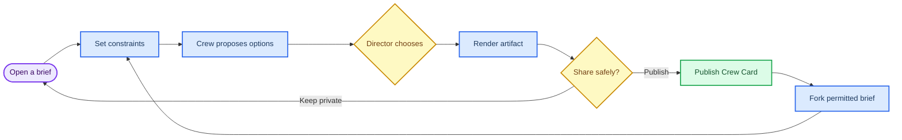

# Non-mining viral game lab: a decision framework and Crewroom prototype

_Asentxia founder strategy report · 2 October 2026 · Based on five structured research briefs; concepts are hypotheses to test, not forecasts_

---

**Recommendation:** discard mining entirely and prototype **Crewroom**: a short, social “direct an AI crew” game in which people make visible creative judgments, leave with a useful artifact, and can publish a replayable card that others fork. It has the best current combination of immediate clarity, real agency, shareable proof of taste, reusable value, and creator/community distribution—while still being small enough to falsify in Studio before adding money, wallets, or a chain.

**Product hook:** *Give three specialists a brief, make the calls that matter, and publish the result others can replay and remix.*

No product has a guaranteed route to virality or worldwide adoption. The recommendation is a set of mechanisms, testable assumptions, and stop conditions—not a promise that a game loop can manufacture demand.

## 🧭 Reset the product thesis

Mining is discarded. It is a poor product metaphor here because it makes extraction, scarcity, and implied upside more important than the player’s own decision, craft, or contribution. **Solana, or any other chain, is at most a later infrastructure rail; it is never the product, the reason to join, or a substitute for value.** The core experience must work without a wallet, payment, token, referral, or investment story.

The desired product equation is:

> **Instant comprehension + meaningful agency + shareable status + a durable value source + partner distribution**

- **Instant comprehension:** a visitor understands the action and payoff in one sentence and can make a first choice in seconds.
- **Meaningful agency:** a human decision changes a visible outcome, not merely the color of an AI response or a cosmetic score.
- **Shareable status:** the output credibly shows taste, contribution, skill, or participation. It is not a financial asset.
- **Durable value source:** the result remains useful as a brief, story, plan, portfolio item, community memory, or mission record after the session ends.
- **Partner distribution:** creators, educators, clubs, publishers, or community hosts have a reason to put the product in front of an existing audience.

The product must reject paid influence, paid randomness, passive rewards, token-gated core play, reward countdowns, referral quotas, dark patterns, and any claim that participation generates financial return. Human confirmation is required before an agent publishes externally, spends money, contacts someone, or changes any durable external state.

## 🔬 Ten success mechanics to borrow carefully

These are **evidence-supported mechanics**, not evidence that the proposed products will succeed. The implication column is a design hypothesis to test.

| # | Mechanism | Why it matters | Failure condition | Product implication |
| --- | --- | --- | --- | --- |
| 1 | **One-link, guest-first participation** | Jackbox lets people join a shared host experience without each player buying the game, while Kahoot supports a lobby joined by PIN, direct link, or QR code.[^1][^2] This removes setup friction at the social moment. | It fails if the first screen requires an account, tutorial, wallet, download, or unexplained permission before the first action. | Let a Crewroom visitor choose a prebuilt brief and make one `Keep`, `Change`, or `Ask why` decision before sign-in. |
| 2 | **A host surface plus personal device** | Kahoot’s host-and-participant pattern shows that a short facilitated session can be joined from separate devices and then produce a report.[^2] | It fails when the host becomes a bottleneck, people cannot follow the shared state, or a solo visitor has no viable experience. | Make Crewroom work solo first; later let a creator screen a shared brief while participants direct separate role turns. |
| 3 | **Visible consequence, not a disposable poll** | Epic’s event guidance recommends world-altering moments and participation through voting, shifting objectives, cooperative challenges, or creator twists rather than passive spectacle.[^3] | It fails when multiple choices lead to the same result or the consequence is too delayed or opaque to attribute. | Show what each director decision changed in the artifact: source choice, constraint, rejected option, and before/after panel. |
| 4 | **Meet people in an existing community** | Discord Activities are iframe web apps that can run across Discord clients, and Twitch Extensions provide channel surfaces with identity, chat, and channel context.[^4][^5] | It fails if the product depends on an embed policy or API that changes, or if the experience is useless outside that platform. | Build open-web links first; treat Discord and Twitch as later distribution adapters, not dependencies. |
| 5 | **Creator-owned prompts and remix lineage** | YouTube Shorts Remix supports reuse of source audio/video and links back to the source, while TikTok Effect House gives creators templates for published interactive effects.[^6][^7] | It fails if reuse rights are unclear, the creator gets more moderation work than value, or copies erase attribution. | Give every published Crew Card an explicit remix setting, upstream credits, and a one-click private fork. |
| 6 | **A compact, attributable share artifact** | Twitch Clips can be published, cropped for portrait viewing, shared, embedded, and controlled by the streamer; BeReal supports native sharing/downloading of individual Memories.[^8][^9] | It fails if a card is an ad rather than a self-contained result, exposes private inputs, or gives the recipient no reason to interact. | Share an image/short link that reveals the brief, three decisions, final artifact, and a safe `Fork this brief` action. |
| 7 | **Human direction over opaque automation** | Google Cloud distinguishes more autonomous agents from assistants that require more user direction, and describes agents in terms of planning, tools, memory, and collaboration.[^10] | It fails if three roles are theatrical labels and user choices do not change the result versus a one-tap baseline. | Constrain Scout, Maker, and Skeptic to distinct proposals; require a director decision at each consequential branch. |
| 8 | **Portfolios beat speculative ownership** | Roblox’s terms describe a platform where users play, create, connect, and publish user-generated experiences through Roblox Studio and creator terms.[^11] GitHub profiles similarly expose contributions, achievements, pinned work, and configurable visibility.[^12] | It fails if status reduces to follower counts, spend, raw volume, or a permanent public record people cannot control. | Make status a privacy-controlled record of useful decisions, forks, and collaboration quality—not a tradable collection. |
| 9 | **Optional progress supports return; punishment does not** | Duolingo reports a retention lift from streak milestone animation and also offers Streak Freeze; Todoist documents goals, trends, days off, and the ability to turn Karma off.[^13][^14] | It fails when a user returns to avoid losing something rather than because the next activity is valuable. | Use optional mastery stamps and saved templates; no streak-loss screen, expiring reward, or notification pressure. |
| 10 | **Bounded social proof and explicit verification** | Stack Overflow describes badges as recognition for measurable contributions such as moderation, edits, and useful answers; Geocaching uses logged movements and owner-defined goals to create provenance for persistent objects.[^15][^16] | It fails when an unverified assertion is labeled verified, verification leaks personal information, or the badge outweighs the real action. | Label every card as user-created, source-backed, AI-generated, or partner-confirmed; keep evidence private by default and allow unpublish/delete. |

### Ethical network effects versus manufactured FOMO

**Ethical network effects** make the product better because more people contribute genuinely useful inputs: more creator briefs, better templates, more remix examples, more collaborators, or richer community context. A person can still receive value alone, refuse sharing, leave, and return later without penalty. The growth loop is: good artifact → voluntary share/fork → more useful artifacts.

**Manufactured FOMO** makes leaving feel costly: expiring rewards, streak loss, hidden scarcity, status conditional on inviting friends, token-price insinuation, or paid power. It may create short-term activity but weakens trust and makes the alleged network effect extractive. Crewroom should optimize for **voluntary return after incentives are removed**, not activity under pressure.

## 🧪 Five original product hypotheses

The following are exactly five candidate hypotheses, one from each research space. None is a mining reskin. Each should be rejected if its stated falsifier is met.

### 1. Common Ground — live social world

**Hook:** *In a 10-minute browser session, a crowd steers one evolving world through consequential votes and leaves a shareable record of what it changed.*

- **Target user:** livestream/community audiences, classrooms, and event facilitators who want participation more meaningful than chat or a poll.
- **First 30 seconds:** open a Flooded City scene; read “The bridge is failing”; tap `reinforce`, `reroute`, or `abandon`; see the crowd split and the stated consequence of each option.
- **Core loop:** a host runs a 6–10 minute, three-to-five-decision chapter; aggregate votes update a persistent map; the next decision reflects the altered state; finale produces an atlas recap.
- **Voluntary return loop:** see the next chapter’s unresolved problem and return to influence the state that prior decisions created; no daily deadline or missed-session penalty.
- **Share/status artifact:** a privacy-controlled World Atlas and personal “I changed…” card showing chapter, role, decision split, and contribution—not an asset.
- **Incentive design:** non-cash recognition, role mastery, contributor credits, and earned authoring tools; no paid vote weight, wagering, referral pressure, or outcome-dependent sponsor prize.
- **Creator/partner wedge:** a board alongside a Twitch stream or embedded in a Discord/community page; later classrooms, conferences, and commissioned fixed-scope chapters. Twitch Extensions and Discord Activities demonstrate that embedded interactive web surfaces exist, but do not guarantee access or demand.[^4][^5]
- **Business/value source:** community entertainment, facilitation, creator-authored scenario kits, classroom/event recap exports, and fixed-fee sponsor chapters with prominent sponsorship labels.
- **Closest alternatives:** Jackbox, Kahoot, Slido, Twitch polls, Discord Activities, and Fortnite Creative/UEFN live events. The hypothesized distinction is persistent collective consequence in a much lighter browser format.[^1][^2][^3][^4]
- **Trust/safety constraints:** transparent aggregation; one vote per session identity; host cannot silently rewrite outcomes; pseudonym/privacy controls; rate limits; moderation; accessible alternatives; small-room minimums; age-appropriate mode.
- **Chain role:** **no chain** for MVP or likely core. Only consider periodic chapter-hash/creator-attestation anchoring if communities explicitly need portable provenance and accept privacy trade-offs; never anchor votes, eligibility, payouts, or a token.
- **Two-to-four-week Manus Studio prototype:** responsive React/TypeScript app with nickname join, one three-decision chapter, deterministic aggregation, managed realtime/WebSocket state, animated map tiles, moderator dashboard, basic profanity/rate limit, recap URL, and seeded users; cap rooms at 50–100.
- **Strongest falsifier:** across at least 10 sessions and three scenarios, a majority of first-time players cannot say what their vote changed **or** fewer than 20% voluntarily join/start a second chapter within seven days.
- **Biggest execution risk:** perceived agency gap—crowd outcomes can feel cosmetic, especially in thin rooms or under brigading.

### 2. Crewroom — AI agency game **(recommended)**

**Hook:** *Direct a small AI crew through a visible brief, make the calls that matter, and publish a replayable result others can remix.*

- **Target user:** creators, students, clubs, youth groups, and small teams who want to make a compact useful or entertaining artifact without a blank page.
- **First 30 seconds:** choose `20-second trailer`, `low-cost club event`, or `visual explainer`; type one sentence; see Scout, Maker, and Skeptic propose distinct next moves; tap `Keep`, `Change`, or `Ask why`.
- **Core loop:** set a bounded brief → inspect three role proposals → direct/approve/reject at explicit checkpoints → render a compact artifact → publish or privately save a Crew Card → fork or co-direct a later version.
- **Voluntary return loop:** return to improve a usable output, try a new role preset, compare a fork, or co-direct with someone—not to preserve a streak.
- **Share/status artifact:** a Crew Card that separates human decisions from model suggestions and carries brief, decision trail, artifact preview, sources/provenance labels, model/version, remix permission, and optional pseudonymous attribution.
- **Incentive design:** utility, visible judgment skill, non-cash mastery stamps, useful peer feedback, and collaboration credit. Fixed, disclosed partner benefits may be offered to all qualifying participants; no paid chance, cash balance, token gate, or paid influence.
- **Creator/partner wedge:** educators/youth clubs run shared brief rooms; creators publish prompt packs; small teams use an approval-gated campaign brief. A later Discord Activity is plausible because Activities run as web apps and Discord promotes social games and remixable moments, but the first product remains standalone web-first.[^4][^17]
- **Business/value source:** free personal creation and private saved briefs; paid organization seats for branded template libraries, moderation/provenance controls, facilitation, and export administration—not for better model authority or player influence.
- **Closest alternatives:** general AI chat/agent tools, Character.AI personas/scenes, Roblox-style creation/remix ecosystems, collaborative creative tools, and Discord Activities. The proposed distinction is a bounded judgment game with explicit checkpoints and inspectable provenance rather than endless chat or open-ended agent autonomy.[^10][^11][^17][^18]
- **Trust/safety constraints:** no external tool side effects; human confirmation at every durable action; labeled sources/AI output; constrained templates; content report/block/delete; default pseudonyms and private drafts; rights/licensing controls; model-cost caps; age-appropriate settings; accessibility.
- **Chain role:** **no chain**. A conventional database supports authorship, forks, deletion, audit records, and moderation with less friction. Revisit optional portable creator provenance only after users ask for cross-platform verification; it must not control access, ranking, or payout.
- **Two-to-four-week Manus Studio prototype:** responsive browser app with a three-brief picker; deterministic state machine; seeded role proposals plus one server-side model call; one artifact template; explicit approve/edit/reject checkpoints; provenance labels; private/public Crew Cards; fork; report flow; basic analytics; hosted database; mobile/accessibility polish. Exclude payments, wallets, external publishing, arbitrary tools, and autonomous agents.
- **Strongest falsifier:** in an invite-only 14-day test of at least 100 first-time users, fewer than 25% complete a second brief without reward/reminder, fewer than 10% voluntarily publish or fork, **or** blinded reviewers cannot distinguish human-directed output from one-tap baseline output for usefulness or entertainment.
- **Biggest execution risk:** it becomes a prompt wrapper: role labels create ceremony without materially improving the outcome or revealing human judgment.

### 3. Branchline — creator interactive media

**Hook:** *Creators publish a playable prompt, and each viewer response becomes a credited branch that can change the next episode and travel as a share card.*

- **Target user:** independent video/podcast/stream creators and their fans who want agency, recognition, and reusable next-episode material.
- **First 30 seconds:** watch a 20-second creator scene that ends in two choices, pick one or record a constrained ten-second response, then preview a Branch Card.
- **Core loop:** creator posts a media prompt → participant chooses/submits under explicit rules → system attaches consented response to lineage → creator selects/combines credited branches → next prompt incorporates the choice.
- **Voluntary return loop:** return to see whether a branch was selected, respond to the next canonical prompt, or remix an allowed ancestor—not to maintain a quota.
- **Share/status artifact:** a Branch Card with prompt, personal role/submission, upstream credits, selected/featured/combined status, timestamp, privacy setting, and permalink.
- **Incentive design:** real chance of creative inclusion, explicit credit, mastery through better responses, saved non-cash branch collections, and fixed disclosed sponsor benefits. No token gate, paid selection, wager, or passive reward.
- **Creator/partner wedge:** iframe/SDK for articles, livestream descriptions, podcast companions, classrooms, and campaign pages; initial wedge is the interactive companion for independent video/podcast creators.
- **Business/value source:** creator workflow software, moderated branch galleries, analytics, embed tooling, and fixed sponsor brief commissions; it must save creator ideation/editing time to earn its place.
- **Closest alternatives:** YouTube Live polls/chat, Twitch Clips, YouTube Shorts Remix, TikTok Effect House, and Discord Activities. These products establish familiar component behaviors such as polls, clips, remix attribution, effects, and embeds; Branchline’s hypothesis is a persistent, creator-controlled causal branch.[^19][^8][^6][^7][^4]
- **Trust/safety constraints:** consent, likeness/music/copyright permissions, constrained formats, size limits, moderation queues, creator review controls, deletion/takedown, private/unlisted responses, age safeguards, and standalone web resilience when embeds change.
- **Chain role:** **no chain** for UGC lineage, attribution, deletion, and permissions. Optional timestamp/licence proof only after a demonstrated creator need; never gate participation or benefits.
- **Two-to-four-week Manus Studio prototype:** React/TypeScript prompt/branch schema, creator dashboard, anonymous session plus optional handle, binary/text/short-audio prompt types, mock selection, consent/delete controls, basic filter/size check, vertical card renderer, PNG/copy-link export, and iframe demo. Use seeded media; do not ship livestream ingest, recommendation, payments, wallets, or public arbitrary uploads.
- **Strongest falsifier:** after 20 creator and 500 invited-participant pilot, fewer than 20% complete a second prompt within 14 days, fewer than 10% of completed prompts yield a voluntary external share/direct invite, **and** creators report no ideation or editing-time reduction.
- **Biggest execution risk:** creator review and moderation workload exceeds the creative value created by audience branches.

### 4. ProofSprint — real utility game

**Hook:** *Turn one annoying admin task into a three-minute quest that leaves a credible, shareable proof-of-done card.*

- **Target user:** people postponing small, low-stakes administrative tasks and partner organizations trying to reduce repetitive support questions.
- **First 30 seconds:** choose `prepare a cancellation`, `return an item`, or `find the right form`; see a three-step, 2–5 minute path; complete the first browser-native checklist action.
- **Core loop:** select a bounded real-world quest → follow an explainable checklist/draft → optionally attach redacted evidence → label completion provenance → receive a Proof Card → save/reuse/share the template.
- **Voluntary return loop:** return when another concrete task needs reducing; browse a useful library or co-complete an actually shared household/club task.
- **Share/status artifact:** a redacted, privacy-controlled Proof Card explicitly labeled self-reported, evidence-attached, or partner-confirmed—never “verified” when it is not.
- **Incentive design:** primary reward is useful completion; optional non-cash domain badges and all-eligible fixed benefits. No streak loss, shame notifications, investment claim, lottery, or referral requirement.
- **Creator/partner wedge:** public libraries and university services publish versioned “official path” quests; later HR/benefits teams subsidize a disclosed workflow.
- **Business/value source:** partner fees for versioned support workflows and aggregate completion analytics; free core templates; fixed benefits can subsidize a quest but cannot become a prize pool.
- **Closest alternatives:** Todoist, Habitica, subscription-management services, checklist/document tools, and public self-service portals. Todoist and Habitica demonstrate task-plus-motivation patterns, but ProofSprint’s distinction would have to be real completion evidence and provenance, not points.[^14][^20]
- **Trust/safety constraints:** no legal/medical/tax/financial advice; human confirmation; current source/version dates; no default evidence upload; local redaction; encryption/minimal retention/deletion; clear disclaimers; pause/no-points mode; only low-stakes reversible workflows in pilot.
- **Chain role:** **no chain**. Revocable, private, conventional records are sufficient. Consider opt-in revocable credentials only if multiple independent issuers need to verify a non-sensitive achievement, never raw documents or token-based eligibility.
- **Two-to-four-week Manus Studio prototype:** six synthetic/demo quest templates, hosted/local persistence, quest state machine, redaction preview, Proof Card renderer, author view, mock partner confirmation states, share/download, and keyboard-first privacy labels. No live accounts, external actions, money, wallets, or claims of institutional acceptance.
- **Strongest falsifier:** real low-stakes testers understand the promise but do not complete more tasks or return after a card, and recipients rarely open a shared card or begin a quest.
- **Biggest execution risk:** the card is decorative while templates become stale, sensitive, or untrustworthy.

### 5. CommonQuest — collective quest network

**Hook:** *Pick a real-world or online mission, complete it with people you choose, and build a shareable proof-of-participation identity that unlocks better missions—not power or money.*

- **Target user:** community members who want low-pressure activities and creators/venues/campuses that want measurable participation.
- **First 30 seconds:** open a 20-minute photo, museum, campus, or online mission; join solo or team; see three steps; complete a browser-native first action.
- **Core loop:** discover a scoped mission → join solo/team → complete low-risk evidence step → review/confirm as appropriate → receive a field note → share, remix, or choose the next mission.
- **Voluntary return loop:** more relevant missions, collaborators, partner communities, and a growing personal participation portfolio—not streaks or expiring collectibles.
- **Share/status artifact:** a privacy-controlled Quest Passport with field notes, roles, team credit, endorsement, verification level, and a delete/export path.
- **Incentive design:** non-cash field notes, feedback, contribution credit, fixed clearly allocated workshop access, and partner discounts available to all eligible participants; no paid chance, global humiliation leaderboard, scarcity, or token gate.
- **Creator/partner wedge:** branded mission pages for creators, libraries, campuses, museums, cafés, community organizations, and conferences with QR distribution, analytics, moderation queue, and recap.
- **Business/value source:** partner fees for mission creation, moderation/review workflow, consented completion analytics, and event recap; user value remains discovery, coordination, and documented participation.
- **Closest alternatives:** Geocaching, Strava Group Challenges, GitHub profiles/achievements, Roblox quests/events, Discord Activities, Meetup, and location-collection games. Geocaching, Strava, GitHub, and Roblox demonstrate persistent journeys, group goals, portfolios, and quest structure; CommonQuest must prove a cross-context, privacy-controlled portfolio is better than those fragments.[^16][^21][^12][^22][^4]
- **Trust/safety constraints:** start with low-risk missions; minimize location; protect minors; explicit evidence confidence; peer/creator confirmation labels; moderation and human review; solo mode; no precise location history; partner benefit terms and fulfillment controls.
- **Chain role:** **no chain** by default. A conventional record gives privacy, correction, and moderation. Consider an opt-in non-financial attestation export only if independent organizations truly need cross-organization verification.
- **Two-to-four-week Manus Studio prototype:** responsive catalog, seeded online/local mission templates, demo identity, creator authoring, solo/team links, browser response/image/peer confirmation evidence types, basic moderation, field-note generator, passport/profile, privacy controls, proof-card route, and QR/deep-link landing. Do not build tracking, native apps, payments, wallets, or a marketplace.
- **Strongest falsifier:** with 10–20 seeded missions, people who complete one do not voluntarily open a second or share a field note, and creators cannot author a credible mission in under 15 minutes despite distribution help.
- **Biggest execution risk:** evidence verification and moderation costs overwhelm a sparse launch catalog.

## 📊 Weighted decision scorecard

Scores are **design judgments**, not measured performance. Each criterion uses a 1–5 score. Weighted points equal `score ÷ 5 × criterion weight`; totals therefore equal 100 exactly.

| Candidate | Instant comprehension 20% | Meaningful agency 20% | Organic sharing 15% | Voluntary repeat 15% | Durable economics 10% | Distribution leverage 10% | Studio buildability 10% | Total / 100 | Decision read |
| --- | ---: | ---: | ---: | ---: | ---: | ---: | ---: | ---: | --- |
| Common Ground | 5 → 20 | 4 → 16 | 4 → 12 | 3 → 9 | 3 → 6 | 4 → 8 | 4 → 8 | **79** | Strong live mechanic; high dependency on room energy and content supply |
| Crewroom | 5 → 20 | 5 → 20 | 4 → 12 | 4 → 12 | 4 → 8 | 4 → 8 | 4 → 8 | **88** | Best balanced first bet; falsify “prompt wrapper” risk quickly |
| Branchline | 4 → 16 | 4 → 16 | 5 → 15 | 3 → 9 | 3 → 6 | 5 → 10 | 4 → 8 | **80** | Strongest share surface; creator operations are the gating risk |
| ProofSprint | 5 → 20 | 4 → 16 | 3 → 9 | 3 → 9 | 4 → 8 | 3 → 6 | 5 → 10 | **78** | Useful and buildable, but status/share may be too weak |
| CommonQuest | 4 → 16 | 4 → 16 | 4 → 12 | 3 → 9 | 4 → 8 | 4 → 8 | 3 → 6 | **75** | Ambitious partner loop; verification and cold-start cost are high |

**Why Crewroom wins now:** it can make a first decision visible almost immediately, show a direct causal difference, leave a useful output, and test sharing without depending on synchronous crowd density, offline verification, or a creator’s full media-production workflow. This is a prioritization hypothesis, not a statement that it has the highest ultimate ceiling.

## 🧩 Deep design: Crewroom

### 90-second user journey

| Time | User sees and does | Product proof being tested |
| --- | --- | --- |
| 0–10 seconds | Landing copy: “Give three specialists a brief. You are the director.” User picks one of three sample briefs. | Can a visitor explain the hook without instruction? |
| 10–25 seconds | User enters one sentence of intent and selects two constraints (audience, tone, budget, or safety level). | Does a bounded blank page feel welcoming rather than restrictive? |
| 25–45 seconds | Scout, Maker, and Skeptic each surface one short, labeled proposal with provenance labels. | Do role differences create legible options? |
| 45–60 seconds | User accepts, edits, rejects, or asks why; a preview visibly changes. | Does the human choice causally change the artifact? |
| 60–75 seconds | System creates a compact storyboard/checklist/script preview and a “three decisions” replay. | Is the result useful or entertaining enough to keep? |
| 75–90 seconds | User saves privately, publishes a pseudonymous Crew Card, or forks another card; publication is an explicit choice. | Is sharing voluntary and identity-relevant rather than prompted? |

### Product objects and roles

| Object / role | Purpose | Authority boundary |
| --- | --- | --- |
| **Brief** | Bounded goal, audience, constraints, source pack, safety profile, and owner | Creator/director can edit; public fork never alters the original |
| **Crew role** | Scout proposes sourced inputs; Maker drafts; Skeptic tests fit, claims, and policy risk | Roles may propose only within template and approved sources; they cannot publish or call external tools |
| **Decision** | Human `accept`, `edit`, `reject`, or `ask_why` action tied to a proposal | Only a director/co-director may record a consequential decision |
| **Artifact version** | Rendered storyboard, event plan, mini script, or explainer | Server generates within bounded template; director approves public release |
| **Crew Card** | Share object containing public artifact preview and selected decision trail | Owner controls public/private state, attribution, remix licence, and unpublish |
| **Fork lineage** | Link from a new brief to a permitted source card | Attribution is automatic; the forker owns the new brief and can remove their own card |
| **Player/director** | Makes the goal and quality trade-offs | Owns their inputs and publication consent; no paid power |
| **Creator** | Supplies templates, source packs, or a public challenge | Cannot silently alter a participant’s saved output or hiddenly bias results |
| **Partner** | Provides a plainly labeled brief pack, rubric, or fixed benefit | Cannot see private briefs by default; never purchases a favorable outcome or ranking |
| **Moderator/operator** | Enforces policy, handles reports, and audits logs | Can restrict/withdraw public content under policy; cannot edit a user’s decision history without an auditable correction record |

### Authority and data boundaries

| Boundary | What is allowed | What is prohibited |
| --- | --- | --- |
| Browser client | Draft brief, select constraints, request generation, preview/share/report | Direct database authority, silent public posting, tool execution, or access to another user’s private brief |
| Application server | Validate schemas, rate-limit, store events, apply policy, render card, call approved model route | Sending messages, spending, account changes, or publishing outside Crewroom without a fresh human confirmation |
| Model provider | Produce bounded proposal text/structured artifact data from approved inputs | Holding canonical state, deciding eligibility, contacting others, or treating generated text as verified fact |
| Public Crew Card | Card preview, opted-in alias, selected decisions, source labels, remix terms | Raw prompt text, private sources, personal data, hidden chain-of-thought, or unconsented collaborator identity |
| Partner analytics | Aggregated, consented completion/fork/report data | Private brief content, individual ranking manipulation, or targeting based on sensitive inputs |

### Event model

Use an append-only operational event log for product behavior, with separate mutable privacy records for aliases, consent, and deletion. A user can unpublish a card or delete personal inputs; the system retains only the minimal de-identified security/audit record required by policy. Do not present the event log as a public blockchain or immutable personal history.

1. `brief.created` — director creates a bounded brief and privacy defaults.
2. `proposal.generated` — server records model/version, template, source labels, and safety state; no hidden reasoning is stored or exposed.
3. `director.decision_recorded` — director accepts, edits, rejects, or asks why; this is the central agency event.
4. `artifact.version_created` — server renders the approved structure and provenance summary.
5. `card.published` or `card.unpublished` — owner grants or withdraws public visibility.
6. `fork.started` — a recipient copies only the permissioned brief/card components and keeps upstream attribution.
7. `content.reported` / `moderation.resolved` — safety operation with explicit state and reason.

**Central event — illustrative typed JSON:**

```json
{
  "event_id": "evt_01J8R6JZ6R6ST0Y3K4V6MA0K2P",
  "event_type": "director.decision_recorded",
  "occurred_at": "2026-10-02T17:42:12Z",
  "brief_id": "brief_01J8R6H5WGM4K64F8XE6QPH3MN",
  "actor": {
    "actor_type": "director",
    "actor_id": "usr_pseudonymous_8b21"
  },
  "proposal": {
    "proposal_id": "prop_01J8R6JPV9QG2CVBA1P4FQ2Z5C",
    "role": "skeptic",
    "source_state": "user_provided_and_ai_generated"
  },
  "decision": {
    "action": "edit_and_accept",
    "changed_constraints": ["audience=first-year students", "tone=plain_language"],
    "human_confirmed": true
  },
  "privacy": {
    "publicly_replayable": false,
    "contains_personal_data": false
  },
  "schema_version": "1.0"
}
```

**Share-card object — illustrative typed JSON:**

```json
{
  "card_id": "card_01J8R7A0CDR8WAT2P79FDKGB3X",
  "object_type": "crew_card",
  "visibility": "public",
  "title": "Make a 20-second library event trailer",
  "artifact_preview": {
    "format": "storyboard",
    "summary": "Three-shot trailer with a quiet-to-curious reveal",
    "thumbnail_url": "https://example.invalid/cards/card_01J8R7A0.png"
  },
  "human_decisions": [
    {"role": "scout", "action": "reject", "reason_label": "source too broad"},
    {"role": "maker", "action": "accept", "reason_label": "strong opening image"},
    {"role": "skeptic", "action": "edit_and_accept", "reason_label": "clearer audience fit"}
  ],
  "provenance": {
    "model_version": "studio-model-v1",
    "source_labels": ["user_provided", "ai_generated"],
    "safety_state": "checked"
  },
  "attribution": {
    "display_alias": "River Director",
    "upstream_card_id": null,
    "remix_license": "fork_with_attribution"
  },
  "share_url": "https://crewroom.example/c/card_01J8R7A0CDR8WAT2P79FDKGB3X"
}
```

### Sharing surface, network effect, and operations model

The card must be useful **before** it asks anyone to join: a recipient should see a short artifact preview plus the three human decisions that changed it. The link offers a read-only replay, then a private fork. It must not auto-tag people, hide source labels, or make a recipient’s access contingent on referral behavior.

The hypothesized network effect is a **content-and-collaboration loop**: more good briefs and source packs reduce blank-page friction; more public cards demonstrate directing patterns; more forks and co-directors create useful examples for creators/educators. The loop is local and bounded. A strong solo experience is required before a two-sided library can be claimed.

Operations should begin with three template families only—short trailer concept, club event plan, and visual explainer—and a small reviewed source-pack library. Weekly themes may provide discovery but remain replayable. Human operators review reports, featured cards, source-pack changes, and partner briefs. Creator selection must favor clear brief quality and repeat usefulness rather than raw submission volume.

### Abuse controls and monetization boundary

- Default to pseudonymous private drafts; make public sharing an explicit, reversible action.
- Require constrained inputs, rate limits, file/type limits, model safety filters, source labels, report/block tools, and moderation queues for public cards.
- Prohibit impersonation, non-consensual likeness/voice use, hate/harassment, sexual content involving minors, personal-data exposure, copyrighted uploads without rights, and instructions for wrongdoing.
- Run red-team prompts against both role proposals and the card renderer; log moderation actions with reasons and appeal path.
- Do not expose hidden model reasoning; show concise evidence/provenance labels instead.
- Monetize **administration and workflow value**—organization seats, branded template libraries, facilitation, reviewed source packs, and export/admin controls—not generation volume, social rank, creator selection, or decision authority.
- No payments in the prototype. Any later partner benefit is fixed, fully disclosed, available by stated rules, and never tied to spending, chance, or a promised return.

### Why Crewroom does not need a chain

Crewroom’s core problems are fast iteration, privacy, moderation, deletion, correction, attribution, and low-friction sharing. A conventional server and database solve these directly. A chain would add wallet friction and permanence that conflict with user deletion, safety interventions, and age-appropriate privacy. The only conceivable later role is optional, periodic creator provenance anchoring across platforms—and only if a real partner need cannot be served by signed exports and audit records. It must never decide access, rank, governance, eligibility, payout, or ownership of the core experience.



## 🧪 Staged experiments before payments, wallets, or blockchain

These are **team decision thresholds**, not industry benchmarks. Run each stage sequentially with invite-only users, record both quantitative behavior and short qualitative interviews, and do not add a new incentive to rescue a failing prior stage.

| Stage | Test and instrumentation | Pass threshold | Kill threshold | Decision if passed |
| --- | --- | --- | --- | --- |
| First-session comprehension | 30–50 new users receive one sample brief; measure first decision, completion, and a one-sentence explanation of what their decision changed. | ≥70% make a first decision in 30 seconds **and** ≥60% accurately explain the causal difference. | <50% accurate explanation after one copy/UI iteration. | Keep the basic interaction; improve only the lowest-friction confusion observed. |
| 48-hour sharing | After a completed artifact, offer private save and optional card publish equally; track voluntary share/copy and recipient landing/first action. | ≥15% of completers voluntarily share/copy a card **and** ≥20% of unique recipients open it and take one interaction. | <8% share/copy **or** <10% recipient interaction. | Invest in card clarity and a read-only replay before adding social feed features. |
| 7-day voluntary repeat | No reward or reminder is required; measure a second completed brief or fork from the first cohort. | ≥30% complete a second brief/fork within seven days. | <15% complete a second brief/fork. | Test a second template family and co-direction. |
| 14-day incentive-off repeat | Turn off stamps, weekly-theme prompts, and notifications for this cohort; keep saved work and forks available. | ≥20% voluntarily complete another brief or meaningful edit during days 8–14. | <10% voluntary repeat. | The utility/agency loop is promising enough to test partner supply. |
| Creator/partner distribution | Recruit eight small creators/educators/community hosts; time setup, observe publication, and count qualified distinct first visits from each canonical link. | ≥5 of 8 publish a brief in ≤15 minutes and ≥3 drive ≥20 qualified first visits each. | Fewer than 2 of 8 publish **or** no partner reaches 10 qualified first visits. | Build one narrow partner toolkit, not a marketplace. |
| Abuse/safety drill | Red-team 50 scripted cases across prompt injection, harassment, privacy leakage, copyrighted/likeness material, unsafe instructions, and report handling. | 100% of high-severity cases are blocked or held before public display; ≥95% of reports reach a review state within 24 hours in the drill. | Any high-severity content is publicly rendered unfiltered, any private input appears on a card, or critical report routing fails. | Do not open public publishing until controls are remediated and retested. |

> **Guardrail:** payment, wallet, token, blockchain, referral, and sponsor-benefit work remain out of scope until all six gates pass. Passing a later growth stage does not excuse failure on comprehension, agency, or safety.

## 🛠️ Technology decision

| Area | Decision now | Boundary / rationale |
| --- | --- | --- |
| **Runs in Manus Studio now** | Responsive React/TypeScript UI; server route for one bounded model call; deterministic brief/decision state machine; Supabase or simple hosted database; role proposal templates; provenance labels; private/public card renderer; share URL; fork; moderation/report queue; feature flags; analytics; accessibility and mobile tests. | This proves comprehension, causal agency, card sharing, and repeat without irreversible dependencies. |
| **Remains mocked** | Most role outputs, partner source packs, partner confirmation, creator review/rewards, co-direction, social embeds, external sharing callbacks, content ranking, and any benefit fulfillment. | Mocking preserves a fast experiment while avoiding false claims, API dependency, and commercial commitments. |
| **Requires security, legal, and commercial review** | Real model-provider data processing; user uploads; public UGC; creator remix licence; child/teen settings; copyright/voice/likeness; data retention/deletion; accessibility; moderation staffing/appeals; partner data access; organization contracts; export claims; any payment or prize. | These affect rights, privacy, safety, contractual responsibility, and operational cost. |
| **Explicitly not in prototype** | Wallet connection, token, chain write, smart contract, NFT/collectible, payout, paid generation, wagering, referral campaign, external autonomous tool, or personalized ranking. | They obscure the product signal and introduce harm before the central loop is proven. |

**Exact question before any chain write:**

> **Have at least two independent creator or partner organizations demonstrated a need for portable, independently verifiable authorship across platforms that cannot be met by signed, exportable audit records—and can an opt-in design preserve deletion, correction, moderation, privacy, and full wallet-free access?**

If the answer is not a documented **yes** to both clauses, do not write to a chain.

## 🎯 Five founder decisions required to start a focused prototype

1. **Approve Crewroom as the sole 2–4 week prototype** and explicitly defer the other four hypotheses rather than blending their loops into v1.
2. **Choose the first artifact template:** 20-second trailer concept, low-cost club event plan, or visual explainer; pick one and hold the others for later experiments.
3. **Define the initial audience and distribution partner:** for example, eight educators/youth clubs or eight independent creators—not both in the first pilot.
4. **Approve the safety and data posture:** pseudonymous private drafts by default, no external actions, constrained sources, public-card moderation, deletion/unpublish, and no under-18 public pilot until reviewed.
5. **Commit to the six gates as stop/go authority:** no payments, wallets, sponsors, or chain work until thresholds pass; agree in advance that the prompt-wrapper falsifier kills or materially redesigns Crewroom.

## 🔗 References

[^1]: Jackbox Games. “Jackbox Games.” https://www.jackboxgames.com/
[^2]: Kahoot! Support. “How to host a live kahoot.” https://support.kahoot.com/hc/en-us/articles/360039422694-How-to-host-a-live-kahoot
[^3]: Epic Games. “Designing a successful event in Fortnite.” https://dev.epicgames.com/documentation/fortnite/designing-a-successful-event-in-fortnite?lang=en-US
[^4]: Discord Developer Documentation. “Activities overview.” https://docs.discord.com/developers/activities/overview
[^5]: Twitch Developer Documentation. “Extensions.” https://dev.twitch.tv/extensions/
[^6]: YouTube Help. “Remix Shorts.” https://support.google.com/youtube/answer/10623810?hl=en
[^7]: TikTok Effect House. “Introduction to Effect House.” https://effecthouse.tiktok.com/learn/guides/getting-started/introduction-to-effect-house/
[^8]: Twitch Help. “How to use Clips.” https://help.twitch.tv/s/article/how-to-use-clips
[^9]: BeReal Help Center. “Share & Download Memories.” https://help.bereal.com/hc/en-us/articles/7539627724701-Share-Download-Memories
[^10]: Google Cloud. “What are AI agents?” https://cloud.google.com/discover/what-are-ai-agents
[^11]: Roblox Support. “Roblox Terms of Use.” https://en.help.roblox.com/hc/en-us/articles/115004647846-Roblox-Terms-of-Use
[^12]: GitHub Docs. “Contributions on your profile.” https://docs.github.com/en/account-and-profile/concepts/contributions-on-your-profile
[^13]: Duolingo Blog. “How Duolingo streak builds habit.” https://blog.duolingo.com/how-duolingo-streak-builds-habit/
[^14]: Todoist. “Karma.” https://www.todoist.com/karma
[^15]: Stack Overflow Blog. “Stack Overflow badges explained.” https://stackoverflow.blog/2021/04/12/stack-overflow-badges-explained/
[^16]: Geocaching. “Trackables.” https://www.geocaching.com/track/
[^17]: Discord Developers. “Build on Discord.” https://discord.com/developers/build
[^18]: Character.AI Help Center. https://support.character.ai/hc/en-us
[^19]: YouTube Help. “Create a live poll.” https://support.google.com/youtube/answer/15268877?hl=en-GB
[^20]: Habitica. “Frequently asked questions.” https://habitica.com/static/faq
[^21]: Strava Support. “How do Group Challenges work on Strava?” https://support.strava.com/en-us/articles/15401736-how-do-group-challenges-work-on-strava
[^22]: Roblox Creator Documentation. “Introduction to quest design.” https://github.com/Roblox/creator-docs/blob/main/content/en-us/production/game-design/introduction-to-quest-design.md
