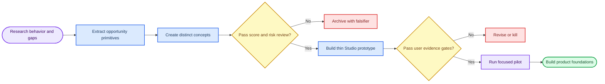

# Product Discovery Lab Implementation Plan

> **For agentic workers:** REQUIRED SUB-SKILL: Use superpowers:subagent-driven-development (recommended) or superpowers:executing-plans to implement this plan task-by-task. Steps use checkbox (`- [ ]`) syntax for tracking.

**Goal:** Find, test, and launch one browser-first product with evidence of instant comprehension, voluntary repeat use, voluntary sharing, and partner distribution.

**Architecture:** Run a staged decision funnel rather than committing to a theme. Broad independent research produces evidence-backed opportunity primitives; a separate concept round combines and challenges them; then thin Manus Studio prototypes test the strongest hypotheses with real people before any expensive infrastructure, money flow, wallet, token, or chain work.

**Tech Stack:** Manus research tools, workflow subagents, search/fetch/browser and Firecrawl for public sources, Markdown/Mermaid for decisions, Manus Studio/WebDev for prototypes, TypeScript/React for later browser experiments.

**Spec:** `docs/research/product-discovery-lab/` is the source of truth for research tracks, portfolio, experiments, and decisions.

## Global Constraints

- Build no wallet, payment, token, smart contract, payout, wagering, or autonomous external-action feature before a validated product loop requires it.
- Treat Solana, Robinhood Chain, or any blockchain as optional infrastructure, not the product premise.
- Use direct sources where possible; label hypotheses, estimates, targets, and measurements distinctly.
- Exclude dark patterns: paid influence, paid chance, compulsive reward loss, deceptive scarcity, referral pressure, and claims of guaranteed financial returns.
- Require a visible human approval before any future product action that could publish, spend, contact someone, or mutate an external system.
- Keep initial prototypes browser-first, guest-friendly, mobile-responsive, accessible, and usable without a chain account.

## Review Focus

- A promising claim may be based on social attention rather than actual repeated use; demand evidence must distinguish the two.
- A product may appear viral only because of an existing creator or paid distribution; experiments must measure recipient activation and independent repeat use.
- A game mechanic may create activity by fear of loss rather than value; measure incentive-off return.
- A partner wedge may be operationally expensive; measure creator/partner setup time and repeat publication.
- A chain feature may add friction without unique user value; require a documented unsatisfied portability or verification need before any chain write.

---

## 📍 Decision funnel

## 📚 Task 1: Create the evidence map

**Files:**
- Create: `docs/research/product-discovery-lab/tracks/01-*.md` through `10-*.md`
- Create: `docs/research/product-discovery-lab/01-opportunity-map.md`

**Interfaces:**
- Consumes: public product, platform, market, and user-behavior sources
- Produces: cited opportunity primitives, closest alternatives, constraints, evidence quality, and explicit falsifiers

- [ ] Research ten independent opportunity spaces with one dedicated agent per space
- [ ] Read multiple authoritative sources per space and record direct URLs beside claims
- [ ] Separate verified mechanisms from design hypotheses and popularity claims
- [ ] Aggregate repeated patterns, contradictions, and gaps into an opportunity map
- [ ] Verify all linked track reports exist and citations render
- [ ] Commit the evidence map

## 📚 Task 2: Create and challenge the concept portfolio

**Files:**
- Create: `docs/research/product-discovery-lab/02-concept-portfolio.md`
- Create: `docs/research/product-discovery-lab/concepts/*.md`

**Interfaces:**
- Consumes: `01-opportunity-map.md`
- Produces: distinct product concepts with user hook, core loop, durable value source, distribution wedge, technical boundary, risk register, and falsifier

- [ ] Generate concepts that combine evidence-backed primitives without copying existing product themes
- [ ] Give each concept a one-sentence hook and a first-30-second user experience
- [ ] Identify direct alternatives and the exact differentiated bet
- [ ] Score against instant comprehension, agency, repeat, sharing, durable economics, distribution, Studio buildability, safety, and operational load
- [ ] Red-team the highest-scoring concepts against non-use, abuse, cold start, and partner burden
- [ ] Commit the ranked portfolio

## 📚 Task 3: Specify thin prototypes and decision gates

**Files:**
- Create: `docs/research/product-discovery-lab/experiments/*.md`
- Create: `docs/research/product-discovery-lab/03-experiment-board.md`

**Interfaces:**
- Consumes: `02-concept-portfolio.md`
- Produces: one bounded Manus Studio prototype specification per finalist and stop/go thresholds

- [ ] Select at most three finalists that can each prove their central loop in two to four weeks
- [ ] Define the smallest build that produces a real user outcome rather than simulated vanity metrics
- [ ] Specify event instrumentation, consent/privacy posture, abuse test, and cost bound
- [ ] Define comprehension, share, recipient activation, seven-day return, partner setup, and safety thresholds before implementation
- [ ] Define a kill condition for each concept and lock payment/wallet/chain work out of scope
- [ ] Commit the experiment board

## 📦 Task 4: Build and test only the evidence leader

**Files:**
- Create: product-specific specification and implementation plan after the prototype winner is chosen
- Modify: application source files only after prototype acceptance criteria are approved

**Interfaces:**
- Consumes: `03-experiment-board.md` and the winning prototype specification
- Produces: a hosted Manus Studio prototype, analytics events, a real-user test script, and an evidence-based go/kill decision

- [ ] Confirm the winning prototype’s scope, target audience, and first distribution channel
- [ ] Write the product-specific architecture and test plan before implementation
- [ ] Build guest-first core loop and explicit privacy/safety boundaries
- [ ] Run functional, accessibility, and abuse checks before inviting external users
- [ ] Collect behavior and interview evidence against precommitted thresholds
- [ ] Build deeper infrastructure only when the prototype passes its gates
